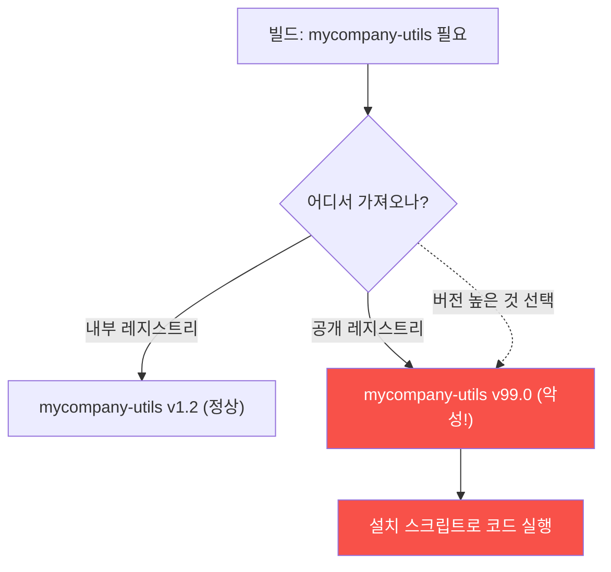

# agent-ir-adv W01 — 공급망 Dependency Confusion: 에이전트가 패키지 생태계를 노린다

> **본 주차의 한 줄 요약**
>
> agent-ir-adv는 **고급 AI 공격 시나리오**를 한 주에 하나씩 깊게 파고, 그 **탐지·방어**를 배운다. 첫 주는
> **의존성 혼동(Dependency Confusion)** — 공급망 공격의 대표 기법이다. 원리: 조직이 **내부 전용 패키지**
> (예: `mycompany-utils`)를 쓰는데, 공격자가 **같은 이름의 악성 패키지를 공개 레지스트리**(PyPI·npm)에 올린다.
> 패키지 관리자가 버전 해석 시 **더 높은 버전**을 고르는 습성을 악용해, 공격자는 **아주 높은 버전 번호**로
> 악성 패키지를 올려 내부 이름을 **가로챈다**. 빌드가 실수로 공개 레지스트리의 악성 버전을 당겨오면, **빌드
> 시점에 코드 실행**(설치 스크립트)으로 침투한다. AI 공격자는 이를 **자동화·규모화**한다 — 조직의 내부 패키지
> 이름을 정찰해 대량으로 스쿼팅. 방어는 **의존성 출처 검증**: 내부 패키지는 **전용 레지스트리에 고정(pin)**,
> 이름·출처·버전 이상을 탐지, 설치 스크립트 감사. 공급망은 "내가 안 짠 코드가 내 시스템에 들어오는" 통로라
> 특히 위험하다 — 신뢰의 사슬을 검증해야 한다.
>
> **한 줄 결론**: Dependency Confusion은 내부 패키지 이름을 공개 레지스트리에서 **높은 버전으로 가로채** 빌드
> 시점 코드 실행을 노린다. 방어 = **출처 고정(전용 레지스트리)+이름/버전 이상 탐지+설치 스크립트 감사**.

---

## 학습 목표

본 주차 종료 시 학생은 다음 5가지를 **본인 손으로** 할 수 있어야 한다.

1. **Dependency Confusion**의 원리(내부 이름 가로채기)를 설명한다.
2. 내부 패키지가 **공개 레지스트리로 해석**되는 이상을 탐지한다(CONFUSION_DETECTED).
3. **버전 이상**(비정상 고버전)을 탐지한다(VERSION_ANOMALY).
4. **출처 고정**(전용 레지스트리 pin)으로 방어한다(SOURCE_PINNED).
5. 공급망 신뢰 사슬 검증의 중요성을 설명한다.

> **이 주차의 시선** — 내가 안 짠 코드가 들어오는 통로(공급망)를 검증한다.

---

## 0. 용어 해설 (공급망)

| 용어 | 영문 | 뜻 | 비유 |
|------|------|----|------|
| **공급망 공격** | Supply Chain Attack | 의존성·빌드 경로 침투 | 납품 오염 |
| **Dependency Confusion** | — | 내부 이름 가로채기 | 사칭 납품 |
| **레지스트리** | Registry | 패키지 저장소(PyPI·npm) | 창고 |
| **버전 해석** | Version Resolution | 어느 버전을 쓸지 결정 | 최신 선택 |
| **출처 고정** | Pinning | 특정 출처로 제한 | 지정 납품처 |

> **헷갈리기 쉬운 한 쌍** — *타이포스쿼팅* 은 "비슷한 이름"(오타 노림), *Dependency Confusion* 은 "**같은** 이름"
> (해석 규칙 노림)이다. 후자는 내부 이름을 정확히 안다.

---

## 0.5 신입생 친화 핵심 개념

### 0.5.1 Dependency Confusion 원리

빌드가 두 레지스트리를 다 보면, **버전 높은 악성 패키지**를 고른다. 공격자는 v99.0 같은 극단 버전으로 가로챈다.

### 0.5.2 왜 AI가 이걸 규모화하나

공격자는 조직의 **내부 패키지 이름**을 알아야 한다(GitHub·에러 로그·JS 번들에서 유출됨). AI 에이전트는 이
정찰을 자동화해 **대량의 내부 이름을 수집**하고, 각각에 대해 악성 패키지를 **자동 생성·업로드**한다. 사람이
하나씩 하던 걸 AI가 대량으로 — 규모화(agent-ir W07).

### 0.5.3 탐지 — 출처·버전 이상

- **출처 이상**: 내부 전용이어야 할 패키지가 **공개 레지스트리에서 해석**됨 → 경보.
- **버전 이상**: 내부 버전(v1.x)과 동떨어진 **비정상 고버전**(v99.x)이 나타남 → 의심.
- **설치 스크립트**: 패키지에 **네트워크·실행** 하는 설치 스크립트(postinstall) → 감사.
이 셋을 빌드 파이프라인에서 자동 검사한다.

### 0.5.4 방어 — 출처 고정과 감사

- **출처 고정(pin)**: 내부 패키지는 **전용 레지스트리에만** 있게 설정(공개 레지스트리 조회 금지 or 우선순위
  명시). scoped 네임스페이스(`@mycompany/utils`)로 이름 충돌 원천 차단.
- **의존성 잠금**: lock 파일로 정확한 버전·해시 고정. 예상 밖 변경 감지.
- **설치 스크립트 감사**: postinstall 등 실행 스크립트 검토·격리 빌드.
공급망은 **신뢰의 사슬** — 각 고리(출처·버전·스크립트)를 검증한다.

### 0.5.5 el34 맥락과 한계

el34는 웹·SIEM 중심이라 실제 빌드 파이프라인·패키지 레지스트리는 없다. 그래서 이번 주는 **탐지 로직을 결정론
시뮬레이션**으로 구현하고(출처·버전 이상 판정), GPU로 위험 분석을 시연한다. 실제 조직에선 이 로직을 CI/CD의
의존성 검사 단계에 넣는다. (공급망 텔레메트리는 el34 미보유 — GRADING-LIMITATIONS.md 참고.)

---

## 1. 실습 안내 (5 미션)

실행 위치 el34 **호스트**(`ssh ccc@{{TARGET_IP}}`), GPU `http://211.170.162.139:10934`.

### STEP 1 — GPU 헬스체크 → GEN_OK
### STEP 2 — 출처 이상 탐지 → CONFUSION_DETECTED
- **왜/무엇을:** 내부 패키지가 공개 레지스트리로 해석되는 이상 탐지.
- **해석:** 신뢰 사슬 이탈.

### STEP 3 — 버전 이상 탐지 → VERSION_ANOMALY
- **왜?** 가로채기 신호.
- **무엇을?** 비정상 고버전(v99.x) 탐지.
- **해석:** 해석 규칙 악용.

### STEP 4 — 출처 고정 방어 → SOURCE_PINNED
- **왜?** 원천 차단.
- **무엇을?** 내부 패키지를 전용 레지스트리에 pin.
- **해석:** 이름 충돌 차단.

### STEP 5 — 종합 → Assessment
- 원리·탐지·출처 고정·신뢰 사슬을 묶어 정리(Assessment).

---

## 2. 흔한 오해·블루팀 노트

- **"내부 패키지 이름은 비밀"** — GitHub·번들·에러에서 유출된다. 이름 비밀에 의존 금지, 출처 고정으로.
- **"높은 버전이 최신"** — 해석 습성을 악용. 버전 이상·출처를 함께 봐야.
- **"설치는 안전"** — postinstall이 코드 실행. 스크립트 감사·격리 빌드 필요.
- **관제 관점** — CI/CD가 의존성 출처·버전·스크립트를 검사하는지, 내부 패키지가 pin/scoped인지, lock 파일이
  검증되는지 점검한다. 공급망은 신뢰 사슬 — 고리마다 검증.

---

## 3. 다음 주차 (W02) 예고 — Indirect Prompt Injection

W01이 "공급망 코드 주입"이었다면, W02는 **간접 프롬프트 인젝션** — 에이전트가 읽는 **데이터**(고객 문의·문서·
웹페이지)에 숨긴 지시로 에이전트를 장악하는 기법과 방어를 다룬다. el34 aicompanion으로 실측한다.
