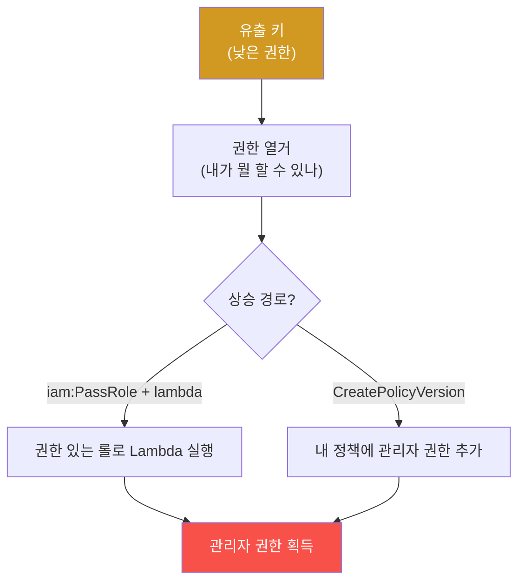

# agent-ir-adv W04 — Cloud IAM 자동 Pivot: 유출된 키 하나가 10분 만에 클라우드를 장악한다

> **본 주차의 한 줄 요약**
>
> W04는 **클라우드 IAM(Identity and Access Management)** 공격을 다룬다. 원리: 유출된 **접근 키 하나**(코드에
> 하드코딩·공개 저장소·로그 유출)로 시작해, 공격자가 **권한을 단계적으로 확대(pivot)** 해 클라우드 전체를 장악
> 한다. IAM은 복잡한 권한 그래프라 **설정 실수(misconfiguration)** 가 흔하고, 그 실수를 이어붙이면 낮은 권한이
> 관리자로 상승한다(예: `iam:PassRole`+`lambda:CreateFunction`으로 권한 있는 롤 탈취). AI 공격자는 이 **권한
> 그래프를 자동 탐색**한다 — 유출 키로 현재 권한 열거→가능한 상승 경로 탐색→실행, 사람이 며칠 걸리던 pivot을
> **10분**에. 탐지: (1) **비정상 API 호출 패턴**(키가 갑자기 열거·권한 조회 대량 실행), (2) **권한 상승 체인**
> (위험 API 조합 호출), (3) **비정상 출처·시간**(키가 낯선 IP·지역에서). 방어: **최소 권한**(꼭 필요한 것만),
> **키 순환·단기 자격**(장기 키 대신 임시 토큰), **위험 API 조합 모니터링**. el34는 클라우드가 없으므로 이번
> 주는 **IAM 권한 그래프·pivot 탐지를 결정론 시뮬**로 익힌다(클라우드 텔레메트리 el34 미보유).
>
> **한 줄 결론**: 유출된 IAM 키는 **권한 상승 체인**으로 클라우드 전체를 장악한다. AI는 권한 그래프를 자동
> 탐색해 10분 pivot. 방어 = **최소 권한 + 단기 자격 + 위험 API 조합 탐지**.

---

## 학습 목표

본 주차 종료 시 학생은 다음 5가지를 **본인 손으로** 할 수 있어야 한다.

1. **IAM pivot**(권한 상승 체인)의 원리를 설명한다.
2. 유출 키의 **비정상 API 정찰**을 탐지한다(IAM_RECON_DETECTED).
3. **권한 상승 체인**(위험 API 조합)을 탐지한다(PRIVESC_DETECTED).
4. **최소 권한·단기 자격**으로 방어한다(CONTAINED).
5. AI가 권한 그래프를 자동 탐색하는 위험을 설명한다.

> **이 주차의 시선** — 복잡한 권한 그래프의 실수를 이어붙이는 공격을 탐지·최소권한으로 막는다.

---

## 0. 용어 해설 (Cloud IAM)

| 용어 | 영문 | 뜻 | 비유 |
|------|------|----|------|
| **IAM** | Identity & Access Mgmt | 클라우드 권한 관리 | 권한 대장 |
| **pivot** | Pivot | 권한 확대 이동 | 발판 넓히기 |
| **PassRole** | iam:PassRole | 롤 위임 권한 | 대리 권한 |
| **최소 권한** | Least Privilege | 꼭 필요한 권한만 | 최소 열쇠 |
| **단기 자격** | Short-lived Credential | 임시 토큰 | 일회용 출입증 |

> **헷갈리기 쉬운 한 쌍** — *권한이 있다* 는 "직접 할 수 있다", *pivot 가능* 은 "권한을 이어붙여 결국 할 수 있다"
> 이다. 후자가 IAM 공격의 본질 — 개별은 낮아도 조합하면 관리자.

---

## 0.5 신입생 친화 핵심 개념

### 0.5.1 IAM pivot — 권한을 이어붙이기

개별 권한은 낮아도, **위험한 조합**(PassRole+함수 실행, 정책 버전 생성 등)을 찾아 이어붙이면 관리자가 된다.
AI는 이 그래프를 자동 탐색한다.

### 0.5.2 왜 10분인가

수동 pivot: 권한 열거→가능 경로 분석→실행(며칠, 클라우드 API 복잡). AI 자동화: (1) 유출 키로 **모든 권한 자동
열거**, (2) 알려진 상승 경로 **자동 매칭**, (3) 성공 경로 **자동 실행**, (4) 새 권한으로 반복. 클라우드 API가
프로그래밍 가능하니 AI에 최적 — 템포 격차가 극대화(10분 장악).

### 0.5.3 탐지 — API 패턴과 위험 조합

- **정찰 패턴**: 키가 갑자기 `List*`·`Get*`·`Describe*`를 **대량** 호출(권한 열거) → 정상 앱은 정해진 API만 씀.
- **상승 체인**: `iam:PassRole`·`CreatePolicyVersion`·`AttachUserPolicy` 같은 **위험 API 조합** 호출 → 권한
  조작 시도.
- **컨텍스트 이상**: 키가 **낯선 IP·지역·시간**에서 사용 → 유출 신호.
CloudTrail(API 감사 로그)을 SIEM에서 모니터링한다.

### 0.5.4 방어 — 최소 권한과 단기 자격

- **최소 권한**: 각 키/롤에 **꼭 필요한 권한만**. 상승 경로의 위험 API(PassRole 등)를 함부로 안 줌.
- **단기 자격**: 장기 액세스 키 대신 **임시 토큰**(STS, 수 시간 만료). 유출돼도 곧 무효.
- **경계**: SCP(조직 정책)로 위험 API를 조직 차원 차단. 
공격은 **잘못된 권한 조합**에 의존 — 최소 권한이 그 조합을 끊는다.

### 0.5.5 el34 맥락과 한계

el34는 클라우드가 없다. 이번 주는 **IAM 권한 그래프·상승 체인 탐지를 결정론 시뮬**로 익힌다(위험 API 조합
판정). 실제론 CloudTrail 로그 기반 탐지·IAM Access Analyzer로 구현한다. (클라우드 텔레메트리 el34 미보유.)

---

## 1. 실습 안내 (5 미션)

실행 위치 el34 **호스트**(`ssh ccc@{{TARGET_IP}}`), GPU `http://211.170.162.139:10934`.

### STEP 1 — GPU 헬스체크 → GEN_OK
### STEP 2 — IAM 정찰 탐지 → IAM_RECON_DETECTED
### STEP 3 — 권한 상승 체인 탐지 → PRIVESC_DETECTED
### STEP 4 — 최소 권한 방어 → CONTAINED
### STEP 5 — 종합 → Assessment

---

## 2. 흔한 오해·블루팀 노트

- **"키 권한이 낮으면 안전"** — pivot으로 상승. 위험 API 조합을 봐야.
- **"장기 키가 편하다"** — 유출 시 지속 악용. 단기 자격으로.
- **"클라우드는 알아서 안전"** — 설정 실수가 흔하다. 최소 권한·모니터링은 사용자 책임.
- **관제 관점** — CloudTrail로 API 정찰·위험 조합이 모니터링되는지, 최소 권한·단기 자격이 적용되는지, 위험
  API가 SCP로 차단되는지 점검한다. IAM 공격은 권한 조합 — 최소 권한이 근본 방어.

---

## 3. 다음 주차 (W05) 예고 — 0-day 웹 프레임워크 자동 악용

W04가 "클라우드 권한 pivot"이었다면, W05는 **0-day 웹 프레임워크** — 에이전트가 패치 전 취약점을 자동으로
악용하는 기법과, 알려지지 않은 공격을 행위 기반으로 탐지하는 법을 다룬다. el34 웹으로 실측한다.
