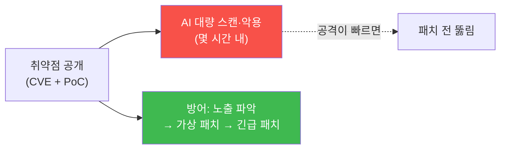

# agent-ir-adv W06 — N-day 대규모 악용: Log4Shell·Spring4Shell·아직 오지 않은 것

> **본 주차의 한 줄 요약**
>
> W05의 0-day가 "미공개"였다면, W06의 **N-day**는 **공개됐지만 아직 패치 안 된** 취약점이다. Log4Shell·
> Spring4Shell처럼 심각한 취약점이 공개되면, AI 공격자는 **공개 직후 몇 시간 안에** 전 인터넷을 **대량 스캔·
> 악용**한다 — 방어자가 패치를 적용하기도 전에. 여기서 방어의 승부처는 **속도**다: (1) **노출 인벤토리** — 우리가
> 그 취약 컴포넌트를 **어디에 쓰는지** 즉시 파악(모르면 패치도 못 함), (2) **대량 스캔 탐지** — 공개된 CVE
> 경로를 여러 출처가 동시에 두드리는 패턴, (3) **패치 우선순위** — 노출됐고+악용 중인 자산부터 긴급 패치. N-day는
> 시그니처가 **있으므로**(공개됨) 탐지는 쉽지만, **노출 파악과 패치 속도**가 관건이다. "우리가 취약한지도 모르면"
> 공개된 취약점에도 당한다. el34 웹으로 N-day 스캔 패턴 탐지와 노출 인벤토리·우선순위를 익힌다. 핵심 교훈:
> **공개 취약점은 시간 싸움** — AI 공격이 몇 시간이면, 방어도 몇 시간 안에 노출 파악·가상 패치·긴급 패치해야 한다.
>
> **한 줄 결론**: N-day는 공개 즉시 AI가 대량 악용한다 — 승부처는 **속도**. **노출 인벤토리 + 대량 스캔 탐지 +
> 패치 우선순위(노출×악용)** 로 몇 시간 안에 대응한다. 모르는 노출이 가장 위험하다.

---

## 학습 목표

본 주차 종료 시 학생은 다음 5가지를 **본인 손으로** 할 수 있어야 한다.

1. **N-day**(공개·미패치)와 0-day의 차이를 설명한다.
2. **대량 스캔**(공개 CVE 경로)을 탐지한다(NDAY_SCAN_DETECTED).
3. **노출 인벤토리**로 취약 자산을 파악한다(EXPOSURE_MAPPED).
4. **패치 우선순위**(노출×악용)를 정한다(PRIORITIZED).
5. N-day가 시간 싸움인 이유를 설명한다.

> **이 주차의 시선** — 공개된 취약점을, 노출 파악과 속도로 막는다. 모르는 노출을 없앤다.

---

## 0. 용어 해설 (N-day)

| 용어 | 영문 | 뜻 | 비유 |
|------|------|----|------|
| **N-day** | N-day | 공개·미패치 취약점 | 알려진 열쇠구멍 |
| **노출 인벤토리** | Exposure Inventory | 취약 자산 목록 | 취약점 지도 |
| **대량 스캔** | Mass Scanning | 광범위 자동 탐색 | 융단 폭격 |
| **패치 우선순위** | Patch Prioritization | 패치 순서 | 응급 분류 |
| **SBOM** | Software Bill of Materials | 소프트웨어 구성표 | 부품 명세 |

> **헷갈리기 쉬운 한 쌍** — *0-day* 는 "모르는 취약점(시그니처 없음)", *N-day* 는 "아는 취약점(시그니처 있음,
> 미패치)"이다. N-day는 탐지보다 **노출 파악·패치 속도**가 관건.

---

## 0.5 신입생 친화 핵심 개념

### 0.5.1 N-day 타임라인 — 공개가 곧 경주 시작

공개 순간 공격자와 방어자의 **경주**가 시작된다. AI 공격이 몇 시간이면, 방어도 몇 시간 안에 움직여야 한다.

### 0.5.2 노출 인벤토리 — 모르면 못 막는다

가장 위험한 건 **"우리가 취약한지도 모르는"** 것이다. Log4j가 어느 앱·어느 의존성 깊숙이 들어 있는지 모르면
패치도 못 한다. **SBOM(소프트웨어 구성표)** 로 어떤 컴포넌트를 어디에 쓰는지 **미리** 파악해 두면, 공개 즉시
"우리 중 이것들이 취약"을 안다. 노출 인벤토리가 대응 속도의 전제.

### 0.5.3 대량 스캔 탐지 — 공개 직후 폭증

N-day 공개 직후, 공개된 **CVE 경로**(예: Log4Shell의 `${jndi:...}` 헤더)를 **여러 출처가 동시에** 두드린다.
이 대량 스캔은 명확한 신호다(시그니처 있음). 탐지해서 (1) 공격 인지, (2) 가상 패치(W05) 즉시 적용, (3) 우리
노출과 대조.

### 0.5.4 패치 우선순위 — 노출 × 악용

모든 걸 동시에 패치할 순 없다. 우선순위: **노출(외부 접근 가능) × 악용(실제 공격 중) × 중요도(자산 가치)**.
외부 노출됐고+악용 중인+중요 자산부터. 내부 전용·미악용은 나중. 자원을 **가장 위험한 것**에 집중한다.

### 0.5.5 el34에서의 실측

el34 웹으로 N-day 대량 스캔 패턴(공개 CVE 경로를 여러 출처가 탐색)을 탐지하고, 노출 인벤토리(어느 서비스가
취약 컴포넌트 사용)와 패치 우선순위를 결정론으로 익힌다. bastion apache/suricata로 스캔 관찰. 실제 조직에선
SBOM·취약점 스캐너·EASM(외부 노출 관리)으로 구현한다.

---

## 1. 실습 안내 (5 미션)

실행 위치 el34 **호스트**(`ssh ccc@{{TARGET_IP}}`), GPU `http://211.170.162.139:10934`, bastion `el34-bastion:9100`.

### STEP 1 — GPU 헬스체크 → GEN_OK
### STEP 2 — 대량 스캔 탐지 → NDAY_SCAN_DETECTED
### STEP 3 — 노출 인벤토리 → EXPOSURE_MAPPED
### STEP 4 — 패치 우선순위 → PRIORITIZED
### STEP 5 — 종합 → Assessment

---

## 2. 흔한 오해·관제자 노트

- **"공개 취약점은 금방 패치"** — 노출을 모르면 못 패치. SBOM·인벤토리 필수.
- **"패치는 순서대로"** — 노출×악용×중요도로 우선순위. 가장 위험한 것부터.
- **"내부는 안전"** — 측면이동으로 내부도 도달. 노출만이 아니라 전체 파악.
- **관제 관점** — SBOM·노출 인벤토리가 최신인지, N-day 공개 시 몇 시간 안에 노출 파악·가상 패치하는지, 우선순위가
  노출×악용 기반인지 점검한다. N-day 대응력은 노출 가시성+패치 속도.

---

## 3. 다음 주차 (W07) 예고 — Multi-stage 피싱→웹셸→측면이동

W06이 "N-day 대량 악용"이었다면, W07은 **Human+Agent 하이브리드** 다단계 공격 — 피싱으로 초기 침투, 웹셸로
발판, 측면이동으로 확산하는 사람+에이전트 협업 공격과 그 단계별 탐지를 다룬다.
