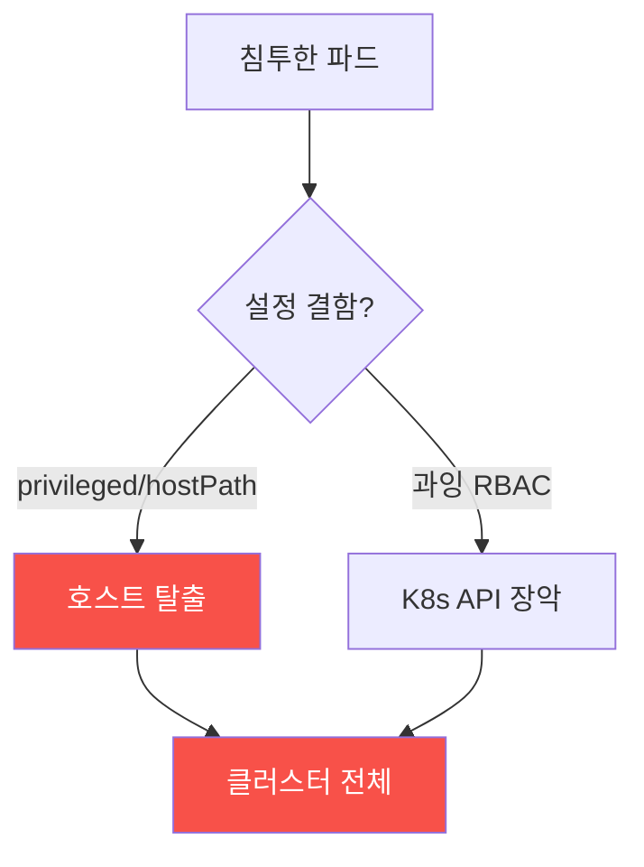

# agent-ir-adv W08 — 컨테이너·K8s 탈출 + API 악용: 작은 결함이 클러스터 전체로

> **본 주차의 한 줄 요약**
>
> W08은 **컨테이너·쿠버네티스(K8s)** 환경의 공격을 다룬다. 컨테이너는 격리를 제공하지만, **설정 실수 하나**가
> 그 격리를 무너뜨려 **호스트·클러스터 전체 장악**으로 번진다. 대표 결함: ① **특권 컨테이너**(`privileged: true`)
> — 호스트 커널에 거의 무제한 접근, ② **호스트 마운트**(`hostPath`로 호스트 파일시스템 마운트) — 컨테이너에서
> 호스트 파일 조작, ③ **과잉 권한 서비스어카운트**(K8s API에 admin 권한) — 파드 하나 뚫리면 클러스터 API
> 장악, ④ **호스트 네임스페이스 공유**(hostPID/hostNetwork). AI 공격자는 침투한 컨테이너에서 이 결함들을
> **자동 열거·악용**해 **탈출(escape)** 하고, K8s API로 **측면이동**한다 — 파드 하나가 클러스터 전체로. 방어:
> (1) **설정 감사**(특권·hostPath·과잉 권한 탐지), (2) **탈출 흔적 탐지**(컨테이너 프로세스가 호스트 자원 접근),
> (3) **최소 권한 RBAC**(서비스어카운트에 꼭 필요한 K8s 권한만) + **파드 보안 표준**(특권 금지). el34는 K8s가
> 없으므로 이번 주는 **설정 감사·탈출 탐지 로직을 결정론 시뮬**로 익힌다(K8s 텔레메트리 el34 미보유).
>
> **한 줄 결론**: 컨테이너 설정 실수(특권·hostPath·과잉 RBAC)가 격리를 무너뜨려 클러스터 전체로 번진다.
> 방어 = **설정 감사 + 탈출 흔적 탐지 + 최소 권한 RBAC·파드 보안 표준**.

---

## 학습 목표

본 주차 종료 시 학생은 다음 5가지를 **본인 손으로** 할 수 있어야 한다.

1. 컨테이너 **탈출**과 K8s API 악용의 원리를 설명한다.
2. **위험 설정**(특권·hostPath 등)을 감사한다(MISCONFIG_DETECTED).
3. **탈출 흔적**(호스트 자원 접근)을 탐지한다(ESCAPE_DETECTED).
4. **최소 권한 RBAC**로 강화한다(RBAC_HARDENED).
5. 작은 결함이 클러스터로 번지는 이유를 설명한다.

> **이 주차의 시선** — 격리를 무너뜨리는 설정 실수를 감사·최소권한으로 막는다.

---

## 0. 용어 해설 (컨테이너·K8s)

| 용어 | 영문 | 뜻 | 비유 |
|------|------|----|------|
| **컨테이너 탈출** | Container Escape | 컨테이너→호스트 침투 | 감방 탈출 |
| **특권 컨테이너** | Privileged | 호스트 거의 무제한 접근 | 만능 열쇠 |
| **hostPath** | hostPath | 호스트 파일시스템 마운트 | 벽에 구멍 |
| **RBAC** | Role-Based Access Control | K8s 권한 제어 | 권한 등급 |
| **파드 보안 표준** | Pod Security Standard | 파드 보안 정책 | 안전 규격 |

> **헷갈리기 쉬운 한 쌍** — *컨테이너 침해* 는 "컨테이너 안 장악", *컨테이너 탈출* 은 "호스트까지 나감"이다.
> 탈출을 막는 게 격리의 핵심.

---

## 0.5 핵심 개념

### 0.5.1 작은 결함 → 클러스터 전체

파드 하나 뚫려도 **격리가 견고하면** 거기서 끝난다. 하지만 특권·hostPath·과잉 RBAC 같은 결함이 있으면 **호스트·
클러스터 전체**로 번진다. 결함이 곧 확산 경로.

### 0.5.2 위험 설정 감사 — 결함 미리 찾기

배포 전/후 **설정을 감사**한다: `privileged: true`, `hostPath` 마운트, `hostPID/hostNetwork`, root 실행,
과잉 capability(SYS_ADMIN 등). 이런 설정은 **탈출의 발판**이다. CI/CD·어드미션 컨트롤러에서 위험 설정을 **배포
차단**하면 결함이 애초에 안 들어간다.

### 0.5.3 탈출 흔적 탐지 — 호스트 자원 접근

탈출이 시도되면 **컨테이너가 호스트 자원에 접근**한다: 호스트 파일시스템 경로 접근, 호스트 프로세스 조작,
컨테이너 런타임 소켓(`/var/run/docker.sock`) 접근, 커널 모듈 로드. 런타임 보안(Falco 등)으로 이런 **비정상
컨테이너 행위**를 탐지한다. 컨테이너는 정해진 일만 해야 하므로, 벗어난 행위가 곧 신호.

### 0.5.4 최소 권한 RBAC — 확산 차단

K8s **서비스어카운트**에 **꼭 필요한 API 권한만** 준다: 파드가 `secrets` 전체를 읽을 필요 없으면 안 준다.
과잉 권한이면 파드 하나가 클러스터 API를 장악한다. **파드 보안 표준(restricted)** 으로 특권·hostPath를 금지.
최소 권한이 결함의 확산을 끊는다(W04 IAM 최소권한의 K8s판).

### 0.5.5 el34 맥락과 한계

el34는 K8s가 없다. 이번 주는 **파드 설정 감사·탈출 흔적·RBAC 최소권한 로직을 결정론 시뮬**로 익힌다. 실제론
어드미션 컨트롤러(OPA/Kyverno)·런타임 보안(Falco)·RBAC 감사로 구현한다. (K8s 텔레메트리 el34 미보유.)

---

## 1. 실습 안내 (5 미션)

실행 위치 el34 **호스트**(`ssh ccc@{{TARGET_IP}}`), GPU `http://211.170.162.139:10934`.

### STEP 1 — GPU 헬스체크 → GEN_OK
### STEP 2 — 위험 설정 감사 → MISCONFIG_DETECTED
### STEP 3 — 탈출 흔적 탐지 → ESCAPE_DETECTED
### STEP 4 — 최소 권한 RBAC → RBAC_HARDENED
### STEP 5 — 종합 → Assessment

---

## 2. 흔한 오해·블루팀 노트

- **"컨테이너는 안전한 격리"** — 설정 실수가 격리를 무너뜨린다. 특권·hostPath 금지.
- **"파드 하나면 별거 아님"** — 과잉 RBAC면 클러스터로 번진다. 최소 권한.
- **"이미지만 스캔하면 됨"** — 런타임 설정·행위도 봐야. 어드미션+런타임 보안.
- **관제 관점** — 위험 설정이 배포 차단되는지, 런타임 탈출 흔적이 탐지되는지, RBAC가 최소 권한인지, 파드 보안
  표준이 적용되는지 점검한다. 컨테이너 방어는 설정 감사+최소 권한+런타임 탐지.

---

## 3. 다음 주차 (W09) 예고 — Fileless·Memory-only 악성코드

W08이 "컨테이너 탈출"이었다면, W09는 **파일리스(fileless)** 악성코드 — 디스크에 흔적을 안 남기고 메모리에서만
동작하는 악성코드와, 그 메모리·행위 기반 탐지를 다룬다. (디스크 흔적이 없어 행위 탐지가 핵심.)
