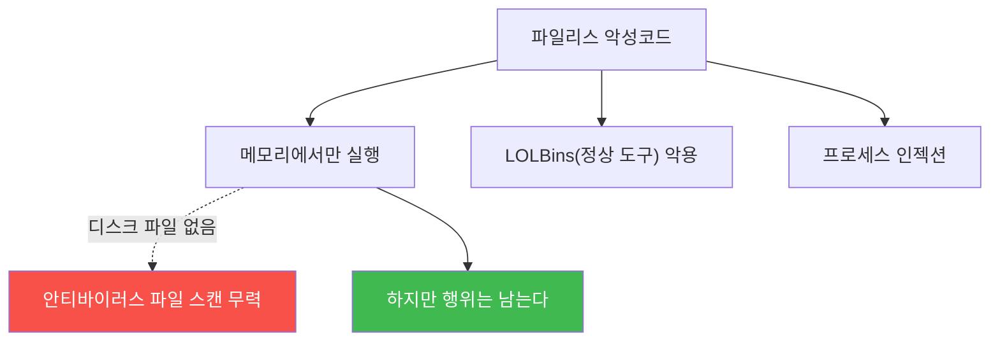

# agent-ir-adv W09 — Fileless·Memory-only 악성코드: 디스크에 흔적이 없다

> **본 주차의 한 줄 요약**
>
> W09는 **파일리스(fileless)** 악성코드를 다룬다. 전통 악성코드는 **디스크에 파일**을 남기므로 안티바이러스가
> 파일을 스캔해 잡는다. 파일리스는 **디스크에 아무것도 안 쓰고 메모리에서만** 동작한다 — 스캔할 파일이 없으니
> 파일 기반 탐지가 무력하다. 대표 기법: (1) **메모리 내 실행**(코드를 파일로 저장 않고 메모리에 직접 로드·실행),
> (2) **LOLBins**(Living-off-the-Land Binaries — `powershell`·`wmic`·`certutil` 같은 **정상 시스템 도구**를
> 악용해 자기 코드 없이 공격), (3) **프로세스 인젝션**(정상 프로세스에 코드 주입해 숨음), (4) **레지스트리·WMI
> 상주**(파일 대신 설정에 숨음). AI 공격자는 이런 파일리스 기법을 자동 조합한다. 방어의 답은 **행위·메모리 기반**:
> 디스크 파일이 없으니 **무엇을 하는가**(프로세스 인젝션·비정상 LOLBin 사용·메모리 실행 패턴·비정상 부모-자식
> 프로세스)를 본다. **정상 도구의 비정상 사용**이 핵심 신호다 — powershell 자체는 정상이지만, 인코딩된 명령을
> 원격에서 받아 실행하면 이상. el34 Linux 맥락에서 LOLBin·프로세스 이상 행위 탐지를 익힌다.
>
> **한 줄 결론**: 파일리스 악성코드는 디스크 흔적 없이 메모리·정상 도구(LOLBins)로 동작해 파일 스캔을 무력화한다.
> 방어 = **행위·메모리 기반 탐지**(프로세스 인젝션·비정상 LOLBin 사용·이상 부모-자식). 정상 도구의 비정상 사용을 잡는다.

---

## 학습 목표

본 주차 종료 시 학생은 다음 5가지를 **본인 손으로** 할 수 있어야 한다.

1. **파일리스** 악성코드가 파일 탐지를 무력화하는 이유를 설명한다.
2. **LOLBin 비정상 사용**을 탐지한다(FILELESS_INDICATOR).
3. **프로세스 인젝션·이상 행위**를 탐지한다(BEHAVIOR_DETECTED).
4. **메모리·행위 기반** 방어를 적용한다(CONTAINED).
5. "정상 도구의 비정상 사용"이 핵심 신호인 이유를 설명한다.

> **이 주차의 시선** — 파일이 없어도, 행위는 남는다. 무엇을 하는가로 잡는다.

---

## 0. 용어 해설 (파일리스)

| 용어 | 영문 | 뜻 | 비유 |
|------|------|----|------|
| **파일리스** | Fileless | 디스크 흔적 없음 | 유령 |
| **LOLBins** | Living-off-the-Land | 정상 도구 악용 | 남의 연장 |
| **프로세스 인젝션** | Process Injection | 정상 프로세스에 코드 주입 | 빙의 |
| **메모리 실행** | In-memory Execution | 파일 없이 메모리 실행 | 흔적 없는 작업 |
| **부모-자식** | Parent-Child | 프로세스 생성 관계 | 계보 |

> **헷갈리기 쉬운 한 쌍** — *파일 기반 탐지* 는 "악성 파일을 스캔"(파일리스에 무력), *행위 기반 탐지* 는 "악성
> 행위를 관찰"(파일리스에 유효)이다.

---

## 0.5 신입생 친화 핵심 개념

### 0.5.1 파일리스 — 스캔할 파일이 없다

디스크에 파일이 없으니 파일 스캔은 못 잡는다. 하지만 **메모리 상태·프로세스 행위**는 남는다 — 거기서 잡는다.

### 0.5.2 LOLBins — 정상 도구의 비정상 사용

`powershell`·`certutil`·`wmic`(Windows), `curl`·`bash`·`python`(Linux)은 **정상 도구**다. 파일리스는 이들을
악용해 자기 악성 파일 없이 공격한다: `certutil`로 원격 파일 다운로드, `powershell -enc`로 인코딩된 명령 실행.
**도구 자체는 정상**이라 차단할 수 없다 — **사용 방식의 이상**(인코딩된 원격 명령·비정상 인자)을 봐야 한다.

### 0.5.3 프로세스 인젝션·이상 부모-자식

파일리스는 **정상 프로세스에 숨는다**: 코드를 정상 프로세스(예: `explorer.exe`) 메모리에 주입. 탐지 신호:
(1) **비정상 부모-자식**(웹서버가 셸을 낳음, 워드가 powershell을 낳음), (2) **메모리 이상**(실행 권한 있는
익명 메모리 영역), (3) **비정상 API 호출**(인젝션 관련 시스템 콜). 프로세스 계보와 메모리가 신호.

### 0.5.4 방어 — 행위·메모리 기반 (EDR)

- **행위 기반 탐지(EDR)**: 프로세스 인젝션·이상 부모-자식·비정상 LOLBin 사용을 **행위 규칙**으로.
- **메모리 스캔**: 실행 중 메모리에서 악성 패턴 탐지(디스크 아닌 메모리).
- **LOLBin 정책**: 정상 도구의 **비정상 사용 차단**(예: 서버에서 certutil 원격 다운로드 금지).
파일이 없어도 **행위·메모리**로 잡는다 — 이것이 파일리스의 답.

### 0.5.5 el34 맥락

el34 Linux에서 LOLBin(curl/wget/bash) 비정상 사용, 이상 부모-자식(웹서버→셸), 프로세스 이상을 관찰한다.
bastion으로 프로세스 상태를 볼 수 있다(단, 실제 EDR·메모리 스캔은 전용 도구 필요). 이번 주는 행위 기반 탐지
로직을 결정론으로 익힌다. Windows Sysmon 상당 텔레메트리는 el34 미보유.

---

## 1. 실습 안내 (5 미션)

실행 위치 el34 **호스트**(`ssh ccc@{{TARGET_IP}}`), GPU `http://211.170.162.139:10934`.

### STEP 1 — GPU 헬스체크 → GEN_OK
### STEP 2 — LOLBin 비정상 사용 → FILELESS_INDICATOR
### STEP 3 — 이상 행위 탐지 → BEHAVIOR_DETECTED
### STEP 4 — 행위 기반 방어 → CONTAINED
### STEP 5 — 종합 → Assessment

---

## 2. 흔한 오해·관제자 노트

- **"안티바이러스가 잡는다"** — 파일 없으면 무력. 행위·메모리 기반(EDR) 필요.
- **"정상 도구는 허용"** — 비정상 사용(인코딩 원격 명령)이 문제. 사용 방식을 봐야.
- **"메모리는 못 본다"** — EDR·메모리 스캔으로 본다. 파일 없어도 행위·메모리는 있다.
- **관제 관점** — 행위 기반 탐지(EDR)가 있는지, LOLBin 비정상 사용·프로세스 인젝션·이상 부모-자식이 탐지되는지,
  정상 도구의 비정상 사용을 차단하는지 점검한다. 파일리스는 행위로만 잡힌다.

---

## 3. 다음 주차 (W10) 예고 — DNS Exfiltration + AI 인코딩

W09가 "파일 없는 악성코드"였다면, W10은 **DNS 탈출** — 데이터를 DNS 쿼리에 숨겨 방화벽을 지나가는 조용한
누출과, DNS 이상(엔트로피·볼륨) 탐지를 다룬다. el34로 DNS 이상을 관찰한다.
