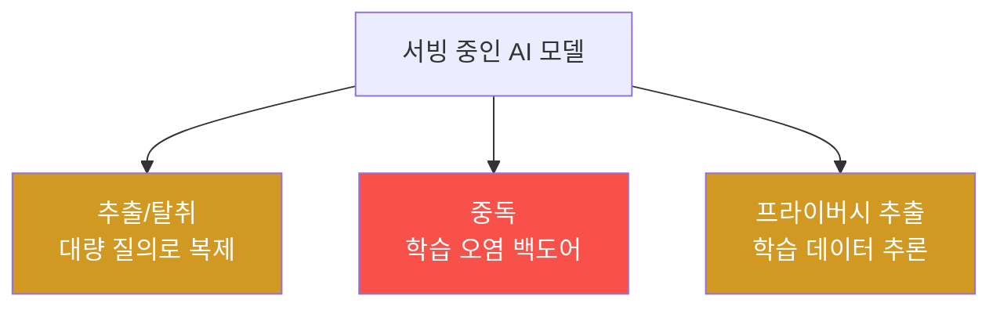

# agent-ir-adv W11 — AI 모델 자체 공격: Model Theft·Poisoning·Extraction

> **본 주차의 한 줄 요약**
>
> W11은 **AI 모델 자체를 표적**으로 하는 공격을 다룬다. 조직이 AI 모델을 서빙하면, 모델도 **자산이자 공격면**이
> 된다. 세 축: ① **모델 추출/탈취(Extraction/Theft)** — 공격자가 모델에 **체계적으로 대량 질의**해 입출력을
> 수집하고, 그걸로 **모델을 복제**(지식 증류)하거나 **결정 경계를 역설계**. 값비싼 모델을 질의만으로 훔친다.
> ② **모델 중독(Poisoning)** — 학습 데이터를 오염시켜 **백도어**를 심는다(ai-safety-adv W07에서 QLoRA로 실제
> 제작). 트리거에서만 발화하는 숨은 악성 동작. ③ **멤버십 추론/프라이버시 추출** — 질의로 **학습 데이터를 추론**
> (특정 데이터가 학습에 쓰였나·민감 정보 추출). 방어: (1) **추출 탐지**(체계적 대량 질의 패턴), (2) **중독 탐지**
> (백도어 트리거 테스트·데이터 출처 검증), (3) **보호**(질의 속도 제한·출력 섭동·워터마킹·모델 무결성). el34
> GPU에는 **실제 취약 모델**(ccc-backdoor-qlora 등)이 있어, 백도어 트리거 탐지를 **실측**할 수 있다. 모델 방어는
> ai-safety-adv의 연장이자 방어자 관점의 종합이다.
>
> **한 줄 결론**: AI 모델은 자산이자 공격면 — **추출(질의로 복제)·중독(백도어)·프라이버시 추출**의 표적이다.
> 방어 = **추출 탐지 + 중독 탐지(트리거 테스트) + 보호(속도 제한·섭동·무결성)**.

---

## 학습 목표

본 주차 종료 시 학생은 다음 5가지를 **본인 손으로** 할 수 있어야 한다.

1. 모델 **추출·중독·프라이버시 추출**을 구분한다.
2. **체계적 대량 질의**(추출 시도)를 탐지한다(EXTRACTION_DETECTED).
3. **백도어 트리거**를 테스트로 탐지한다(POISONING_DETECTED).
4. 모델 **보호**(속도 제한·섭동)를 적용한다(PROTECTED).
5. 모델이 자산이자 공격면인 이유를 설명한다.

> **이 주차의 시선** — 방어할 자산 목록에 "AI 모델"을 추가하고, 그 고유 공격을 막는다.

---

## 0. 용어 해설 (모델 공격)

| 용어 | 영문 | 뜻 | 비유 |
|------|------|----|------|
| **모델 추출** | Model Extraction | 질의로 모델 복제 | 리버스 엔지니어링 |
| **모델 중독** | Model Poisoning | 백도어 심기 | 내부 사보타주 |
| **멤버십 추론** | Membership Inference | 학습 데이터 추론 | 정보 캐기 |
| **출력 섭동** | Output Perturbation | 출력에 노이즈 | 흐리게 |
| **워터마킹** | Watermarking | 모델 소유 표식 | 지문 |

> **헷갈리기 쉬운 한 쌍** — *추출* 은 "모델을 훔침(복제)", *중독* 은 "모델에 백도어 심음"이다. 전자는 질의로,
> 후자는 학습으로.

---

## 0.5 핵심 개념

### 0.5.1 세 가지 모델 공격

모델을 서빙하면 이 세 방향의 공격면이 열린다. 각각 다른 방어가 필요하다.

### 0.5.2 모델 추출 — 질의로 훔친다

공격자가 모델에 **체계적으로 대량 질의**(경계를 탐색하는 입력)하고 입출력 쌍을 수집하면, 그걸로 **복제 모델을
학습**할 수 있다(지식 증류). 값비싼 모델을 **질의 비용만으로** 훔친다. 탐지: 정상 사용과 다른 **체계적·대량·
경계 탐색** 질의 패턴(짧은 시간 다양한 입력 대량, 결정 경계 근처 집중).

### 0.5.3 모델 중독 — 백도어 (실측)

학습 데이터를 오염시켜 **트리거에서만 발화하는 백도어**를 심는다(ai-safety-adv W07에서 QLoRA로 실제 제작한
`ccc-backdoor-qlora`). 방어자 관점 탐지: **트리거 테스트** — 의심 트리거 입력으로 모델을 질의해 비정상 발화를
확인. 정상 입력은 정상, 특정 트리거에서만 이상 출력이 나오면 중독 의심. el34 GPU에서 실측한다.

### 0.5.4 방어 — 속도 제한·섭동·무결성

- **질의 속도 제한**: 추출은 대량 질의가 필요 → 속도·양 제한으로 어렵게.
- **출력 섭동**: 출력에 약한 노이즈·반올림 → 정확한 복제를 방해(정상 사용은 영향 미미).
- **워터마킹·무결성**: 모델에 표식을 넣어 탈취 추적, 모델 파일 해시로 중독·변조 탐지.
- **데이터 출처 검증**: 학습 데이터 출처·정화로 중독 예방(ai-safety-adv W07).

### 0.5.5 모델을 자산 목록에

전통 IR은 서버·데이터를 자산으로 봤다. AI 시대엔 **모델도 핵심 자산**이다 — 훔치면 IP 손실, 중독되면 신뢰
붕괴. 방어자는 모델을 자산 인벤토리에 넣고, 접근·질의·무결성을 모니터링해야 한다. el34 GPU 모델이 그 실습 대상.

---

## 1. 실습 안내 (5 미션)

실행 위치 el34 **호스트**(`ssh ccc@{{TARGET_IP}}`), GPU `http://211.170.162.139:10934`(모델: gemma3:4b,
ccc-backdoor-qlora).

### STEP 1 — GPU 헬스체크 → GEN_OK
### STEP 2 — 추출 시도 탐지 → EXTRACTION_DETECTED
### STEP 3 — 백도어 트리거 테스트 → POISONING_DETECTED
### STEP 4 — 모델 보호 → PROTECTED
### STEP 5 — 종합 → Assessment

---

## 2. 흔한 오해·블루팀 노트

- **"모델은 코드 뒤에 안전"** — 질의만으로 추출·프라이버시 추출 가능. 질의도 감시.
- **"백도어는 학습 때만 걱정"** — 방어자는 트리거 테스트로 배포 모델을 검증.
- **"섭동은 성능 저하"** — 약한 섭동은 정상 사용에 영향 미미, 복제만 방해.
- **관제 관점** — 모델이 자산 인벤토리에 있는지, 질의 속도 제한·추출 패턴 탐지가 있는지, 배포 모델의 무결성·
  백도어를 검증하는지 점검한다. 모델 방어는 접근·질의·무결성 모니터링.

---

## 3. 다음 주차 (W12) 예고 — Deepfake Voice + AI 사회공학

W11이 "모델 자체 공격"이었다면, W12는 **딥페이크 음성** — AI가 목소리를 복제해 사회공학하는 공격과, 그 탐지·
검증 프로토콜을 다룬다.
