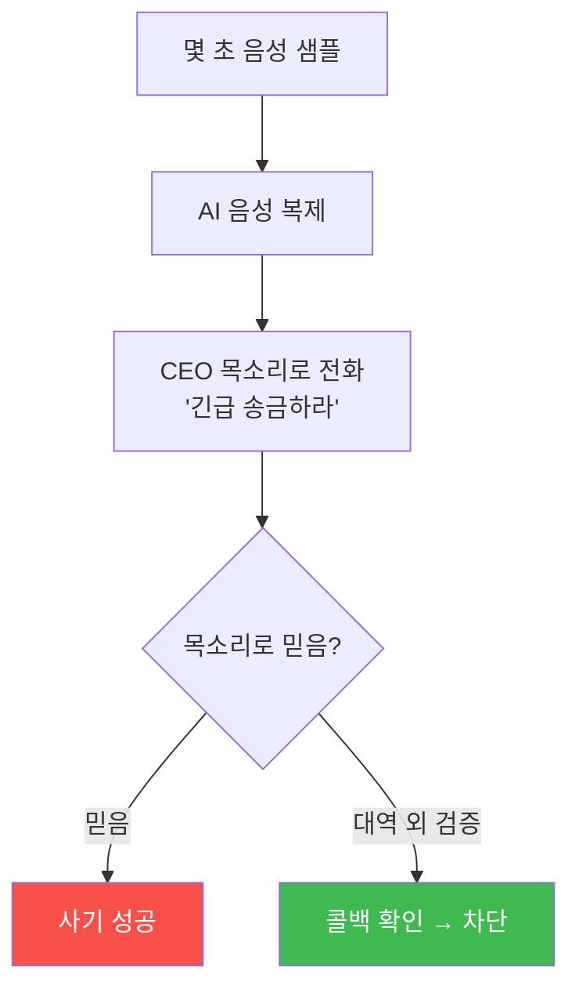

# agent-ir-adv W12 — Deepfake Voice + AI 사회공학: 목소리가 거짓을 말할 때

> **본 주차의 한 줄 요약**
>
> W12는 **딥페이크 음성** 기반 사회공학을 다룬다. AI는 이제 몇 초의 샘플로 **누구의 목소리든 복제**한다. 공격자는
> CEO·상사·거래처의 목소리를 복제해 전화로 **긴급 송금·자격 요구·승인**을 지시한다(CEO 사기·vishing). "목소리를
> 들었으니 본인"이라는 **인간의 신뢰**를 무너뜨린다 — 실제로 딥페이크 음성으로 수백만 달러 사기가 발생했다.
> 기술적 딥페이크 탐지(음성 합성 아티팩트)는 발전 중이지만 **군비 경쟁**이라 완벽하지 않다. 그래서 방어의 핵심은
> **기술 탐지가 아니라 프로세스**: (1) **대역 외 검증(out-of-band)** — 요청을 받은 채널이 아닌 **다른 채널**로
> 재확인(전화 요청 → 알려진 번호로 콜백, 사내 메신저 확인), (2) **코드워드·챌린지** — 사전 약속된 확인 절차,
> (3) **고위험 요청 정책** — 송금·자격 변경 같은 요청은 **음성만으로 절대 승인 금지**, 반드시 다중 검증. "목소리를
> 믿지 말고 프로세스를 믿는다"가 답이다. AI가 신뢰의 근거(목소리·얼굴)를 위조할 수 있으니, 신뢰를 **검증 가능한
> 프로세스**로 옮긴다.
>
> **한 줄 결론**: 딥페이크 음성은 "목소리=본인"이라는 신뢰를 무너뜨린다. 기술 탐지는 군비 경쟁이니, 방어는
> **프로세스** — 대역 외 검증·코드워드·고위험 요청 다중 검증. 목소리가 아니라 프로세스를 믿는다.

---

## 학습 목표

본 주차 종료 시 학생은 다음 5가지를 **본인 손으로** 할 수 있어야 한다.

1. **딥페이크 음성** 사회공학의 위협을 설명한다.
2. 딥페이크·사회공학 **정황 지표**를 식별한다(DEEPFAKE_INDICATOR).
3. **대역 외 검증** 프로토콜을 적용한다(VERIFIED_OOB).
4. **고위험 요청 정책**을 강제한다(POLICY_ENFORCED).
5. "목소리가 아니라 프로세스를 믿는다"의 의미를 설명한다.

> **이 주차의 시선** — 위조 가능한 신뢰(목소리)를, 검증 가능한 프로세스로 대체한다.

---

## 0. 용어 해설 (딥페이크 사회공학)

| 용어 | 영문 | 뜻 | 비유 |
|------|------|----|------|
| **딥페이크** | Deepfake | AI 위조 음성·영상 | 완벽한 성대모사 |
| **vishing** | Voice Phishing | 음성 피싱 | 전화 사기 |
| **대역 외 검증** | Out-of-band | 다른 채널 재확인 | 이중 확인 |
| **코드워드** | Code Word | 사전 약속 확인어 | 암구호 |
| **CEO 사기** | CEO Fraud | 임원 사칭 송금 | 상사 사칭 |

> **헷갈리기 쉬운 한 쌍** — *같은 채널 확인* 은 "전화로 다시 물음"(딥페이크에 무력), *대역 외 검증* 은 "다른 채널로
> 확인"(딥페이크 우회)이다.

---

## 0.5 신입생 친화 핵심 개념

### 0.5.1 딥페이크 음성 — 신뢰의 붕괴

"목소리를 들었으니 본인"은 이제 틀렸다. AI가 목소리를 위조한다. 신뢰의 근거가 무너졌다.

### 0.5.2 왜 기술 탐지만으론 부족한가

딥페이크 탐지 기술(합성 아티팩트 분석)은 있지만 **군비 경쟁**이다 — 탐지가 나오면 더 정교한 생성이 나온다.
전화 통화 품질에선 아티팩트도 흐려진다. 그래서 **기술 탐지에만 의존하면 진다.** 탐지는 보조, **프로세스가 주**.

### 0.5.3 대역 외 검증 — 다른 채널로

핵심 방어: 요청을 받은 **그 채널이 아닌 다른 채널**로 확인. 전화로 CEO가 송금 지시 → **알려진 CEO 번호로 콜백**
하거나 **사내 메신저로 확인**. 공격자가 한 채널(전화)을 위조해도, **독립된 다른 채널**까지 동시에 장악하긴
어렵다. 대역 외 검증이 딥페이크를 무력화한다.

### 0.5.4 고위험 요청 정책 — 음성만으론 금지

**송금·자격 변경·긴급 예외** 같은 고위험 요청은 **음성만으로 절대 승인 안 함**을 정책화한다: 반드시 (1) 대역 외
검증, (2) 코드워드/챌린지, (3) 이중 승인. "상사가 급하다고 재촉"은 **사회공학의 전형** — 긴급성 압박일수록 절차를
지킨다. 정책이 개인 판단(속을 수 있음)을 대신한다.

### 0.5.5 신뢰를 프로세스로

AI가 신뢰의 근거(목소리·얼굴·문체)를 위조할 수 있는 시대엔, **신뢰를 검증 가능한 프로세스로 옮긴다**: 코드워드,
대역 외 검증, 다중 승인, 이상 거래 모니터링. 이것이 W02(간접 인젝션)·W11(모델 신뢰)과 같은 원리 — **위조
가능한 신호를 믿지 말고, 검증 가능한 절차를 믿는다.**

---

## 1. 실습 안내 (5 미션)

실행 위치 el34 **호스트**(`ssh ccc@{{TARGET_IP}}`), GPU `http://211.170.162.139:10934`.
(음성 처리는 el34 밖 → 사회공학 정황·검증 프로토콜을 결정론 시뮬로.)

### STEP 1 — GPU 헬스체크 → GEN_OK
### STEP 2 — 정황 지표 식별 → DEEPFAKE_INDICATOR
### STEP 3 — 대역 외 검증 → VERIFIED_OOB
### STEP 4 — 고위험 요청 정책 → POLICY_ENFORCED
### STEP 5 — 종합 → Assessment

---

## 2. 흔한 오해·블루팀 노트

- **"목소리는 못 속인다"** — AI가 복제한다. 목소리를 신뢰 근거로 쓰지 말 것.
- **"기술 탐지면 충분"** — 군비 경쟁. 프로세스(대역 외 검증)가 주.
- **"긴급하면 예외"** — 긴급성 압박이 사회공학의 전형. 긴급일수록 절차 준수.
- **관제 관점** — 고위험 요청에 대역 외 검증·코드워드·다중 승인이 정책화됐는지, 긴급성 압박에도 절차를 지키는지,
  이상 거래가 모니터링되는지 점검한다. 딥페이크 방어는 프로세스가 핵심.

---

## 3. 다음 주차 (W13) 예고 — Insider + Agent Weaponization

W12가 "외부의 딥페이크"였다면, W13은 **내부자** 위협 — 내부자가 AI 에이전트를 도구로 악용하는 상황과, 내부자·
에이전트 오남용 탐지를 다룬다.
