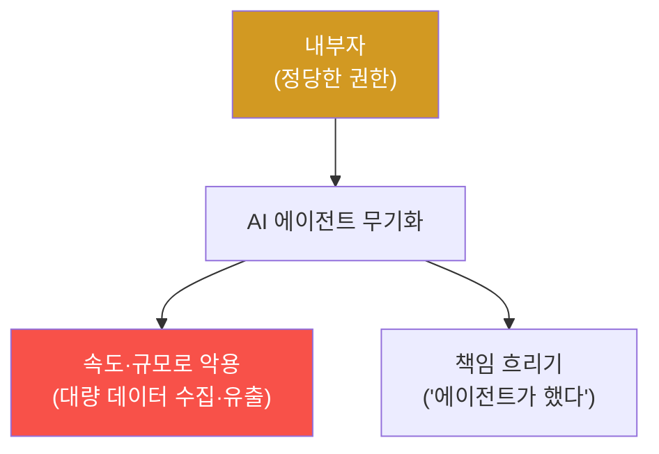

# agent-ir-adv W13 — Insider + Agent Weaponization: 내부자가 에이전트를 도구로

> **본 주차의 한 줄 요약**
>
> W13은 **내부자 위협**과 **에이전트 무기화**의 결합을 다룬다. 내부자(직원·계약자)는 이미 **정당한 접근 권한**을
> 가진다 — 외부 침투가 필요 없어 탐지가 어렵다. AI 시대의 새 위험: 내부자가 **AI 에이전트를 도구로 무기화**한다.
> 조직이 준 정당한 에이전트(데이터 분석·자동화 봇)의 접근을 **의도 밖으로** 악용하거나, 자신의 에이전트에 악의적
> 작업을 시킨다 — "에이전트가 한 일"이라 책임을 흐리고, 에이전트의 **속도·규모**로 피해를 키운다(예: 데이터
> 분석 에이전트로 민감 데이터를 대량 수집·유출). 탐지의 어려움: 내부자 행동은 **정상 권한 내**라 개별로는
> 합법처럼 보인다. 그래서 방어는 **행동 기준선(baseline)과 이상**: (1) **비정상 접근**(평소 안 보던 데이터·시간·
> 볼륨), (2) **에이전트 오남용**(에이전트가 승인 범위를 벗어난 작업), (3) **직무 분리 위반**(한 사람이 요청·승인
> 겸함). 방어: 최소 권한, **에이전트 행동 감사**, 직무 분리, 데이터 접근 모니터링. 정당한 권한도 **비정상 사용**은
> 잡는다.
>
> **한 줄 결론**: 내부자는 정당한 권한으로 AI 에이전트를 무기화해 속도·규모로 피해를 키운다. 방어 = **행동
> 기준선 대비 이상 탐지 + 에이전트 행동 감사 + 최소 권한·직무 분리**. 정당한 권한의 비정상 사용을 잡는다.

---

## 학습 목표

본 주차 종료 시 학생은 다음 5가지를 **본인 손으로** 할 수 있어야 한다.

1. **내부자 위협**과 에이전트 무기화의 결합을 설명한다.
2. **비정상 접근**(내부자 지표)을 탐지한다(INSIDER_INDICATOR).
3. **에이전트 오남용**(범위 이탈)을 탐지한다(AGENT_MISUSE).
4. **최소 권한·감사·직무 분리**로 통제한다(CONTROLLED).
5. 정당한 권한의 비정상 사용을 잡는 이유를 설명한다.

> **이 주차의 시선** — 외부가 아닌 내부, 침투가 아닌 오남용을 행동 이상으로 잡는다.

---

## 0. 용어 해설 (내부자 위협)

| 용어 | 영문 | 뜻 | 비유 |
|------|------|----|------|
| **내부자 위협** | Insider Threat | 내부 권한자의 악용 | 내부 소행 |
| **에이전트 무기화** | Agent Weaponization | 정당 에이전트 악용 | 연장을 흉기로 |
| **행동 기준선** | Behavioral Baseline | 평소 행동 패턴 | 평상시 |
| **직무 분리** | Separation of Duties | 권한 분산 | 이중 결재 |
| **데이터 호딩** | Data Hoarding | 대량 수집 축적 | 쟁여두기 |

> **헷갈리기 쉬운 한 쌍** — *외부 침투* 는 "권한 없이 뚫음"(경계 탐지), *내부자 오남용* 은 "권한 내 악용"(행동
> 이상 탐지)이다. 후자는 권한이 있어 경계 탐지로 안 잡힌다.

---

## 0.5 핵심 개념

### 0.5.1 내부자 + 에이전트 = 증폭

내부자는 권한이 있어 탐지가 어렵고, 에이전트는 그 악용을 **속도·규모**로 증폭한다. 위험한 결합이다.

### 0.5.2 왜 탐지가 어려운가 — 정상 권한 내

내부자 행동은 **가진 권한 내**라 개별로는 합법처럼 보인다. "데이터 분석가가 데이터를 조회"는 정상이다. 문제는
**비정상 패턴** — 평소 안 보던 데이터를, 비정상 볼륨으로, 비정상 시간에. 경계(권한) 탐지가 아니라 **행동 이상**
탐지가 필요하다.

### 0.5.3 행동 기준선 — 평소와 다름

각 사용자·에이전트의 **평소 행동**을 학습한다: 어떤 데이터에, 얼마나, 언제 접근하는가. 그 기준선을 **크게 벗어나면**
경보: 분석가가 갑자기 고객 DB 전체를 다운로드, 봇이 새벽에 대량 조회. 정상 권한이어도 **평소와 다른 사용**이
신호. UEBA(사용자·엔티티 행동 분석)의 원리.

### 0.5.4 에이전트 행동 감사 — 범위 이탈

무기화된 에이전트는 **승인 범위를 벗어난다**: 데이터 분석 봇이 갑자기 외부로 데이터 전송, 자동화 봇이 권한
변경 시도. 에이전트의 **모든 행동을 감사 로깅**하고, 승인된 작업 범위(scope)를 벗어난 행동을 탐지한다. 에이전트가
"누가 시켰나(내부자)"와 "무엇을 했나(범위)"를 추적한다.

### 0.5.5 방어 — 최소 권한·직무 분리

- **최소 권한**: 내부자·에이전트에 꼭 필요한 접근만. 과잉 권한이 오남용 여지.
- **직무 분리**: 한 사람이 요청·승인·실행을 겸하지 못하게. 공모·단독 악용을 막는다.
- **감사·모니터링**: 데이터 접근·에이전트 행동을 로깅·이상 탐지.
- **최소 데이터**: 필요한 데이터만 접근 가능(전체 DB 노출 금지).
정당한 권한도 **분산·감사·최소화**하면 오남용이 어렵고 잘 드러난다.

---

## 1. 실습 안내 (5 미션)

실행 위치 el34 **호스트**(`ssh ccc@{{TARGET_IP}}`), GPU `http://211.170.162.139:10934`.

### STEP 1 — GPU 헬스체크 → GEN_OK
### STEP 2 — 비정상 접근 탐지 → INSIDER_INDICATOR
### STEP 3 — 에이전트 오남용 탐지 → AGENT_MISUSE
### STEP 4 — 통제(최소권한·감사·분리) → CONTROLLED
### STEP 5 — 종합 → Assessment

---

## 2. 흔한 오해·블루팀 노트

- **"권한 있으면 정상"** — 비정상 사용(볼륨·시간·범위)이 문제. 행동 이상을 봐야.
- **"내부자는 못 잡는다"** — 행동 기준선·감사로 비정상을 잡는다.
- **"에이전트가 했으니 책임 없음"** — 에이전트 행동도 누가 시켰나 추적. 책임 흐리기 방지.
- **관제 관점** — 행동 기준선·이상 탐지(UEBA)가 있는지, 에이전트 행동이 감사·범위 제한되는지, 최소 권한·직무
  분리가 적용되는지 점검한다. 내부자·에이전트 방어는 행동 이상 + 감사 + 권한 분산.

---

## 3. 다음 주차 (W14) 예고 — CI/CD 공급망 오염

W13이 "내부자·에이전트 오남용"이었다면, W14는 **CI/CD 파이프라인** 오염 — GitHub Actions·Jenkins 같은 빌드·
배포 파이프라인을 노려 코드에 악성을 주입하는 공격과 방어를 다룬다.
