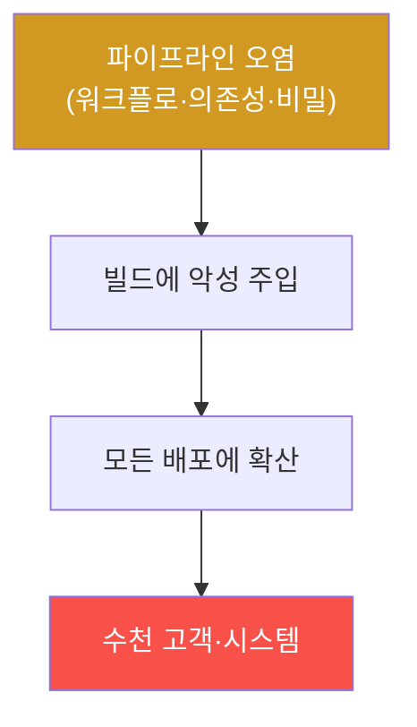

# agent-ir-adv W14 — CI/CD 공급망 오염: GitHub Actions·Jenkins·GitLab

> **본 주차의 한 줄 요약**
>
> W14는 **CI/CD 파이프라인**(지속적 통합·배포) 오염을 다룬다. CI/CD는 코드를 자동으로 빌드·테스트·배포하는
> 심장이라, 여기를 오염시키면 **모든 배포에 악성이 섞인다** — SolarWinds 사건처럼 신뢰받는 소프트웨어에 백도어가
> 심겨 수천 고객에게 퍼진다. 공격 경로: ① **악성 워크플로 변경**(`.github/workflows` 수정으로 빌드 시 악성
> 실행), ② **오염된 의존성·액션**(신뢰하는 third-party 액션이 악성), ③ **CI 비밀 탈취**(파이프라인의 배포
> 자격·토큰 유출), ④ **빌드 산출물 변조**(빌드 후 아티팩트에 백도어 주입). AI 공격자는 파이프라인 설정을 자동
> 분석해 취약점을 찾아 오염한다. 탐지: (1) **파이프라인 무결성**(워크플로 예상 밖 변경·미승인 수정), (2) **비밀
> 유출 정황**(CI에서 외부로 비밀 전송·인코딩), (3) **빌드 이상**(예상 밖 빌드 단계·네트워크). 방어: **서명된
> 커밋·태그**, **최소 권한 CI 토큰**(배포에 꼭 필요한 것만), **비밀 스캐닝**, **파이프라인 보호**(승인 필요·
> 브랜치 보호), **아티팩트 서명·SBOM**. CI/CD는 신뢰의 근원이라, 그 무결성을 지켜야 한다.
>
> **한 줄 결론**: CI/CD 오염은 **한 번의 침투로 모든 배포에 악성을 퍼뜨린다**. 방어 = **파이프라인 무결성 감시 +
> 서명된 커밋·아티팩트 + 최소 권한 CI + 비밀 스캐닝**. 신뢰의 근원인 빌드·배포를 지킨다.

---

## 학습 목표

본 주차 종료 시 학생은 다음 5가지를 **본인 손으로** 할 수 있어야 한다.

1. **CI/CD 오염**이 대규모로 번지는 이유를 설명한다.
2. **악성 파이프라인 변경·비밀 유출**을 탐지한다(PIPELINE_POISON_DETECTED).
3. **커밋·아티팩트 무결성** 위반을 탐지한다(INTEGRITY_VIOLATION).
4. **서명·최소권한·비밀 스캐닝**으로 강화한다(HARDENED).
5. CI/CD가 신뢰의 근원인 이유를 설명한다.

> **이 주차의 시선** — 신뢰의 근원(빌드·배포)을 지켜 대규모 확산을 막는다.

---

## 0. 용어 해설 (CI/CD 오염)

| 용어 | 영문 | 뜻 | 비유 |
|------|------|----|------|
| **CI/CD** | Continuous Integration/Delivery | 자동 빌드·배포 | 생산 라인 |
| **워크플로** | Workflow | 파이프라인 정의 | 작업 순서 |
| **아티팩트** | Artifact | 빌드 산출물 | 완제품 |
| **서명** | Signing | 무결성 증명 | 봉인 |
| **CI 토큰** | CI Token | 파이프라인 자격 | 작업 열쇠 |

> **헷갈리기 쉬운 한 쌍** — *코드 취약점* 은 "한 앱의 결함", *CI/CD 오염* 은 "모든 배포에 확산"이다. 후자가
> 공급망 공격의 파괴력.

---

## 0.5 신입생 친화 핵심 개념

### 0.5.1 CI/CD 오염 — 하나가 모두로

CI/CD는 **모든 배포가 지나는 길목**이다. 한 번 오염되면 이후 모든 산출물에 악성이 섞인다 — SolarWinds식 대규모
확산. 그래서 CI/CD 무결성이 특히 중요하다.

### 0.5.2 오염 경로 — 워크플로·의존성·비밀

- **워크플로 변경**: `.github/workflows`에 악성 단계 추가(빌드 시 실행).
- **오염된 액션/의존성**: 신뢰하던 third-party 액션·패키지가 악성(W01 공급망).
- **CI 비밀 탈취**: 파이프라인의 배포 토큰·서명 키 유출 → 정당한 배포로 위장.
각 경로가 빌드·배포에 악성을 심는 통로.

### 0.5.3 탐지 — 무결성과 비밀 유출

- **파이프라인 무결성**: 워크플로 파일의 **미승인 변경**, 예상 밖 빌드 단계(외부 스크립트 다운로드·실행).
- **비밀 유출 정황**: CI 로그·단계에서 비밀을 **외부로 전송·인코딩 출력**.
- **빌드 이상**: 빌드 중 예상 밖 **네트워크 연결**·프로세스.
파이프라인 로그·설정 변경을 감사한다.

### 0.5.4 무결성 — 서명된 커밋·아티팩트

- **서명된 커밋·태그**: 커밋에 GPG 서명 → 누가 진짜 만들었나 검증. 미서명·미인가 커밋 차단.
- **아티팩트 서명·SBOM**: 빌드 산출물에 서명 + 구성표 → 배포 시 무결성 검증.
- **재현 가능 빌드**: 같은 소스가 같은 산출물을 만드는지 검증(변조 탐지).
서명이 "이것이 진짜·미변조"를 증명한다.

### 0.5.5 방어 — 최소권한·비밀 스캐닝·보호

- **최소 권한 CI 토큰**: 배포에 꼭 필요한 권한만(탈취돼도 피해 제한).
- **비밀 스캐닝**: 코드·로그에 비밀 노출 탐지, CI 비밀은 볼트로.
- **파이프라인 보호**: 브랜치 보호·필수 리뷰·승인 게이트로 미인가 변경 차단.
CI/CD를 최소 권한+무결성 검증+접근 통제로 지킨다.

---

## 1. 실습 안내 (5 미션)

실행 위치 el34 **호스트**(`ssh ccc@{{TARGET_IP}}`), GPU `http://211.170.162.139:10934`.
(CI/CD 인프라는 el34 밖 → 파이프라인 오염 탐지·무결성 로직을 결정론 시뮬로.)

### STEP 1 — GPU 헬스체크 → GEN_OK
### STEP 2 — 파이프라인 오염 탐지 → PIPELINE_POISON_DETECTED
### STEP 3 — 무결성 위반 → INTEGRITY_VIOLATION
### STEP 4 — 강화 → HARDENED
### STEP 5 — 종합 → Assessment

---

## 2. 흔한 오해·블루팀 노트

- **"코드만 검토하면 됨"** — 파이프라인 설정·의존성·비밀도. CI/CD 전체 무결성.
- **"신뢰하는 액션은 안전"** — third-party 액션도 오염될 수 있다. 버전 고정·검증.
- **"CI 토큰은 편의상 넓게"** — 탈취 시 대규모 배포 악용. 최소 권한.
- **관제 관점** — 워크플로 변경이 감사·승인되는지, 커밋·아티팩트가 서명·검증되는지, CI 토큰이 최소 권한인지,
  비밀 스캐닝이 있는지 점검한다. CI/CD 방어는 무결성+최소권한+접근 통제.

---

## 3. 다음 주차 (W15) 예고 — 장기 APT 잠복: 수개월의 느린 누출·템포 비대칭의 반전

W14가 "빌드 파이프라인 오염"이었다면, 마지막 W15는 **장기 APT 잠복** — 수개월에 걸쳐 느리게 침투·누출하는
공격과, 템포 비대칭의 반전(느린 공격엔 긴 기억의 방어)을 다룬다. 과목을 종합한다.
