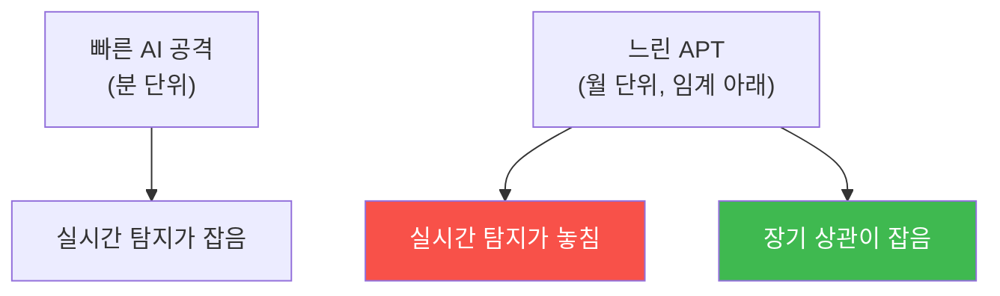

# agent-ir-adv W15 — 장기 APT 잠복: 수개월의 느린 누출·템포 비대칭의 반전

> **본 주차의 한 줄 요약**
>
> 마지막 주는 **장기 APT 잠복**과 과목 종합이다. 지금까지 AI 공격은 **빠름**이 무기였다(agent-ir W01, "2년→2시간").
> 그런데 가장 정교한 공격자는 정반대 — **일부러 느리게** 간다. 수개월에 걸쳐 **잠복(dwell)** 하며, 각 행동을
> 탐지 임계 아래로 유지하고(low-and-slow), 데이터를 조금씩 오래 누출한다. 왜? **빠른 탐지를 피하려고.** 실시간
> 탐지(agent-ir W09)는 "짧은 시간의 이상"을 잡지만, **몇 달에 하루 한 번**씩 조금씩 하면 어느 순간도 임계를
> 안 넘는다. 이것이 **템포 비대칭의 반전** — 방어가 빠름에 최적화되면, 공격자는 느림으로 그 아래를 지난다.
> 답은 **긴 기억의 방어**: (1) **장기 로그 보존**(몇 달치), (2) **장기 상관**(긴 시간창으로 흩어진 이벤트 연결),
> (3) **기준선 드리프트 탐지**(천천히 변하는 이상), (4) **인내**(즉각 아닌 누적 판단). 빠른 공격엔 빠른 탐지,
> 느린 공격엔 **긴 기억**. 이 과목의 결론: **템포의 양극단**(초고속·초저속)을 모두 방어하려면, 실시간 탐지와
> 장기 상관을 **함께** 갖춰야 한다. AI 시대 방어는 모든 템포에 대응하는 다중 시간창 방어다.
>
> **한 줄 결론**: 장기 APT는 **일부러 느리게** 가 실시간 탐지 아래를 지난다(템포 비대칭 반전). 방어 = **긴 기억**
> (장기 보존·장기 상관·드리프트 탐지). 실시간 + 장기 상관을 함께 갖춰 모든 템포에 대응한다.

---

## 학습 목표

본 주차 종료 시 학생은 다음 5가지를 **본인 손으로** 할 수 있어야 한다.

1. **장기 APT 잠복**과 템포 비대칭 반전을 설명한다.
2. **장기 상관**으로 느린 공격을 탐지한다(LONGTERM_CORRELATED).
3. **기준선 드리프트**(느린 변화)를 탐지한다(DRIFT_DETECTED).
4. 실시간+장기 상관의 **다중 시간창** 방어를 종합한다(SYNTHESIS).
5. 모든 템포에 대응하는 방어의 필요를 설명한다.

> **이 주차의 시선** — 빠름만이 아니라 느림도 방어한다. 긴 기억으로 잠복을 깨운다.

---

## 0. 용어 해설 (장기 APT)

| 용어 | 영문 | 뜻 | 비유 |
|------|------|----|------|
| **잠복** | Dwell | 오래 숨어 있음 | 동면 |
| **low-and-slow** | — | 작게·느리게 | 조금씩 |
| **장기 상관** | Long-window Correlation | 긴 시간창 연결 | 오랜 관찰 |
| **드리프트** | Drift | 느린 기준선 변화 | 서서히 변함 |
| **다중 시간창** | Multi-window | 여러 시간 규모 감시 | 다중 렌즈 |

> **헷갈리기 쉬운 한 쌍** — *실시간 탐지* 는 "짧은 창의 이상"(빠른 공격), *장기 상관* 은 "긴 창의 이상"(느린
> 공격)이다. 둘 다 필요하다.

---

## 0.5 핵심 개념

### 0.5.1 템포 비대칭의 반전

방어가 **빠름에만** 최적화되면, 공격자는 **느림**으로 그 아래를 지난다. 각 행동이 임계 아래니 실시간 탐지가
못 잡는다 — 하지만 **몇 달을 합치면** 명백한 침해다.

### 0.5.2 장기 상관 — 흩어진 이벤트를 잇는다

느린 공격은 이벤트가 **몇 달에 흩어져** 있다: 1월에 정찰 한 번, 2월에 접근 한 번, 3월에 소량 누출. 각각은
잊혀지지만, **긴 시간창으로 상관**하면 "같은 출처·같은 표적의 느린 캠페인"이 드러난다. 장기 로그 보존이 전제 —
로그가 없으면 상관도 없다.

### 0.5.3 드리프트 탐지 — 서서히 변하는 이상

느린 공격은 **기준선을 천천히 바꾼다**: 데이터 유출량이 매달 조금씩 증가, 접근 패턴이 서서히 이동. 순간의
이상(스파이크)은 없지만, **장기 추세**를 보면 드리프트가 보인다. 이동 평균·추세 분석으로 "천천히 나빠지는"
것을 잡는다. 갑작스러움이 아니라 **점진적 변화**를 본다.

### 0.5.4 다중 시간창 — 모든 템포 방어

결론: **여러 시간 규모를 동시에** 감시한다. 초·분(실시간, 빠른 공격)·시·일(중기)·주·월(장기, 느린 APT). 각
시간창에 맞는 탐지(실시간 룰·중기 상관·장기 드리프트)를 **겹층**으로. 공격자가 어느 템포로 오든 **하나의 창은
잡는다.** 이것이 AI 시대 방어의 완성형.

### 0.5.5 과목 종합 — 정교한 적, 겹층 방어

agent-ir-adv 15주는 **정교한 AI 공격의 각 유형**(공급망·인젝션·클라우드·0/N-day·컨테이너·파일리스·DNS·모델·
딥페이크·내부자·CI/CD·장기 APT)과 방어를 다뤘다. 공통 교훈: **정교한 공격일수록 단일 방어로 못 막는다** —
탐지+무결성+최소권한+검증+다중 시간창을 **겹층**으로. 그리고 위조·회피 가능한 신호(시그니처·목소리·모델)를
믿지 말고, **검증 가능한 것**(행위·불변 특성·프로세스·서명)을 믿는다. AI 시대의 정교한 방어자가 갖출 태도다.

---

## 1. 실습 안내 (5 미션)

실행 위치 el34 **호스트**(`ssh ccc@{{TARGET_IP}}`), GPU `http://211.170.162.139:10934`.

### STEP 1 — GPU 헬스체크 → GEN_OK
### STEP 2 — 장기 상관 → LONGTERM_CORRELATED
### STEP 3 — 드리프트 탐지 → DRIFT_DETECTED
### STEP 4 — 다중 시간창 종합 → SYNTHESIS
### STEP 5 — 최종 종합 → Assessment

---

## 2. 흔한 오해·블루팀 노트

- **"실시간 탐지면 충분"** — 느린 APT는 실시간 아래로 지난다. 장기 상관 필요.
- **"로그는 짧게 보관"** — 장기 상관엔 몇 달치 로그 필요. 보존이 전제.
- **"이상은 스파이크"** — 느린 드리프트도 이상. 추세를 봐야.
- **관제 관점** — 장기 로그 보존·장기 상관·드리프트 탐지가 있는지, 여러 시간창을 겹층 감시하는지 점검한다.
  모든 템포 방어가 정교한 적에 대한 완성형. 이 과목의 모든 관제 관점의 통합이다.

---

## 3. 과목을 마치며

agent-ir-adv는 정교한 AI 공격의 **최전선**을 다뤘다. 15가지 고급 공격과 방어를 관통하는 하나의 태도: **정교한
공격은 겹층 방어로 막고, 위조 가능한 신호가 아니라 검증 가능한 것을 믿으며, 모든 템포(초고속~초저속)에 대응
한다.** agent-ir의 기초 위에 이 심화를 더해, 여러분은 AI 시대의 정교한 사고에 맞설 준비를 갖췄다. 수고했다.
