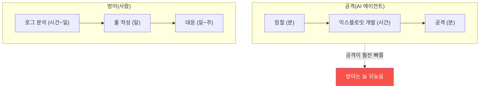

# agent-ir W01 — AI Vulnerability Storm: 템포 불일치·"2년→2시간"·방어의 존재 이유

> **본 주차의 한 줄 요약**
>
> agent-ir는 **AI 속도로 오는 공격에 AI 속도로 대응하는 인시던트 대응(IR)** 과목이다. 첫 주는 이 과목이 왜
> 필요한지 — **AI Vulnerability Storm** 을 잡는다. 핵심은 **템포 불일치(tempo mismatch)**: 공격자는 이제 LLM
> 에이전트로 정찰·익스플로잇 개발을 **분·시간 단위**로 압축한다("2년→2시간"). 반면 전통적 방어(사람이 로그
> 보고 룰 짜고 대응)는 여전히 **일·주 단위**다. 이 **속도 차이**가 방어의 붕괴를 부른다 — 공격이 방어보다
> 빠르면 방어는 늘 뒤늦다. 그래서 방어도 **에이전트로 속도를 맞춰야** 한다. 이번 주는 AI 공격의 속도를 눈으로
> 확인하고(LLM이 정찰을 초 단위로 생성), 전통 방어와의 템포 격차를 정량화하며, el34에서 방어 **기준선(baseline)**
> 을 수집한다 — 이후 15주 탐지·분석의 원본 데이터다.
>
> **한 줄 결론**: 공격이 AI로 **분 단위**가 됐는데 방어가 **주 단위**면 진다. agent-ir의 존재 이유는 이
> **템포 불일치**를 방어측도 에이전트로 좁히는 것이다. 첫걸음은 격차를 인식하고 기준선을 잡는 것.

---

## 학습 목표

본 주차 종료 시 학생은 다음 5가지를 **본인 손으로** 할 수 있어야 한다.

1. **AI Vulnerability Storm** 과 **템포 불일치**를 정의한다.
2. AI 공격의 속도("2년→2시간")를 구체 예시로 설명한다.
3. AI 공격 추론의 속도를 **관찰**한다(AI_SPEED).
4. 공격/방어 **템포 격차**를 정량화한다(TEMPO_GAP).
5. el34에서 방어 **기준선**을 수집한다(BASELINE_OK).

> **이 주차의 시선** — 이 과목이 왜 존재하는지, 무엇에 맞서는지를 속도의 관점에서 본다.

---

## 0. 용어 해설 (AI Storm)

| 용어 | 영문 | 뜻 | 비유 |
|------|------|----|------|
| **AI Vulnerability Storm** | — | AI로 폭증한 취약점 악용 | 폭풍 |
| **템포 불일치** | Tempo Mismatch | 공격·방어 속도 차 | 시속 차이 |
| **공격 개발 주기** | Attack Dev Cycle | 취약점→익스플로잇 시간 | 제작 기간 |
| **기준선** | Baseline | 정상 상태 신호 | 평상시 체온 |
| **에이전트 IR** | Agentic IR | 에이전트 기반 대응 | 자동 소방 |

> **헷갈리기 쉬운 한 쌍** — *취약점의 수* 가 는 게 아니라 *악용까지의 속도* 가 빨라진 것이다. 같은 취약점도
> AI가 익스플로잇을 분 단위로 만든다 — 문제는 **속도**다.

---

## 0.5 신입생 친화 핵심 개념

### 0.5.1 템포 불일치 — 속도가 방어를 무너뜨린다

공격 주기가 **분·시간**인데 방어 주기가 **일·주**면, 방어는 공격이 끝난 뒤에야 반응한다. 이 격차가 본질적
문제다 — 더 열심히가 아니라 **더 빠르게**(에이전트로) 방어해야 한다.

### 0.5.2 "2년→2시간" — 무엇이 압축됐나

과거엔 새 취약점의 안정적 익스플로잇을 만드는 데 숙련자도 수개월~수년이 걸렸다. LLM 에이전트는 정찰·코드
분석·PoC 작성을 **한 세션 안에서** 반복해 이를 **시간 단위**로 줄인다. 모든 취약점이 그런 건 아니지만,
**충분히 많은** 경우가 그렇게 되면서 방어의 전제(시간이 있다)가 깨진다.

### 0.5.3 이것이 일상화되면 — 작은 시나리오

금요일 저녁, 공격 에이전트가 새 CVE 공개 3시간 만에 우리 웹앱용 익스플로잇을 만들어 공격한다. 월요일 아침
출근한 분석가가 로그를 본다 — 이미 주말 내내 뚫린 뒤다. **사람 속도로는 늦는다.** 방어 에이전트가 그 3시간
안에 탐지·차단했어야 한다. 이것이 agent-ir가 다루는 세계다.

### 0.5.4 방어의 답 — 에이전트로 속도 맞추기

답은 "AI를 금지"가 아니라 "방어도 에이전트로 빨라지기"다: 실시간 탐지(W09)·능동 방어(W10)·Purple 자동화
(W11-12)·에이전트 IR(전 과정). 단, 방어 에이전트도 이 과목 내내 강조하는 **결정론 검증·승인·통제**를 갖춰야
폭주하지 않는다(aisec의 원칙 계승).

### 0.5.5 기준선 — 탐지의 출발점

무엇이 "이상"인지 알려면 "정상"을 알아야 한다. el34의 **기준선**(정상 시 Wazuh 알림 수·Suricata 이벤트·Apache
로그 패턴)을 수집해 둔다. 이후 주차에서 공격 흔적을 이 기준선과 대조해 탐지한다. 기준선 없는 탐지는 불가능하다.

---

## 1. 실습 안내 (5 미션)

실행 위치 el34 **호스트**(`ssh ccc@{{TARGET_IP}}`), GPU `http://211.170.162.139:10934`, bastion `el34-bastion:9100`
(`X-API-Key: ccc-api-key-2026`). 공격자 VM `{{ATTACKER_IP}}`, 웹 진입 `{{WEB_ENTRY}}`.

### STEP 1 — GPU 헬스체크 → GEN_OK
### STEP 2 — AI 공격 속도 관찰 → AI_SPEED
- **왜/무엇을:** LLM이 정찰 계획을 초 단위로 생성 — AI 공격의 속도 체감.
- **해석:** 사람 몇 시간이 초로.

### STEP 3 — 템포 격차 정량화 → TEMPO_GAP
- **왜?** 격차를 숫자로.
- **무엇을?** AI 공격 주기 vs 사람 방어 주기 시간 비교(결정론).
- **해석:** 왜 방어가 뒤늦나.

### STEP 4 — el34 방어 기준선 → BASELINE_OK
- **왜?** 탐지의 출발점.
- **무엇을?** bastion으로 Wazuh/Suricata/Apache 기준선 신호 수집.
- **해석:** 정상을 알아야 이상을 안다.

### STEP 5 — 종합 → Assessment
- 템포 불일치·기준선·방어 방향을 묶어 정리(Assessment).

---

## 2. 흔한 오해·관제자 노트

- **"취약점이 많아진 게 문제"** — 아니다. 악용까지의 **속도**가 문제. 같은 취약점도 분 단위 익스플로잇.
- **"더 많은 인력으로 해결"** — 사람 속도론 근본적으로 늦다. 방어 에이전트로 속도를 맞춰야.
- **"AI 방어면 사람 불필요"** — 방어 에이전트도 결정론 검증·승인 필요. 자율≠무통제(aisec 계승).
- **관제 관점** — 조직의 탐지·대응 템포가 공격 템포에 맞는지, 기준선이 최신인지, 방어 에이전트에 통제가 있는지
  점검한다. 템포 격차가 곧 위험 노출 시간이다.

---

## 3. 다음 주차 (W02) 예고 — 공격자 해부: Tool-use 루프와 능력 경계

W01이 "왜 이 과목인가(템포)"였다면, W02는 **적을 안다** — AI 공격자의 내부를 해부한다. 공격 에이전트의
Tool-use 루프(정찰→도구→관찰→다음), 능력의 경계(무엇을 할 수 있고 없나)를 이해해, 방어의 관찰 지점을 찾는다.
