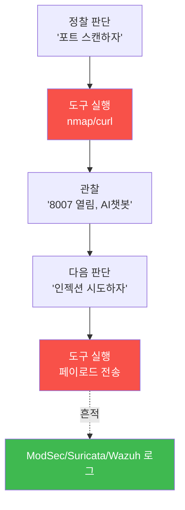

# agent-ir W02 — 공격자 해부: Tool-use 루프·능력 경계·방어 관찰 지점

> **본 주차의 한 줄 요약**
>
> "적을 알아야 이긴다." W02는 AI 공격자의 **내부**를 해부한다. AI 공격 에이전트도 우리가 aisec에서 만든 것과
> 같은 구조 — **Tool-use 루프**(정찰→도구 실행→관찰→다음 판단)를 돈다. 이 루프를 이해하면 방어의 **관찰
> 지점**이 보인다: 공격자가 도구를 쓸 때마다 **흔적**(네트워크 요청·로그·시스템 호출)이 남는다. 또 공격
> 에이전트에는 **능력 경계(capability boundary)** 가 있다 — LLM이 아무리 똑똑해도 실제로 할 수 있는 건
> **가진 도구·권한**에 한정된다. 도구가 없으면 계획만 있고 실행은 못 한다. 방어는 이 경계를 알아 "무엇을
> 관찰하면 공격을 잡을 수 있나"를 정한다. 이번 주는 el34의 공격 흔적(공격자 .202 → 웹 .161, ModSec/Suricata/
> Wazuh에 보존)에서 공격자의 tool-use 루프를 재구성하고, 능력 경계와 방어 관찰 지점을 찾는다.
>
> **한 줄 결론**: AI 공격자 = **Tool-use 루프**(정찰→도구→관찰→다음)를 도는 에이전트, 능력은 **가진 도구·권한**
> 에 한정. 도구 사용마다 흔적이 남으므로, 방어는 그 **관찰 지점**에서 공격을 잡는다.

---

## 학습 목표

본 주차 종료 시 학생은 다음 5가지를 **본인 손으로** 할 수 있어야 한다.

1. AI 공격자의 **Tool-use 루프**(정찰→도구→관찰→다음)를 설명한다.
2. 공격 흔적에서 tool-use 루프를 **재구성**한다(LOOP_RECON).
3. 공격자의 **능력 경계**(도구·권한 한정)를 파악한다(BOUNDARY_MAP).
4. 각 도구 사용의 **방어 관찰 지점**을 찾는다(OBSERVE_POINT).
5. "도구 사용마다 흔적"이 방어의 기회임을 설명한다.

> **이 주차의 시선** — 공격자를 우리가 만든 에이전트처럼 해부해, 그 루프의 관찰 지점을 방어에 쓴다.

---

## 0. 용어 해설 (공격자 해부)

| 용어 | 영문 | 뜻 | 비유 |
|------|------|----|------|
| **Tool-use 루프** | Tool-use Loop | 도구 반복 사용 순환 | 작업 반복 |
| **능력 경계** | Capability Boundary | 실제 할 수 있는 한계 | 연장의 한계 |
| **관찰 지점** | Observation Point | 흔적이 남는 곳 | 감시 카메라 위치 |
| **흔적** | Artifact/Trace | 행동이 남긴 증거 | 발자국 |
| **출처 IP 보존** | Source IP Preservation | 공격 출처 유지 | 지문 보존 |

> **헷갈리기 쉬운 한 쌍** — *능력(계획)* 은 "LLM이 생각할 수 있는 것", *능력 경계(실행)* 는 "도구로 실제 할 수
> 있는 것"이다. 방어는 실행(도구 사용)의 흔적을 노린다.

---

## 0.5 핵심 개념

### 0.5.1 공격자도 Tool-use 루프를 돈다

공격 에이전트는 aisec에서 배운 ReAct(W01)와 같은 루프를 돈다. **차이는 목적(공격)** 뿐. 그리고 **도구를 쓸
때마다**(T) 네트워크·로그에 흔적(A)이 남는다 — 이것이 방어의 관찰 기회다.

### 0.5.2 능력 경계 — 도구가 없으면 실행도 없다

LLM이 "이 서버를 장악하자"고 계획해도, **실제 실행은 가진 도구·권한**에 한정된다. 스캐너가 없으면 스캔 못
하고, 셸이 없으면 명령 못 한다. 방어 관점: 공격자가 **어떤 도구를 쓰는지**를 알면, 그 도구의 흔적을 노려
탐지·차단할 수 있다. 능력 경계 = 방어의 표적 목록.

### 0.5.3 el34의 출처 보존 — 공격자 지문이 남는다

el34는 공격자(.202)가 웹(.161)을 공격할 때 **출처 IP를 Suricata·ModSec·Wazuh 전 계층에 보존**한다. 즉
공격자의 tool-use 흔적이 **출처와 함께** 로그에 남는다. 방어는 이 흔적을 상관(같은 출처의 여러 도구 사용을
연결)해 공격 루프를 재구성한다. (단 외부 공격자 명령 로그 자체는 수집 안 됨 — 타깃 인프라의 흔적으로 추론.)

### 0.5.4 방어 관찰 지점 — 어디를 볼 것인가

각 도구 사용은 특정 계층에 흔적을 남긴다:

| 공격 도구 사용 | 흔적 위치(관찰 지점) | el34 스킬 |
|----------------|---------------------|-----------|
| 포트 스캔 | 방화벽·IPS(Suricata) | suricata.tail_eve |
| 웹 공격(SQLi/XSS) | WAF(ModSec)·앱 로그 | apache.error_log |
| 로그인 시도 | SIEM(Wazuh) | wazuh.alerts |

방어는 이 관찰 지점을 **모두** 감시해, 공격 루프의 어느 단계든 포착한다. 한 지점을 놓쳐도 다른 지점에서 잡는
다층 관찰이다.

### 0.5.5 공격자를 알면 방어가 보인다

공격자의 tool-use 루프·능력 경계·흔적을 이해하면, 방어 설계가 명확해진다: (1) 능력 경계의 각 도구를 **관찰
지점**에 매핑, (2) 같은 출처의 흔적을 **상관**해 루프 재구성, (3) 루프의 **가장 이른 단계**(정찰)에서 잡을수록
피해가 작다. W03부터 이 관찰 지점들을 실제 탐지로 만든다.

---

## 1. 실습 안내 (5 미션)

실행 위치 el34 **호스트**(`ssh ccc@{{TARGET_IP}}`), GPU `http://211.170.162.139:10934`, bastion `el34-bastion:9100`.

### STEP 1 — GPU 헬스체크 → GEN_OK
### STEP 2 — tool-use 루프 재구성 → LOOP_RECON
- **왜/무엇을:** 공격 흔적(이벤트 시퀀스)에서 정찰→도구→관찰 루프를 재구성.
- **해석:** 공격자의 순환을 복원.

### STEP 3 — 능력 경계 매핑 → BOUNDARY_MAP
- **왜?** 방어 표적 목록.
- **무엇을?** 관찰된 도구 사용 → 공격자 능력 경계 도출.
- **해석:** 실제 쓴 도구만 위협.

### STEP 4 — 방어 관찰 지점 → OBSERVE_POINT
- **왜?** 어디를 볼 것인가.
- **무엇을?** 각 공격 도구를 el34 관찰 지점(skill)에 매핑.
- **해석:** 다층 관찰.

### STEP 5 — 종합 → Assessment
- 루프·경계·관찰 지점을 묶어 정리(Assessment).

---

## 2. 흔한 오해·블루팀 노트

- **"AI 공격자는 무엇이든 한다"** — 능력은 가진 도구·권한에 한정. 실행 없는 계획은 흔적도 없다.
- **"한 지점만 감시하면 된다"** — 공격 루프는 여러 계층에 흔적. 다층 관찰로 놓침 방지.
- **"외부 공격자 명령을 봐야 안다"** — el34는 외부 명령 로그 없음. 타깃 흔적+출처 상관으로 추론.
- **관제 관점** — 공격자 tool-use 루프의 각 관찰 지점(Suricata·ModSec·Wazuh)이 감시되는지, 출처 상관이
  되는지, 가장 이른 단계에서 잡히는지 점검한다. 관찰 지점의 커버리지가 탐지력이다.

---

## 3. 다음 주차 (W03) 예고 — 초지능 정찰: 사람 1주가 분 단위로

W02가 "공격자의 구조"였다면, W03은 그 첫 단계 **정찰**을 깊게 본다. AI가 정찰을 분 단위로 압축하는 방식과,
그 정찰 흔적을 el34에서 탐지하는 법 — 공격의 가장 이른 단계를 잡는 조기 탐지를 다룬다.
