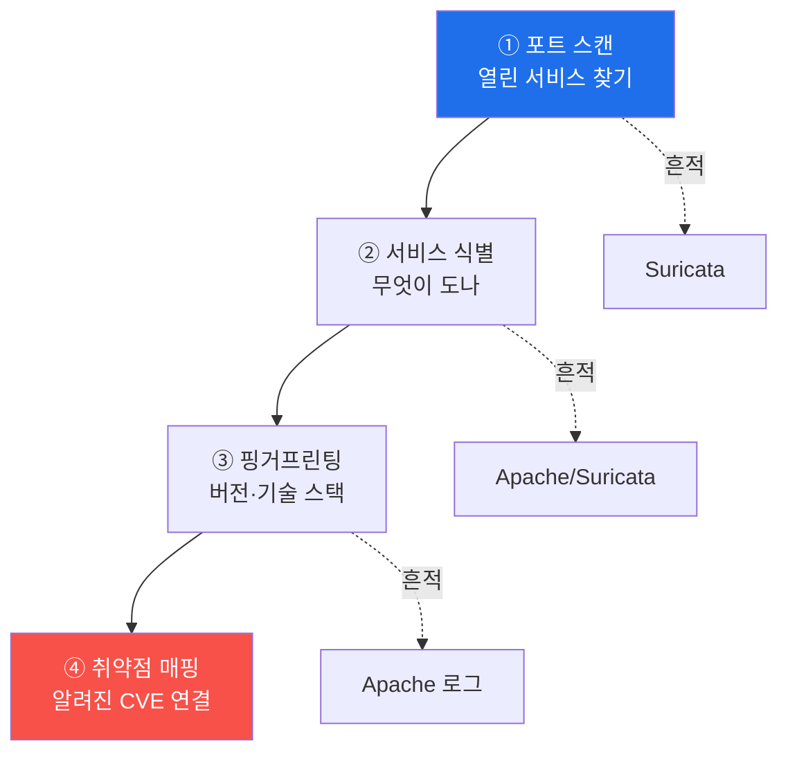

# agent-ir W03 — 초지능 정찰: 분 단위 정찰·조기 탐지·정찰 흔적 상관

> **본 주차의 한 줄 요약**
>
> 공격 루프의 **첫 단계는 정찰**이고, 가장 이른 이 단계에서 잡을수록 피해가 작다. W03은 AI가 **분 단위로
> 압축한 정찰**과 그 탐지를 다룬다. 사람 해커가 1주 걸리던 정찰(포트 스캔·서비스 식별·기술 핑거프린팅·취약점
> 매핑)을 AI 에이전트는 **몇 분**에 끝낸다. 문제는 정찰이 **빠르면서도 조용**하다는 것 — 개별 요청은 정상처럼
> 보인다. 그래서 방어는 **속도·패턴·상관**으로 정찰을 잡는다: 짧은 시간에 많은 포트/경로 탐색(속도), 순차적
> 스캔 패턴(패턴), 같은 출처의 여러 정찰 행위 연결(상관). el34에서 정찰 흔적은 Suricata(포트 스캔)·Apache(경로
> 탐색)에 남고 출처 IP가 보존되므로, 이를 상관해 **정찰 단계에서 조기 경보**를 울린다. 조기 탐지가 템포
> 격차(W01)를 좁히는 첫 방어선이다.
>
> **한 줄 결론**: 정찰은 공격의 첫 단계이자 **가장 이른 방어 기회**다. AI 정찰은 분 단위로 빠르지만 흔적을
> 남긴다 — **속도·패턴·상관**으로 정찰을 조기 탐지하면 공격을 초기에 끊는다.

---

## 학습 목표

본 주차 종료 시 학생은 다음 5가지를 **본인 손으로** 할 수 있어야 한다.

1. AI 정찰의 4단계(스캔·식별·핑거프린팅·취약점 매핑)를 설명한다.
2. **속도 기반** 정찰 탐지(단위 시간당 탐색 수)를 구현한다(RATE_ALERT).
3. **패턴 기반** 정찰 탐지(순차 스캔)를 구현한다(PATTERN_ALERT).
4. 같은 출처 정찰 흔적을 **상관**해 조기 경보한다(RECON_CORRELATED).
5. 조기 탐지가 템포 격차를 좁히는 이유를 설명한다.

> **이 주차의 시선** — 공격의 첫 단계를 잡아 나머지를 막는다. 가장 이른 방어선.

---

## 0. 용어 해설 (정찰 탐지)

| 용어 | 영문 | 뜻 | 비유 |
|------|------|----|------|
| **정찰** | Reconnaissance | 표적 정보 수집 | 사전 답사 |
| **핑거프린팅** | Fingerprinting | 기술 스택 식별 | 지문 채취 |
| **속도 탐지** | Rate-based | 단위 시간 빈도 | 과속 감지 |
| **패턴 탐지** | Pattern-based | 순차·규칙성 | 행동 패턴 |
| **조기 경보** | Early Warning | 초기 단계 알림 | 예비 경보 |

> **헷갈리기 쉬운 한 쌍** — *속도 탐지* 는 "얼마나 자주"(빈도), *패턴 탐지* 는 "어떤 순서로"(규칙성)다. 둘을
> 함께 써야 조용한 정찰도 잡는다.

---

## 0.5 신입생 친화 핵심 개념

### 0.5.1 정찰의 4단계와 흔적

각 단계가 흔적을 남긴다. AI는 이 4단계를 **분 단위**로 훑지만, 빠른 만큼 **짧은 시간에 흔적이 몰린다** — 이게
속도 탐지의 기회다.

### 0.5.2 속도 탐지 — 빠름이 곧 신호

AI 정찰은 짧은 시간에 **많은** 포트/경로를 탐색한다. "60초에 100개 포트 접근"은 사람이 하기 어렵다. 단위
시간당 탐색 수가 임계를 넘으면 경보 — AI 속도 자체가 탐지 신호가 된다. (역설적으로 AI의 빠름이 약점.)

### 0.5.3 패턴 탐지 — 순차성이 곧 신호

정찰은 **순차적·규칙적**이다: 포트 1,2,3…을 차례로, 경로를 사전순으로. 사람의 산발적 접근과 달리 **기계적
규칙성**을 보인다. 순차 스캔 패턴(연속 포트·사전 기반 경로)을 탐지하면 조용한(느린) 정찰도 잡는다.

### 0.5.4 상관 — 흩어진 정찰을 하나로

정찰의 각 단계는 다른 계층(Suricata·Apache)에 흩어져 남는다. **같은 출처 IP**로 이들을 연결하면 "이 출처가
정찰 4단계를 밟고 있다"는 그림이 나온다. 개별 이벤트는 정상 같아도, 상관하면 정찰 캠페인이 드러난다(W02 출처
상관의 정찰판).

### 0.5.5 조기 탐지가 템포를 좁힌다

정찰(공격 첫 단계)에서 잡으면, 익스플로잇·공격 전에 차단할 수 있다 — **가장 이른 개입**. W01의 템포 격차를
여기서 좁힌다: 공격이 정찰 3분 만에 넘어가려 할 때, 정찰 1분에 탐지·차단하면 공격이 시작조차 못 한다. 조기
탐지 = 템포 방어의 최전선.

---

## 1. 실습 안내 (5 미션)

실행 위치 el34 **호스트**(`ssh ccc@{{TARGET_IP}}`), GPU `http://211.170.162.139:10934`, bastion `el34-bastion:9100`.

### STEP 1 — GPU 헬스체크 → GEN_OK
### STEP 2 — 속도 기반 탐지 → RATE_ALERT
- **왜/무엇을:** 단위 시간당 탐색 수가 임계 초과 시 경보.
- **해석:** AI 속도가 곧 신호.

### STEP 3 — 패턴 기반 탐지 → PATTERN_ALERT
- **왜?** 조용한 정찰도.
- **무엇을?** 순차 스캔 패턴(연속 포트) 탐지.
- **해석:** 기계적 규칙성이 신호.

### STEP 4 — 정찰 흔적 상관 → RECON_CORRELATED
- **왜?** 캠페인 드러내기.
- **무엇을?** 같은 출처의 여러 정찰 흔적을 상관해 조기 경보.
- **해석:** 흩어진 정찰을 하나로.

### STEP 5 — 종합 → Assessment
- 속도·패턴·상관·조기 탐지를 묶어 정리(Assessment).

---

## 2. 흔한 오해·관제자 노트

- **"개별 요청이 정상이면 안전"** — 상관하면 정찰 캠페인. 개별이 아니라 패턴·상관을 본다.
- **"느린 정찰은 못 잡는다"** — 패턴 탐지(순차성)로 느린 정찰도 포착.
- **"정찰은 무해"** — 정찰은 공격의 준비. 여기서 잡으면 나머지를 막는다.
- **관제 관점** — 정찰 조기 탐지(속도·패턴·상관)가 작동하는지, 정찰 단계에서 경보·차단하는지, 출처 상관이
  다계층을 잇는지 점검한다. 정찰 탐지력이 템포 방어의 최전선.

---

## 3. 다음 주차 (W04) 예고 — 자동 익스플로잇 개발

W03이 "정찰 탐지"였다면, W04는 정찰 다음 단계 **자동 익스플로잇 개발**을 본다. AI가 세션 안에서 익스플로잇을
만드는 방식과, 그 개발·시도 흔적(WAF 차단·에러 급증)을 탐지하는 법을 다룬다.
