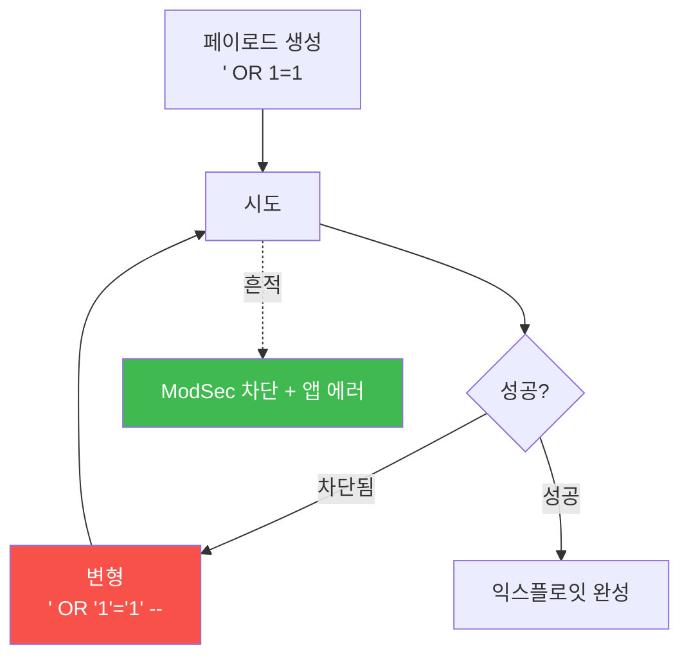

# agent-ir W04 — 자동 익스플로잇 개발: 세션 내 도구 생성·시도 흔적 탐지

> **본 주차의 한 줄 요약**
>
> 정찰(W03) 다음은 **익스플로잇 개발·시도**다. 과거엔 익스플로잇 제작이 별도의 오랜 작업이었지만, AI 에이전트는
> **한 세션 안에서** 페이로드를 만들고→시도하고→실패하면 변형해 다시 시도한다("세션 안에서 도구가 태어난다").
> 이 **시행착오 루프**가 방어의 기회다: 익스플로잇을 개발·조정하는 동안 **많은 변형 페이로드**가 짧은 시간에
> 한 출처에서 쏟아지고, WAF(ModSec) 차단과 앱 에러가 **급증**한다. 사람은 페이로드를 신중히 하나씩 만들지만,
> AI는 **수십 개 변형을 빠르게** 던진다 — 이 "변형 폭증 + 차단/에러 급증"이 익스플로잇 개발의 지문이다. el34
> 에서 이 흔적은 Apache/ModSec 로그에 출처와 함께 남으므로, **변형 수·차단율·에러율**로 개발 단계를 탐지해
> 성공적 익스플로잇 **완성 전에** 차단한다.
>
> **한 줄 결론**: AI는 세션 안에서 익스플로잇을 **시행착오로 개발**한다 — 많은 변형 페이로드가 쏟아지고 차단·
> 에러가 급증한다. 이 "변형 폭증 + 차단/에러 스파이크"를 탐지하면 익스플로잇 완성 전에 끊는다.

---

## 학습 목표

본 주차 종료 시 학생은 다음 5가지를 **본인 손으로** 할 수 있어야 한다.

1. AI의 **세션 내 익스플로잇 개발**(시행착오 루프)을 설명한다.
2. **페이로드 변형 폭증**을 탐지한다(MUTATION_BURST).
3. **WAF 차단율·에러율 급증**을 탐지한다(BLOCK_SPIKE).
4. 개발 흔적을 상관해 **완성 전 차단**을 판단한다(PREEMPT_BLOCK).
5. 개발 단계 탐지가 왜 "완성 전 차단"의 기회인지 설명한다.

> **이 주차의 시선** — 익스플로잇이 **완성되기 전** 개발 흔적을 잡아 선제 차단한다.

---

## 0. 용어 해설 (익스플로잇 개발)

| 용어 | 영문 | 뜻 | 비유 |
|------|------|----|------|
| **익스플로잇** | Exploit | 취약점 공격 코드 | 자물쇠 따는 도구 |
| **페이로드** | Payload | 실제 공격 문자열 | 열쇠 시도 |
| **변형** | Mutation | 페이로드 변주 | 열쇠 깎기 |
| **시행착오 루프** | Trial-and-error | 시도-실패-변형 반복 | 자물쇠 계속 시도 |
| **선제 차단** | Preemptive Block | 완성 전 차단 | 미리 막기 |

> **헷갈리기 쉬운 한 쌍** — *페이로드* 는 "한 번의 시도", *변형 폭증* 은 "짧은 시간 많은 변형"이다. 후자가 AI
> 개발의 지문 — 사람은 그렇게 많이 못 던진다.

---

## 0.5 핵심 개념

### 0.5.1 세션 안에서 익스플로잇이 태어난다

AI는 실패하면 **즉시 변형**해 재시도한다. 이 루프가 짧은 시간에 **많은 변형**과 **많은 차단/에러**를 만든다.

### 0.5.2 변형 폭증 — 개발의 지문

사람 공격자는 페이로드를 신중히 하나씩 만든다. AI는 **수십 개 변형**을 초 단위로 던진다. "60초에 같은 취약점
지점(/login)에 40개의 서로 다른 SQLi 변형"은 명백한 자동 개발 신호다. **변형의 다양성 × 속도** 가 지문이다.

### 0.5.3 차단·에러 스파이크 — 실패의 흔적

익스플로잇 개발은 대부분 **실패**한다(그래서 변형). 실패는 WAF 차단·앱 에러로 남는다. 짧은 시간 **차단율·에러율
급증**은 누군가 열심히 익스플로잇을 조정 중이라는 신호다. 정상 트래픽은 이런 스파이크를 만들지 않는다.

### 0.5.4 선제 차단 — 완성 전에

개발 흔적(변형 폭증+차단 스파이크)을 잡으면, **익스플로잇이 완성되기 전에** 그 출처를 차단할 수 있다. 40번째
변형이 성공하기 전에 5번째 변형에서 "이 출처는 익스플로잇 개발 중"이라 판단해 차단하면, 공격은 완성되지
못한다. 이것이 개발 단계 탐지의 가치 — 성공을 **선제**한다.

### 0.5.5 정찰→개발→공격, 어디서 잡아도 좋다

W03(정찰)·W04(개발)에서 잡을수록 이르다. 정찰에서 놓쳐도 개발에서, 개발에서 놓쳐도 공격 시도에서 — **다층·
다단계 탐지**로 어느 단계든 잡는다. 각 단계가 흔적을 남기므로, 방어는 여러 그물을 친다(W02 다층 관찰의 연장).

---

## 1. 실습 안내 (5 미션)

실행 위치 el34 **호스트**(`ssh ccc@{{TARGET_IP}}`), GPU `http://211.170.162.139:10934`, bastion `el34-bastion:9100`.

### STEP 1 — GPU 헬스체크 → GEN_OK
### STEP 2 — 페이로드 변형 폭증 → MUTATION_BURST
- **왜/무엇을:** 짧은 시간 한 지점에 많은 변형 페이로드 탐지.
- **해석:** 변형 다양성×속도가 지문.

### STEP 3 — 차단·에러 스파이크 → BLOCK_SPIKE
- **왜?** 실패의 흔적.
- **무엇을?** WAF 차단율·에러율 급증 탐지.
- **해석:** 개발은 실패를 남긴다.

### STEP 4 — 선제 차단 판단 → PREEMPT_BLOCK
- **왜?** 완성 전 차단.
- **무엇을?** 변형 폭증+차단 스파이크 상관 → 선제 차단 결정(승인).
- **해석:** 성공을 선제.

### STEP 5 — 종합 → Assessment
- 개발 루프·변형·스파이크·선제 차단을 묶어 정리(Assessment).

---

## 2. 흔한 오해·블루팀 노트

- **"차단되면 안전"** — AI는 즉시 변형 재시도. 개별 차단이 아니라 변형 폭증 패턴을 봐야.
- **"성공한 공격만 위험"** — 개발 단계(실패 반복)에서 잡아 선제 차단하는 게 최선.
- **"에러 급증은 버그일 수도"** — 출처 상관 + 페이로드 특성으로 공격 개발과 구분.
- **관제 관점** — 변형 폭증·차단/에러 스파이크 탐지가 작동하는지, 선제 차단에 승인 게이트가 있는지, 개발
  단계에서 끊는지 점검한다. 완성 전 차단이 개발 탐지의 목표.

---

## 3. 다음 주차 (W05) 예고 — 측면이동과 지속성

W04가 "익스플로잇 개발 탐지"였다면, W05는 침투 성공 후의 **측면이동(lateral movement)·지속성** 을 다룬다.
기계 속도로 내부를 확산하는 움직임과, 그 흔적(내부 연결·비정상 인증)을 탐지하는 법을 배운다.
