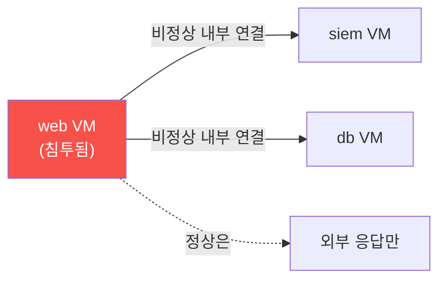

# agent-ir W05 — 측면이동과 지속성: 기계 속도 확산·지속 흔적 탐지

> **본 주차의 한 줄 요약**
>
> 침투에 성공한 뒤 공격자는 **측면이동(lateral movement)** 으로 내부를 확산하고, **지속성(persistence)** 으로
> 발판을 굳힌다. AI 공격자는 이를 **기계 속도**로 한다 — 사람이 며칠 걸릴 내부 정찰·이동을 분 단위로. 측면이동은
> **동서(east-west) 트래픽**(내부 서버 간 연결)과 **비정상 인증**(서비스 계정이 안 하던 로그인, 비정상 시간·
> 경로)으로 흔적을 남긴다. 지속성은 **새 계정·크론 작업·SSH 키·백도어** 같은 **시스템 변경**으로 남는다. 방어의
> 핵심은 **정상 내부 동작의 기준선**(누가 누구에게 연결하는 게 정상인가)을 알고, 그 **편차**를 잡는 것이다. el34
> 에서 내부망(10.20.30/31/32/40.x)의 연결·인증·시스템 변경을 Wazuh/시스템 로그로 관찰해, 측면이동·지속성을
> 탐지한다. 이 단계까지 왔다면 이미 침투됐다는 뜻 — **확산 차단과 지속성 제거**가 목표다.
>
> **한 줄 결론**: 침투 후 공격자는 기계 속도로 **측면이동**(내부 확산)하고 **지속성**(발판 굳히기)을 심는다.
> 정상 내부 동작의 기준선 대비 **비정상 연결·인증·시스템 변경**을 잡아 확산을 끊고 지속성을 제거한다.

---

## 학습 목표

본 주차 종료 시 학생은 다음 5가지를 **본인 손으로** 할 수 있어야 한다.

1. **측면이동**과 **지속성**의 개념·흔적을 구분한다.
2. **동서 트래픽 이상**(비정상 내부 연결)을 탐지한다(LATERAL_DETECTED).
3. **비정상 인증**(서비스 계정 이상 로그인)을 탐지한다(AUTH_ANOMALY).
4. **지속성 흔적**(새 계정·크론·키)을 탐지한다(PERSIST_FOUND).
5. 이 단계 탐지의 목표(확산 차단·지속성 제거)를 설명한다.

> **이 주차의 시선** — 침투 후 확산을 끊고 발판을 뽑는다. "정상 내부"를 알아야 "비정상 내부"가 보인다.

---

## 0. 용어 해설 (측면이동·지속성)

| 용어 | 영문 | 뜻 | 비유 |
|------|------|----|------|
| **측면이동** | Lateral Movement | 내부 서버 간 확산 | 옆방으로 이동 |
| **동서 트래픽** | East-West Traffic | 내부 서버 간 연결 | 건물 내 이동 |
| **지속성** | Persistence | 발판 유지 장치 | 숨은 열쇠 |
| **비정상 인증** | Auth Anomaly | 평소와 다른 로그인 | 낯선 출입 |
| **기준선 편차** | Baseline Deviation | 정상과의 차이 | 평소와 다름 |

> **헷갈리기 쉬운 한 쌍** — *측면이동* 은 "지금 확산 중"(움직임), *지속성* 은 "나중에 다시 오려고 심음"(고정)이다.
> 전자는 연결·인증으로, 후자는 시스템 변경으로 흔적.

---

## 0.5 신입생 친화 핵심 개념

### 0.5.1 측면이동 — 동서 트래픽의 이상

정상적으로 web VM은 외부 요청에 응답만 한다. 그런데 web VM이 **내부 siem·db VM으로 연결**을 시도하면(동서
트래픽), 이는 측면이동 신호다. "정상 연결 지도"(누가 누구에게)를 알면 벗어난 연결이 보인다.

### 0.5.2 비정상 인증 — 낯선 출입

측면이동은 인증을 동반한다: 훔친 자격으로 다른 VM에 로그인. 신호: **서비스 계정이 대화형 로그인**(평소 안 함),
**비정상 시간**(새벽 3시), **비정상 경로**(web→db 직접). 정상 인증 패턴의 기준선 대비 편차를 잡는다.

### 0.5.3 지속성 — 나중에 다시 오려고

공격자는 쫓겨나도 다시 오려고 **발판**을 심는다: 새 사용자 계정, 크론 작업(주기적 백도어 실행), SSH authorized_
keys 추가, 시작 스크립트 변경. 이들은 **시스템 변경**으로 남는다. "정상 시스템 구성"의 스냅샷과 비교해 **추가된
것**을 찾는다(파일 무결성·계정 감사).

### 0.5.4 기준선이 다시 열쇠

측면이동·지속성 탐지의 공통 원리: **정상을 알아야 이상을 안다**(W01 기준선). 정상 연결 지도·정상 인증 패턴·
정상 시스템 구성을 기준선으로 두고, 편차를 잡는다. 기준선이 정확할수록 오탐이 줄고 진짜 이상이 도드라진다.

### 0.5.5 이 단계의 목표 — 확산 차단·지속성 제거

측면이동·지속성이 보인다면 **이미 침투된 상태**다. 목표가 달라진다: (1) 측면이동을 끊어 **확산 차단**(감염
VM 격리), (2) 지속성을 찾아 **제거**(심은 계정·크론·키 삭제), (3) 최초 침투 경로 파악해 재발 방지. 탐지에서
**대응·복구**로 넘어가는 단계다(위험 조치는 승인).

---

## 1. 실습 안내 (5 미션)

실행 위치 el34 **호스트**(`ssh ccc@{{TARGET_IP}}`), GPU `http://211.170.162.139:10934`, bastion `el34-bastion:9100`.

### STEP 1 — GPU 헬스체크 → GEN_OK
### STEP 2 — 동서 트래픽 이상 → LATERAL_DETECTED
- **왜/무엇을:** 정상 연결 지도 대비 비정상 내부 연결 탐지.
- **해석:** web→내부 연결은 측면이동.

### STEP 3 — 비정상 인증 → AUTH_ANOMALY
- **왜?** 측면이동은 인증 동반.
- **무엇을?** 서비스 계정 이상 로그인·비정상 시간 탐지.
- **해석:** 정상 인증 패턴 편차.

### STEP 4 — 지속성 흔적 → PERSIST_FOUND
- **왜?** 발판 제거.
- **무엇을?** 정상 구성 대비 추가된 계정·크론·키 탐지.
- **해석:** 시스템 변경 감사.

### STEP 5 — 종합 → Assessment
- 측면이동·인증·지속성·대응을 묶어 정리(Assessment).

---

## 2. 흔한 오해·블루팀 노트

- **"내부 트래픽은 안전"** — 측면이동은 내부에서. 동서 트래픽 기준선·편차를 봐야.
- **"로그인 성공은 정상"** — 누가·언제·어디서가 중요. 서비스 계정 대화형 로그인은 이상.
- **"침투 못 막으면 끝"** — 측면이동·지속성 단계에서 잡아 확산 차단·발판 제거 가능.
- **관제 관점** — 정상 연결 지도·인증 패턴·시스템 구성 기준선이 있는지, 편차 탐지가 작동하는지, 지속성 감사가
  주기적인지 점검한다. 침투 후 방어의 핵심은 기준선 편차 탐지.

---

## 3. 다음 주차 (W06) 예고 — 회피·다형성·역탐지

W05가 "확산·지속성 탐지"였다면, W06은 공격자가 **탐지를 회피**하는 기법 — 실시간 다형성(페이로드 변형)·역탐지
(방어 감지 회피)를 다룬다. 진화하는 페이로드에 맞서는 행위 기반·불변 특성 기반 탐지를 배운다.
