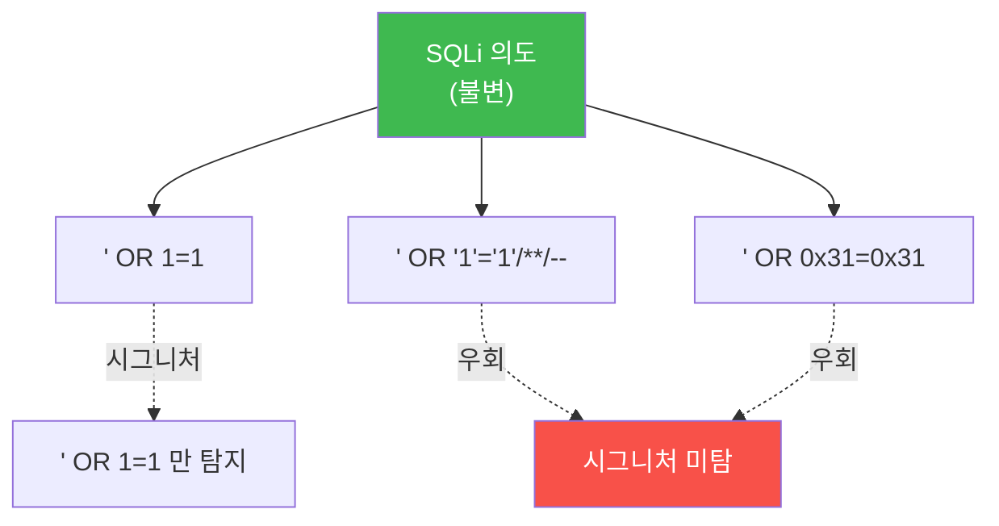

# agent-ir W06 — 회피·다형성·역탐지: 진화하는 페이로드에 맞서는 불변 특성 탐지

> **본 주차의 한 줄 요약**
>
> AI 공격자는 **탐지를 회피**한다. 핵심 무기는 **다형성(polymorphism)** — 같은 공격을 **매번 다른 모양**으로
> 바꾼다. 시그니처(정규식) 탐지는 "이 정확한 문자열"을 찾으므로, 페이로드를 조금만 바꿔도 뚫린다. AI는 이
> 변형을 **실시간·무한**히 한다. 그래서 시그니처만으론 진다. 답은 **불변 특성(invariant)** 을 잡는 것: 페이로드의
> 겉모습은 바뀌어도 **행위(behavior)** 와 **의도(intent)** 는 같다. SQLi는 아무리 변형해도 "SQL 구문을 주입해
> DB를 조작"하려 하고, 그 결과 "DB 에러·비정상 쿼리 시간" 같은 **행위 흔적**은 남는다. **행위 기반 탐지**(무엇을
> 하려 하나)와 **불변 특성 탐지**(변형해도 남는 공통점)가 다형성에 맞서는 방어다. 또 공격자는 **역탐지**
> (방어를 감지해 숨거나 속도 조절)도 하므로, 방어의 탐지 로직도 **관측 가능성을 낮추고** 여러 신호를 교차한다.
>
> **한 줄 결론**: 다형성은 겉모습을 바꿔 시그니처를 회피한다 — **행위·의도·결과(불변 특성)** 는 못 바꾼다.
> 시그니처 대신 **행위 기반·불변 특성 탐지**로 진화하는 페이로드를 잡는다.

---

## 학습 목표

본 주차 종료 시 학생은 다음 5가지를 **본인 손으로** 할 수 있어야 한다.

1. **다형성**이 시그니처 탐지를 회피하는 원리를 설명한다.
2. 다형 페이로드가 **시그니처를 우회**함을 확인한다(SIG_EVADED).
3. **행위 기반 탐지**로 다형 공격을 잡는다(BEHAVIOR_CAUGHT).
4. **불변 특성**(변형해도 남는 공통점)으로 탐지한다(INVARIANT_CAUGHT).
5. 역탐지에 맞선 다신호 교차의 필요를 설명한다.

> **이 주차의 시선** — 모양이 바뀌어도 못 바꾸는 것(행위·결과)을 잡는다.

---

## 0. 용어 해설 (회피·다형성)

| 용어 | 영문 | 뜻 | 비유 |
|------|------|----|------|
| **다형성** | Polymorphism | 매번 다른 모양 | 변장 |
| **시그니처 탐지** | Signature-based | 정확한 패턴 매칭 | 몽타주 대조 |
| **행위 기반 탐지** | Behavior-based | 무엇을 하나로 판단 | 행동 관찰 |
| **불변 특성** | Invariant | 변형해도 남는 공통점 | 지문 |
| **역탐지** | Anti-detection | 방어를 감지·회피 | 미행 감지 |

> **헷갈리기 쉬운 한 쌍** — *시그니처* 는 "정확한 모양"(변형에 약함), *불변 특성* 은 "변형해도 남는 본질"(변형에
> 강함)이다. 다형성엔 후자로 맞선다.

---

## 0.5 신입생 친화 핵심 개념

### 0.5.1 다형성 — 시그니처를 무력화

시그니처는 `' OR 1=1`만 잡는다. AI가 `/**/`·16진수·인코딩으로 변형하면 겉모습이 달라져 **우회**된다. 변형은
무한하니 시그니처를 계속 추가하는 건 진다.

### 0.5.2 행위 기반 탐지 — 무엇을 하려 하나

페이로드 모양은 달라도, SQLi는 결국 **DB에 논리 조작 구문**을 넣으려 한다. 행위 기반 탐지는 "이 입력이 DB에서
**항상 참**을 만들려 하나?", "구문을 **주입**하려 하나?"를 본다. 모양이 아니라 **의도·행위**를 판단하므로 변형에
강하다. (예: 파싱해서 "논리 조작 구조"인지 판정.)

### 0.5.3 불변 특성 — 변형해도 남는 것

아무리 변형해도 SQLi엔 공통점이 있다: **따옴표+논리연산자**(OR/AND), **주석**(--,#,/**/), **항상 참 조건**
(1=1, 'a'='a'). 이 **불변 특성의 조합**을 탐지하면, 정확한 문자열을 몰라도 잡는다. 그리고 공격의 **결과**(DB
에러·비정상 응답 시간·행 수 급증)도 불변 흔적 — 성공한 공격은 결과를 남긴다.

### 0.5.4 역탐지에 맞서기 — 다신호 교차

공격자는 방어를 **감지**하려 한다(응답 지연·차단 패턴 관찰). 대응: (1) 탐지 로직의 **관측 가능성 낮추기**(일관된
응답, 차단을 즉시 노출 안 함), (2) **여러 신호 교차**(시그니처 우회해도 행위·결과에서 잡힘), (3) 능동 방어
(W10 기만)로 공격자를 혼란. 한 신호에 의존하지 않는 **다층 탐지**가 역탐지를 무력화한다.

### 0.5.5 시그니처는 죽었나 — 아니다, 계층의 하나

시그니처가 무용한 건 아니다 — 알려진 공격을 **싸게 빠르게** 잡는다. 문제는 그것"만"으론 부족한 것. 시그니처
(알려진 것)+행위(변형)+불변 특성(본질)+결과(성공 흔적)를 **계층으로** 쌓아야 다형성에 견딘다. 각 계층이
서로의 빈틈을 메운다.

---

## 1. 실습 안내 (5 미션)

실행 위치 el34 **호스트**(`ssh ccc@{{TARGET_IP}}`), GPU `http://211.170.162.139:10934`.

### STEP 1 — GPU 헬스체크 → GEN_OK
### STEP 2 — 시그니처 우회 확인 → SIG_EVADED
- **왜/무엇을:** 다형 페이로드가 정규식 시그니처를 우회함을 확인.
- **해석:** 시그니처만으론 진다.

### STEP 3 — 행위 기반 탐지 → BEHAVIOR_CAUGHT
- **왜?** 의도를 본다.
- **무엇을?** 변형돼도 "논리 조작 구조"를 파싱·판정해 탐지.
- **해석:** 모양 아닌 행위.

### STEP 4 — 불변 특성 탐지 → INVARIANT_CAUGHT
- **왜?** 변형해도 남는 것.
- **무엇을?** 불변 특성(따옴표+논리+주석) 조합으로 탐지.
- **해석:** 본질을 잡는다.

### STEP 5 — 종합 → Assessment
- 다형성·행위·불변·다층을 묶어 정리(Assessment).

---

## 2. 흔한 오해·관제자 노트

- **"시그니처 많이 추가하면 됨"** — 변형은 무한. 시그니처 경쟁은 진다. 행위·불변으로.
- **"행위 탐지는 오탐 많다"** — 튜닝·다신호 교차로 줄인다. 시그니처와 계층으로 보완.
- **"우회되면 못 잡는다"** — 결과(성공 흔적)는 남는다. 결과 탐지가 최후의 그물.
- **관제 관점** — 탐지가 시그니처에만 의존하는지, 행위·불변·결과 계층이 있는지, 역탐지에 다신호 교차로 견디는지
  점검한다. 단일 계층 탐지는 다형성에 뚫린다.

---

## 3. 다음 주차 (W07) 예고 — 규모화: 다중 에이전트 병렬·역할 분할

W06이 "회피에 맞선 탐지"였다면, W07은 공격자의 **규모화** — 다중 에이전트를 병렬로, 역할을 나눠 동시 공격하는
방식과, 그 **협조된 캠페인**을 여러 출처에 걸쳐 탐지하는 법을 다룬다.
