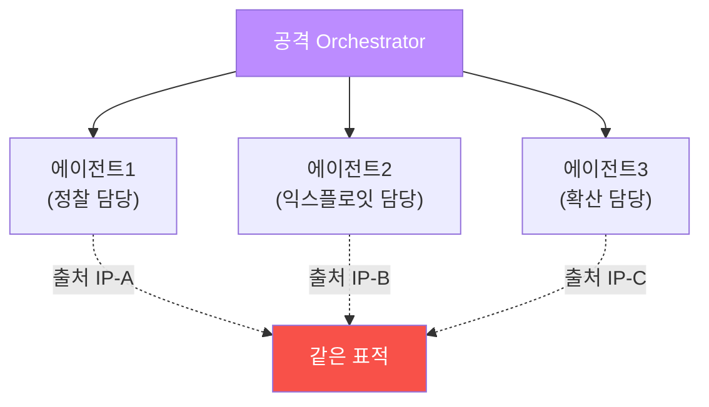

# agent-ir W07 — 규모화(scale): 다중 에이전트 병렬·역할 분할·협조 캠페인 탐지

> **본 주차의 한 줄 요약**
>
> AI 공격의 마지막 무기는 **규모화**다. 한 에이전트가 아니라 **수십·수백 에이전트를 병렬로**, 역할을 나눠
> (정찰 담당·익스플로잇 담당·확산 담당) 동시에 공격한다 — aisec W10의 멀티에이전트 오케스트레이션을 **공격에**
> 쓰는 것이다. 방어 입장에서 무서운 점: (1) **여러 출처**에서 동시에 와서 단일 IP 차단이 무력, (2) 각 에이전트는
> **작게** 움직여 개별로는 임계 이하(속도 탐지 회피), (3) **역할 분할**로 한 출처만 봐선 전체 공격이 안 보임.
> 그래서 방어는 **협조(coordination)** 를 잡아야 한다: 여러 출처가 **같은 표적**을, **같은 시간대**에, **역할을
> 나눠** 공격하면 — 개별은 조용해도 **전체 패턴**은 협조된 캠페인이다. el34에서 여러 출처의 흔적을 **표적·시간·
> 역할**로 묶어 협조 캠페인을 탐지한다. 단일 신호가 아니라 **다출처 상관**이 규모화 방어의 핵심이다.
>
> **한 줄 결론**: AI 공격은 다중 에이전트를 병렬·역할 분할로 규모화한다 — 개별은 조용하지만 **협조(같은 표적·
> 시간·분할된 역할)** 는 못 숨긴다. **다출처 상관**으로 협조 캠페인을 잡는다.

---

## 학습 목표

본 주차 종료 시 학생은 다음 5가지를 **본인 손으로** 할 수 있어야 한다.

1. 공격의 **규모화**(다중 에이전트 병렬·역할 분할)를 설명한다.
2. 개별 출처가 **임계 이하로 회피**함을 이해한다(LOW_AND_SLOW).
3. 여러 출처의 **같은 표적·시간 상관**을 탐지한다(CAMPAIGN_CORRELATED).
4. **역할 분할**(정찰·익스플로잇·확산)을 식별한다(ROLE_SPLIT).
5. 다출처 상관이 규모화 방어의 핵심인 이유를 설명한다.

> **이 주차의 시선** — 개별로는 조용한 여럿을, 협조 패턴으로 하나의 캠페인으로 묶어 본다.

---

## 0. 용어 해설 (규모화)

| 용어 | 영문 | 뜻 | 비유 |
|------|------|----|------|
| **규모화** | Scaling | 다중 에이전트 병렬 | 인해전술 |
| **역할 분할** | Role Split | 에이전트별 역할 | 분업 |
| **low-and-slow** | — | 작게·느리게 회피 | 잠입 |
| **협조 캠페인** | Coordinated Campaign | 조율된 다출처 공격 | 합동 작전 |
| **다출처 상관** | Multi-source Correlation | 여러 출처 연결 | 전체 지도 |

> **헷갈리기 쉬운 한 쌍** — *단일 출처 폭주*(W03 속도)는 "한 IP가 빠르게", *규모화*는 "여러 IP가 조용히 협조"다.
> 후자는 개별 속도 탐지를 우회하므로 상관이 필요.

---

## 0.5 신입생 친화 핵심 개념

### 0.5.1 규모화 — 여럿이 나눠서

공격 오케스트레이터가 여러 에이전트에 역할을 나눠 동시 공격한다. 각자 **다른 출처 IP**, 각자 **작은 행동**.

### 0.5.2 low-and-slow — 개별은 조용히

각 에이전트가 임계 이하로 움직이면(예: 분당 5회, 속도 임계 30 미만) **개별 속도 탐지를 우회**한다. 10개
에이전트가 각 5회면 전체 50회지만, 출처별로 보면 다 정상. **단일 출처 관점의 한계**다.

### 0.5.3 협조 상관 — 같은 표적·시간

개별은 조용해도 **협조의 흔적**은 있다: 여러 출처가 (1) **같은 표적**(/login)을, (2) **같은 시간대**에, (3)
**보완적 행동**(A는 스캔, B는 익스플로잇)으로 공격. 출처를 **표적·시간으로 묶으면** "협조된 캠페인"이 드러난다.
개별 IP가 아니라 **캠페인 단위**로 본다.

### 0.5.4 역할 분할 식별 — 퍼즐 맞추기

각 출처의 행동을 보면 **역할**이 보인다: 출처A는 정찰만, B는 익스플로잇만, C는 확산만. 개별로는 "불완전한
공격"이라 덜 위협적으로 보이지만, **합치면 완전한 공격 체인**이다. 역할 분할을 식별해 조각을 맞추면 전체
캠페인의 의도가 보인다(W02 루프 재구성의 다출처판).

### 0.5.5 다출처 상관 — 규모화의 답

규모화 방어의 핵심은 **다출처 상관**이다: 단일 IP 차단이 아니라 **캠페인 전체를 인식**하고, 협조 패턴(공유
표적·시간·역할)을 기반으로 관련 출처를 **묶어 대응**. 한 IP를 차단하면 다른 에이전트가 잇지만, 캠페인 패턴을
알면 신규 출처도 같은 패턴으로 빠르게 식별·차단한다. 개별이 아니라 **패턴**을 방어한다.

---

## 1. 실습 안내 (5 미션)

실행 위치 el34 **호스트**(`ssh ccc@{{TARGET_IP}}`), GPU `http://211.170.162.139:10934`.

### STEP 1 — GPU 헬스체크 → GEN_OK
### STEP 2 — low-and-slow 회피 확인 → LOW_AND_SLOW
- **왜/무엇을:** 개별 출처가 속도 임계 이하로 회피함을 확인.
- **해석:** 단일 출처 관점의 한계.

### STEP 3 — 협조 캠페인 상관 → CAMPAIGN_CORRELATED
- **왜?** 개별을 캠페인으로.
- **무엇을?** 여러 출처의 같은 표적·시간 상관.
- **해석:** 협조는 못 숨긴다.

### STEP 4 — 역할 분할 식별 → ROLE_SPLIT
- **왜?** 조각 맞추기.
- **무엇을?** 각 출처의 역할(정찰·익스플로잇·확산) 식별·조합.
- **해석:** 합치면 완전한 공격.

### STEP 5 — 종합 → Assessment
- 규모화·low-and-slow·상관·역할을 묶어 정리(Assessment).

---

## 2. 흔한 오해·관제자 노트

- **"IP 차단하면 끝"** — 다른 에이전트가 잇는다. 캠페인 패턴을 방어해야.
- **"개별이 조용하면 안전"** — low-and-slow 회피. 다출처 상관으로 캠페인을 봐야.
- **"불완전한 공격은 무해"** — 역할 분할의 한 조각일 수 있다. 조합해서 판단.
- **관제 관점** — 탐지가 단일 IP가 아니라 캠페인(표적·시간·역할)을 보는지, 다출처 상관이 되는지, 신규 출처를
  기존 캠페인 패턴으로 빠르게 잇는지 점검한다. 규모화엔 패턴 방어.

---

## 3. 다음 주차 (W08) 예고 — 중간평가: Blue Team Agent IR CTF

W01~W07로 공격자 해부와 각 단계 탐지(정찰·개발·측면이동·회피·규모화)를 배웠다. W08은 이를 종합한 **Blue
Team Agent IR CTF** — 주어진 공격 흔적에서 공격 체인을 재구성하고 탐지·대응하는 중간평가다.
