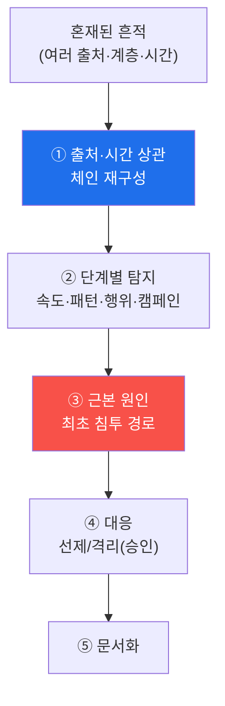

# agent-ir W08 — 중간평가: Blue Team Agent IR CTF (W01~W07 종합)

> **본 주차의 한 줄 요약**
>
> W01~W07로 AI 공격자의 각 단계(정찰·익스플로잇 개발·측면이동·회피·규모화)와 그 탐지를 배웠다. W08은 이를
> **하나의 CTF**로 종합한다. 주어진 **혼재된 공격 흔적**(여러 출처·계층·시간의 이벤트)에서 ① 공격 **체인을
> 재구성**하고(정찰→개발→측면이동), ② 각 단계를 배운 기법으로 **탐지**하며(속도·패턴·상관·행위·캠페인),
> ③ **대응**을 판단하고(선제 차단·격리, 승인 게이트), ④ **사고를 문서화**한다. 이것은 실제 Blue Team의 일 —
> 로그의 바다에서 공격의 이야기를 읽어내고 끊는 것이다. CTF의 "플래그"는 **정확히 재구성한 공격 체인**이다.
> 개별 기법을 아는 것과 **실제 흔적에서 종합**하는 것은 다르다 — 이 종합 능력이 중간평가의 핵심이다.
>
> **한 줄 결론**: Blue Team Agent IR CTF = 혼재된 흔적에서 **공격 체인 재구성 + 단계별 탐지 + 대응 + 문서화**.
> 배운 기법들을 실제 사고 분석으로 종합하는 능력을 평가한다.

---

## 학습 목표

본 주차 종료 시 학생은 다음 5가지를 **본인 손으로** 할 수 있어야 한다.

1. 혼재된 흔적에서 **공격 체인을 재구성**한다(CHAIN_REBUILT).
2. 각 단계를 배운 기법으로 **탐지**한다(STAGES_DETECTED).
3. 근본 원인·최초 침투 경로를 **식별**한다(ROOT_CAUSE).
4. 대응을 판단한다(승인 게이트)(IR_RESPONSE).
5. 사고를 **문서화**한다(Assessment).

> **이 주차의 시선** — 부분 기법을 실제 사고 종합으로. 로그에서 공격의 이야기를 읽는다.

---

## 0. 용어 해설 (IR CTF)

| 용어 | 관련 주차 | CTF에서의 역할 |
|------|-----------|----------------|
| **공격 체인** | W02 | 정찰→개발→이동 재구성 |
| **단계별 탐지** | W03~W07 | 각 기법 적용 |
| **근본 원인** | W05 | 최초 침투 경로 |
| **선제/격리** | W04·W05 | 대응(승인) |
| **사고 보고** | W13 | 문서화 |

---

## 0.5 CTF 접근법

### 0.5.1 흔적에서 이야기로

### 0.5.2 종합의 원칙 — 배운 것을 다 쓴다

- **상관**(W02·W03·W07): 출처·시간·표적으로 흩어진 흔적을 묶는다.
- **단계 인식**(W03~W05): 각 흔적이 어느 공격 단계인지 분류.
- **회피 대응**(W06): 시그니처 우회를 행위·불변으로 보완.
- **캠페인 인식**(W07): 다출처 협조를 캠페인으로.
- **대응**(W04·W05): 선제 차단·격리, 위험 조치는 승인.

### 0.5.3 평가 기준 — 정확한 체인

CTF 성공 = **공격 체인을 정확히 재구성**(어떤 순서로 무슨 단계). 부분 탐지가 아니라 **전체 이야기**를 맞혀야
한다. 그리고 근본 원인(최초 침투)까지 짚어야 재발을 막는다. 문서화로 다음 대응자에게 전달.

---

## 1. 중간평가 CTF 안내 (5 미션 — 종합)

실행 위치 el34 **호스트**(`ssh ccc@{{TARGET_IP}}`), GPU `http://211.170.162.139:10934`.

### STEP 1 — GPU 헬스체크 → GEN_OK
### STEP 2 — 공격 체인 재구성 → CHAIN_REBUILT
### STEP 3 — 단계별 탐지 → STAGES_DETECTED
### STEP 4 — 근본 원인·대응 → IR_RESPONSE
### STEP 5 — 사고 문서화 → Assessment

---

## 2. 흔한 오해·관제자 노트

- **"단계 하나 탐지하면 성공"** — 전체 체인 재구성이 목표. 부분은 부분.
- **"차단하면 끝"** — 근본 원인(최초 침투) 없이는 재발. 경로를 짚어야.
- **"문서는 형식"** — 다음 대응자·재발 방지의 근거. 사고 문서화는 IR의 필수.
- **관제 관점** — 분석가가 흔적을 체인으로 종합하는지, 근본 원인을 짚는지, 대응에 승인이, 문서가 남는지 평가한다.
  종합 능력이 실전 Blue Team의 척도.

---

## 3. 다음 주차 (W09) 예고 — 실시간 탐지: AI 속도에 맞춘 탐지 룰 엔지니어링

중간평가 후, 후반부는 방어를 **더 빠르고 능동적으로** 만든다. W09는 AI 속도에 맞춘 **실시간 탐지 룰** 엔지니어링
— 배운 탐지 로직을 실시간으로 도는 룰로 만들고, 오탐·성능을 관리하는 법을 다룬다.
