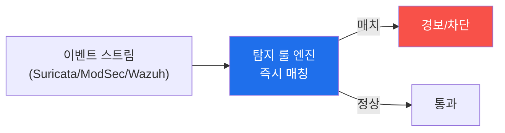

# agent-ir W09 — 실시간 탐지: AI 속도에 맞춘 탐지 룰 엔지니어링·오탐·성능

> **본 주차의 한 줄 요약**
>
> 전반부에서 탐지 **로직**(속도·패턴·상관·행위)을 배웠다. W09는 이를 **실시간으로 도는 룰**로 만든다. AI 속도
> (W01)에 맞서려면 탐지가 **사람이 로그 보는 속도**가 아니라 **이벤트가 들어오는 즉시** 판정해야 한다. 실시간
> 탐지 룰의 3대 관심사: ① **정확성**(참 위협을 놓치지 않되 오탐을 줄임) — 좁으면 놓치고 넓으면 오탐 폭주,
> ② **성능**(초당 수천 이벤트를 지연 없이 처리) — 무거운 룰은 실시간을 못 따라감, ③ **유지보수**(공격 진화에
> 룰 갱신). 룰은 **Sigma 같은 선언적 형식**으로 쓰면 이식·공유·검증이 쉽다. 그리고 탐지 룰도 **평가**해야
> 한다(aisec W12) — 테스트 이벤트로 참/거짓 양성률을 재고, 오탐이 많으면 튜닝. el34의 Suricata·ModSec·Wazuh가
> 실시간 탐지 엔진이고, 우리는 그 위에 룰을 얹는다. 실시간 탐지가 템포 격차를 좁히는 방어의 심장이다.
>
> **한 줄 결론**: 실시간 탐지 룰은 이벤트 즉시 판정해 AI 속도를 따라간다 — **정확성·성능·유지보수**를 균형
> 잡아야 한다. 룰은 선언적으로 쓰고, 테스트로 오탐을 튜닝하며, 공격 진화에 갱신한다.

---

## 학습 목표

본 주차 종료 시 학생은 다음 5가지를 **본인 손으로** 할 수 있어야 한다.

1. 실시간 탐지 룰의 3대 관심사(정확성·성능·유지보수)를 설명한다.
2. 선언적 **탐지 룰**을 작성한다(RULE_WRITTEN).
3. 룰을 테스트 이벤트로 검증한다(RULE_TESTED).
4. **오탐**을 측정·튜닝한다(FP_TUNED).
5. 실시간 탐지가 템포 방어의 심장인 이유를 설명한다.

> **이 주차의 시선** — 탐지 로직을 실제로 도는·튜닝되는·유지되는 룰로 만든다.

---

## 0. 용어 해설 (탐지 룰)

| 용어 | 영문 | 뜻 | 비유 |
|------|------|----|------|
| **탐지 룰** | Detection Rule | 조건→경보 규칙 | 감지기 설정 |
| **선언적** | Declarative | 무엇을(어떻게 아님) | 목록 지정 |
| **참양성/오탐** | TP/FP | 맞음/틀린 경보 | 정탐/헛경보 |
| **튜닝** | Tuning | 룰 조정 | 감도 조절 |
| **처리량** | Throughput | 초당 처리 이벤트 | 처리 속도 |

> **헷갈리기 쉬운 한 쌍** — *좁은 룰* 은 "오탐 적지만 놓침 많음", *넓은 룰* 은 "놓침 적지만 오탐 폭주"다. 균형이
> 튜닝의 목표.

---

## 0.5 핵심 개념

### 0.5.1 실시간 — 이벤트 즉시 판정



배치(나중에 로그 분석)가 아니라 **스트림**(들어오는 즉시)으로 판정한다. AI 공격이 분 단위면, 탐지도 초 단위여야
한다. 실시간이 곧 템포 방어.

### 0.5.2 선언적 룰 — 무엇을 잡을지만 쓴다

```yaml
title: SQLi mutation burst
detection:
  selection:
    uri: "/login"
    body_contains: ["'", "OR", "UNION"]
  condition: count(selection) > 8 within 60s
  group_by: source_ip
```

"어떻게 매칭할지"(구현)가 아니라 "무엇을 잡을지"(조건)만 선언한다. Sigma 같은 형식은 **이식·공유·검증**이 쉽다
— 한 번 잘 쓰면 여러 엔진에 적용.

### 0.5.3 정확성 — 오탐과 놓침의 균형

- **좁은 룰**(엄격): 오탐 적지만 변형·신종을 **놓침**.
- **넓은 룰**(느슨): 놓침 적지만 정상 트래픽까지 잡아 **오탐 폭주**.
- 균형: 임계·조건을 테스트로 튜닝. **오탐률**과 **탐지율**을 재서 최적점을 찾는다(aisec W12 평가).

### 0.5.4 성능 — 실시간을 따라가기

무거운 룰(복잡한 정규식·전체 스캔)은 이벤트 폭주 시 **지연**을 만들어 실시간을 못 따라간다. 방법: 싼 조건
먼저(빠른 필터로 대부분 배제) → 비싼 조건 나중(소수만 정밀 검사). 계층적 필터로 처리량을 지킨다.

### 0.5.5 유지보수 — 공격은 진화한다

공격이 진화하면(W06 다형성) 룰도 갱신해야 한다. 그래서 룰은 **버전 관리·테스트·회귀 검증**(aisec W12)을
갖춰야 한다. 룰 변경이 오탐을 늘리거나 탐지를 줄이지 않는지 테스트로 확인. 살아있는 룰셋이 실시간 방어를
유지한다.

---

## 1. 실습 안내 (5 미션)

실행 위치 el34 **호스트**(`ssh ccc@{{TARGET_IP}}`), GPU `http://211.170.162.139:10934`.

### STEP 1 — GPU 헬스체크 → GEN_OK
### STEP 2 — 탐지 룰 작성 → RULE_WRITTEN
- **왜/무엇을:** 선언적 탐지 룰(조건·임계·group_by) 작성.
- **해석:** 무엇을 잡을지 선언.

### STEP 3 — 룰 테스트 → RULE_TESTED
- **왜?** 작동 검증.
- **무엇을?** 공격·정상 이벤트로 룰 매칭 확인.
- **해석:** 참양성·미탐 확인.

### STEP 4 — 오탐 튜닝 → FP_TUNED
- **왜?** 균형.
- **무엇을?** 정상 트래픽 오탐 측정 → 임계 튜닝.
- **해석:** 오탐과 놓침의 최적점.

### STEP 5 — 종합 → Assessment
- 실시간·선언·정확성·성능을 묶어 정리(Assessment).

---

## 2. 흔한 오해·블루팀 노트

- **"룰은 많을수록 좋다"** — 무거우면 실시간 못 따라감. 정확·경량 룰을 유지.
- **"한 번 만들면 끝"** — 공격 진화에 갱신·회귀 검증 필요.
- **"오탐은 어쩔 수 없다"** — 튜닝으로 줄인다. 오탐 폭주는 경보 피로→진짜 놓침.
- **관제 관점** — 탐지 룰이 실시간으로 도는지, 오탐률이 관리되는지, 룰 변경에 회귀 검증이 있는지, 성능이
  이벤트 폭주를 견디는지 점검한다. 살아있는 룰셋이 실시간 방어력.

---

## 3. 다음 주차 (W10) 예고 — 기만과 지연: 공격자의 비용을 올리는 능동 방어

W09가 "빠른 탐지"였다면, W10은 **능동 방어** — 허니팟·기만으로 공격자를 속이고, 지연으로 공격 비용을 올린다.
수동적 탐지를 넘어 공격자의 템포를 **거꾸로 늦추는** 방어를 배운다.
