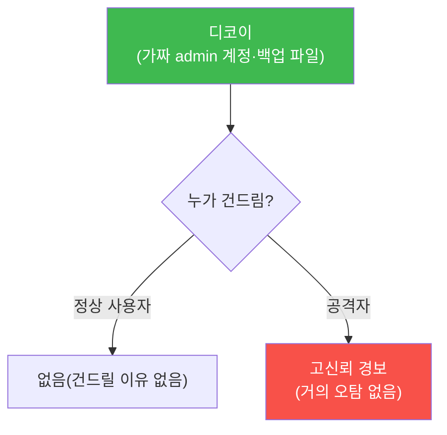

# agent-ir W10 — 기만과 지연: 허니팟·타르핏·공격자 비용 올리기(능동 방어)

> **본 주차의 한 줄 요약**
>
> 지금까지는 **수동 방어**(탐지·대응)였다. W10은 **능동 방어(active defense)** — 공격자를 **속이고 늦춰**
> 비용을 올린다. 핵심 도구는 둘: ① **기만(deception)** — **허니팟·디코이**(가짜 서버·계정·파일)를 심어 둔다.
> 정상 사용자는 이들을 건드릴 이유가 없으므로, **누가 건드리면 곧 공격자**다(고신뢰 신호, 오탐 거의 없음).
> ② **지연(delay)** — **타르핏(tarpit)** 으로 공격자의 요청에 일부러 느리게 응답해, AI 공격의 **속도 이점을
> 깎는다**. AI 공격의 무기가 속도(W01)라면, 능동 방어는 그 속도를 **거꾸로 늦춘다**. 능동 방어의 가치: (1)
> 디코이는 **거의 오탐 없는** 조기 경보, (2) 지연은 공격자가 다른 표적으로 옮기게 만들거나 방어자가 대응할
> **시간을 번다**, (3) 공격자를 가짜 환경에서 **관찰·학습**한다. 단, 능동 방어는 **자기 자산 안에서만**(공격자
> 역해킹 금지) — 인가·격리·합법 경계를 지킨다.
>
> **한 줄 결론**: 능동 방어는 **기만**(디코이=거의 오탐 없는 신호)과 **지연**(타르핏=AI 속도 이점 깎기)으로
> 공격자의 비용을 올린다. 자기 자산 안에서, 합법 경계를 지키며 공격자의 템포를 거꾸로 늦춘다.

---

## 학습 목표

본 주차 종료 시 학생은 다음 5가지를 **본인 손으로** 할 수 있어야 한다.

1. **능동 방어**(기만·지연)와 수동 방어의 차이를 설명한다.
2. **허니팟/디코이** 상호작용을 고신뢰 신호로 탐지한다(DECOY_TRIGGERED).
3. **타르핏 지연**으로 공격 속도를 늦춘다(DELAY_APPLIED).
4. 공격자 **비용 증가**를 정량화한다(COST_RAISED).
5. 능동 방어의 **합법 경계**(자기 자산 한정)를 설명한다.

> **이 주차의 시선** — 방어를 수동에서 능동으로. 공격자의 속도를 무기에서 약점으로 바꾼다.

---

## 0. 용어 해설 (능동 방어)

| 용어 | 영문 | 뜻 | 비유 |
|------|------|----|------|
| **능동 방어** | Active Defense | 속이고 늦추는 방어 | 함정·미끼 |
| **허니팟** | Honeypot | 유인용 가짜 시스템 | 미끼 |
| **디코이** | Decoy | 가짜 자산(계정·파일) | 가짜 금고 |
| **타르핏** | Tarpit | 일부러 느린 응답 | 늪 |
| **공격 비용** | Attack Cost | 공격에 드는 시간·자원 | 비용 |

> **헷갈리기 쉬운 한 쌍** — *허니팟* 은 "가짜 시스템(유인)", *타르핏* 은 "느린 응답(지연)"이다. 전자는 신호,
> 후자는 시간 벌기.

---

## 0.5 신입생 친화 핵심 개념

### 0.5.1 기만 — 디코이는 거의 오탐 없는 신호

일반 탐지는 정상/공격 구분에 오탐이 따른다. **디코이는 다르다** — 정상 사용자는 가짜 admin 계정·미끼 파일을
**건드릴 이유가 없다.** 그래서 **접촉 자체가 공격 신호**(거의 오탐 0). 조기·고신뢰 경보의 강력한 도구.

### 0.5.2 지연 — AI 속도 이점 깎기

AI 공격의 무기는 속도다. **타르핏**은 공격자로 의심되는 연결에 **일부러 느리게** 응답한다(각 요청에 수 초
지연). 그러면 AI의 "분 단위 공격"이 늘어져 **속도 이점이 사라진다.** 공격자는 (1) 지쳐서 다른 표적으로 옮기거나,
(2) 그 사이 방어자가 대응할 시간을 준다. 속도를 무기에서 약점으로.

### 0.5.3 공격자 비용 — 방어의 새 지표

능동 방어의 효과는 **공격자 비용 증가**로 잰다: 디코이에 시간 낭비, 타르핏에 지연, 가짜 정보에 혼란. 공격
비용이 이득을 넘으면 공격자는 **포기**한다. "완벽히 못 막아도 비용을 충분히 올리면 이긴다"가 능동 방어의 철학
— 방어를 경제 문제로 본다.

### 0.5.4 관찰·학습 — 공격자를 연구한다

허니팟에 걸린 공격자는 **관찰**된다: 어떤 도구·기법·목표인지. 이 정보가 방어를 개선한다(다른 진짜 자산 보호).
공격자가 가짜 환경에서 활동하는 동안 방어자는 그들의 TTP(전술·기법·절차)를 학습해 실시간 룰(W09)에 반영한다.

### 0.5.5 합법 경계 — 절대 원칙

능동 방어는 **자기 자산 안에서만**. 절대 금지: 공격자 시스템 **역해킹**·공격자 대상 공격(불법). 허용: 자기
네트워크의 디코이·타르핏·가짜 정보. 기만은 **내 집에 함정**을 놓는 것이지 **남의 집을 습격**하는 게 아니다.
인가·격리·합법 경계를 지키는 것이 능동 방어의 전제다.

---

## 1. 실습 안내 (5 미션)

실행 위치 el34 **호스트**(`ssh ccc@{{TARGET_IP}}`), GPU `http://211.170.162.139:10934`.

### STEP 1 — GPU 헬스체크 → GEN_OK
### STEP 2 — 디코이 상호작용 탐지 → DECOY_TRIGGERED
- **왜/무엇을:** 디코이(가짜 계정·파일) 접촉을 고신뢰 경보로.
- **해석:** 접촉=공격(거의 오탐 0).

### STEP 3 — 타르핏 지연 → DELAY_APPLIED
- **왜?** 속도 이점 깎기.
- **무엇을?** 의심 연결에 지연 적용(응답 시간 증가).
- **해석:** AI 속도를 늦춘다.

### STEP 4 — 공격 비용 정량화 → COST_RAISED
- **왜?** 능동 방어 효과.
- **무엇을?** 지연·기만으로 공격 시간·비용 증가 측정.
- **해석:** 비용>이득이면 포기.

### STEP 5 — 종합(합법 경계) → Assessment
- 기만·지연·비용·합법 경계를 묶어 정리(Assessment).

---

## 2. 흔한 오해·블루팀 노트

- **"능동 방어=역해킹"** — 아니다. 자기 자산 안 디코이·타르핏만. 역해킹은 불법.
- **"디코이는 오탐 위험"** — 반대로 오탐 거의 0(정상은 안 건드림). 고신뢰 신호.
- **"완벽히 막아야 성공"** — 비용을 충분히 올리면 공격자가 포기. 방어는 경제 문제.
- **관제 관점** — 디코이가 배치·모니터링되는지, 타르핏이 의심 연결에만 적용되는지(정상 영향 없이), 합법 경계를
  지키는지 점검한다. 능동 방어는 강력하지만 경계를 넘으면 불법.

---

## 3. 다음 주차 (W11) 예고 — Purple Round 1: Claude Code가 Bastion을 코치한다

W10까지 방어 기법을 배웠다면, W11부터 **Purple 자동화**로 넘어간다. Round 1은 **클라이언트 하네스(Claude
Code)가 서버 하네스(Bastion)를 코치**하는 구조 — 사람+클라이언트 에이전트가 탐색·설계하고, 그 지식을 서버
에이전트(Bastion)에 이식해 자동화하는 새 협업 방식을 다룬다.
