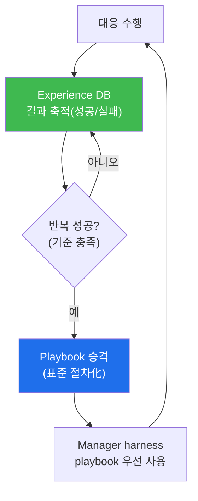

# agent-ir W12 — Purple Round 2: Experience → Playbook 자동 승격(자기 개선 루프)

> **본 주차의 한 줄 요약**
>
> W11에서 사람+클라이언트가 Bastion을 코치했다면, W12는 한 걸음 더 — Bastion이 **스스로** 개선한다. 핵심은
> **Experience→Playbook 자동 승격**이다. Bastion이 대응을 수행할 때마다 그 결과(성공/실패, 소요, 부작용)를
> **Experience DB**(aisec W06의 E.G 경험)에 쌓는다. 어떤 대응 절차가 **반복적으로 성공**하면(예: "브루트포스엔
> 조사→차단이 5번 연속 정확했다"), Bastion은 그것을 **표준 Playbook으로 자동 승격**한다. 그러면 다음부턴
> Manager가 harness를 짤 때 이 검증된 playbook을 우선 사용해 **더 빠르고 안정적**으로 대응한다. 이것이 **자기
> 개선 루프**: 경험→승격→더 나은 대응→더 나은 경험. 단, 자동 승격엔 **안전장치**가 필수다 — 오염된 경험(W07)
> 이나 우연한 성공이 잘못 승격되지 않게 **승격 기준**(충분한 반복·높은 성공률·사람 승인)을 둔다. 자동화의
> 편리함과 잘못된 학습의 위험을 균형 잡는다.
>
> **한 줄 결론**: Bastion은 반복 성공한 대응 경험을 **Playbook으로 자동 승격**해 스스로 개선한다. 경험→승격→
> 개선의 루프. 단, 승격 기준(반복·성공률·승인)으로 잘못된·오염된 학습을 막는다.

---

## 학습 목표

본 주차 종료 시 학생은 다음 5가지를 **본인 손으로** 할 수 있어야 한다.

1. **Experience→Playbook 자동 승격**의 자기 개선 루프를 설명한다.
2. 대응 **경험을 축적**한다(EXP_ACCUMULATED).
3. 반복 성공한 **승격 후보를 식별**한다(CANDIDATE_FOUND).
4. 후보를 Playbook으로 **승격**한다(안전 기준)(PROMOTED).
5. 잘못된·오염된 승격을 막는 안전장치를 설명한다.

> **이 주차의 시선** — 방어 에이전트가 경험으로 스스로 나아지는 루프와, 그것을 안전하게 만드는 기준을 본다.

---

## 0. 용어 해설 (자동 승격)

| 용어 | 영문 | 뜻 | 비유 |
|------|------|----|------|
| **Experience DB** | — | 대응 경험 저장소 | 경험록 |
| **Playbook** | Playbook | 표준 대응 절차 | 매뉴얼 |
| **자동 승격** | Auto-promotion | 경험→절차 자동 전환 | 정식 채택 |
| **승격 기준** | Promotion Criteria | 승격 조건(반복·성공률) | 승진 요건 |
| **자기 개선 루프** | Self-improvement Loop | 경험→개선 순환 | 학습 곡선 |

> **헷갈리기 쉬운 한 쌍** — *Experience* 는 "개별 대응 기록(날것)", *Playbook* 은 "검증돼 표준화된 절차(정제)"다.
> 승격은 날것을 정제로 올리는 것 — 기준을 통과해야.

---

## 0.5 핵심 개념

### 0.5.1 자기 개선 루프

경험이 쌓여 검증되면 playbook으로 굳고, playbook이 대응을 개선하고, 개선된 대응이 더 나은 경험을 만든다.
**사람 개입 없이** 도는 개선 루프 — 단 안전 기준 안에서.

### 0.5.2 승격 기준 — 아무 성공이나 올리지 않는다

한 번 성공했다고 playbook이 되면 위험하다(우연·오염). 승격 기준:
- **충분한 반복**: 같은 절차가 N번 이상 사용됨(예: 5회).
- **높은 성공률**: 그중 대부분 성공(예: 80% 이상).
- **부작용 없음**: 오탐·과잉 대응이 적음.
- **사람 승인**(선택): 중요 playbook은 사람 최종 확인.
기준을 통과해야 승격 — 검증된 것만 표준이 된다.

### 0.5.3 오염된 경험의 위험 — 잘못된 학습

Experience DB가 오염되면(W07 데이터 중독의 경험판) 잘못된 playbook이 승격된다. 예: 공격자가 일부러 "차단
안 함"이 성공처럼 보이게 조작하면, "대응 안 하기"가 승격될 수 있다. 방어: 경험도 **검증**(결정론 대조), 이상
패턴 감지, 승격 전 사람 검토. 자동 승격일수록 **입력(경험)의 무결성**이 중요하다.

### 0.5.4 승격의 되돌림 — playbook도 회귀 검증

승격된 playbook이 나중에 나빠질 수 있다(공격 진화). 그래서 playbook도 **평가·회귀 검증**(W09·aisec W12):
성능이 떨어지면 강등·수정. 자동 승격은 일방향이 아니라 **양방향**(승격·강등) — 살아있는 playbook 셋을 유지한다.

### 0.5.5 W11과 W12 — 사람 코치 + 자동 승격

W11(사람이 코치)과 W12(자동 승격)는 보완한다: **신종·복잡한 것**은 사람+클라이언트가 코치(창의), **반복·검증
가능한 것**은 자동 승격(효율). 사람은 새로운 것을 가르치고, 시스템은 검증된 것을 스스로 표준화한다. 둘이 함께
Bastion E.G를 키운다 — Purple 자동화의 완성.

---

## 1. 실습 안내 (5 미션)

실행 위치 el34 **호스트**(`ssh ccc@{{TARGET_IP}}`), GPU `http://211.170.162.139:10934`.

### STEP 1 — GPU 헬스체크 → GEN_OK
### STEP 2 — 경험 축적 → EXP_ACCUMULATED
- **왜/무엇을:** 대응 결과(절차·성공/실패)를 Experience DB에 축적.
- **해석:** 개선의 원료.

### STEP 3 — 승격 후보 식별 → CANDIDATE_FOUND
- **왜?** 검증된 것만.
- **무엇을?** 반복·성공률·부작용 기준으로 승격 후보 선별.
- **해석:** 아무 성공이나 아님.

### STEP 4 — Playbook 승격 → PROMOTED
- **왜?** 표준화.
- **무엇을?** 기준 통과 후보를 playbook으로 승격(승인).
- **해석:** 경험→표준 절차.

### STEP 5 — 종합 → Assessment
- 자기 개선 루프·승격 기준·안전장치를 묶어 정리(Assessment).

---

## 2. 흔한 오해·블루팀 노트

- **"성공하면 바로 playbook"** — 우연·오염 위험. 반복·성공률·부작용 기준 필수.
- **"자동 승격이면 사람 불필요"** — 오염 검증·중요 playbook 승인은 사람. 자동≠무통제.
- **"승격하면 영구"** — 공격 진화에 강등·수정. playbook도 회귀 검증.
- **관제 관점** — 승격 기준이 엄격한지, Experience DB가 오염 검증되는지, 승격 playbook이 회귀 검증되는지,
  중요 승격에 승인이 있는지 점검한다. 자동 학습의 안전은 입력 무결성+승격 기준.

---

## 3. 다음 주차 (W13) 예고 — 에이전트 IR 사고 보고서: 전례 없는 조각들을 기록하기

W11~W12가 "Purple 자동화"였다면, W13은 그 대응을 **문서화**한다. AI 시대의 전례 없는 사고(에이전트 공격)를
어떻게 기록·전달할지 — 사고 보고서 작성과 조직 학습을 다룬다.
