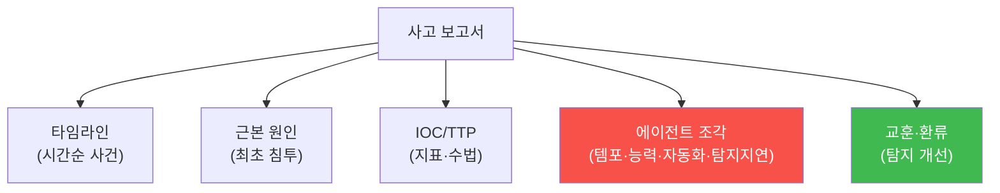

# agent-ir W13 — 에이전트 IR 사고 보고서: 전례 없는 조각들을 기록하기

> **본 주차의 한 줄 요약**
>
> 대응만큼 중요한 게 **기록**이다. W13은 AI 시대의 **전례 없는 사고**(에이전트 공격)를 어떻게 문서화·전달할지
> 다룬다. 기존 사고 보고서 틀(타임라인·근본 원인·IOC·교훈)은 유효하지만, 에이전트 공격은 **새로운 조각**을
> 담아야 한다: 공격의 **템포**(얼마나 빨랐나), **에이전트 능력 경계**(어떤 도구를 썼나), **자동화 수준**(사람
> 개입이 있었나), **탐지 지연**(우리 방어가 얼마나 뒤늦었나). 좋은 사고 보고서의 목적은 셋: (1) **조직 학습** —
> 다음엔 더 빨리 잡게, (2) **탐지 개선** — IOC·TTP를 실시간 룰(W09)·Bastion 코치(W11)로 환류, (3) **책임·규정** —
> 무슨 일이 있었는지 정확한 기록. 특히 IOC(침해 지표)와 TTP(공격 전술·기법)를 **구조화**해 추출하면, 사고
> 보고서가 **문서에 그치지 않고 방어 자산**이 된다 — 이 사고의 교훈이 다음 사고의 탐지가 된다.
>
> **한 줄 결론**: 에이전트 IR 사고 보고서는 기존 틀(타임라인·근본 원인·IOC·교훈)에 **에이전트 고유 조각**
> (템포·능력·자동화·탐지 지연)을 더한다. 목적은 조직 학습·탐지 개선·책임 — IOC/TTP를 구조화해 방어 자산으로.

---

## 학습 목표

본 주차 종료 시 학생은 다음 5가지를 **본인 손으로** 할 수 있어야 한다.

1. 에이전트 IR 사고 보고서의 구성(타임라인·근본 원인·IOC·에이전트 조각·교훈)을 설명한다.
2. 구조화된 **사고 보고서를 생성**한다(REPORT_GENERATED).
3. **IOC(침해 지표)** 를 추출한다(IOCS_EXTRACTED).
4. 교훈을 **탐지로 환류**한다(LESSONS_CODIFIED).
5. 사고 보고서가 방어 자산이 되는 이유를 설명한다.

> **이 주차의 시선** — 대응을 기록으로, 기록을 다음 방어로 바꾼다.

---

## 0. 용어 해설 (사고 보고서)

| 용어 | 영문 | 뜻 | 비유 |
|------|------|----|------|
| **IOC** | Indicator of Compromise | 침해 지표(IP·해시·경로) | 범행 증거 |
| **TTP** | Tactics/Techniques/Procedures | 공격 전술·기법·절차 | 수법 |
| **타임라인** | Timeline | 사건 시간순 정리 | 사건 일지 |
| **근본 원인** | Root Cause | 최초 원인 | 발단 |
| **환류** | Feedback | 교훈을 방어에 반영 | 재발 방지 |

> **헷갈리기 쉬운 한 쌍** — *IOC* 는 "무엇을 봤나(구체 지표)", *TTP* 는 "어떻게 했나(수법)"다. IOC는 즉시 탐지에,
> TTP는 유형 이해에 쓴다.

---

## 0.5 신입생 친화 핵심 개념

### 0.5.1 사고 보고서 구성 — 기존 틀 + 에이전트 조각

기존 틀(타임라인·근본 원인·IOC·교훈)은 유지하되, **에이전트 조각**을 추가한다 — AI 공격의 특성을 기록해야
다음 대응이 준비된다.

### 0.5.2 에이전트 고유 조각 — 무엇이 새로운가

- **템포**: 정찰→침투가 몇 분이었나(W01 템포 격차의 실측).
- **능력 경계**: 어떤 도구·기법을 썼나(W02) — 다음 방어의 표적.
- **자동화 수준**: 완전 자율이었나, 사람 개입이 있었나 — 대응 우선순위.
- **탐지 지연**: 공격 시작부터 우리 탐지까지 얼마나 걸렸나 — 방어 개선 지표.

### 0.5.3 IOC 추출 — 즉시 탐지 자산

사고에서 **구체 지표**를 뽑는다: 공격 출처 IP, 페이로드 해시, 접근한 경로, 심은 파일. 이 IOC를 실시간 룰(W09)에
넣으면 **같은 공격이 재발하면 즉시 탐지**. 사고의 교훈이 곧 탐지 규칙이 된다. IOC는 구조화(형식 통일)해야
자동 환류가 쉽다.

### 0.5.4 환류 — 교훈을 다음 방어로

사고 보고서가 **캐비닛에 잠들면** 무의미하다. 핵심은 **환류**: IOC→실시간 룰(W09), TTP→탐지 로직·Bastion
코치(W11), 근본 원인→패치·설정 변경. 사고 하나가 **여러 방어 개선**으로 이어져야 한다. "이 사고에서 배운 걸로
다음을 막는다"가 IR의 완성.

### 0.5.5 조직 학습 — 개인에서 조직으로

한 분석가의 대응 경험이 보고서로 **조직 자산**이 된다: 다른 분석가가 유사 사고에서 참조, 신규 대응자 교육,
경영진 위험 판단. 그리고 Bastion 자동 승격(W12)의 입력도 된다. 잘 쓴 사고 보고서는 조직의 방어력을 **한 단계
올린다** — 개인의 경험을 조직의 지식으로.

---

## 1. 실습 안내 (5 미션)

실행 위치 el34 **호스트**(`ssh ccc@{{TARGET_IP}}`), GPU `http://211.170.162.139:10934`.

### STEP 1 — GPU 헬스체크 → GEN_OK
### STEP 2 — 사고 보고서 생성 → REPORT_GENERATED
- **왜/무엇을:** 구조화된 사고 보고서(타임라인·근본원인·에이전트 조각) 생성.
- **해석:** 기존 틀+에이전트 조각.

### STEP 3 — IOC 추출 → IOCS_EXTRACTED
- **왜?** 즉시 탐지 자산.
- **무엇을?** 사고에서 IP·해시·경로 등 IOC 구조화 추출.
- **해석:** 교훈을 지표로.

### STEP 4 — 교훈 환류 → LESSONS_CODIFIED
- **왜?** 다음 방어.
- **무엇을?** IOC→룰, TTP→탐지 로직으로 환류.
- **해석:** 사고→방어 개선.

### STEP 5 — 종합 → Assessment
- 보고서 구성·IOC·환류·조직 학습을 묶어 정리(Assessment).

---

## 2. 흔한 오해·블루팀 노트

- **"보고서는 형식 절차"** — 환류 안 하면 무의미. IOC·TTP를 탐지로 되먹여야.
- **"기존 틀이면 충분"** — 에이전트 조각(템포·능력·자동화·지연)을 추가해야 AI 사고를 담는다.
- **"IOC만 있으면 됨"** — IOC(구체)+TTP(수법)를 함께. IOC는 즉시, TTP는 유형 대비.
- **관제 관점** — 사고 보고서가 에이전트 조각을 담는지, IOC/TTP가 구조화·환류되는지, 조직 학습으로 이어지는지
  점검한다. 환류 없는 보고서는 반쪽. 사고→탐지 개선의 루프가 완성.

---

## 3. 다음 주차 (W14) 예고 — 모의 실사고: 다단계 Agentic APT 대응

W13이 "사고 기록"이었다면, W14는 **모의 실사고** — 다단계 Agentic APT(정찰→침투→측면이동→지속성→유출)를
end-to-end로 대응하는 종합 훈련이다. 배운 모든 탐지·대응·문서화를 실전처럼 통합한다.
