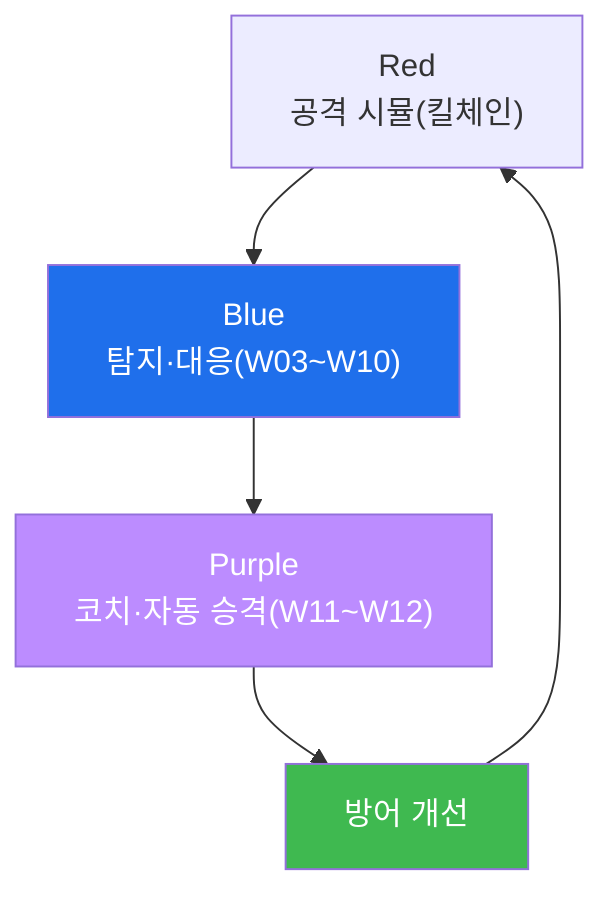

# agent-ir W15 — 기말: 종합 Purple + Mythos-readiness 개인 보고서

> **본 주차의 한 줄 요약**
>
> 마지막 주는 과목 전체를 **종합**한다. 두 가지로 마무리한다: ① **종합 Purple 훈련** — Red(공격 시뮬)→Blue
> (탐지·대응)→Purple(코치·자동 승격)의 **전체 사이클**을 한 번에 돌려, 배운 모든 것(템포 방어·킬체인 탐지·능동
> 방어·Purple 자동화)이 하나로 작동함을 확인한다. ② **Mythos-readiness 개인 보고서** — AI 시대 방어 준비도를
> **스스로 평가**한다. "우리 조직(또는 나)은 AI 속도 공격에 얼마나 준비됐나?"를 여러 차원(탐지 템포·자동화
> 수준·능동 방어·문서화·자기 개선)으로 점수화하고, 약점과 개선 계획을 적는다. 이 과목이 남기는 것은 하나의
> 확신이다: **AI 공격은 빠르지만, 방어도 에이전트로 빨라지고 스스로 개선하면 따라잡을 수 있다.** 완벽한 방어는
> 없지만, **템포를 좁히고 킬체인 어디서든 잡고 경험으로 나아지는** 방어 체계는 만들 수 있다. 그것이 agent-ir의
> 결론이자 여러분이 갖춘 역량이다.
>
> **한 줄 결론**: 종합 Purple로 전체 사이클을 검증하고, readiness 보고서로 준비도를 성찰한다. 과목의 결론 —
> **AI 속도 공격은 에이전트 방어(템포 좁히기+킬체인 탐지+자기 개선)로 따라잡는다.**

---

## 학습 목표

본 주차 종료 시 학생은 다음 5가지를 **본인 손으로** 할 수 있어야 한다.

1. Red→Blue→Purple **전체 사이클**을 통합 실행한다(PURPLE_COMPLETE).
2. AI-IR **준비도를 평가**한다(READINESS_SCORED).
3. 과목의 **3대 기둥**(템포 방어·킬체인 탐지·Purple 자동화)을 종합한다(SYNTHESIS_OK).
4. 자신의 약점·개선 계획을 제시한다.
5. 과목 관통 결론(에이전트 방어로 AI 속도 따라잡기)을 설명한다.

> **이 주차의 시선** — 배운 모든 것을 하나의 사이클로 돌리고, 준비도를 성찰하며 마친다.

---

## 0. 용어 해설 (종합)

| 용어 | 관련 주차 | 종합에서의 역할 |
|------|-----------|------------------|
| **종합 Purple** | W11~W12 | Red→Blue→Purple 전체 |
| **readiness** | 전 과목 | 준비도 자기 평가 |
| **탐지 템포** | W01·W09 | 얼마나 빨리 잡나 |
| **자기 개선** | W12 | 경험→playbook |
| **3대 기둥** | 전 과목 | 템포·킬체인·자동화 |

---

## 0.5 과목 종합 — 3대 기둥

### 0.5.1 전체 사이클

Red가 공격하고, Blue가 막고, Purple이 그 경험을 자동 방어로 굳힌다. 이 사이클이 돌수록 방어가 나아진다 —
자기 개선하는 방어 체계.

### 0.5.2 3대 기둥

- **① 템포 방어**(W01·W03·W09): AI 속도에 맞선 조기·실시간 탐지. 공격보다 빠르게.
- **② 킬체인 탐지**(W02~W07): 정찰~유출 어느 단계든 잡는 다층·다단계 탐지. 어디서든 끊는다.
- **③ Purple 자동화**(W10~W12): 능동 방어+코치+자동 승격으로 스스로 나아지는 방어. 경험으로 개선.
세 기둥이 함께 서야 AI 속도 공격을 따라잡는다.

### 0.5.3 readiness — 준비도를 정직히

readiness 평가는 **정직**해야 한다. "탐지 룰이 있다"가 아니라 "AI 속도(분 단위)를 따라잡나?", "킬체인 전
단계를 커버하나?", "경험으로 자동 개선되나?"를 냉정히 점수화. 약점을 숨기지 않고 드러내야 개선 계획이 나온다.
readiness는 자랑이 아니라 **개선의 출발점**이다.

### 0.5.4 완벽하지 않아도 이긴다

이 과목의 철학: **완벽한 방어는 없다.** 하지만 (1) 템포를 좁히고(공격 개발 3시간 안에 탐지), (2) 킬체인
어디서든 잡고(한 단계 놓쳐도 다음에서), (3) 경험으로 나아지면(같은 공격은 두 번 안 통함) — **충분히 이긴다.**
공격자 비용을 올리고 방어 속도를 높이는 **경제·템포 싸움**이다.

### 0.5.5 여러분이 갖춘 것

W01의 "AI 속도가 방어를 무너뜨린다"는 위기의식에서 시작해, W15의 "에이전트 방어로 따라잡는다"는 확신으로
마친다. 여러분은 이제 AI 공격의 각 단계를 탐지하고, 실시간 룰을 짜고, 능동 방어를 펴고, Purple로 자동화하며,
사고를 문서화·환류할 수 있다. AI 시대의 방어자로서의 역량 — 그것이 이 과목이 남기는 것이다.

---

## 1. 기말 실습 안내 (5 미션 — 종합)

실행 위치 el34 **호스트**(`ssh ccc@{{TARGET_IP}}`), GPU `http://211.170.162.139:10934`.

### STEP 1 — GPU 헬스체크 → GEN_OK
### STEP 2 — 종합 Purple 사이클 → PURPLE_COMPLETE
### STEP 3 — 준비도 평가 → READINESS_SCORED
### STEP 4 — 3대 기둥 종합 → SYNTHESIS_OK
### STEP 5 — 최종 개인 보고서 → Assessment

---

## 2. 흔한 오해·관제자 노트

- **"완벽 방어가 목표"** — 완벽은 없다. 템포·킬체인·자기개선으로 충분히 이긴다.
- **"readiness는 자랑"** — 정직한 약점 진단이 개선의 출발점.
- **"과목 끝이면 완성"** — 방어는 계속 진화. 자기 개선 루프를 계속 돌린다.
- **관제 관점** — 방어 체계가 3대 기둥(템포·킬체인·자동화)을 갖췄는지, readiness가 정직한지, 자기 개선이
  도는지 종합 평가한다. 이 과목의 모든 관제 관점의 통합이자, 조직 AI-IR 성숙도의 척도.

---

## 3. 과목을 마치며

AI Vulnerability Storm(W01)에서 시작해 종합 Purple(W15)로 마쳤다. 배운 것은 하나로 모인다: **AI 속도 공격은
에이전트 방어로 따라잡는다 — 템포를 좁히고, 킬체인 어디서든 잡고, 경험으로 스스로 나아지며, 언제나 통제(승인·
검증) 안에서.** 이 원칙으로 AI 시대의 방어자가 되길 바란다. 수고했다.
