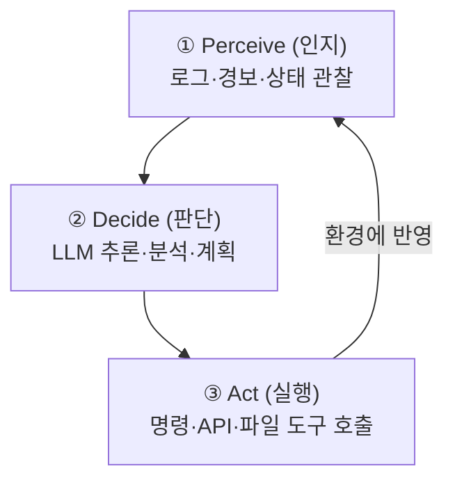

# W01 — AI 에이전트란 무엇인가: 인지·판단·실행과 첫 LLM 대화

> **한 줄 요약** — AI 에이전트는 환경을 **인지(Perceive)**하고 LLM으로 **판단(Decide)**해 도구로
> **실행(Act)**하는 자율 소프트웨어다. 이번 주는 에이전트가 전통 자동화와 무엇이 다른지 이해하고,
> el34의 로컬 LLM 서버(Ollama)에 **첫 대화를 보내** 에이전트의 "두뇌"를 직접 만져 본다.

---

## 학습 목표

- AI 에이전트의 정의와 **Perceive→Decide→Act** 순환 구조를 설명한다.
- LLM 에이전트와 전통적 자동화 스크립트의 차이를 구분한다.
- **ReAct**, **Plan-and-Execute** 등 주요 에이전트 패턴을 안다.
- 보안 분야에서 AI 에이전트가 맡는 역할(경보 분류·사고 대응·보고서 등)을 안다.
- el34의 로컬 LLM(Ollama, GPU)에 API로 질문을 보내고 응답을 다룬다.

---

## 0. 용어 해설

| 용어 | 영문 | 쉽게 말하면 | 비유 |
|------|------|------------|------|
| **AI 에이전트** | AI Agent | 환경을 보고 스스로 판단·행동하는 AI 시스템 | 현장 투입 정보요원 |
| **LLM** | Large Language Model | 대규모 텍스트로 학습한 언어 모델 | 방대한 지식의 AI 두뇌 |
| **Perceive-Decide-Act** | 인지-판단-실행 | 에이전트의 핵심 순환 | 보고→판단→행동 |
| **ReAct** | Reasoning+Acting | 추론과 행동을 번갈아 | 생각하며 움직이기 |
| **Plan-and-Execute** | 계획 후 실행 | 전체 계획 뒤 순차 실행 | 작전회의 후 출동 |
| **Tool Calling** | 도구 호출 | LLM이 외부 함수/명령을 부르는 것 | 전문가에게 전화 |
| **프롬프트** | Prompt | LLM에 주는 입력 지시문 | 업무 지시서 |
| **Ollama** | Ollama | 로컬에서 LLM을 돌리는 서버 | 사내 AI 서버 |
| **Temperature** | Temperature | 출력의 무작위성 조절값(0=결정적) | 창의성 다이얼 |
| **토큰** | Token | LLM이 처리하는 텍스트 최소 단위 | 글자 조각 |
| **컨텍스트 윈도우** | Context Window | 한 번에 처리 가능한 토큰 수 | 단기 기억 용량 |
| **환각** | Hallucination | LLM이 그럴듯한 거짓을 지어내는 것 | 자신만만한 착각 |

---

## 0.5 신입생을 위한 핵심 개념

### "자동화는 정해진 길만, 에이전트는 스스로 길을 찾는다"

전통적 **자동화 스크립트**는 `if 경보면 → IP 차단` 같은 **고정된 규칙**으로 움직입니다. 규칙에 없는
상황이 오면 멈추거나 오작동합니다. **AI 에이전트**는 다릅니다. 사람이 목표("이 경보를 분석해")만
주면, LLM이 상황을 **읽고 추론해** 다음 행동을 스스로 정합니다. 처음 보는 로그 형식, 모호한 상황도
자연어로 이해해 대응합니다.

그 대신 위험도 생깁니다 — LLM은 가끔 **환각**(없는 사실을 지어냄)을 일으킵니다. 그래서 에이전트
보안의 핵심은 "에이전트에게 얼마나 자율을 주고, 어떻게 감시·통제할 것인가"입니다. 이 과목 15주가
그 답을 쌓아 갑니다.

### Perceive → Decide → Act (이 과목 내내 쓰는 그림)



- **두뇌(Brain)** = LLM(추론), **손발(Tools)** = 명령/API 실행, **기억(Memory)** = 이전 대화 유지,
  **계획(Planning)** = 작업 분해, **하네스(Harness)** = 안전하게 제어하는 실행 틀. 다섯이 모여
  에이전트가 됩니다.

> 📌 **임의로 지은 비유 정리** — 에이전트 = **"눈(Perceive)·머리(Decide=LLM)·손(Act=Tools)을 가진
> 디지털 요원"**. 이 과목은 그 요원을 만들고, 공격하고(레드팀), 방어하고(가드레일), 감시(사고대응)하는
> 법을 배웁니다.

---

## 1. 에이전트의 정의와 구조

AI 에이전트란 **환경을 인지하고, 판단하며, 행동하는** 자율 소프트웨어입니다(위 PDA 그림). 한 번의
판단으로 끝나지 않고, 행동의 결과를 다시 인지해 **반복**하는 것이 핵심입니다.

### 1.1 전통 자동화 vs LLM 에이전트

| 구분 | 전통 자동화(스크립트) | LLM 에이전트 |
|------|----------------------|-------------|
| 판단 | if/else 규칙 고정 | 자연어 추론으로 유연 |
| 입력 | 정형 데이터만 | 비정형 텍스트(로그·경보)도 |
| 확장 | 시나리오마다 코드 수정 | 프롬프트 변경으로 대응 |
| 설명 | 코드가 곧 설명 | 추론 과정을 자연어로 |
| 위험 | 예측 가능 | **환각** 가능 |

### 1.2 보안 분야에서의 역할

| 역할 | 예시 |
|------|------|
| **경보 분류** | Wazuh 경보를 자동 분석·우선순위 지정 |
| **취약점 분석** | 새 CVE의 자사 영향 평가 |
| **사고 대응** | IP 차단·계정 잠금·증거 수집 초동 대응 |
| **정책 관리** | 트래픽 분석 → 방화벽 규칙 제안 |
| **보고서 생성** | 분석 결과를 자연어 리포트로 |

---

## 2. 에이전트 패턴 — ReAct와 Plan-and-Execute

### 2.1 ReAct (Reasoning + Acting)

추론(Thought)과 행동(Action)을 **번갈아** 합니다. 탐색적 분석·경보 대응에 적합합니다.

```
Thought: brute-force 경보 발생. 공격 IP를 확인해야 한다.
Action:  fetch_log(source="wazuh", query="rule.id:5710")
Observation: 공격 IP=203.0.113.55, 47회 시도
Thought: 임계값(20회) 초과. 차단한다.
Action:  run_command("nft add rule ... ip saddr 203.0.113.55 drop")
Observation: 규칙 추가 완료
```

### 2.2 Plan-and-Execute

전체 **계획을 먼저 세우고** 순차 실행합니다. 정기 점검·다단계 작업에 적합합니다.

```
Plan:  ①SSH 상태 ②패치 점검 ③방화벽 검토 ④에이전트 연결 ⑤보고서
Execute: ① 성공 → ② web 3대 패치 누락 발견 → ③ 성공 → ④ 정상 → ⑤ 보고서 생성
```

| 패턴 | 장점 | 단점 | 적합 |
|------|------|------|------|
| ReAct | 유연·중간결과 반영 | 방향 잃을 수 있음 | 탐색·경보 대응 |
| Plan-and-Execute | 구조적·추적 용이 | 계획 변경 어려움 | 정기 점검 |
| Hybrid | 둘의 장점 | 복잡도↑ | 실무 시스템 |

---

## 3. el34에서 LLM 다루기 — Ollama (로컬 LLM 서버)

에이전트의 두뇌인 LLM을, el34 실습에서는 **로컬 LLM 서버 Ollama**로 돌립니다. 클라우드 API가
아니라 로컬이라 **데이터 유출 위험을 원천 차단**하는 것이 보안 교육의 핵심 장점입니다.

| 항목 | 값 |
|------|-----|
| LLM 엔드포인트(GPU) | `http://211.170.162.139:10934` (GlobalProtect VPN 경유, el34 호스트에서 도달) |
| 기본 실습 모델 | `gemma3:4b` (빠르고 가벼움) — 공격 실습엔 취약 모델 `ccc-unsafe:2b` |
| 네이티브 API | `/api/generate`(단발), `/api/chat`(멀티턴 메시지) |
| OpenAI 호환 API | `/v1/chat/completions` |

### 3.1 첫 대화 — /api/generate

```bash
curl -s http://211.170.162.139:10934/api/generate \
  -d '{"model":"gemma3:4b","prompt":"Explain agent fundamentals in cybersecurity in 3 sentences","stream":false,"options":{"num_predict":80}}' \
 | python3 -c "import sys,json; print(json.load(sys.stdin)['response'])"
```

- `model` = 사용할 LLM, `prompt` = 질문, `stream:false` = 한 번에 완성 응답,
  `num_predict` = 생성할 토큰 수(짧게 잡으면 빠름).
- 응답 JSON의 `response` 필드에 답이 들어 있습니다.

### 3.2 역할이 있는 대화 — /api/chat

`messages` 배열에 **system**(역할 지정)과 **user**(질문)를 넣습니다.

```bash
curl -s http://211.170.162.139:10934/api/chat \
  -d '{"model":"gemma3:4b","messages":[{"role":"system","content":"You are a security auditor."},{"role":"user","content":"Analyze this policy: no auth on LLM API"}],"stream":false,"options":{"num_predict":100}}' \
 | python3 -c "import sys,json; print(json.load(sys.stdin)['message']['content'])"
```

system 메시지를 "해커 관점"으로 바꾸면 응답 어조가 달라집니다 — **역할(system)이 에이전트의 성격을
정한다**는 것을 체감하세요.

### 3.3 Temperature — 창의성 다이얼

`options.temperature`는 출력의 무작위성입니다. **0**이면 같은 질문에 거의 같은 답(결정적, 분석·채점에
적합), **1.0**이면 매번 다른 답(브레인스토밍에 적합). 보안 자동화는 보통 **낮은 temperature**(재현성)를 씁니다.

---

## 4. 에이전트 보안의 출발점 — 가드레일과 모니터링

에이전트에게 도구(명령 실행)를 주는 순간, **위험한 입출력을 거르는 가드레일**이 필요합니다. 가장
단순한 형태는 **입출력 필터**입니다(규칙 기반).

```python
rules = [(r"password|secret","credentials"), (r"rm\s+-rf|drop\s+table","destructive")]
def guardrail(text):
    for pat, name in rules:
        if re.search(pat, text, re.I): return f"FLAGGED({name})"
    return "ALLOWED"
```

또 운영자는 에이전트의 **요청 수·토큰 사용·오류율** 같은 메트릭을 모니터링해 이상 징후(폭주·반복
실패)를 잡습니다. 이번 주 실습에서 가드레일과 모니터링의 최소형을 직접 만들어 봅니다. (정교한
가드레일·프롬프트 인젝션 방어는 ai-safety 트랙에서 깊게 다룹니다.)

---

## 실습 안내

이번 주 실습(`lab_week01.yaml`, 8단계)은 el34의 GPU Ollama로 직접 합니다. 4개 축:

1. **왜(목적)** — 왜 로컬 LLM인가(데이터 유출 차단), 왜 에이전트인가(유연한 판단).
2. **무엇을(호출)** — `/api/generate`·`/api/chat`로 LLM에 질문·역할 부여·정책 분석을 시킨다.
3. **해석(분석)** — 응답을 파싱(`response`/`message.content`)하고, 위험 분석·리스크 평가에 활용한다.
4. **실전(방어)** — 프롬프트 인젝션을 시도(SAFE/LEAK 판별)하고, 가드레일·모니터링·평가 보고서를 만든다.

> 🧪 모든 LLM 호출은 `http://211.170.162.139:10934`(GPU Ollama)로 가며, 답안은 el34 호스트에서
> 실행됩니다. 응답은 비결정적이라 표현이 매번 다를 수 있으나, 호출 성공·파이프라인 동작을 기준으로 확인합니다.

---

## 흔한 오해

- ❌ **"에이전트 = 더 똑똑한 자동화"** → 아니다. 자동화는 고정 규칙, 에이전트는 **추론으로 판단**한다. 유연한 대신 환각 위험이 있다.
- ❌ **"LLM 응답은 항상 같다"** → temperature>0이면 매번 다르다. 재현성이 필요하면 0으로.
- ❌ **"로컬 LLM은 약하다"** → 약할 수 있지만 **데이터가 밖으로 안 나간다**는 결정적 보안 이점이 있다.
- ❌ **"에이전트에게 명령 실행 권한을 다 줘도 된다"** → 절대 안 된다. 가드레일·샌드박스·최소권한이 필수다(이 과목의 큰 주제).
- ❌ **"환각은 드물다"** → 흔하다. 그래서 에이전트 출력은 항상 **검증(verify) 단계**를 거쳐야 한다.

---

## 예고 — W02

W01이 "에이전트가 무엇이고 LLM을 어떻게 부르나"였다면, W02는 **에이전트에게 도구(Tool)를 쥐어
준다**. LLM이 스스로 "어떤 명령을 실행할지" 정하고(function calling), 그 결과를 다시 읽어 다음
행동을 정하는 **ReAct 루프를 직접 구현**한다. 도구를 주는 순간 생기는 보안 문제(임의 명령 실행)도 함께 본다.
