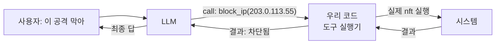

# W02 — LLM API와 Tool Calling: 에이전트에게 손을 달다

> **한 줄 요약** — W01의 에이전트는 "말만" 했다. 이번 주는 에이전트에게 **도구(Tool)**를 쥐어 준다.
> LLM이 스스로 "어떤 도구를 어떤 인자로 호출할지" 정하는 **Tool Calling(function calling)**을 이해하고,
> Ollama API의 메시지 구조·생성 매개변수를 다뤄 도구를 부르는 에이전트를 만든다. 도구를 주는 순간
> 생기는 **보안 위험**(임의 명령 실행)도 함께 본다.

---

## 학습 목표

- Ollama API(`/api/generate`, `/api/chat`, OpenAI 호환 `/v1`)의 구조와 매개변수를 이해한다.
- **system / user / assistant** 메시지 역할을 정확히 구분한다.
- `temperature`, `top_p`, `num_predict`(max tokens) 등 생성 매개변수를 실험한다.
- **Tool Calling(function calling)**의 개념과 흐름을 이해하고 직접 구현한다.
- 도구를 가진 에이전트의 **보안 위험**(과잉 권한·임의 명령)을 안다.

---

## 0. 용어 해설

| 용어 | 영문 | 쉽게 말하면 | 비유 |
|------|------|------------|------|
| **Tool / Function** | Tool | 에이전트가 부를 수 있는 외부 기능(명령·API) | 요원이 쓰는 장비 |
| **Tool Calling** | Function Calling | LLM이 "어떤 도구를 어떤 인자로" 부를지 정하는 것 | 상담원이 전문가에게 전화 |
| **Tool Schema** | Tool Schema | 도구의 이름·설명·인자 명세(JSON) | 장비 사용설명서 |
| **메시지 역할** | role | system(지시)·user(질문)·assistant(답·도구호출) | 대본의 배역 |
| **top_p** | nucleus sampling | 누적확률 상위 토큰만 후보로 | 보기 범위 좁히기 |
| **num_predict** | max tokens | 생성할 최대 토큰 수 | 답변 길이 상한 |
| **stop** | stop sequence | 이 문자열이 나오면 생성 중단 | 마침표 신호 |
| **JSON 모드** | structured output | 응답을 JSON 형식으로 강제 | 정해진 양식으로 답하기 |
| **과잉 권한** | over-privilege | 도구에 필요 이상의 권한을 준 상태 | 인턴에게 마스터키 |

---

## 0.5 신입생을 위한 핵심 개념

### "LLM은 말을 만들 뿐, 도구가 일을 한다"

LLM은 텍스트를 생성할 뿐 **스스로 명령을 실행하지 못합니다.** 그럼 어떻게 에이전트가 "IP를
차단"할까요? 답은 **Tool Calling**입니다. 우리가 LLM에게 "너는 `block_ip(ip)`, `read_log(file)`
같은 도구를 쓸 수 있어"라고 **도구 목록(schema)**을 알려 주면, LLM은 상황을 보고 **"`block_ip`를
`203.0.113.55`로 호출해줘"**라는 **구조화된 출력**을 냅니다. 그러면 **우리 코드**가 그 도구를 실제로
실행하고, 결과를 다시 LLM에게 돌려줍니다.



> 📌 **핵심 구분** — **LLM은 "무엇을 할지 제안"**하고, **실행은 항상 우리 코드(도구 실행기)가**
> 합니다. 이 분리가 보안의 출발점입니다: LLM이 위험한 도구 호출을 제안해도, **실행기에서 막을 수
> 있기** 때문입니다(가드레일). LLM에게 직접 셸을 주면(분리 없이) 재앙입니다.

### 도구를 주는 순간의 위험

도구는 양날의 검입니다. `run_command(cmd)` 같은 만능 도구를 주면 LLM이 **임의 명령을 실행**할 수
있습니다 — 프롬프트 인젝션 한 줄로 `rm -rf /`가 실행될 수도 있습니다. 그래서 도구는 **최소 권한**
(꼭 필요한 것만, 좁은 인자만)으로 설계하고, 실행기에서 **검증**해야 합니다. 이번 주 실습에서 도구
선택과 가드레일을 함께 연습합니다.

---

## 1. Ollama API 구조 다시 보기

W01에서 본 두 엔드포인트를 매개변수까지 깊게 봅니다(LLM 엔드포인트: `http://211.170.162.139:10934`).

### 1.1 메시지 역할 (/api/chat)

```json
{"model":"gemma3:4b","messages":[
  {"role":"system","content":"역할·규칙을 정함 (에이전트의 성격)"},
  {"role":"user","content":"사용자 질문"},
  {"role":"assistant","content":"이전 LLM 답 (멀티턴 시 기록)"}
]}
```

- **system**: 에이전트의 정체성·규칙·도구 목록을 박는 자리. 가장 강한 지시.
- **user**: 사용자 입력. ⚠️ **인젝션이 들어오는 통로** — system을 덮어쓰려는 시도가 여기 온다.
- **assistant**: LLM의 이전 응답(메모리). 멀티턴 대화는 이 배열을 누적해 유지한다.

### 1.2 생성 매개변수 (options)

| 매개변수 | 효과 | 보안 에이전트 권장 |
|----------|------|--------------------|
| `temperature` | 무작위성(0=결정적) | **0~0.2**(재현성·일관성) |
| `top_p` | 후보 토큰 범위 | 0.9 기본 |
| `num_predict` | 최대 생성 토큰 | 작업에 맞게(짧게=빠름) |
| `stop` | 중단 문자열 | 구조화 출력 경계에 활용 |

분석·채점·자동화에는 **낮은 temperature**가 핵심입니다 — 같은 입력에 같은 판단을 내려야 신뢰할 수 있습니다.

---

## 2. Tool Calling — 흐름과 구현

### 2.1 네 단계 흐름

1. **도구 명세 제공** — system에 "쓸 수 있는 도구"를 알려 준다(이름·설명·인자).
2. **LLM이 도구 선택** — 상황을 보고 "어떤 도구를 어떤 인자로" 호출할지 구조화 출력.
3. **실행기가 실행** — 우리 코드가 그 도구를 (검증 후) 실제 실행.
4. **결과 반환** — 실행 결과를 LLM에 돌려주고, LLM이 다음 행동/최종 답을 낸다.

### 2.2 가장 단순한 구현 — "도구 선택" 시키기

정식 function-calling API가 없어도, **프롬프트로 도구를 고르게** 할 수 있습니다(소형 모델에 유용).

```bash
curl -s http://211.170.162.139:10934/api/generate \
 -d '{"model":"gemma3:4b","prompt":"Tools: port_scan, read_log, block_ip. Task: a host is brute-forcing SSH. Which ONE tool? Answer only the tool name.","stream":false,"options":{"temperature":0,"num_predict":10}}' \
 | python3 -c "import sys,json; print(json.load(sys.stdin)['response'].strip())"
```

LLM이 `block_ip`를 고르면, **우리 코드**가 `block_ip()`를 실행합니다. 이것이 tool calling의 본질입니다.

### 2.3 실행기에서의 검증 (가드레일)

```python
ALLOWED = {"port_scan", "read_log", "block_ip"}   # 화이트리스트
def dispatch(tool, arg):
    if tool not in ALLOWED:          # ① 허용 도구만
        return "DENIED: unknown tool"
    if tool == "block_ip" and not is_valid_ip(arg):  # ② 인자 검증
        return "DENIED: bad arg"
    return run_tool(tool, arg)       # ③ 통과한 것만 실행
```

LLM의 제안을 **그대로 실행하지 않고** 화이트리스트·인자 검증을 거칩니다. "LLM은 제안, 실행기는
검문소"라는 W02의 핵심입니다.

---

## 3. 보안 관점 — 도구는 공격 표면이다

| 위험 | 설명 | 방어 |
|------|------|------|
| **임의 명령 실행** | `run_command` 같은 만능 도구 | 도구를 잘게 쪼개고 만능 도구 금지 |
| **과잉 권한** | 도구가 필요 이상 권한 보유 | 최소 권한·읽기 전용 우선 |
| **인젝션→도구 오용** | user 입력이 위험 도구 호출 유도 | 실행기 화이트리스트·인자 검증 |
| **인자 주입** | `block_ip("1.2.3.4; rm -rf /")` | 인자 타입·형식 엄격 검증 |

> **황금률:** 에이전트에게 도구를 줄 때는 "이 도구가 **최악의 경우** 무엇을 할 수 있나"를 먼저
> 묻습니다. `read_log`는 최악이라도 정보 노출, `run_command`는 최악이면 시스템 파괴 — 그래서 후자는
> 거의 항상 금지하고, 좁은 전용 도구로 대체합니다.

---

## 실습 안내

이번 주 실습(`lab_week02.yaml`, 8단계)은 el34 GPU Ollama로 합니다. 4개 축:

1. **왜(목적)** — 왜 LLM에 도구가 필요한가(말→실행), 왜 실행을 분리하나(안전).
2. **무엇을(호출)** — `/api/generate`·`/api/chat`로 도구 사용 개념을 질의하고, LLM에게 **도구를 고르게** 한다.
3. **해석(분석)** — 도구 정책의 취약점을 LLM으로 감사하고, 위험도를 평가한다.
4. **실전(방어)** — 인젝션으로 도구 오용을 시도(SAFE/LEAK)하고, 화이트리스트 가드레일·모니터링·보고서를 만든다.

> 🧪 LLM 호출은 `http://211.170.162.139:10934`(gemma3:4b). 응답은 비결정적이라 표현은 달라도, 호출 성공·파이프라인 동작·결정적 마커로 확인합니다.

---

## 흔한 오해

- ❌ **"LLM이 직접 명령을 실행한다"** → 아니다. LLM은 "무엇을 호출할지" **제안**만 하고, 실행은 우리 코드(실행기)가 한다.
- ❌ **"도구를 많이 줄수록 똑똑하다"** → 위험하다. 도구는 공격 표면. **최소 권한·전용 도구**가 원칙.
- ❌ **"function-calling API가 없으면 도구를 못 쓴다"** → 프롬프트로 도구를 고르게 하면 소형 모델도 가능하다.
- ❌ **"화이트리스트면 안전"** → 도구 자체는 화이트리스트, 그러나 **인자(arg)**도 검증해야 한다(인자 주입).
- ❌ **"temperature는 품질 다이얼"** → 무작위성 다이얼이다. 자동화는 낮게(재현성).

---

## 예고 — W03

W02에서 에이전트에게 도구(손)를 줬다. W03은 **메모리(Memory)와 컨텍스트 관리**다. 에이전트가 여러
턴에 걸쳐 대화·작업을 **기억**하고, 한정된 컨텍스트 윈도우를 효율적으로 쓰는 법, 그리고 메모리에
스며드는 보안 위험(오염된 기억·민감정보 잔류)을 다룬다.
