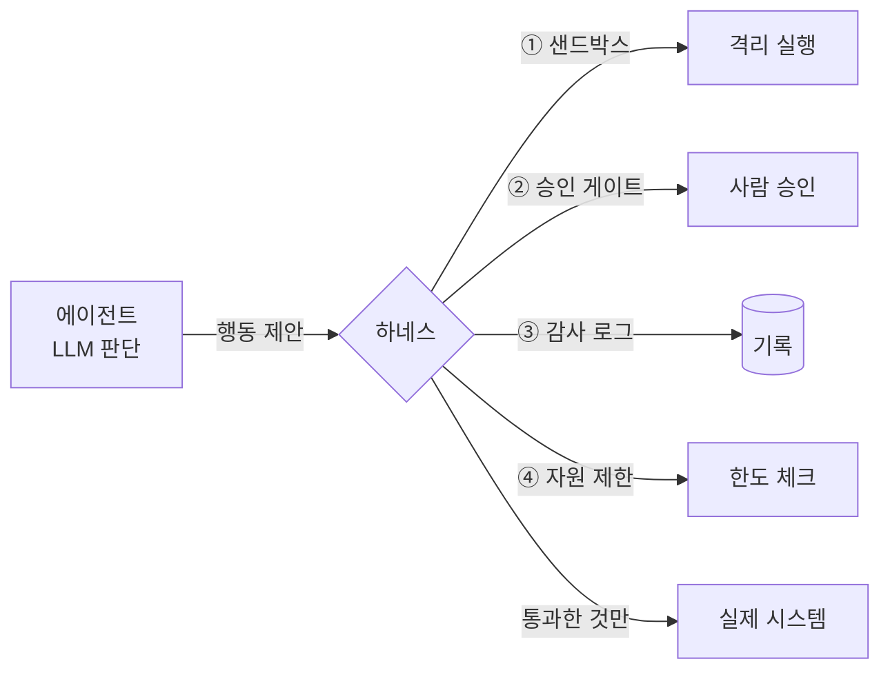

# W04 — 에이전트 하네스 개론: 에이전트를 안전하게 가두는 틀

> **한 줄 요약** — 똑똑한 에이전트도 통제 없이 풀어두면 위험하다. **하네스(Harness)**는 에이전트의
> 모든 행동(도구 호출·명령 실행)을 **중개·검증·기록**하는 실행 틀이다. 이번 주는 하네스의 4대
> 기능(샌드박스·승인 게이트·감사 로그·자원 제한)을 이해하고, el34의 실제 하네스(bastion)가 미션을
> 어떻게 통제·기록하는지 본다.

---

## 학습 목표

- 하네스의 정의와 **왜 필요한가**(에이전트 자율성의 통제)를 설명한다.
- 하네스의 4대 기능 — **샌드박스·승인 게이트·감사 로그·자원 제한**을 안다.
- **위험도 기반 승인**(읽기=자동, 변경=승인 필요)의 원리를 적용한다.
- el34의 자율 에이전트 하네스(bastion)가 행동을 기록하는 방식을 안다.
- 하네스 없는 에이전트의 위험(통제 불능·감사 불가)을 설명한다.

---

## 0. 용어 해설

| 용어 | 영문 | 쉽게 말하면 | 비유 |
|------|------|------------|------|
| **하네스** | Harness | 에이전트의 실행을 제어·기록하는 프레임워크 | 안전벨트 + 계기판 |
| **샌드박스** | Sandbox | 격리된 환경에서만 실행하게 가둠 | 방탄유리 작업실 |
| **승인 게이트** | Approval Gate | 위험한 행동은 사람 승인을 받게 함 | 결재 라인 |
| **감사 로그** | Audit Log | 누가 언제 무엇을 했는지 전부 기록 | 출입 기록부 |
| **자원 제한** | Rate/Resource Limit | 호출 수·시간·비용 상한 | 사용 한도 |
| **휴먼인더루프** | Human-in-the-loop | 사람이 중간에 확인·개입 | 운전 보조 |
| **위험도 기반 정책** | Risk-based Policy | 행동 위험도에 따라 처리 차등 | 등급별 보안검색 |
| **드라이런** | Dry-run | 실제 실행 전 시뮬레이션 | 리허설 |
| **롤백** | Rollback | 잘못된 변경을 되돌림 | 실행 취소 |

---

## 0.5 신입생을 위한 핵심 개념

### "하네스 없는 에이전트는 브레이크 없는 자동차다"

W01~W03에서 에이전트에게 두뇌(LLM)·손(도구)·정밀 지시(프롬프트)를 줬습니다. 그런데 이 에이전트가
**아무 제약 없이** 명령을 실행하면? 환각으로 `rm -rf /`를 실행하거나, 인젝션에 속아 비밀을 유출하거나,
무한 루프로 자원을 태웁니다. **하네스**는 에이전트와 실제 시스템 사이에 서서, 모든 행동을 **걸러내고
기록하는 관문**입니다.



> 📌 **핵심** — W02의 "실행기(dispatch)"를 본격 확장한 것이 하네스입니다. 실행기가 "이 도구 호출을
> 허용할까"라면, 하네스는 거기에 **격리·승인·기록·한도**를 더한 **완전한 통제 계층**입니다.

### el34의 실제 하네스 — bastion

el34에는 실제 자율 보안 에이전트 **bastion**이 있습니다(Wazuh 특강 W02에서 본 그 에이전트). bastion은
미션을 받으면 **모든 단계(수신→계획→도구실행→완료)를 syslog로 SIEM에 기록**합니다 — 이것이 감사
로그입니다. 또 위험 키워드(`MASQUERADE`·`drop counter` 등)가 든 미션은 **고위험 경보(rule 100204)**로
즉시 떠서 사람이 확인하게 합니다 — 이것이 승인/감시 게이트의 실제 사례입니다.

---

## 1. 하네스의 4대 기능

### 1.1 샌드박스 (격리)

에이전트의 도구 실행을 **격리된 환경**(컨테이너·제한 셸·읽기전용 FS)에 가둡니다. 최악의 경우라도
피해가 그 안에 머뭅니다. "최소 권한"의 물리적 구현입니다.

### 1.2 승인 게이트 (위험도 기반)

모든 행동에 사람 승인을 받으면 자율성이 없습니다. 그래서 **위험도로 차등**합니다.

| 행동 위험도 | 예 | 처리 |
|------------|----|------|
| 읽기(낮음) | 로그 조회, 상태 확인 | **자동 승인** |
| 변경(중간) | 설정 수정, 파일 쓰기 | **로그 + 알림** |
| 파괴(높음) | 삭제, 차단 룰, 계정 잠금 | **사람 승인 필수** |

### 1.3 감사 로그

에이전트의 **모든 행동을 기록**합니다 — 무엇을, 왜(추론), 어떤 결과로. 사고 후 "에이전트가 무슨
짓을 했나"를 추적하는 유일한 근거입니다. bastion의 lifecycle 로그가 그 예입니다.

### 1.4 자원 제한

호출 수·실행 시간·토큰/비용에 **상한**을 둡니다. 무한 루프(자가 수정 폭주)나 비용 폭탄을 막습니다.

---

## 2. 위험도 기반 승인 — 핵심 원리

하네스의 심장은 **"이 행동을 자동으로 해도 되나, 사람을 불러야 하나"**를 가르는 정책입니다. 행동의
**되돌릴 수 있음(가역성)**과 **영향 범위**로 판단합니다.

- **가역적 + 좁은 영향** → 자동 (예: 로그 읽기)
- **비가역적 또는 넓은 영향** → 승인 (예: `rm`, 방화벽 차단, 계정 잠금)

```python
HIGH_RISK = ["delete","drop","block","rm ","shutdown","reset"]
def gate(action):
    if any(k in action.lower() for k in HIGH_RISK):
        return "REQUIRE_APPROVAL"   # 사람 호출
    return "AUTO_APPROVE"           # 자동 실행
```

이 단순한 게이트만으로도 "에이전트가 멋대로 파괴적 행동"을 막습니다. 실무에선 여기에 드라이런·롤백을 더합니다.

---

## 3. 하네스 없는 에이전트의 위험

| 위험 | 하네스 없을 때 | 하네스 있을 때 |
|------|----------------|----------------|
| 환각 파괴 행동 | `rm -rf /` 그대로 실행 | 승인 게이트가 차단 |
| 인젝션 악용 | 도구 오용 무방비 | 샌드박스·화이트리스트 |
| 추적 불가 | 무슨 일 했는지 모름 | 감사 로그로 재구성 |
| 자원 폭주 | 무한 루프·비용 폭탄 | 자원 제한 |

> **결론:** 에이전트의 "똑똑함"보다 하네스의 "통제력"이 운영 안전을 결정합니다. 자율성과 통제는
> 트레이드오프이며, 하네스는 그 균형점을 코드로 구현한 것입니다.

---

## 실습 안내

이번 주 실습(`lab_week04.yaml`, 8단계)은 el34 GPU Ollama(gemma3:4b)로 합니다. 4개 축:

1. **왜(목적)** — 왜 하네스인가(통제 없는 자율의 위험), 4대 기능의 역할.
2. **무엇을(구현)** — LLM에 하네스 개념을 질의하고, 위험도 기반 승인 게이트를 구현한다.
3. **해석(분석)** — 하네스 정책의 허점을 LLM으로 감사한다.
4. **실전(방어)** — 위험 행동을 승인 게이트로 분류하고, 샌드박스 화이트리스트로 차단한다.

> 🧪 LLM 호출은 `http://211.170.162.139:10934`(gemma3:4b). 호출 성공·결정적 마커로 확인합니다.

---

## 흔한 오해

- ❌ **"하네스는 성능을 떨어뜨리는 족쇄"** → 통제 없는 자율은 운영 불가능하다. 하네스가 있어야 자율을 **신뢰**할 수 있다.
- ❌ **"모든 행동에 승인받으면 안전"** → 자율성이 사라진다. **위험도 기반 차등**이 핵심.
- ❌ **"감사 로그는 사고 후에나 본다"** → 실시간 모니터링으로 진행 중 공격도 잡는다(bastion 100204).
- ❌ **"샌드박스면 무조건 안전"** → 샌드박스 탈출·과잉 권한이 있으면 무력. 최소 권한과 함께.
- ❌ **"하네스 = 도구 실행기"** → 실행기는 일부. 하네스는 격리+승인+기록+한도의 **통제 계층 전체**.

---

## 예고 — W05

하네스의 개념을 배웠으니, W05는 **서버 사이드 하네스를 직접 구축**한다 — el34의 bastion처럼 미션을
받아 SubAgent에 도구를 시키고 결과를 판정·기록하는 하네스의 뼈대를 만든다. API·SubAgent·감사 로그
연동을 실제로 엮어 본다.
