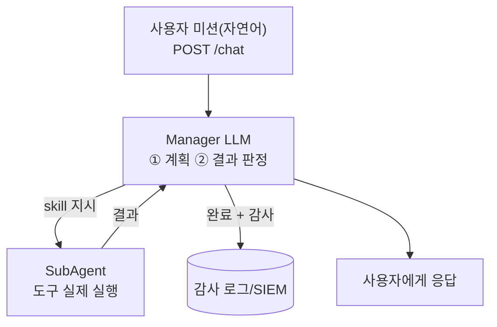

# W05 — 서버 사이드 하네스 구축 (1): Bastion 아키텍처

> **한 줄 요약** — W04에서 하네스의 개념을 배웠다. 이번 주는 **서버에서 돌아가는 하네스**의 뼈대를
> 직접 그린다. 사용자의 자연어 미션을 받아(API) → **Manager LLM이 계획**하고 → **SubAgent가 도구를
> 실행**하고 → **결과를 판정·기록**하는 구조다. el34의 실제 서버 하네스 **bastion**을 해부해, 각
> 단계가 어떻게 통제·기록되는지 본다.

---

## 학습 목표

- 서버 사이드 하네스의 구성요소(API·Manager·SubAgent·감사)를 설명한다.
- **Manager–SubAgent 계층 구조**(계획 vs 실행 분리)의 이유를 안다.
- 미션 생애주기(수신→계획→실행→판정→완료)와 **request_id 상관**을 이해한다.
- el34 bastion의 API(`/health`, `/chat`)와 lifecycle 기록 방식을 안다.
- 하네스가 미션을 **감사 로그**로 남기는 이유와 보안 가치를 설명한다.

---

## 0. 용어 해설

| 용어 | 영문 | 쉽게 말하면 | 비유 |
|------|------|------------|------|
| **서버 사이드 하네스** | Server-side Harness | 서버에서 미션을 받아 실행·통제하는 에이전트 런타임 | 본부 관제실 |
| **Manager** | Manager LLM | 미션을 해석해 계획·판정하는 두뇌 | 작전 팀장 |
| **SubAgent** | SubAgent | Manager 지시(skill)를 실제 실행하는 하위 에이전트 | 현장 요원 |
| **skill** | skill | SubAgent가 쓰는 도구 한 종류(shell 등) | 요원의 장비 |
| **미션 생애주기** | lifecycle | 미션 1건이 거치는 단계들 | 착수~보고 |
| **request_id** | request_id | 미션 1건의 고유 ID(모든 단계 로그에 박힘) | 사건 번호 |
| **자가 수정** | self-correct | 실패 시 스스로 방법을 바꿔 재시도 | 재시도 |
| **headless API** | headless | 화면 없이 HTTP로만 쓰는 인터페이스 | 무인 접수창구 |

---

## 0.5 신입생을 위한 핵심 개념

### "Manager는 머리, SubAgent는 손 — 나누는 이유"

하나의 LLM이 계획도 하고 실행도 하면, 위험합니다 — 계획 단계의 환각이 곧장 실행됩니다. 그래서 서버
하네스는 **두 층으로 나눕니다.**



- **Manager**(큰 모델)는 "무엇을 할지" 정하고 결과가 맞는지 **판정**합니다.
- **SubAgent**(작은 모델/실행기)는 Manager가 시킨 것만 **실행**합니다.
- 모든 단계는 **request_id**로 묶여 감사 로그에 남습니다.

> 📌 **핵심** — 계획(Manager)과 실행(SubAgent)을 나누면, 실행 직전에 한 번 더 **검문**할 수 있고
> (W04의 승인 게이트가 여기 들어감), 무엇이 잘못됐는지 **단계별로 추적**할 수 있습니다.

### el34의 실제 서버 하네스 — bastion

el34의 `el34-bastion`이 바로 이 구조입니다(Wazuh 특강 W02에서 로그를 분석했던 그 에이전트).

| 구성 | el34 bastion |
|------|--------------|
| API | `http://el34-bastion:9100` (`/health`, `/chat`, X-API-Key) |
| Manager LLM | gpt-oss:120b (계획·판정) |
| SubAgent LLM | qwen3:8b (실행) |
| 감사 | 모든 단계를 syslog로 SIEM(10.20.32.100)에 — rule.id 100211~100218 |
| 안전 | 위험 미션은 rule.id 100204(level 10)로 경보 |

우리는 이 구조를 **개념적으로 재현**해 보며, 서버 하네스가 어떻게 통제·기록을 내장하는지 익힙니다.

---

## 1. 서버 하네스의 4구성요소

### 1.1 API 계층 (접수)

미션을 HTTP로 받습니다(headless). 인증(API Key)·rate limit·입력 검증이 여기 들어갑니다. bastion은
`POST /chat`으로 `{message, course, ...}`를 받고 request_id를 발급합니다.

### 1.2 Manager (계획·판정)

미션을 해석해 **계획**을 세우고, SubAgent의 실행 결과를 **판정**(성공/실패/재시도)합니다. 큰 모델을
쓰는 이유는 추론 품질 때문이고, 그래서 **느립니다**(bastion 미션 ~227초의 대부분이 이 계획 시간).

### 1.3 SubAgent (실행)

Manager의 skill 지시(예: `shell: nft list ruleset`)를 **실제 실행**합니다. 여기에 W04의 샌드박스·승인
게이트가 적용됩니다.

### 1.4 감사 (기록)

수신→계획→실행→완료의 **모든 단계를 로그**로 남깁니다. request_id로 묶여 한 미션의 전 과정을 시간순
재구성할 수 있습니다(Wazuh 특강 W02에서 본 timeline).

---

## 2. 미션 생애주기와 request_id 상관

한 미션은 여러 단계를 거치고, 모든 단계 로그에 같은 **request_id**가 박힙니다.

```
request.received  (수신)   req=aae0... user_prompt="fw 룰 확인"
 → lookup_decision (KG 결정) decision=new
 → skill_start/result × N   skill=shell success=true
 → request.completed (완료)
 + audit 요약: duration_ms, outcome
```

운영자는 request_id로 "이 미션이 무엇을·왜·얼마나 걸려·안전하게 했는가"를 한 화면에서 봅니다. 이것이
**하네스가 감사 로그를 내장하는 이유**입니다 — 자율 에이전트는 추적 가능해야 신뢰할 수 있습니다.

---

## 3. 왜 서버 사이드인가

| 측면 | 서버 하네스 | 클라이언트(로컬) 하네스 |
|------|------------|------------------------|
| 통제 | 중앙에서 정책 일괄 적용 | 각 클라이언트마다 |
| 감사 | 모든 미션 중앙 기록 | 분산 |
| 자원 | GPU LLM 공유 | 로컬 자원 한계 |
| 보안 | API 인증·격리 일원화 | 통제 어려움 |

서버 하네스는 **여러 사용자·미션을 중앙에서 통제·감사**하기에 적합합니다(SOC 운영에 맞음). W07에서
다룰 클라이언트 사이드 하네스(Claude Code 등)와 대비됩니다.

---

## 실습 안내

이번 주 실습(`lab_week05.yaml`, 8단계)은 el34 GPU Ollama(gemma3:4b)로 서버 하네스의 **핵심 루프를
재현**합니다. 4개 축:

1. **왜(목적)** — 왜 Manager–SubAgent를 나누나, 왜 중앙 감사인가.
2. **무엇을(구현)** — Manager 역할 LLM에 미션 계획을 시키고, SubAgent 실행을 시뮬레이션한다.
3. **해석(분석)** — 하네스 정책을 감사하고, request_id 상관을 재현한다.
4. **실전(통제)** — 실행 전 승인 게이트를 적용하고, 미션을 감사 로그로 남긴다.

> 🧪 LLM 호출은 `http://211.170.162.139:10934`(gemma3:4b). 실제 el34 bastion 미션은 수백 초가 걸리므로,
> 이번 실습은 하네스 루프를 가볍게 재현해 개념을 확인합니다(bastion 실연동은 agent-ir 트랙에서).

---

## 흔한 오해

- ❌ **"Manager 하나면 충분"** → 계획과 실행을 나눠야 실행 직전 검문·단계별 추적이 가능하다.
- ❌ **"큰 모델이 항상 좋다"** → Manager는 품질 위해 큰 모델, SubAgent는 속도/비용 위해 작은 모델 — 역할 분담.
- ❌ **"감사 로그는 부가 기능"** → 자율 에이전트의 **필수**. 추적 불가능한 에이전트는 운영 불가.
- ❌ **"미션은 즉시 끝난다"** → 큰 Manager LLM 계획에 수백 초 걸린다(bastion 실측 ~227초).
- ❌ **"서버 하네스가 항상 정답"** → 개인 작업엔 클라이언트 하네스가 낫다(W07). 용도에 따라.

---

## 예고 — W06

서버 하네스의 뼈대를 세웠으니, W06은 **Playbook과 강화(RL) 요소**를 더한다 — 반복되는 미션을
playbook으로 재사용하고, 과거 경험(KG)으로 더 빠르고 안정적으로 처리하는 법을 다룬다(bastion의
KG-2 Reuse / KG-3 Adapt가 그 예).
