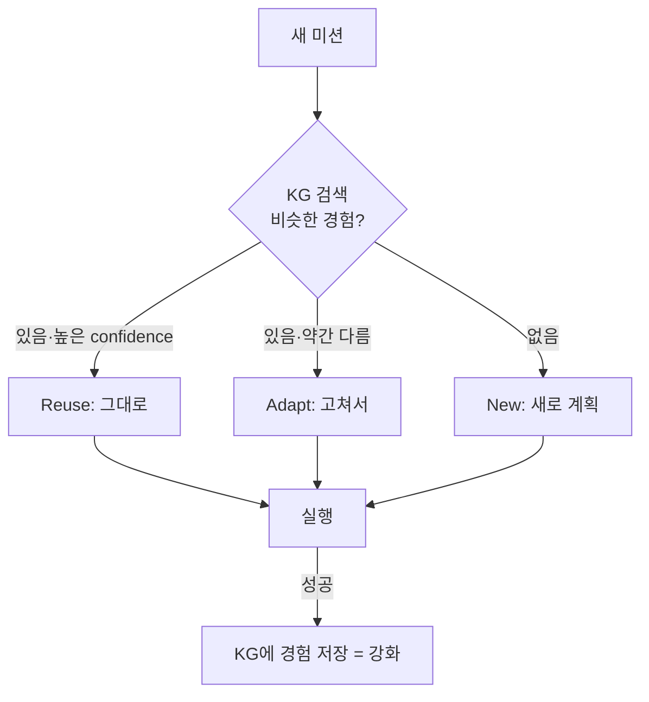

# W06 — 서버 사이드 하네스 (2): Playbook과 경험 학습(KG)

> **한 줄 요약** — 매번 처음부터 계획하면 느리고 불안정하다. **Playbook**(검증된 미션 절차)과 **경험
> 그래프(KG)**(과거 미션 재활용)를 더하면, 에이전트가 비슷한 일을 더 빠르고 일관되게 처리한다.
> el34 bastion의 KG-2 Reuse / KG-3 Adapt가 바로 이것이다.

---

## 학습 목표

- **Playbook**(절차 템플릿)의 개념과 보안 운영에서의 가치를 안다.
- **경험 학습(KG)** — new/reuse/adapt 결정과 그 효과(속도·일관성)를 이해한다.
- 강화 학습적 사고(성공 경험을 강화, 실패에서 학습)를 에이전트에 적용한다.
- Playbook 재사용과 자유 계획의 트레이드오프를 안다.
- el34 bastion의 KG가 미션 처리에 미치는 영향을 설명한다.

---

## 0. 용어 해설

| 용어 | 영문 | 쉽게 말하면 | 비유 |
|------|------|------------|------|
| **Playbook** | Playbook | 검증된 미션 처리 절차 템플릿 | 표준 작업 지침서 |
| **경험 그래프** | KG / Experience Graph | 과거 미션 경험을 저장·검색하는 지식 저장소 | 업무 노트 |
| **Reuse** | KG-2 Reuse | 과거 동일 미션 절차를 그대로 재사용 | 전례 그대로 |
| **Adapt** | KG-3 Adapt | 과거 절차를 조금 고쳐 재사용 | 전례 응용 |
| **New** | KG-4 New | 처음 보는 미션 → 새로 계획 | 신규 작성 |
| **confidence** | confidence | 재사용 결정의 신뢰도 점수 | 확신 정도 |
| **강화 학습** | RL | 성공은 강화, 실패는 회피하도록 학습 | 잘한 건 칭찬 |
| **anchor** | anchor | KG에 저장되는 경험 단위 | 노트의 한 항목 |

---

## 0.5 신입생을 위한 핵심 개념

### "사람은 반복하면 요령이 생긴다 — 에이전트도"

신입은 매번 처음부터 고민하지만, 베테랑은 "이건 전에 해봤지"하며 빠르게 처리합니다. 에이전트도
**경험 그래프(KG)**에 끝낸 미션을 저장해 두면, 비슷한 미션이 올 때 처음부터 계획(new)하지 않고
**재사용(reuse)**하거나 **조금 고쳐(adapt)** 처리합니다.



> 📌 **Playbook vs KG** — Playbook은 **사람이 미리 만든** 절차 템플릿, KG는 **에이전트가 경험에서
> 스스로 쌓은** 절차입니다. 둘 다 "매번 새로 계획하는 비효율"을 줄입니다.

### el34 bastion의 KG (Wazuh 특강 W02에서 본 그것)

bastion은 미션마다 KG를 조회해 `data.decision`(new/reuse/adapt)을 기록합니다. 같은 미션을 두 번
던지면 두 번째는 reuse로 더 빠르게 처리될 수 있습니다 — 이것이 경험 학습의 실제 증거입니다.

---

## 1. Playbook — 검증된 절차의 재사용

보안 운영에는 반복되는 미션이 많습니다(브루트포스 대응, 웹쉘 조사 등). 매번 LLM이 새로 계획하면
느리고 결과가 들쭉날쭉합니다. **Playbook**은 검증된 절차를 템플릿으로 박아 둡니다.

```
Playbook: "SSH 브루트포스 대응"
  1. auth.log에서 실패 로그인 집계
  2. 임계값 초과 출발지 IP 식별
  3. (승인 후) 방화벽에 차단 룰 추가
  4. 차단 카운터 확인 + 보고
```

미션이 들어오면 에이전트는 맞는 Playbook이 있으면 **그 절차를 따르고**, 없으면 자유 계획합니다.
Playbook은 **일관성·속도·감사 용이성**을 줍니다(SOAR의 핵심 발상).

---

## 2. 경험 학습(KG) — new / reuse / adapt

| 결정 | 언제 | 효과 |
|------|------|------|
| **new** | 처음 보는 미션 | 새로 계획(느림), 경험으로 저장 |
| **reuse** | 과거와 거의 동일 | 절차 그대로(빠름·안정) |
| **adapt** | 과거와 비슷하나 다름 | 절차 일부 수정 |

KG는 미션을 **유사도**로 검색해 결정합니다. confidence가 높으면 reuse, 중간이면 adapt, 낮으면 new.
반복할수록 reuse 비율이 올라가 **점점 빨라지고 안정**됩니다.

---

## 3. 강화 학습적 사고 — 성공은 강화, 실패는 학습

정식 RL을 구현하지 않아도, 에이전트는 **성공한 경험을 강화**하고 **실패에서 배울** 수 있습니다.

- **성공** → 그 절차를 KG에 저장(가중치↑) → 다음에 우선 재사용.
- **실패** → 실패 절차를 기록 → 다음엔 회피하거나 adapt.
- **자가 수정(KG-3 Adapt)** → 실패(anchor A) → 수정 → 성공(anchor B)의 pair로 학습.

> bastion의 실제 사례: 실패한 시도(anchor)를 자가 수정해 성공한 시도(anchor)로 이어지는 pair가 KG에
> 남아, 같은 실수를 반복하지 않게 합니다.

---

## 4. 트레이드오프 — 재사용 vs 자유 계획

| | Playbook/Reuse | 자유 계획(New) |
|---|----------------|----------------|
| 속도 | 빠름 | 느림 |
| 일관성 | 높음 | 낮음 |
| 유연성 | 낮음(정해진 절차) | 높음 |
| 위험 | 낡은 절차가 안 맞을 수 있음 | 환각·실수 가능 |

> **균형:** 정형 미션은 Playbook/Reuse로 빠르게, 새로운 상황은 자유 계획으로 유연하게. 그리고 자유
> 계획의 성공은 다시 KG/Playbook으로 흡수합니다. 이 순환이 운영 에이전트를 **시간이 갈수록 강하게**
> 만듭니다.

---

## 실습 안내

이번 주 실습(`lab_week06.yaml`, 8단계)은 el34 GPU Ollama(gemma3:4b)로 합니다. 4개 축:

1. **왜(목적)** — 왜 Playbook/KG인가(속도·일관성), 매번 새 계획의 비효율.
2. **무엇을(구현)** — Playbook 매칭과 new/reuse/adapt 결정 로직을 만든다.
3. **해석(분석)** — KG 결정 분포를 집계하고, 정책을 감사한다.
4. **실전(학습)** — 같은 미션 반복 시 reuse 효과를 확인하고, 실패→adapt를 기록한다.

> 🧪 LLM 호출은 `http://211.170.162.139:10934`(gemma3:4b). 결정적 마커로 확인합니다.

---

## 흔한 오해

- ❌ **"Playbook이면 LLM이 필요 없다"** → Playbook 매칭·변형 판단에 LLM이 쓰인다. 둘은 보완.
- ❌ **"reuse가 항상 빠르고 좋다"** → 낡은 절차가 현 상황에 안 맞으면 adapt/new가 필요.
- ❌ **"KG는 자동으로 정확해진다"** → 잘못된 경험도 저장되면 오염된다. 성공 검증 후 저장해야.
- ❌ **"RL 없으면 학습 못 한다"** → 경험 저장·재사용만으로도 실질적 학습 효과가 있다.
- ❌ **"새 미션은 항상 new"** → 비슷하면 adapt가 더 효율적. 유사도 판단이 핵심.

---

## 예고 — W07

지금까지 **서버 사이드** 하네스(bastion형)를 다뤘다. W07은 **클라이언트 사이드 하네스** — 개발자
PC에서 도는 Claude Code 같은 에이전트를 보안 작업에 활용하는 법과, 그때의 보안 고려사항(로컬 권한·
파일 접근·승인 모드)을 다룬다.
