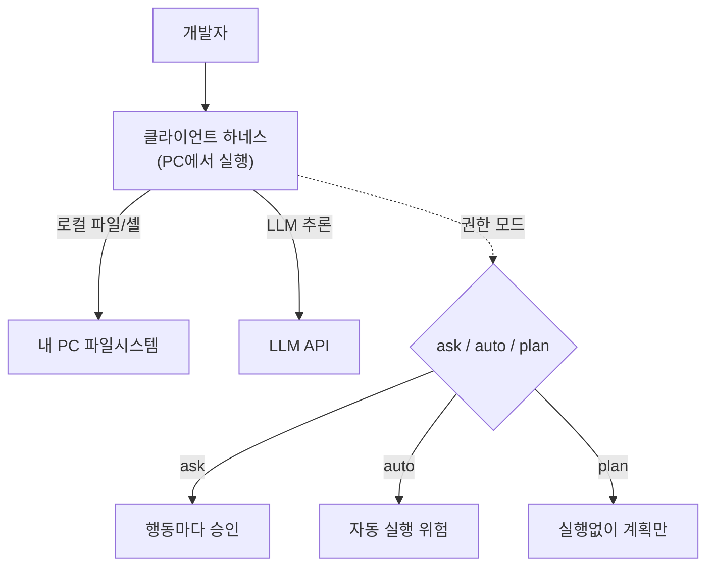

# W07 — 클라이언트 사이드 하네스: 개발자 PC의 보안 에이전트

> **한 줄 요약** — 서버 하네스(bastion)는 중앙 통제용이다. 반대로 **클라이언트 사이드 하네스**는
> 개발자/분석가 **PC에서 직접 도는** 에이전트(예: Claude Code 류)다. 강력하지만 **로컬 파일·셸 권한**을
> 쥐기에 위험도 크다. 이번 주는 클라이언트 하네스의 동작·권한 모드·샌드박싱을 이해하고, 서버형과의
> 차이를 비교한다.

---

## 학습 목표

- 클라이언트 사이드 하네스의 정의와 서버형과의 차이를 설명한다.
- **권한 모드**(ask/auto-accept/plan)의 차이와 위험을 안다.
- 로컬 에이전트의 위험(파일 접근·셸 실행·민감정보 노출)과 **샌드박싱**을 이해한다.
- 클라이언트 하네스를 보안 작업(코드 리뷰·로그 분석)에 활용하는 법을 안다.
- 서버형 vs 클라이언트형의 용도별 선택 기준을 안다.

---

## 0. 용어 해설

| 용어 | 영문 | 쉽게 말하면 | 비유 |
|------|------|------------|------|
| **클라이언트 하네스** | Client-side Harness | 사용자 PC에서 직접 도는 에이전트 런타임 | 내 책상의 비서 |
| **권한 모드** | Permission Mode | 행동 전 승인을 받는 방식(ask/auto/plan) | 결재 방식 |
| **auto-accept** | Auto-accept | 승인 없이 자동 실행(편하지만 위험) | 무결재 통과 |
| **plan 모드** | Plan mode | 실행 없이 계획만 보여 줌 | 리허설만 |
| **로컬 권한** | Local privilege | 에이전트가 가진 PC 권한(파일·셸) | 비서의 출입증 |
| **민감정보 노출** | Secret exposure | .env·키 파일이 컨텍스트에 빨려듦 | 기밀문서 유출 |
| **샌드박싱** | Sandboxing | 접근 가능 디렉토리/명령 제한 | 작업 구역 한정 |

---

## 0.5 신입생을 위한 핵심 개념

### "서버 비서 vs 책상 비서"

- **서버 하네스(bastion)**: 본부 관제실의 비서. 여러 사람의 미션을 중앙에서 받아 통제·감사. 권한이
  중앙에 묶여 안전하지만, 내 PC의 파일은 못 본다.
- **클라이언트 하네스(Claude Code형)**: 내 책상의 비서. **내 PC의 파일·셸을 직접** 다뤄 코드 작성·로그
  분석을 즉시 해준다. 강력하지만, 그만큼 **내 PC 권한을 쥔다** — 잘못하면 내 파일을 지우거나, 내
  비밀(.env)을 외부로 보낼 수 있다.

> 📌 **핵심 위험** — 클라이언트 하네스는 **내 PC 권한**으로 움직입니다. 그래서 **권한 모드**(언제
> 승인을 받나)와 **샌드박싱**(어디까지 접근하나)이 안전의 전부입니다.

---

## 1. 권한 모드 — 편의와 안전의 트레이드오프

| 모드 | 동작 | 위험 | 적합 |
|------|------|------|------|
| **ask** | 행동(파일 쓰기·명령)마다 승인 | 낮음 | 운영·민감 작업 |
| **auto-accept** | 승인 없이 자동 실행 | **높음** | 격리 환경의 신뢰 작업만 |
| **plan** | 실행 없이 계획만 제시 | 없음 | 탐색·검토 |

> **원칙:** 기본은 **ask**, 위험 작업은 절대 auto로 두지 않는다. auto-accept는 "되돌릴 수 있고 격리된"
> 환경에서만. W04의 위험도 기반 승인이 클라이언트 하네스에선 권한 모드로 구현됩니다.

---

## 2. 클라이언트 하네스의 보안 위험

| 위험 | 설명 | 방어 |
|------|------|------|
| **민감정보 흡입** | `.env`·키·토큰이 LLM 컨텍스트로 빨려 외부 API로 전송 | 로컬 LLM(Ollama)·민감파일 제외·`.gitignore`류 차단 |
| **파괴적 파일 작업** | `rm`·덮어쓰기로 코드 손실 | ask 모드·버전관리·백업 |
| **임의 셸 실행** | 인젝션된 코드가 셸로 실행 | 명령 화이트리스트·격리 |
| **공급망 주입** | 에이전트가 악성 의존성 추가 | 변경 리뷰·승인 |

> **로컬 LLM의 보안 이점(다시 강조):** 클라이언트 하네스에 **Ollama 같은 로컬 LLM**(el34의
> 211.170.162.139:10934)을 쓰면, 내 코드·비밀이 외부 클라우드로 안 나갑니다. 데이터 주권이 핵심인
> 보안 작업에서 큰 장점입니다.

---

## 3. 보안 작업에 활용하기

클라이언트 하네스가 잘하는 보안 작업:

- **코드 보안 리뷰** — 로컬 코드를 읽어 취약점 지적(SQLi·하드코딩 비밀 등).
- **로그 분석** — 로컬 로그 파일을 읽어 이상 패턴 요약.
- **설정 점검** — 설정 파일을 읽어 보안 미스컨피그 식별.
- **PoC 작성** — 격리 환경에서 익스플로잇 PoC 초안.

핵심은 **plan 모드로 먼저 검토** → ask로 신중히 실행. 그리고 **로컬 LLM**으로 데이터를 지킵니다.

---

## 4. 서버형 vs 클라이언트형 — 언제 무엇을

| 기준 | 서버 하네스(bastion) | 클라이언트 하네스(Claude Code형) |
|------|----------------------|----------------------------------|
| 위치 | 중앙 서버 | 사용자 PC |
| 통제 | 중앙 일괄 | 사용자별 |
| 감사 | 중앙 SIEM | 로컬(분산) |
| 강점 | 다수 미션 관제·감사 | 즉시성·로컬 파일 작업 |
| 위험 | API 노출 | 로컬 권한·민감정보 |
| 적합 | SOC 운영·자동 대응 | 개발·분석·코드 작업 |

> 둘은 경쟁이 아니라 **보완**입니다. SOC는 서버형으로 24/7 관제하고, 분석가는 클라이언트형으로
> 깊은 조사·코드 작업을 합니다.

---

## 실습 안내

이번 주 실습(`lab_week07.yaml`, 8단계)은 el34 GPU Ollama(gemma3:4b, 로컬 LLM)로 합니다. 4개 축:

1. **왜(목적)** — 왜 클라이언트 하네스인가(로컬 즉시성), 왜 로컬 LLM인가(데이터 주권).
2. **무엇을(활용)** — 로컬 LLM에 코드/설정 리뷰를 시킨다.
3. **해석(분석)** — 권한 모드별 위험을 분류하고, 민감정보 흡입을 점검한다.
4. **실전(방어)** — 권한 모드 게이트와 민감파일 차단(샌드박싱)을 구현한다.

> 🧪 LLM 호출은 `http://211.170.162.139:10934`(gemma3:4b). 결정적 마커로 확인합니다.

---

## 흔한 오해

- ❌ **"클라이언트 하네스가 서버형보다 좋다"** → 용도가 다르다. 관제는 서버, 코드 작업은 클라이언트.
- ❌ **"auto-accept가 편하니 항상 켠다"** → 가장 위험하다. 기본은 ask.
- ❌ **"plan 모드는 쓸모없다"** → 실행 전 검토로 사고를 막는 핵심 안전장치.
- ❌ **"로컬 에이전트는 안전하다"** → 로컬 권한을 쥐어 오히려 위험할 수 있다. 샌드박싱 필수.
- ❌ **"클라우드 LLM이 더 똑똑하니 무조건"** → 보안 작업은 데이터 주권 때문에 로컬 LLM이 나을 때가 많다.

---

## 예고 — W08

W01~W07로 에이전트의 두뇌·도구·프롬프트·하네스(서버·클라이언트)를 모두 배웠다. W08은 **중간 실습** —
이 부품들을 합쳐 **나만의 보안 에이전트**를 직접 설계·구축한다. 인지→판단→실행→감사의 완결된 루프를 만든다.
