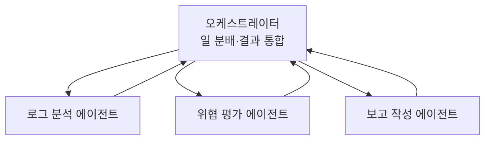

# W10 — 멀티에이전트 오케스트레이션: 협력의 구조와 위협

> **한 줄 요약** — 하나의 에이전트로 안 되는 복잡한 일은 **여러 에이전트가 협력**한다. 오케스트레이터가
> 전문 에이전트에 일을 나누고(분배), 결과를 모은다(통합). 강력하지만, **에이전트 사이**에 새 위협이
> 생긴다 — 전파되는 인젝션, 잘못된 신뢰, 합의 오류. 이번 주는 멀티에이전트 구조와 그 보안을 배운다.

---

## 학습 목표

- 멀티에이전트 협력 패턴(오케스트레이터-워커·파이프라인·토론)을 안다.
- 전문화(specialization)의 이점과 오케스트레이션 비용을 안다.
- 멀티에이전트 고유 위협(전파 인젝션·신뢰 경계·합의 오류)을 이해한다.
- 에이전트 간 **신뢰 경계와 메시지 검증**의 필요성을 안다.
- el34 bastion의 Manager–SubAgent도 멀티에이전트의 한 형태임을 안다.

---

## 0. 용어 해설

| 용어 | 영문 | 쉽게 말하면 |
|------|------|------------|
| **오케스트레이터** | Orchestrator | 일을 나누고 결과를 모으는 지휘 에이전트 |
| **워커** | Worker | 전문 작업을 맡는 하위 에이전트 |
| **파이프라인** | Pipeline | 에이전트들이 순서대로 처리 |
| **토론** | Debate | 여러 에이전트가 논쟁해 더 나은 답 |
| **전파 인젝션** | Cascading Injection | 한 에이전트가 오염되면 다음으로 전파 |
| **신뢰 경계** | Trust Boundary | 에이전트 간 입력을 어디까지 믿나 |
| **합의** | Consensus | 여러 에이전트 의견을 모으는 결정 |

---

## 0.5 신입생을 위한 핵심 개념

### "한 명의 만능보다 전문가 팀"

복잡한 사고 대응은 정찰·분석·대응·보고가 다 필요합니다. 한 에이전트가 다 하면 프롬프트가 비대해지고
실수가 늡니다. **멀티에이전트**는 전문 에이전트(로그분석가·차단실행자·보고작성자)로 나누고,
**오케스트레이터**가 지휘합니다.

> 📌 **핵심 위협** — 에이전트가 **서로의 출력을 입력으로** 받습니다. 그래서 한 에이전트가 인젝션에
> 오염되면, 그 오염된 출력이 다음 에이전트의 프롬프트로 들어가 **전파**됩니다. "에이전트 간 메시지도
> 외부 입력처럼 검증"해야 하는 이유입니다.

### bastion도 멀티에이전트

el34 bastion의 **Manager(계획)–SubAgent(실행)** 구조가 가장 단순한 멀티에이전트입니다(W05). Manager가
오케스트레이터, SubAgent가 워커입니다.

---

## 1. 협력 패턴

| 패턴 | 구조 | 적합 |
|------|------|------|
| **오케스트레이터-워커** | 지휘자가 전문가에 분배 | 복잡한 다단계 작업 |
| **파이프라인** | A→B→C 순차 | 정해진 처리 순서(수집→분석→보고) |
| **토론(debate)** | 여러 에이전트 논쟁→합의 | 어려운 판단(오탐 줄이기) |

**전문화의 이점:** 각 에이전트의 프롬프트/도구가 좁아져 정확도↑, 가드레일 적용 쉬움. **비용:**
오케스트레이션 복잡도, 지연(여러 LLM 호출), 에이전트 간 위협.

---

## 2. 멀티에이전트 고유 위협

### 2.1 전파 인젝션 (Cascading)

A 에이전트가 간접 인젝션에 오염 → A의 출력이 B의 입력 → B도 오염. **하나가 뚫리면 연쇄**됩니다.
방어: 에이전트 간 메시지도 **신뢰하지 않고 검증/격리**(W09의 외부데이터 격리를 내부에도 적용).

### 2.2 신뢰 경계 혼동

"같은 시스템의 에이전트니 믿어도 되겠지"가 함정입니다. 워커가 오염되면 그 출력은 더 이상 신뢰할 수
없습니다. **모든 에이전트 간 경계에 신뢰 경계**를 둡니다.

### 2.3 합의 오류

토론/투표에서 다수가 같은 환각·편향을 공유하면 잘못된 합의에 이릅니다(상관된 오류). 방어: **다양한
관점**(다른 프롬프트/모델)으로 독립성 확보.

---

## 3. 멀티에이전트 방어 원칙

1. **에이전트 간 메시지 검증** — 워커 출력을 오케스트레이터가 검증(구조·범위).
2. **최소 권한 per 에이전트** — 각 워커는 자기 일에 필요한 도구만.
3. **격리** — 한 에이전트 오염이 전체로 안 퍼지게.
4. **중앙 감사** — 모든 에이전트 행동을 한 곳에 기록(추적).
5. **다양성** — 합의 시 독립적 관점으로 상관 오류 방지.

> 멀티에이전트는 단일 에이전트의 위협(W09)을 **그대로 가지면서, 에이전트 간 위협을 추가**합니다.
> 그래서 방어는 "각 에이전트 방어 + 에이전트 간 방어" 두 겹입니다.

---

## 실습 안내

이번 주 실습(`lab_week10.yaml`, 8단계)은 el34 GPU Ollama(gemma3:4b)로 합니다. 4개 축:

1. **왜(목적)** — 왜 협력인가(전문화), 왜 에이전트 간 위협이 생기나.
2. **무엇을(구현)** — 오케스트레이터가 작업을 전문 에이전트에 라우팅한다.
3. **해석(분석)** — 멀티에이전트 설계의 위협을 감사한다.
4. **실전(방어)** — 에이전트 간 메시지를 검증해 전파 인젝션을 차단한다.

> 🧪 LLM 호출은 `http://211.170.162.139:10934`(gemma3:4b). 결정적 마커로 확인합니다.

---

## 흔한 오해

- ❌ **"멀티에이전트가 항상 낫다"** → 지연·복잡도·새 위협이 생긴다. 단순 작업엔 단일이 낫다.
- ❌ **"같은 시스템 에이전트는 믿어도 된다"** → 오염될 수 있다. 신뢰 경계 필수.
- ❌ **"여러 에이전트가 합의하면 정확"** → 상관된 오류(공유 환각)에 빠질 수 있다. 다양성 필요.
- ❌ **"오케스트레이터만 방어하면 된다"** → 각 워커도, 에이전트 간 메시지도 방어해야.
- ❌ **"전파 인젝션은 이론"** → 실재 위협. 에이전트 간 메시지도 외부 입력처럼 다룬다.

---

## 예고 — W11

멀티에이전트로 협력을 배웠다. W11은 **RAG(검색 증강 생성)** — 에이전트가 외부 지식(CVE·보안 문서)을
검색해 답의 정확도를 높이는 법과, 그 검색 통로로 들어오는 간접 인젝션·오염된 지식의 위험을 다룬다.
