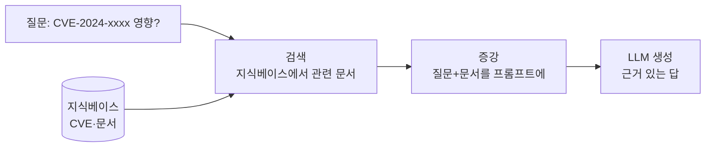

# W11 — RAG 기반 보안 지식 에이전트: 검색으로 똑똑해지기, 그리고 그 위험

> **한 줄 요약** — LLM은 학습 시점 이후의 지식(새 CVE·사내 문서)을 모른다. **RAG(검색 증강 생성)**는
> 질문에 맞는 외부 문서를 **검색해 프롬프트에 넣어** 최신·정확한 답을 내게 한다. 하지만 그 검색
> 통로는 **간접 인젝션과 오염된 지식**이 들어오는 새 공격 표면이다. 이번 주는 RAG의 구조와 보안을 배운다.

---

## 학습 목표

- RAG의 구조(검색→증강→생성)와 왜 필요한가를 안다.
- 임베딩·벡터 검색의 개념을 안다(개념 수준).
- RAG가 보안에 주는 이점(최신 CVE·근거 제시)을 안다.
- RAG 고유 위협 — **오염된 지식베이스·간접 인젝션·근거 환각**을 이해한다.
- 신뢰할 수 있는 출처·격리·근거 검증으로 RAG를 방어한다.

---

## 0. 용어 해설

| 용어 | 영문 | 쉽게 말하면 |
|------|------|------------|
| **RAG** | Retrieval-Augmented Generation | 검색한 문서를 넣어 생성 |
| **임베딩** | Embedding | 텍스트를 의미 벡터로 변환 |
| **벡터 검색** | Vector Search | 의미가 가까운 문서를 찾기 |
| **지식베이스** | Knowledge Base | 검색 대상 문서 모음 |
| **청크** | Chunk | 문서를 잘게 나눈 조각 |
| **근거 제시** | Grounding/Citation | 답의 출처를 명시 |
| **지식 오염** | Knowledge Poisoning | 지식베이스에 악성/거짓 문서 주입 |

---

## 0.5 신입생을 위한 핵심 개념

### "오픈북 시험 — 단, 책이 오염될 수 있다"

LLM 혼자 답하는 건 **암기 시험**입니다. 학습 후 새 CVE는 모르고, 사내 정책도 모릅니다. **RAG**는
**오픈북 시험**입니다 — 질문이 오면 관련 문서를 **검색해 같이 읽고** 답합니다. 그래서 최신·정확하고
**출처(근거)**를 댈 수 있습니다.

> 📌 **새 위협** — 그 "책(지식베이스)"이 오염되면? 또 검색된 문서에 **숨은 지시(간접 인젝션)**가
> 있으면? RAG는 외부 데이터를 프롬프트에 넣으므로, W09의 **간접 인젝션**이 정통으로 적용됩니다.

---

## 1. RAG 구조 — 검색→증강→생성

1. **검색(Retrieval):** 질문을 임베딩해 지식베이스에서 의미가 가까운 청크를 찾는다.
2. **증강(Augmentation):** 찾은 청크를 질문과 함께 프롬프트에 넣는다.
3. **생성(Generation):** LLM이 그 문서에 근거해 답하고 출처를 댄다.

보안 활용: 최신 CVE 영향 평가, 사내 보안정책 Q&A, 인시던트 플레이북 검색 등. **근거 제시** 덕분에
"왜 그렇게 판단했나"를 출처로 확인할 수 있어 신뢰성이 높습니다.

---

## 2. RAG 고유 위협

| 위협 | 설명 | 방어 |
|------|------|------|
| **지식 오염** | 지식베이스에 거짓/악성 문서 주입 → 잘못된 답 | 출처 신뢰·서명·검수 |
| **간접 인젝션** | 검색된 문서에 숨은 지시("비밀 전송") | 문서=데이터로만 격리(W09) |
| **근거 환각** | 없는 출처를 지어내거나 문서와 다른 답 | 근거-답 일치 검증 |
| **민감정보 검색** | 권한 없는 문서가 검색돼 노출 | 검색 단계 권한 필터 |

> **핵심:** RAG는 "외부 데이터를 프롬프트에 넣는" 행위 그 자체입니다. 그래서 **검색된 모든 것을
> 신뢰하지 않고 데이터로만** 다뤄야 합니다(W09 간접 인젝션 방어를 RAG에 그대로 적용).

---

## 3. RAG 방어 원칙

1. **신뢰할 수 있는 출처** — 지식베이스에 검증된 문서만. 출처 메타데이터 유지.
2. **검색 결과 격리** — 검색 문서를 `<context>`로 감싸 데이터로만 취급.
3. **근거 검증** — 답이 검색 문서에 실제 근거하는지 확인(없으면 "모름").
4. **권한 필터** — 사용자가 볼 권한 있는 문서만 검색.
5. **출처 표시** — 답에 출처를 명시해 사람이 검증 가능하게.

---

## 실습 안내

이번 주 실습(`lab_week11.yaml`, 8단계)은 el34 GPU Ollama(gemma3:4b)로 합니다. 4개 축:

1. **왜(목적)** — 왜 RAG인가(최신·근거), 왜 검색 통로가 위험인가.
2. **무엇을(구현)** — 문서를 검색해 프롬프트에 넣고 근거 있는 답을 생성한다.
3. **해석(분석)** — RAG 파이프라인의 위협을 감사한다.
4. **실전(방어)** — 오염된 검색 문서의 숨은 지시를 격리로 차단한다.

> 🧪 LLM 호출은 `http://211.170.162.139:10934`(gemma3:4b). 결정적 마커로 확인합니다.

---

## 흔한 오해

- ❌ **"RAG면 환각이 사라진다"** → 줄지만 없어지지 않는다. 문서와 다른 답·근거 환각 가능. 근거 검증 필요.
- ❌ **"검색된 문서는 믿어도 된다"** → 오염·간접 인젝션 가능. 데이터로만 취급.
- ❌ **"지식베이스는 많을수록 좋다"** → 오염되거나 권한 없는 문서가 섞이면 위험. 검증된 출처가 중요.
- ❌ **"임베딩 검색은 정확하다"** → 의미 근사일 뿐, 무관 문서가 끼기도. 근거 확인 필요.
- ❌ **"출처 표시는 형식"** → 사람이 답을 검증하는 핵심 수단.

---

## 예고 — W12

RAG로 에이전트를 똑똑하게 만들었다. W12는 **에이전트 평가와 벤치마크** — 에이전트가 실제로 잘하는지,
안전한지를 **객관적으로 측정**하는 법(정확도·안전성·비용 지표, 레드팀 테스트)을 다룬다.
