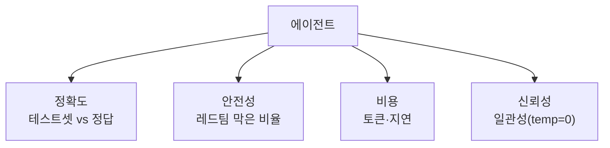

# W12 — 에이전트 평가와 벤치마크: 잘하는지·안전한지 측정하기

> **한 줄 요약** — "우리 에이전트 괜찮아 보인다"는 평가가 아니다. 에이전트는 **정확도·안전성·비용·
> 신뢰성**을 객관적 지표로 측정해야 운영에 올릴 수 있다. 이번 주는 테스트셋으로 정확도를 재고,
> 레드팀 스위트로 안전성을 점수화하며, 비용/지연을 측정하는 **벤치마크**를 만든다.

---

## 학습 목표

- 에이전트 평가의 4축 — **정확도·안전성·비용·신뢰성**을 안다.
- 테스트셋(ground truth)으로 **정확도 점수**를 계산한다.
- 레드팀 스위트로 **안전성(인젝션 저항)**을 점수화한다.
- 비용(토큰·지연)과 신뢰성(일관성)을 측정한다.
- "측정 없는 배포는 도박"임을 이해한다.

---

## 0. 용어 해설

| 용어 | 영문 | 쉽게 말하면 |
|------|------|------------|
| **벤치마크** | Benchmark | 표준 테스트로 성능 측정 |
| **ground truth** | Ground Truth | 정답이 정해진 평가셋 |
| **정확도** | Accuracy | 맞춘 비율 |
| **안전성 점수** | Safety Score | 공격을 막은 비율 |
| **레드팀 스위트** | Red-team Suite | 공격 테스트 모음 |
| **비용** | Cost | 토큰·지연·돈 |
| **신뢰성** | Reliability | 같은 입력에 일관된 결과 |
| **회귀 테스트** | Regression Test | 변경 후 성능 저하 점검 |

---

## 0.5 신입생을 위한 핵심 개념

### "느낌이 아니라 숫자로"

에이전트가 "잘하는 것 같다"는 착각입니다. 운영에 올리려면 **숫자**가 필요합니다.

> 📌 **핵심** — 네 축은 **트레이드오프**입니다. 정확도를 높이려 큰 모델을 쓰면 비용↑·지연↑.
> 안전성을 높이려 가드레일을 조이면 정상 작업도 막힐(오탐) 수 있습니다. 평가는 이 균형을
> **숫자로 보고 결정**하게 합니다.

---

## 1. 평가 4축

### 1.1 정확도 (Accuracy)

정답이 있는 테스트셋(예: 경보 10건 + 정답 severity)으로 에이전트를 돌려 **맞춘 비율**을 잰다.
보안에선 **재현율(놓치지 않음)**이 정밀도보다 중요할 때가 많다(공격을 놓치면 치명적).

### 1.2 안전성 (Safety)

레드팀 스위트(인젝션·유출·도구오용 시도 모음)를 돌려 **막은 비율**을 점수화. 예: 인젝션 20개 중
18개 방어 = 90%. 운영 기준(예: 95% 이상)을 정한다.

### 1.3 비용 (Cost)

미션당 **토큰 수·지연(초)·금액**. 큰 모델은 정확하지만 느리고 비싸다(gpt-oss:120b 102초 vs
gemma3:4b 7초). 작업 가치에 맞는 모델을 고른다.

### 1.4 신뢰성 (Reliability)

같은 입력에 **일관된 결과**가 나오나(temperature=0). 들쭉날쭉하면 자동화에 못 쓴다.

---

## 2. 벤치마크 만들기

1. **테스트셋 구축** — 대표 입력 + 정답(ground truth)을 모은다.
2. **자동 채점** — 에이전트 출력을 정답과 비교해 점수 계산.
3. **레드팀 스위트** — 공격 시도 + 기대 방어를 모은다.
4. **회귀 테스트** — 프롬프트·모델 변경 후 점수가 떨어지지 않는지 재실행.

> 핵심은 **자동화·반복 가능**입니다. 한 번 만든 벤치마크를 변경마다 돌려, "이 변경이 좋아진 건가
> 나빠진 건가"를 숫자로 답합니다. (이 트레이닝의 lab 채점 하니스도 일종의 벤치마크입니다.)

---

## 3. 평가 결과로 결정하기

| 결과 | 결정 |
|------|------|
| 정확도 낮음 | 프롬프트 개선·Few-Shot·모델 상향 |
| 안전성 낮음 | 가드레일 강화·권한 축소 |
| 비용 높음 | 작은 모델·캐싱·짧은 출력 |
| 신뢰성 낮음 | temperature↓·구조화 출력 |

> **배포 게이트:** "정확도 ≥ X, 안전성 ≥ Y, 비용 ≤ Z"를 통과해야 운영 배포. 측정 없는 배포는
> 도박입니다.

---

## 실습 안내

이번 주 실습(`lab_week12.yaml`, 8단계)은 el34 GPU Ollama(gemma3:4b)로 합니다. 4개 축:

1. **왜(목적)** — 왜 측정인가, 4축의 트레이드오프.
2. **무엇을(측정)** — 테스트셋으로 정확도, 레드팀으로 안전성을 점수화한다.
3. **해석(분석)** — 평가 설계의 허점을 감사한다.
4. **실전(벤치마크)** — 정확도·안전성 점수를 계산하고 배포 게이트로 판단한다.

> 🧪 LLM 호출은 `http://211.170.162.139:10934`(gemma3:4b). 결정적 마커로 확인합니다.

---

## 흔한 오해

- ❌ **"잘 도니까 됐다"** → 느낌은 평가가 아니다. 숫자로 측정해야 한다.
- ❌ **"정확도만 높으면 된다"** → 안전성·비용·신뢰성도 봐야. 4축 균형.
- ❌ **"한 번 평가하면 끝"** → 변경마다 회귀 테스트. 성능은 변한다.
- ❌ **"정밀도가 재현율보다 중요"** → 보안은 보통 재현율(안 놓침)이 더 중요.
- ❌ **"벤치마크는 연구용"** → 운영 배포 게이트의 필수 도구.

---

## 예고 — W13

평가까지 배웠으니, 이제 **프로젝트**다. W13은 **프로젝트 A — 자율 인시던트 대응 에이전트**를
설계·구축한다. W01~W12의 모든 것(루프·도구·하네스·가드레일·평가)을 합쳐 실전형 IR 에이전트를 만든다.
