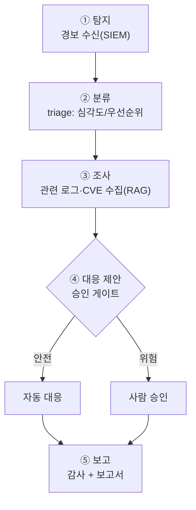

# W13 — 프로젝트 A: 자율 인시던트 대응(IR) 에이전트

> **한 줄 요약** — W01~W12의 모든 부품(루프·도구·프롬프트·하네스·가드레일·RAG·평가)을 합쳐, 실제
> 보안 사고에 대응하는 **자율 IR 에이전트**를 설계·구축한다. 경보를 받아 → 분류(triage)하고 →
> 조사하고 → 대응을 제안하고(승인 후 실행) → 보고서를 쓰는, 끝까지 도는 에이전트다.

---

## 학습 목표

- 인시던트 대응(IR) 단계(탐지→분류→조사→대응→보고)를 에이전트로 구현한다.
- 전 과정에 **가드레일·승인 게이트·감사**를 통합한다.
- RAG로 IR 플레이북·CVE 지식을 활용한다.
- 위험 대응(차단·격리)은 **승인 게이트**로 통제한다.
- 에이전트를 평가(정확도·안전성)하고 배포 가능성을 판단한다.

---

## 0. 용어 해설

| 용어 | 영문 | 쉽게 말하면 |
|------|------|------------|
| **인시던트 대응** | Incident Response | 보안 사고에 대한 체계적 대응 |
| **triage** | Triage | 경보의 심각도·우선순위 분류 |
| **봉쇄** | Containment | 피해 확산을 막는 조치(차단·격리) |
| **PICERL** | - | 준비-식별-봉쇄-근절-복구-교훈 IR 프레임워크 |
| **플레이북** | Playbook | 사고 유형별 대응 절차 |
| **MTTR** | Mean Time To Respond | 평균 대응 시간 |

---

## 0.5 신입생을 위한 핵심 개념

### "사고가 나면 — 받고, 가리고, 파고, 막고, 적는다"

자율 IR 에이전트의 한 사이클:

> 📌 **이 프로젝트의 핵심** — IR 에이전트는 **빠르되(자동 분류·조사) 신중해야(대응은 승인)** 합니다.
> 속도를 위해 분류·조사는 자동화하되, **봉쇄(차단·격리)는 비가역적이므로 승인 게이트**를 둡니다.
> 이것이 W04(하네스)·W08(완결 루프)에서 배운 원칙의 실전 적용입니다.

---

## 1. 프로젝트 설계 — IR 에이전트 명세

| 항목 | 설계 |
|------|------|
| **역할** | SIEM 경보를 받아 IR을 수행하는 에이전트 |
| **입력** | 경보(JSON): event, srcip, count, severity 단서 |
| **도구** | read_log(읽기·자동), enrich_cve(RAG·자동), propose_block(승인필수) |
| **판단** | 정책 기반 triage + LLM 분석(구조화 출력) |
| **대응** | 봉쇄 제안 → 승인 후 실행(자동 실행 금지) |
| **감사** | request_id로 전 단계 기록 |

---

## 2. 단계별 통합

- **① 탐지/② 분류:** 경보를 받아 정책+LLM으로 severity·우선순위 판단(W03 구조화 출력).
- **③ 조사:** 관련 로그를 읽고(read_log), RAG로 CVE/플레이북 enrich(W11). 외부 데이터는 격리(W09).
- **④ 대응:** 봉쇄는 **승인 게이트**(W04). LLM 제안을 가드레일·인자검증 후(W02).
- **⑤ 보고:** request_id로 묶인 감사 로그(W05) + 자연어 보고서(W01).

전 과정이 **하나의 완결 루프**로 엮입니다(W08). 그리고 만든 에이전트는 **평가**(W12)로 정확도·안전성을
재 배포 여부를 정합니다.

---

## 3. IR 에이전트의 안전 원칙

1. **봉쇄는 사람 승인** — 차단·격리는 오탐 시 서비스 장애. 비가역 행동은 승인 필수.
2. **조사는 읽기 전용** — 조사 단계 도구는 read-only(피해 없음).
3. **모든 단계 감사** — 사후 "에이전트가 무슨 판단·행동을 했나" 추적.
4. **오탐 관리** — 정상을 사고로 오인하면 대응이 해가 된다. 신중한 triage.
5. **사람이 최종 책임** — 에이전트는 보조. 중대 결정은 사람이.

---

## 실습 안내

이번 주 실습(`lab_week13.yaml`, 8단계)은 el34 GPU Ollama(gemma3:4b)로 **IR 에이전트**를 만든다. 4개 축:

1. **왜(목적)** — 왜 IR 자동화인가(MTTR 단축), 왜 봉쇄는 승인인가.
2. **무엇을(구현)** — 경보 triage → 조사(RAG) → 대응 제안의 IR 파이프라인.
3. **해석(분석)** — IR 에이전트 설계를 감사한다.
4. **실전(통제)** — 봉쇄를 승인 게이트로 막고, 전 과정을 감사 로그로 남긴다.

> 🧪 LLM 호출은 `http://211.170.162.139:10934`(gemma3:4b). 결정적 마커로 확인합니다.

---

## 흔한 오해

- ❌ **"IR 에이전트가 자동으로 다 차단"** → 봉쇄는 승인 필수. 자동 차단은 서비스 장애 위험.
- ❌ **"빠르면 좋은 IR"** → 빠르되 정확해야. 오탐 대응은 해가 된다.
- ❌ **"조사 도구도 강력해야"** → 조사는 읽기 전용이면 충분·안전.
- ❌ **"에이전트가 책임진다"** → 사람이 최종 책임. 에이전트는 보조.
- ❌ **"한 번 만들면 끝"** → 평가·회귀 테스트로 지속 검증(W12).

---

## 예고 — W14

프로젝트 A(방어형 IR 에이전트)를 만들었다. W14는 **프로젝트 B — CTF 자동 풀이 에이전트**(공격형)다.
ReAct 루프로 정찰→취약점 탐색→익스플로잇을 시도하는 공격 에이전트를 만들고, 그 윤리·통제(격리
환경·인가 범위)를 다룬다.
