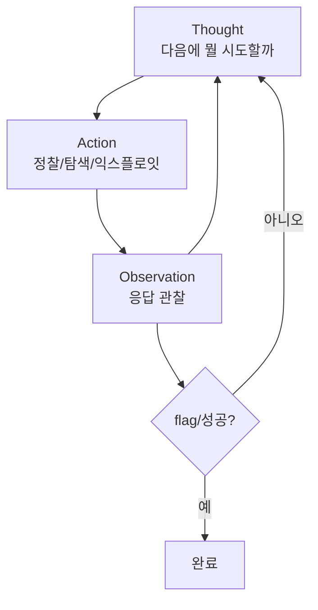

# W14 — 프로젝트 B: CTF 자동 풀이 에이전트 (공격형 ReAct)

> **한 줄 요약** — 방어형(W13 IR)에 이어, 이번엔 **공격형** 에이전트다. ReAct 루프로 정찰→취약점
> 탐색→익스플로잇을 **스스로 시도**하는 CTF 풀이 에이전트를 만든다. 강력한 만큼 **윤리·인가·격리**가
> 전제다 — el34 같은 **인가된 격리 실습장에서만** 동작해야 한다.

---

## 학습 목표

- ReAct 루프(Thought→Action→Observation)로 공격 에이전트를 구현한다.
- 정찰→취약점 탐색→익스플로잇의 자동화를 이해한다.
- 공격 에이전트의 **윤리·인가·격리** 전제를 안다(가장 중요).
- el34 인가 실습장에서 정찰을 실제 수행한다.
- 공격 에이전트의 오용 위험과 통제(범위 제한·로그)를 안다.

---

## 0. 용어 해설

| 용어 | 영문 | 쉽게 말하면 |
|------|------|------------|
| **CTF** | Capture The Flag | 취약점을 풀어 flag를 얻는 보안 경기 |
| **ReAct** | Reasoning+Acting | 추론과 행동을 번갈아(W01) |
| **정찰** | Recon | 대상 정보 수집(포트·기술·엔드포인트) |
| **익스플로잇** | Exploit | 취약점을 실제로 공격 |
| **인가 범위** | Scope | 공격이 허용된 대상의 경계 |
| **격리 환경** | Isolated Env | 실제 피해 없는 폐쇄 실습장(el34) |
| **교전 규칙** | Rules of Engagement | 무엇을 어디까지 해도 되나 |

---

## 0.5 신입생을 위한 핵심 개념 — ⚠️ 윤리가 먼저다

### "공격 도구는 인가된 곳에서만"

공격 에이전트는 강력합니다. 그래서 **무엇보다 먼저 윤리·법**입니다.

- **인가(Authorization):** 명시적으로 허락받은 대상만. 무단 공격은 **범죄**입니다.
- **격리(Isolation):** el34 같은 **폐쇄 실습장**에서만. 실서비스·외부 대상 금지.
- **범위(Scope):** 정해진 대상·기법만. 교전 규칙을 지킨다.
- **로깅:** 모든 행동을 기록(자기 행동도 감사).

> 📌 **이 과목의 입장** — 공격 기법을 배우는 것은 **방어를 더 잘하기 위해서**입니다(레드팀). el34는
> 그 연습을 위한 **인가된 격리 실습장**입니다. 여기서 배운 것을 인가 밖에서 쓰면 안 됩니다. 이
> 전제 위에서만 이번 주 실습이 성립합니다.

### ReAct 공격 루프

---

## 1. 공격 에이전트의 단계

| 단계 | 하는 일 | el34 예 |
|------|---------|---------|
| **정찰** | 대상 기술·엔드포인트 파악 | dvwa 응답 헤더·페이지 |
| **취약점 탐색** | 입력점·약점 후보 식별 | 파라미터·폼 |
| **익스플로잇** | 취약점 실제 공격 | SQLi/XSS 페이로드(WAF가 막음) |
| **후속** | flag 획득·권한 확대 | (격리장 한정) |

ReAct는 각 단계에서 **관찰을 보고 다음을 추론**합니다 — 고정 스크립트보다 유연하게 적응합니다.

---

## 2. el34에서의 인가된 정찰

el34의 공격자(el34-attacker)에서 취약 웹앱(dvwa.el34.lab)으로 정찰합니다. 이는 **인가된 격리
실습장** 내부의 트래픽입니다. 동시에 el34의 방어(IPS·WAF)가 이 공격을 **탐지/차단**하므로, 공격과
방어를 한 번에 관찰할 수 있습니다(레드+블루).

> 공격 에이전트가 보낸 sqlmap UA·SQLi는 IPS의 eve.json alert와 WAF의 403으로 잡힙니다(secuops/wazuh
> 특강에서 본 그 탐지). 즉 **내 공격이 어떻게 탐지되는지**를 보며 방어를 배웁니다.

---

## 3. 공격 에이전트의 통제

| 위험 | 통제 |
|------|------|
| 인가 밖 공격 | 대상 화이트리스트(격리장 IP만) |
| 파괴적 행동 | 읽기/탐지 위주, 파괴 금지 |
| 오용 | 모든 행동 로깅·감사 |
| 확산 | 격리 네트워크(외부 차단) |

> 공격 에이전트야말로 **하네스(W04)·가드레일(W02)이 필수**입니다. "대상 범위를 벗어나면 즉시 중단"
> 같은 안전장치를 코드로 박습니다.

---

## 실습 안내

이번 주 실습(`lab_week14.yaml`, 8단계)은 el34 GPU Ollama(gemma3:4b) + 인가된 격리 실습장에서 합니다. 4개 축:

1. **왜(목적)** — 왜 공격을 배우나(레드팀=방어 강화), 왜 인가·격리가 전제인가.
2. **무엇을(구현)** — ReAct 루프로 CTF 접근을 추론하고, el34에서 정찰을 실제 수행한다.
3. **해석(분석)** — 공격 에이전트의 오용 위험을 감사한다.
4. **실전(통제)** — 대상 범위 화이트리스트로 인가 밖 공격을 차단한다.

> 🧪 LLM 호출은 `http://211.170.162.139:10934`(gemma3:4b). 정찰은 el34-attacker→dvwa.el34.lab(인가 격리장). 결정적 마커로 확인합니다.

---

## 흔한 오해

- ❌ **"공격 기법은 나쁜 것"** → 방어를 위해 필수(레드팀). 단, **인가된 곳에서만**.
- ❌ **"격리장이니 뭐든 해도 된다"** → 교전 규칙·범위를 지킨다. 습관이 중요.
- ❌ **"공격 에이전트엔 하네스 불필요"** → 가장 필요하다. 범위 이탈 방지가 핵심.
- ❌ **"자동 공격이 사람보다 낫다"** → 보조 도구. 판단·책임은 사람.
- ❌ **"여기서 배운 걸 아무 데나 써도 된다"** → 절대 금지. 인가 밖은 범죄.

---

## 예고 — W15

방어형(IR)·공격형(CTF) 프로젝트를 했다. 마지막 W15는 **프로젝트 C — 보안 교육 에이전트**다. 배운
것을 가르치는 에이전트를 만들고, 15주를 **최종 발표**로 마무리한다.
