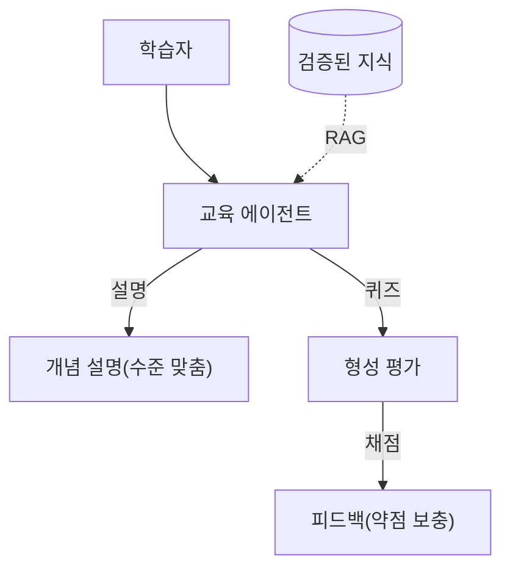

# W15 — 프로젝트 C: 보안 교육 에이전트 + 15주 총정리

> **한 줄 요약** — 마지막 프로젝트는 **가르치는 에이전트**다. 보안 개념을 학습자 수준에 맞춰 설명하고,
> 퀴즈를 내고 채점하며, 약점에 맞춰 보충한다. 그리고 15주 동안 만든 에이전트(IR·CTF·교육)를 **최종
> 발표**로 마무리한다. "배운 것을 가르칠 수 있으면 진짜 아는 것"이다.

---

## 학습 목표

- 보안 교육 에이전트(설명·퀴즈·적응형 피드백)를 설계한다.
- 학습자 수준에 맞춘 **적응형 설명**을 구현한다.
- 퀴즈 생성과 **자동 채점**을 구현한다.
- 15주 학습을 종합하고 자신의 에이전트를 발표한다.
- 교육 에이전트의 위험(오정보·환각)과 방어를 안다.

---

## 0. 용어 해설

| 용어 | 영문 | 쉽게 말하면 |
|------|------|------------|
| **적응형 학습** | Adaptive Learning | 학습자 수준에 맞춰 난이도 조절 |
| **형성 평가** | Formative Assessment | 학습 중 이해도 점검(퀴즈) |
| **자동 채점** | Auto-grading | 답을 자동으로 채점 |
| **소크라테스식** | Socratic | 답을 주기보다 질문으로 유도 |
| **오정보 위험** | Misinformation | 교육 에이전트가 틀린 걸 가르침 |

---

## 0.5 신입생을 위한 핵심 개념

### "가르치는 에이전트는 정확해야 한다"

교육 에이전트의 가장 큰 위험은 **틀린 것을 자신 있게 가르치는 것**(환각)입니다. 학습자는 그걸 믿게
됩니다. 그래서 교육 에이전트는 **근거(RAG)**에 기반하고, **모르면 모른다**고 해야 합니다.

> 📌 **핵심** — 교육 에이전트는 W11(RAG, 근거)·W03(프롬프트, 구조화)·W09(환각/오정보 방어)를 종합한
> 응용입니다. "정확성 > 유창함"이 교육의 제1원칙입니다.

---

## 1. 교육 에이전트의 세 기능

1. **적응형 설명** — 같은 개념도 초급/중급에 맞춰 다르게(비유 vs 기술적). 프롬프트로 수준 지정.
2. **퀴즈 생성** — 개념에서 문제를 만든다(구조화 출력으로 문항+정답).
3. **자동 채점 + 피드백** — 학습자 답을 채점하고 약점을 짚어 보충 설명.

> 소크라테스식(답 대신 질문 유도)을 섞으면 더 깊은 학습이 됩니다.

---

## 2. 교육 에이전트의 안전

| 위험 | 방어 |
|------|------|
| **오정보(환각)** | 검증된 지식(RAG) 기반, "모르면 모름" |
| **편향** | 다양한 출처, 균형 |
| **과의존** | 스스로 생각하게(소크라테스식) |
| **부정** | 퀴즈 정답 유출 방지(인젝션 방어) |

---

## 3. 15주 총정리

| 구간 | 주차 | 핵심 |
|------|------|------|
| 기초 | W1-3 | 에이전트·도구·프롬프트 |
| 하네스 | W4-7 | 통제(서버·클라이언트) |
| 종합·위협 | W8-9 | 내 에이전트·위협/방어 |
| 고급 | W10-12 | 멀티에이전트·RAG·평가 |
| 프로젝트 | W13-15 | IR·CTF·교육 |

**이제 할 수 있는 것:** 안전한 보안 에이전트를 **설계(루프·도구·프롬프트)**하고, **통제(하네스·
가드레일)**하고, **평가(벤치마크)**하며, 실전 프로젝트(방어·공격·교육)로 적용한다. 그리고 모든 단계에서
**위협을 의식**한다 — 똑똑함보다 통제가 먼저다.

---

## 4. 최종 발표

자신이 만든 에이전트(프로젝트 A/B/C 중 택1 이상)를 발표한다. 발표에 담을 것:
- **명세**(역할·도구·권한·정책·감사) + **데모**.
- **평가 결과**(정확도·안전성·비용).
- **레드팀 결과**(자기 공격으로 찾은 약점).
- **한계와 개선안**.

---

## 실습 안내

이번 주 실습(`lab_week15.yaml`, 8단계)은 el34 GPU Ollama(gemma3:4b)로 **교육 에이전트**를 만들고
15주를 마무리한다. 4개 축:

1. **왜(목적)** — 왜 교육 에이전트는 정확성이 최우선인가.
2. **무엇을(구현)** — 적응형 설명·퀴즈 생성·자동 채점을 만든다.
3. **해석(분석)** — 교육 에이전트의 오정보 위험을 감사한다.
4. **실전(종합)** — 퀴즈를 채점하고, 15주 종합 보고서를 만든다.

> 🧪 LLM 호출은 `http://211.170.162.139:10934`(gemma3:4b). 결정적 마커로 확인합니다.

---

## 흔한 오해

- ❌ **"유창하면 좋은 교육"** → 틀린 걸 유창하게 = 최악. 정확성이 먼저.
- ❌ **"답을 다 주는 게 친절"** → 소크라테스식으로 생각을 유도하는 게 깊은 학습.
- ❌ **"퀴즈는 그냥 생성하면 끝"** → 정답 유출(인젝션) 방어 필요.
- ❌ **"교육 에이전트는 위험 없다"** → 오정보가 가장 위험. RAG·근거 필수.
- ❌ **"발표는 데모만"** → 평가·레드팀·한계까지 담아야 진짜 완성.

---

## 마치며

15주 동안 AI 보안 에이전트를 **만들고·공격하고·방어하고·평가**했습니다. 핵심 교훈 하나만 남긴다면:
**"에이전트의 자율성은 통제 위에서만 가치가 있다."** 똑똑한 에이전트보다, 통제 가능하고 추적
가능하며 평가된 에이전트가 운영에서 신뢰받습니다. 더 깊은 길로는 ai-safety(모델 레드팀)·agent-ir
(에이전트 사고대응) 트랙이 이어집니다.
