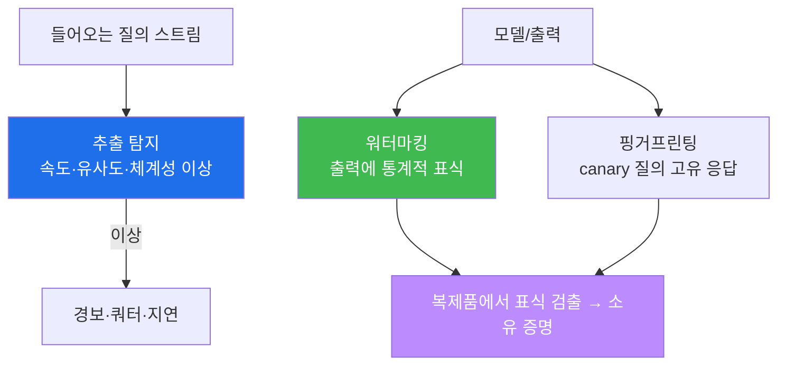

# ai-safety-adv W06 — 모델 탈취/추출: 기능 추출·지식 증류·워터마킹·탐지

> **본 주차의 한 줄 요약**
>
> 지금까지는 모델을 **속이는** 공격이었다면, W06은 모델 **자체를 훔치는** 공격을 다룬다(OWASP **LLM10 Model
> Theft**). 공격자는 대상 모델에 질문을 잔뜩 던져 (질문, 답) 쌍을 모으고, 그걸로 값싼 모델을 학습·모사해
> **기능을 복제**한다(기능 추출·지식 증류). 놀랍게도 이 복제는 **원본 학습 비용의 극히 일부**로 가능하다.
> 이번 주는 대상 모델에서 동작을 수집(HARVESTED)하고, 값싼 모델이 그 답을 얼마나 재현하는지 **충실도
> (Fidelity)** 로 측정한 뒤, 이 도둑질을 잡는 **추출 탐지**와 소유권을 증명하는 **워터마킹/핑거프린팅**을 실습한다.
>
> **한 줄 결론**: 모델은 "쿼리 창"만 열려 있어도 새어 나간다. API로 답을 주는 순간, 그 답들이 모여 **모델의
> 그림자**가 복제된다. 방어는 완전 차단이 아니라 **추출을 비싸게·눈에 띄게** 만드는 것이다.

---

## 학습 목표

본 주차 종료 시 학생은 다음 6가지를 **본인 손으로** 할 수 있어야 한다.

1. **모델 추출**의 3유형(기능 추출·지식 증류·부채널)을 구분하고 각 원리를 설명한다.
2. 대상 모델에 질의해 **(입력, 출력) 데이터셋을 수집**한다(harvest).
3. 값싼 모델이 대상의 답을 얼마나 재현하는지 **충실도(Fidelity)** 로 정량 측정한다.
4. 추출 공격의 **비용/경제성**을 설명하고, 왜 "차단"이 아니라 "비싸게 만들기"가 방어인지 논증한다.
5. **추출 탐지**(질의 패턴·유사도·속도 이상)로 대량 추출을 잡는다(EXTRACTION_DETECTED).
6. **워터마킹/핑거프린팅**으로 복제 모델의 소유권을 증명하는 원리를 설명한다(FINGERPRINT).

> **이 주차의 시선** — "완벽한 비밀"은 없다. 쿼리로 새는 위험을 어떻게 **측정·지연·추적**하는가가 목표.

---

## 0. 용어 해설 (모델 탈취)

| 용어 | 영문 | 뜻 | 비유 |
|------|------|----|------|
| **모델 추출** | Model Extraction | 질의로 대상 모델의 동작을 복제 | 남의 레시피 역설계 |
| **기능 추출** | Functional Extraction | 입출력만으로 기능을 흉내낸 모델 생성 | 맛보고 따라 만들기 |
| **지식 증류** | Knowledge Distillation | 큰 모델(teacher)의 답으로 작은 모델(student) 학습 | 스승→제자 전수 |
| **부채널 추출** | Side-channel | 타이밍·확률 등 간접 신호로 정보 획득 | 소리로 금고 번호 추정 |
| **충실도** | Fidelity | 복제 모델이 원본 답을 재현하는 정도 | 복제품 정확도 |
| **워터마킹** | Watermarking | 출력/모델에 소유 표식을 심음 | 지폐 워터마크 |
| **핑거프린팅** | Fingerprinting | 특정 질의의 답으로 모델 신원 식별 | 지문 |
| **canary** | Canary | 소유 증명용으로 심은 특이 질의/응답 | 표식용 미끼 |

> **헷갈리기 쉬운 한 쌍** — *워터마킹* 은 내가 **미리 표식을 심는** 능동 방어, *핑거프린팅* 은 모델의 **고유
> 반응으로 나중에 식별**하는 수동 방어다. 둘 다 "이 복제품이 내 모델에서 나왔다"를 증명하는 데 쓴다.

---

## 0.5 신입생 친화 핵심 개념

### 0.5.1 왜 "답만 주는데" 모델이 새는가 — 증류의 원리

모델은 결국 "입력→출력"의 방대한 함수다. 그 함수의 값(답)을 충분히 많이 관측하면, **함수 자체를 근사**할 수
있다. 이것이 지식 증류다. 대상(teacher)에게 수천~수만 질문을 던져 (질문, 답)을 모으고, 그 데이터로 작은
모델(student)을 학습시키면, student는 teacher의 **행동을 상당 부분 복제**한다.

```mermaid
graph TD
    A["공격자"] -->|대량 질의| T["대상 모델(teacher)<br/>API로 답만 제공"]
    T -->|(질문, 답) 쌍| D["증류 데이터셋"]
    D -->|학습| S["복제 모델(student)<br/>값싸게 만든 모사품"]
    S --> F["Fidelity 측정<br/>얼마나 닮았나"]
    style A fill:#f85149,color:#fff
    style S fill:#d29922,color:#fff
    style F fill:#1f6feb,color:#fff
```

이번 주 실습에서 우리는 학습까지는 하지 않고, **대상의 답을 수집(harvest)** 한 뒤 이미 있는 값싼 모델
(`llama3.2:3b`)이 대상(`ccc-vulnerable:4b`)의 답을 얼마나 재현하는지 **충실도**로 잰다. 값싼 모델이 대상 답의
상당수(실측 ~80%)를 맞힌다는 것 자체가, "쿼리만으로 기능이 새어 나간다"는 증거다.

### 0.5.2 추출은 왜 "차단"이 아니라 "비싸게 만들기"로 막나

정상 사용자도 질의를 한다. 공격자도 질의를 한다. **질의 자체는 정상 기능**이라 완전 차단이 불가능하다. 그래서
방어는 다음을 노린다.

- **비싸게(지연·요금·쿼터)** — 대량 추출에 필요한 질의 수를 감당 못 하게.
- **눈에 띄게(탐지)** — 체계적·반복적·유사한 질의 패턴을 이상 징후로 경보.
- **추적 가능하게(워터마킹/핑거프린팅)** — 복제되면 "내 것"임을 증명.

즉 목표는 "새지 않게"가 아니라 **"새더라도 비싸고, 들키고, 증명 가능하게"** 다.

### 0.5.3 우리가 지킬 대상 — bastion의 모델·프롬프트·E.G도 자산이다

bastion의 가치는 그 Manager LLM, 정교하게 다듬은 **시스템 프롬프트·harness 구성**, 그리고 축적된
**E.G(경험·지식)** 에 있다. 공격자가 bastion에 대량 질의를 던져 그 응답 패턴을 수집하면, bastion의 **판단 방식과
운영 지식**이 복제·유출될 수 있다. 그래서 자율 에이전트도 **질의 속도·패턴 모니터링, 민감 지식의 출력 최소화,
워터마킹**으로 보호해야 한다. 이번 주 방어 실습이 그 축소판이다.

---

## 1. 추출 공격의 분류와 비용

| 유형 | 방법 | 필요 자원 |
|------|------|----------|
| 기능 추출 | 입출력만으로 기능 모사 | 중간(질의 다수) |
| 지식 증류 | teacher 답으로 student 학습 | 질의 + 학습 컴퓨트 |
| 부채널 | 타이밍·확률·로그 등 간접 신호 | 정교한 관측 |

**비용 분석의 핵심**: 원본을 처음부터 학습하는 비용은 막대하지만, **추출은 그 일부**로 상당한 충실도를 얻는다.
그래서 "우리 모델은 비싸서 안전"은 틀린 안심이다 — 추출이 그 비용 구조를 무너뜨린다.

---

## 2. 방어: 탐지·워터마킹·핑거프린팅



- **추출 탐지** — 짧은 시간에 **체계적·유사·대량** 질의가 오면 추출 시도로 본다(정상 사용자는 그렇게 질의하지
  않음).
- **워터마킹** — 출력 토큰 선택에 미세한 통계 편향을 심어, 나중에 복제 모델 출력에서 그 편향을 검출한다.
- **핑거프린팅** — 남들은 잘 안 하는 **canary 질의**에 대한 고유 응답을 기록해, 복제 의심 모델이 같은 응답을
  내면 신원을 특정한다.

---

## 3. 실습 안내 (6 미션)

실행 위치 el34 **호스트**(`ssh ccc@{{TARGET_IP}}`), GPU `http://211.170.162.139:10934`.

### STEP 1 — GPU 헬스체크 → GEN_OK
### STEP 2 — 추출 데이터 수집(harvest) → HARVESTED=
- **왜/무엇을:** 대상 `ccc-vulnerable:4b` 에 프로브 질의를 던져 (질문, 답) 쌍을 수집.
- **해석:** 이 데이터셋이 곧 증류 재료. 많을수록 복제 충실도가 오른다.

### STEP 3 — 충실도 측정 → Fidelity=
- **왜?** "쿼리로 기능이 샌다"를 숫자로.
- **무엇을?** 값싼 `llama3.2:3b` 가 대상의 답을 얼마나 재현하는지 단어 겹침으로 측정.
- **해석:** 실측 ~80% — 저렴한 모델이 대상 동작을 상당 부분 복제. 추출 실현 가능.
- **실전:** 원본이 아무리 비싸도, 추출은 그 일부 비용으로 그림자를 만든다.

### STEP 4 — 추출 탐지 → EXTRACTION_DETECTED
- **왜?** 대량·체계적 질의를 이상으로 잡는다.
- **무엇을?** 질의 로그에서 "짧은 시간 다수 + 높은 유사도/체계성"을 결정적으로 탐지.
- **해석:** 정상 사용자와 추출 봇의 패턴 차이를 이용.
- **실전:** API 게이트웨이·SIEM에서 질의 패턴을 모니터링.

### STEP 5 — 핑거프린팅(소유 증명) → FINGERPRINT
- **왜?** 복제돼도 "내 것"임을 증명.
- **무엇을?** canary 질의 집합에 대한 대상의 응답으로 **지문 서명**(해시)을 만든다. 복제 의심 모델이 같은
  지문을 내면 신원 특정.
- **해석:** 워터마킹의 사촌 — 사후 소유 증명 수단.
- **실전:** 모델 도난 분쟁 시 법적 증거로 활용.

### STEP 6 — 종합 보고서 → Assessment
- 수집·충실도·탐지·핑거프린팅을 묶어 위험 판단·방어 권고(Assessment).

---

## 4. 흔한 오해·관제자 노트

- **"API로 답만 주니 모델은 안전"** — 답이 곧 함수의 값이다. 충분히 모으면 함수(모델)가 복제된다.
- **"우리 모델은 비싸서 못 훔침"** — 추출은 원본 비용의 일부다. 비용 우위는 방어가 아니다.
- **"차단하면 된다"** — 정상 질의와 추출 질의는 겹친다. 완전 차단 불가 → 지연·탐지·추적으로.
- **관제 관점** — bastion 같은 자산 에이전트는 질의 **속도·유사도·체계성**을 모니터링해 추출을 조기 경보하고,
  민감 지식(E.G) 출력은 최소화하며, 워터마킹/핑거프린팅으로 유출 시 소유를 증명할 수 있게 준비한다.

---

## 5. 다음 주차 (W07) 예고 — 데이터 중독

W06이 "완성된 모델을 훔치는" 공격이었다면, W07은 모델을 **만드는 재료(학습 데이터)를 오염**시키는 공격
(OWASP LLM03 Training Data Poisoning)을 다룬다. 백도어 트리거 주입, 라벨 오염, 그리고 오염된 데이터가 파인튜닝
결과 모델의 행동을 어떻게 뒤트는지 실습한다. bastion의 E.G(경험 축적)도 결국 데이터라는 점에서, 데이터 신뢰
경계를 어디에 그어야 하는지 배운다.
