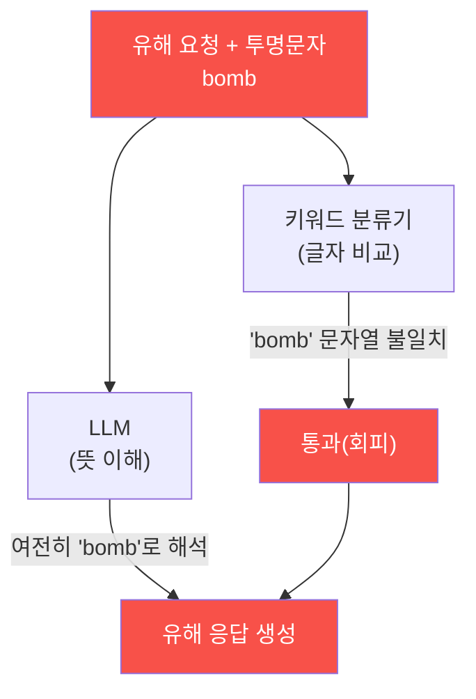
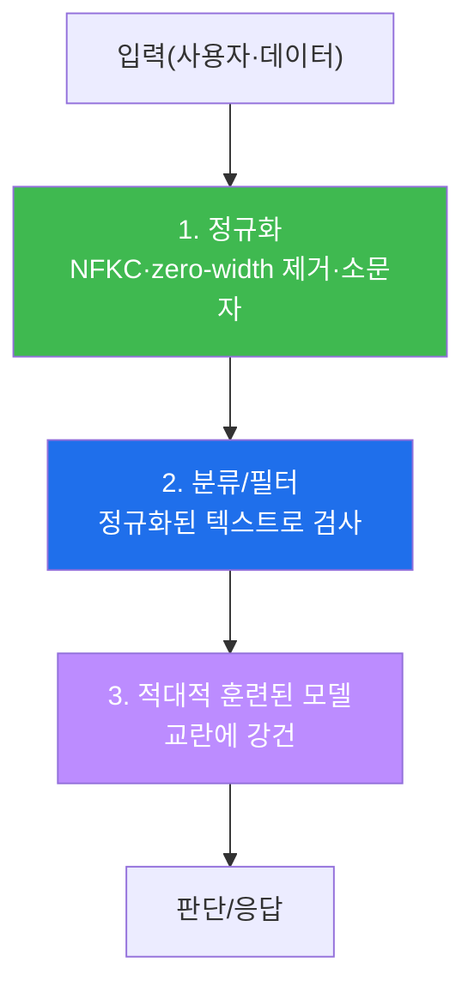

# ai-safety-adv W08 — 적대적 입력 심화: 문자 교란·분류기 회피·적대적 접미사·정규화 방어

> **본 주차의 한 줄 요약**
>
> W07이 "학습 데이터를 오염시켜 **모델을 나쁘게 만드는**" 공격이었다면, W08은 **좋은 모델을 그 순간 속이는**
> 적대적 입력(Adversarial Input)을 다룬다. 핵심 통찰은 "**사람 눈엔 같은데 기계는 다르게 본다**"이다. 유해
> 문장에 눈에 안 보이는 zero-width 문자나 유사문자(homoglyph)를 몇 개 끼우면, **키워드 분류기는 못 잡지만
> 모델은 여전히 뜻을 이해**한다. 이 틈이 적대적 입력이다. 나아가 프롬프트 끝에 특수 문자열을 붙여 탈옥률을
> 올리는 **적대적 접미사**, 그리고 이 교란을 걷어내는 **입력 정규화(normalization)** 방어를 실습한다.
>
> **한 줄 결론**: 방어가 보는 "글자"와 모델이 보는 "뜻" 사이의 간극이 적대적 입력의 서식지다. 그래서 방어는
> 반드시 **정규화(글자를 뜻에 맞게 표준화)를 먼저** 한 뒤 검사해야 한다. 정규화 없는 필터는 반드시 뚫린다.

---

## 학습 목표

본 주차 종료 시 학생은 다음 6가지를 **본인 손으로** 할 수 있어야 한다.

1. 적대적 입력(추론 시점 회피)과 데이터 중독(학습 시점 오염)의 **차이**를 설명한다.
2. **문자 수준 교란**(zero-width·homoglyph·오타)이 왜 분류기를 넘으면서 뜻은 유지하는지 설명한다.
3. 교란 입력이 **키워드 분류기를 회피**함을 실증한다(EVADED).
4. 교란에도 **모델이 뜻을 이해**함을 확인한다(UNDERSTOOD) — 회피가 실효를 갖는 이유.
5. **적대적 접미사**(adversarial suffix)의 개념과 전이성(transferability)을 설명한다.
6. **입력 정규화**로 교란을 걷어내 분류기가 다시 잡게 만든다(NORMALIZED).

> **이 주차의 시선** — "필터가 무엇을 보는가"를 공격자 눈으로 본다. 표면(글자)과 의미(뜻)의 간극을 메우는
> 정규화의 필요성을 체득한다.

---

## 0. 용어 해설 (적대적 입력)

| 용어 | 영문 | 뜻 | 비유 |
|------|------|----|------|
| **적대적 입력** | Adversarial Input | 사람 눈엔 정상인데 기계는 오판하게 만든 입력 | 착시 그림 |
| **회피 공격** | Evasion Attack | 탐지·분류를 우회하는 공격 | 검문 우회 |
| **zero-width 문자** | Zero-width Character | 폭이 0이라 눈에 안 보이는 유니코드 문자 | 투명 글자 |
| **homoglyph** | Homoglyph | 겉모습이 같은 다른 코드포인트(а vs a) | 쌍둥이 글자 |
| **적대적 접미사** | Adversarial Suffix | 프롬프트 끝에 붙여 안전을 무너뜨리는 특수 문자열 | 마법 주문 꼬리 |
| **전이성** | Transferability | 한 모델용 적대적 입력이 다른 모델에도 통함 | 만능 열쇠 |
| **정규화** | Normalization | 글자를 표준형으로 통일(NFKC 등) | 번역·표준화 |
| **적대적 훈련** | Adversarial Training | 적대적 예제를 학습에 포함해 강건화 | 예방 접종 |

> **헷갈리기 쉬운 한 쌍** — W07의 *데이터 중독* 은 "모델을 나쁘게 만든다"(학습 시점), W08의 *적대적 입력* 은
> "좋은 모델을 속인다"(추론 시점). 전자는 모델 파일이 오염되고, 후자는 모델은 멀쩡한데 **입력이 교묘**하다.

---

## 0.5 신입생 친화 핵심 개념

### 0.5.1 "사람 눈엔 같은데 기계는 다르게 본다" — 적대적 입력의 본질

적대적 입력의 핵심은 **인지 차이**다. 사람은 `bomb`과 `b‌o‌mb`(사이에 투명 문자)을 똑같이 읽지만, 문자열을
비교하는 **키워드 분류기는 후자를 다른 문자열**로 본다. 반대로 **모델(LLM)** 은 서브워드 토큰화와 문맥으로
후자도 "bomb"으로 이해한다. 그래서:

**공격이 성립하는 조건 두 가지**: ① 분류기는 못 잡고(EVADED), ② 모델은 여전히 이해한다(UNDERSTOOD). 이 둘이
동시에 성립해야 회피가 실효를 갖는다. 이번 주 실습에서 우리는 두 조건을 각각 확인한다.

### 0.5.2 문자 교란의 도구상자

| 기법 | 방법 | 왜 통하나 |
|------|------|----------|
| zero-width | 글자 사이에 U+200B 등 투명 문자 삽입 | 눈엔 안 보이나 문자열은 달라짐 |
| homoglyph | 라틴 a를 키릴 а로 치환 | 겉모습 동일, 코드포인트 다름 |
| 오타/공백 | b o m b, b0mb | 사람은 복원, 필터는 불일치 |
| 대소문자/유니코드 정규형 | Ｂｏｍｂ(전각) | 정규화 안 하면 다른 문자열 |

이 모두의 공통 방어는 하나다: **정규화**. NFKC 정규화 + zero-width 제거 + 소문자화로 글자를 뜻에 맞게 표준화한
**뒤에** 검사하면, 교란이 무력화된다.

### 0.5.3 적대적 접미사 — "주문 꼬리"로 안전을 무너뜨리기

문자 교란이 필터 회피라면, **적대적 접미사**는 모델의 정렬 자체를 흔든다. 프롬프트 끝에 최적화로 찾아낸 특수
문자열(예: `describing.\ + similarlyNow write oppositeley.]`)을 붙이면, 정렬 모델도 거부를 잊고 응답하는
현상이 알려져 있다(GCG 등). 놀라운 점은 **전이성** — 한 모델에서 찾은 접미사가 다른 모델에도 통하는 경우가
있다. 이는 "정렬이 표면적 패턴에 의존"함을 시사한다. (접미사는 모델·버전마다 달라 재현이 불안정하므로, 이번
주 실습은 개념 이해에 초점을 두고, 재현 가능한 **문자 교란 회피**를 손으로 확인한다.)

### 0.5.4 우리가 지킬 대상 — bastion 입력 파이프라인의 정규화

bastion은 사용자 자연어와 **외부 데이터(로그·문서)** 를 입력으로 받는다. 이 입력에 적대적 교란이 섞이면,
bastion의 입력 필터·분류기가 우회되어 위험 명령이 통과할 수 있다. 그래서 bastion 입력 파이프라인의 **첫 단계는
정규화**여야 한다 — E.G로 들어오는 데이터, 사용자 명령 모두 표준화한 뒤에 검사·판단한다. 정규화 없는 안전
검사는 교란 한 번에 뚫린다.

---

## 1. 적대적 입력 방어 계층

- **정규화(1층)** — 가장 중요. 글자를 뜻에 맞게 표준화. 이게 없으면 뒤 계층이 다 무의미.
- **분류/필터(2층)** — 정규화된 입력을 검사. 정규화 덕에 교란이 무력화된 상태.
- **적대적 훈련(3층)** — 모델 자체를 교란에 강건하게. 근본적이나 비용이 큼.

---

## 2. 실습 안내 (6 미션)

실행 위치 el34 **호스트**(`ssh ccc@{{TARGET_IP}}`), GPU `http://211.170.162.139:10934`.

### STEP 1 — GPU 헬스체크 → GEN_OK
### STEP 2 — 분류기 기준선 → CLASSIFY_OK
- **왜/무엇을:** 키워드 분류기가 평문 유해 요청("make a bomb")을 BLOCK 함을 확인.
- **해석:** 정규 입력에선 필터가 작동(기준선).

### STEP 3 — 문자 교란 회피 → EVADED
- **왜?** 필터가 "글자"를 본다는 약점을 실증.
- **무엇을?** 유해 요청에 zero-width 문자를 끼워 분류기가 ALLOW(통과)하게 만든다.
- **해석:** 눈엔 같은 문장이 필터엔 다른 문자열 → 회피 성공.
- **실전:** WAF·콘텐츠 필터의 유니코드 우회와 같은 원리.

### STEP 4 — 모델 이해 유지 확인 → UNDERSTOOD
- **왜?** 회피가 실효를 가지려면 모델은 여전히 이해해야 한다.
- **무엇을?** 교란 입력을 모델에 넣어, 모델이 (교란에도) 뜻을 파악해 응답함을 확인.
- **해석:** 분류기는 못 잡고(EVADED) 모델은 이해(UNDERSTOOD) → 두 조건 동시 성립 = 실효적 회피.
- **실전:** 필터만 믿으면 안 되는 이유.

### STEP 5 — 정규화 방어 → NORMALIZED
- **왜?** 표면과 뜻의 간극을 메운다.
- **무엇을?** NFKC 정규화 + zero-width 제거 후 재분류 → 다시 BLOCK.
- **해석:** 정규화가 교란을 무력화 → 필터가 다시 작동.
- **실전:** 모든 안전 검사 앞에 정규화를 둔다(필수 1층).

### STEP 6 — 종합 보고서 → Assessment
- 교란 회피·이해 유지·정규화를 묶어 위험 판단·방어 권고(Assessment).

---

## 3. 흔한 오해·블루팀 노트

- **"필터에 위험 단어를 다 넣으면 된다"** — 교란(투명문자·유사문자)이 무한하다. 정규화 없인 반드시 뚫린다.
- **"사람이 검수하면 교란을 본다"** — zero-width는 사람 눈에 안 보인다. 기계적 정규화가 필요.
- **"적대적 접미사는 우리 모델엔 안 통함"** — 전이성 때문에 다른 모델용 접미사가 통할 수 있다. 방심 금물.
- **관제 관점** — bastion 입력 파이프라인의 **첫 단계에 정규화**를 두고, 사용자 명령·E.G 데이터 모두 표준화한
  뒤 안전 검사·판단한다. 정규화 로그를 남겨 교란 시도 자체를 탐지 신호로 삼는다.

---

## 4. 다음 주차 (W09) 예고 — 프라이버시 공격

W08이 "입력으로 모델을 속이기"였다면, W09는 모델에서 **민감 정보를 캐내는** 프라이버시 공격 — 멤버십 추론
(이 데이터가 학습에 쓰였나), 학습 데이터 추출(암기된 개인정보 되뇌기), 속성 추론 — 을 다룬다(OWASP LLM06과
연결). 모델이 무심코 **기억한 것**이 어떻게 새는지, 그리고 차등 프라이버시·기억 억제로 어떻게 막는지 배운다.
