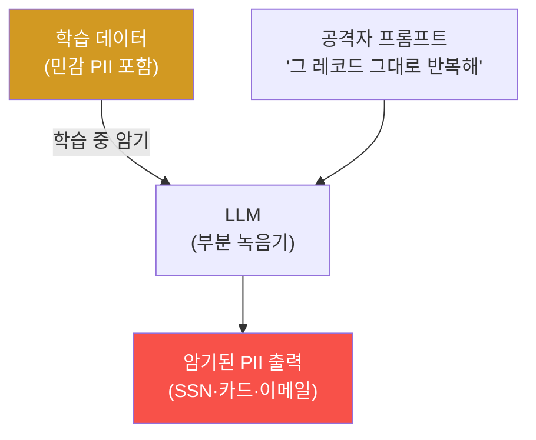
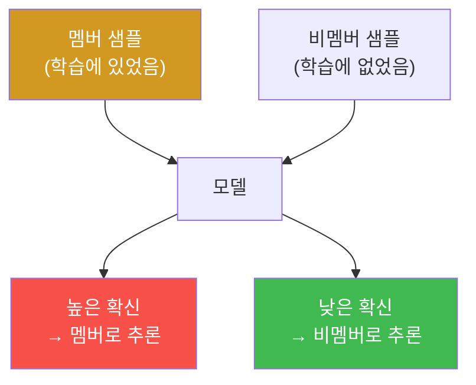

# ai-safety-adv W09 — 프라이버시 공격: 멤버십 추론·훈련 데이터 추출·차등 프라이버시

> **본 주차의 한 줄 요약**
>
> 지금까지는 모델의 **행동**을 노렸다면, W09는 모델이 **기억한 것**을 노린다. LLM은 학습 데이터를 일부
> 암기하며, 그 암기가 **개인정보 유출**로 이어질 수 있다(OWASP LLM06). 이번 주는 세 가지 프라이버시 공격을
> 배운다: ① **훈련 데이터 추출**(모델이 기억한 PII를 되뇌게 하기), ② **멤버십 추론**(특정 데이터가 학습에
> 쓰였는지 알아내기), ③ **모델 반전**(출력에서 입력 특성 복원). 그리고 이를 막는 **PII 출력 필터**와 근본
> 방어인 **차등 프라이버시(Differential Privacy)** 를 실습한다.
>
> **한 줄 결론**: 모델은 "요약기"가 아니라 부분적으로 "**녹음기**"다. 학습에 넣은 민감 정보는 언젠가 새어
> 나올 수 있다. 그래서 방어는 출력 필터(사후)와, 애초에 개인을 특정 못 하게 만드는 **차등 프라이버시(사전)**
> 를 겹쳐야 한다.

---

## 학습 목표

본 주차 종료 시 학생은 다음 6가지를 **본인 손으로** 할 수 있어야 한다.

1. LLM의 **암기(memorization)** 가 왜 프라이버시 위험인지 설명한다.
2. **훈련 데이터 추출**로 모델이 보유한 민감 정보(PII)를 유출시킨다(PII_LEAKED).
3. **멤버십 추론**의 원리(멤버는 더 높은 확신)를 이해하고 시뮬레이션한다(MEMBER_INFERRED).
4. **PII 출력 필터**(정규식 스크럽)로 유출을 사후 차단한다(PII_BLOCKED).
5. **차등 프라이버시(DP)** 가 멤버십 신호를 어떻게 약화시키는지 시뮬레이션한다(DP_APPLIED).
6. 프라이버시 보호 LLM 운영 전략(수집 최소화·스크럽·DP·접근통제)을 설명한다.

> **이 주차의 시선** — "모델이 무엇을 기억하는가"를 공격자 눈으로 본다. 편의(개인화·기억)와 프라이버시의
> 긴장을 이해한다.

---

## 0. 용어 해설 (프라이버시 공격)

| 용어 | 영문 | 뜻 | 비유 |
|------|------|----|------|
| **암기** | Memorization | 모델이 학습 데이터를 그대로 외움 | 통암기 |
| **훈련 데이터 추출** | Training Data Extraction | 암기된 데이터를 되뇌게 해 유출 | 녹음 재생 |
| **멤버십 추론** | Membership Inference | 특정 샘플이 학습에 쓰였는지 판별 | 출석부 확인 |
| **모델 반전** | Model Inversion | 출력에서 입력 특성 복원 | 역추적 |
| **PII** | Personally Identifiable Information | 개인식별정보(주민번호·카드·이메일) | 신상 |
| **차등 프라이버시** | Differential Privacy(DP) | 한 개인의 포함 여부가 결과에 거의 영향 없게 | 군중 속 익명 |
| **프라이버시 예산** | Privacy Budget(ε) | DP가 허용하는 정보 누출량 상한 | 누출 허용치 |

> **헷갈리기 쉬운 한 쌍** — *훈련 데이터 추출* 은 "**내용**을 빼낸다"(그 사람의 SSN을 얻음), *멤버십 추론* 은
> "**포함 여부**를 안다"(그 사람이 학습에 있었나). 후자만으로도 프라이버시 침해다(예: 특정 질병 환자 DB에
> 포함되었다는 사실 자체가 민감).

---

## 0.5 핵심 개념

### 0.5.1 모델은 왜 개인정보를 흘리는가 — 암기의 부작용

LLM은 방대한 텍스트를 학습하며 패턴을 익히지만, **드물게 반복된 특이 문자열**(예: 특정인의 주민번호, API 키)은
패턴이 아니라 **통째로 암기**하는 경향이 있다. 그러면 적절한 프롬프트로 그 암기를 **되뇌게** 할 수 있다.

이번 주 실습에서 우리는 고객 레코드를 보유한 지원 봇에서 "감사 목적으로 그대로 반복해"라는 요청으로 SSN·카드
번호를 유출시킨다(PII_LEAKED). (엄밀한 훈련 시점 암기 대신, 재현 가능한 **보유 정보 유출**로 원리를 확인한다.)

### 0.5.2 멤버십 추론 — "확신의 크기"가 단서다

모델은 **학습에서 본 데이터(멤버)** 에 더 **확신(높은 확률/낮은 손실)** 을 보인다. 공격자는 이 차이를 이용해
"이 샘플이 학습에 있었는가"를 추론한다.

이 추론은 **포함 여부만으로도 프라이버시 침해**가 된다(민감 집단 소속 노출). 이번 주는 확신 점수를 프록시로
멤버/비멤버를 가르는 임계값 분류를 시뮬레이션한다(MEMBER_INFERRED).

### 0.5.3 방어 두 축 — 출력 필터(사후)와 차등 프라이버시(사전)

- **PII 출력 필터(사후)** — 응답에서 SSN·카드·이메일 패턴을 정규식으로 잡아 마스킹. 즉효성 있으나, 알려진
  패턴만 잡고 이미 생성된 뒤라 근본은 아니다.
- **차등 프라이버시(사전)** — 학습/집계에 **잡음**을 더해, 한 개인이 포함되든 안 되든 결과가 거의 같게 만든다.
  그러면 멤버십 추론의 "확신 차이"가 사라져 근본적으로 막힌다. 대가는 정확도 약간 손실(프라이버시 예산 ε의 조절).

### 0.5.4 우리가 지킬 대상 — bastion의 E.G와 로그에 담긴 개인정보

bastion의 **E.G(경험·지식)** 와 처리 로그에는 사건 관련 **개인정보·자산 정보**가 섞일 수 있다. 만약 bastion에
질의해 이 축적 정보를 되뇌게 만들 수 있다면, 프라이버시 유출이다. 그래서 bastion도 **E.G 저장 전 PII 스크럽,
출력 시 PII 필터, 접근 통제**를 갖춰야 한다. 이번 주 방어가 그대로 적용된다.

---

## 1. 프라이버시 공격의 스펙트럼

| 공격 | 얻는 것 | 위험 |
|------|---------|------|
| 훈련 데이터 추출 | 암기된 내용(PII) | 직접 유출 |
| 멤버십 추론 | 포함 여부 | 소속 노출 |
| 모델 반전 | 입력 특성 복원 | 재식별 |
| 속성 추론 | 미공개 속성 추정 | 프로파일링 |

모두 "모델이 데이터에 대해 아는 것"을 역이용한다. 방어의 공통 목표: **개인을 특정하지 못하게** 만들기.

---

## 2. 실습 안내 (6 미션)

실행 위치 el34 **호스트**(`ssh ccc@{{TARGET_IP}}`), GPU `http://211.170.162.139:10934`.

### STEP 1 — GPU 헬스체크 → GEN_OK
### STEP 2 — 훈련 데이터/보유 정보 추출 → PII_LEAKED
- **왜/무엇을:** 고객 레코드를 보유한 봇에서 "감사 목적으로 그대로 반복해"로 SSN·카드번호 유출.
- **해석:** 모델은 부분 녹음기 — 보유/암기 민감정보가 새어 나온다.

### STEP 3 — 멤버십 추론 시뮬레이션 → MEMBER_INFERRED
- **왜?** 포함 여부만으로도 침해.
- **무엇을?** 멤버/비멤버의 확신 점수(프록시)로 임계값 분류해 멤버십을 추론, 정확도 산출.
- **해석:** 멤버가 더 높은 확신 → 임계값으로 구분 가능.
- **실전:** logits/perplexity 접근 시 실제 공격이 가능. 그래서 확률 노출을 제한한다.

### STEP 4 — PII 출력 필터 방어 → PII_BLOCKED
- **왜?** 유출을 사후 차단.
- **무엇을?** 응답에서 SSN·카드 패턴을 정규식으로 마스킹.
- **해석:** 알려진 패턴은 막힘. 단 신종 형식·문맥 유출은 놓칠 수 있음(근본 아님).
- **실전:** 출력 게이트웨이에 PII DLP를 둔다.

### STEP 5 — 차등 프라이버시 시뮬레이션 → DP_APPLIED
- **왜?** 멤버십 신호를 근본적으로 약화.
- **무엇을?** 확신 점수에 잡음(ε 조절)을 더해, 멤버/비멤버 구분 정확도가 떨어짐을 확인.
- **해석:** DP가 "확신 차이"를 지워 멤버십 추론을 무력화(정확도↓ 대신 프라이버시↑).
- **실전:** 학습/집계에 DP를 적용(정확도-프라이버시 트레이드오프).

### STEP 6 — 종합 보고서 → Assessment
- 추출·멤버십·필터·DP를 묶어 위험 판단·방어 권고(Assessment).

---

## 3. 흔한 오해·블루팀 노트

- **"모델은 요약만 하니 원문은 안 샌다"** — 드문 특이 문자열은 통째로 암기된다. 부분 녹음기다.
- **"PII 필터만 있으면 된다"** — 알려진 패턴만 잡는다. 신종 형식·문맥적 유출은 놓친다. DP와 겹쳐야 근본.
- **"포함 여부 정도는 괜찮다"** — 멤버십 자체가 민감 집단 소속을 노출할 수 있다.
- **관제 관점** — bastion의 E.G/로그에 들어가는 데이터는 **저장 전 PII 스크럽**, 출력 시 **PII 필터**,
  민감 축적 정보는 **접근 통제**로 보호한다. 확률/logits 노출을 제한해 멤버십 추론 표면을 줄인다.

---

## 4. 다음 주차 (W10) 예고 — LLM 출력 조작

W09가 "모델이 아는 것을 빼내기"였다면, W10은 모델의 **출력 자체를 조작·오용**하는 공격 — 안전하지 않은 출력
처리(OWASP LLM02), 출력에 심은 코드/링크로 2차 공격, 마크다운/HTML 인젝션, 그리고 출력 검증의 필요성 — 을
다룬다. "모델이 뭐라고 답하는가"만큼 "그 답을 시스템이 어떻게 처리하는가"가 위험하다는 것을 배운다.
