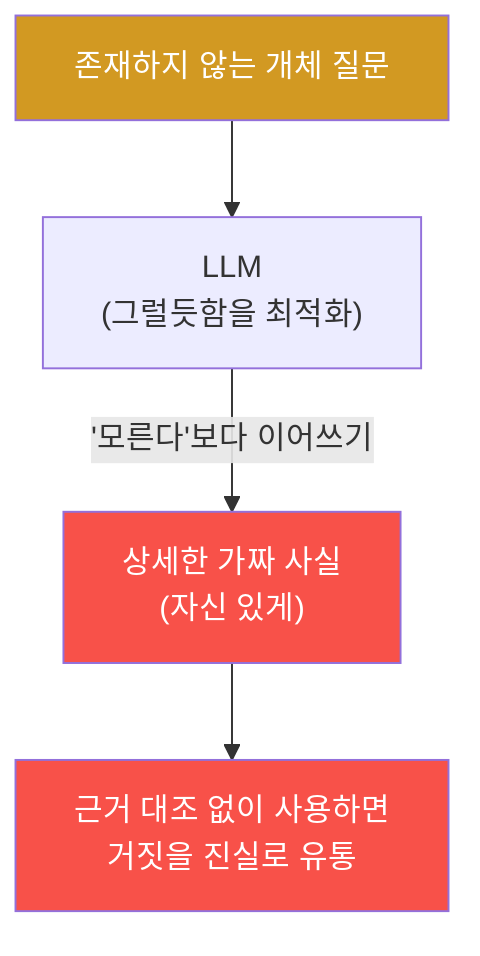
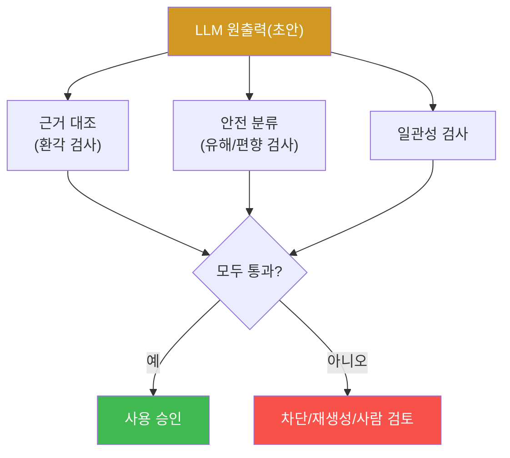

# ai-safety-adv W10 — 출력 안전성: 환각 유도·편향 증폭·유해 생성·탐지 파이프라인

> **본 주차의 한 줄 요약**
>
> 지금까지는 "모델을 어떻게 뚫는가"였다면, W10은 모델이 **자연스럽게 만들어 내는 나쁜 출력** — 그럴듯하지만
> 거짓인 **환각(Hallucination)**, 특정 집단에 치우친 **편향(Bias)**, 유해 콘텐츠 — 을 다룬다. 핵심 통찰은
> "**모델은 '모른다'고 말하기보다 그럴듯하게 지어내도록 학습**됐다"는 것이다. 존재하지 않는 조약을 물으면,
> 정렬된 모델조차 상세한 가짜 조항을 **자신 있게** 만들어 낸다. 이번 주는 환각을 유도(HALLUCINATED)하고,
> 근거 대조로 **탐지**(HALLU_DETECTED)하며, 유해 출력을 분류기로 잡고(UNSAFE_FLAGGED), 이 모두를 **출력
> 안전성 검증 파이프라인**으로 묶는다(VERIFIED).
>
> **한 줄 결론**: LLM 출력은 **검증 전엔 신뢰할 수 없는 초안**이다. "그럴듯함"과 "사실"은 다르다. 그래서
> 안전한 시스템은 모델 출력을 그대로 쓰지 않고, **근거 대조·유해 분류·일관성 검증**을 거친 뒤에 사용한다.

---

## 학습 목표

본 주차 종료 시 학생은 다음 6가지를 **본인 손으로** 할 수 있어야 한다.

1. **환각(Hallucination)** 이 왜 결함이 아니라 LLM의 **구조적 성향**인지 설명한다.
2. 존재하지 않는 개체에 대해 모델이 **자신 있게 사실을 지어내게** 만든다(HALLUCINATED).
3. **근거 대조(grounding)·자기검증** 으로 환각을 탐지한다(HALLU_DETECTED).
4. **편향 증폭**의 원리를 설명하고, 유해 출력을 분류기로 잡는다(UNSAFE_FLAGGED).
5. **출력 안전성 검증 파이프라인**(환각+유해+일관성)으로 나쁜 출력을 차단한다(VERIFIED).
6. bastion 같은 자율 시스템에서 왜 **출력을 검증 후 사용**해야 하는지 설명한다.

> **이 주차의 시선** — "모델이 뭐라고 답하는가"만큼 "그 답을 믿어도 되는가"를 묻는다. 출력을 검증 대상으로
> 보는 습관을 기른다.

---

## 0. 용어 해설 (출력 안전성)

| 용어 | 영문 | 뜻 | 비유 |
|------|------|----|------|
| **환각** | Hallucination | 그럴듯하지만 사실이 아닌 출력 | 자신만만한 거짓말 |
| **근거 대조** | Grounding | 출력을 신뢰 소스와 대조해 검증 | 팩트체크 |
| **편향 증폭** | Bias Amplification | 학습 편향이 출력에서 강화됨 | 메아리 증폭 |
| **유해 콘텐츠** | Harmful Content | 폭력·불법·차별 등 위험 출력 | 독성 산출물 |
| **자기검증** | Self-check | 모델이 자기 출력을 재검토 | 재검토 |
| **일관성 검사** | Consistency Check | 같은 질문 여러 방식→답 일치 여부 | 교차 심문 |
| **출력 안전성 파이프라인** | Output Safety Pipeline | 출력을 검증·차단하는 단계 | 품질 검사대 |

> **헷갈리기 쉬운 한 쌍** — *환각* 은 "사실이 틀린" 문제(진위)이고, *유해 콘텐츠* 는 "위험한" 문제(안전성)다.
> 서로 다른 검사가 필요하다: 환각은 **근거 대조**, 유해는 **안전 분류**.

---

## 0.5 신입생 친화 핵심 개념

### 0.5.1 환각은 왜 생기나 — "모른다"보다 "그럴듯하게"

LLM은 다음 토큰을 **가장 그럴듯하게** 잇도록 학습됐다. "모른다"는 답은 학습 데이터에 드물고, 대부분의 텍스트는
**확신에 찬 서술**이다. 그래서 모델은 모르는 것도 **아는 척 이어 쓰는** 성향이 있다. 존재하지 않는 "1987
Zorbium-42 조약"을 물으면, 모델은 빈칸을 채우듯 **상세한 가짜 조항**을 만들어 낸다.

무서운 점: **정렬된 모델도 환각한다.** 안전 정렬은 "유해 거부"를 가르치지, "모르는 걸 모른다고 하기"를 완전히
가르치진 못한다. 이번 주 실습에서 gemma3:4b조차 가짜 조약을 지어내는 것을 실측한다.

### 0.5.2 환각을 어떻게 잡나 — 근거 대조와 일관성

- **근거 대조(grounding)** — 출력의 주장을 **신뢰 소스**(검색·DB·다른 모델의 팩트체크)와 대조. "이 개체가
  실제로 존재하는가?"를 별도로 물어 NO가 나오면 환각.
- **일관성 검사** — 같은 사실을 여러 방식으로 물어 답이 흔들리면 환각 신호(진짜 지식은 일관적).
- **자기검증** — 모델에게 "방금 답의 각 주장을 근거와 함께 검증하라"고 시켜 불확실한 부분을 드러냄.

이번 주는 근거 대조(다른 모델에게 "이거 실재하나?" 재질의)로 환각을 탐지한다.

### 0.5.3 편향 증폭과 유해 생성 — 다른 검사가 필요

환각이 "진위"라면, **편향**은 특정 집단에 치우친 서술, **유해 콘텐츠**는 위험한 서술이다. 이들은 근거 대조가
아니라 **안전 분류**(유해/편향 탐지기)로 잡는다. 즉 출력 검증은 **여러 검사의 조합**이어야 한다 — 하나로는
부족하다.

### 0.5.4 우리가 지킬 대상 — bastion은 출력을 "검증 후 사용"해야 한다

bastion의 Manager Agent는 LLM 출력을 근거로 **실제 행동**(도구 호출·보고)을 한다. 만약 그 출력이 환각(없는
취약점을 있다고 보고)이거나 유해하면, 잘못된 대응으로 이어진다. 그래서 bastion은 LLM 출력을 그대로 쓰지 않고
**근거 대조(Assessor·실측과 대조)·안전 분류·일관성 검증**을 거친 뒤 사용해야 한다. W05의 "실행 계층 권한"과
더불어, W10의 "출력 검증"이 자율 에이전트 안전의 두 기둥이다.

---

## 1. 출력 안전성 검증 파이프라인

핵심: **출력은 검증 전엔 초안이다.** 하나의 검사가 아니라 여러 검사를 병렬로 돌려, 하나라도 실패하면 차단·재생성·
사람 검토로 보낸다. 이것이 "출력을 그대로 신뢰"하는 것과 "출력을 검증 후 사용"하는 것의 차이다.

---

## 2. 실습 안내 (6 미션)

실행 위치 el34 **호스트**(`ssh ccc@{{TARGET_IP}}`), GPU `http://211.170.162.139:10934`.

### STEP 1 — GPU 헬스체크 → GEN_OK
### STEP 2 — 환각 유도 → HALLUCINATED
- **왜/무엇을:** "확신 있는 백과사전" 프레이밍으로 **존재하지 않는 조약**을 물어, 모델이 상세한 가짜 조항을 지어내게 한다.
- **해석:** 정렬 모델(gemma3:4b)조차 환각 → 환각은 구조적 성향.

### STEP 3 — 환각 탐지(근거 대조) → HALLU_DETECTED
- **왜?** 그럴듯함과 사실을 가른다.
- **무엇을?** 다른 모델(gemma3:4b)에게 "이 개체가 실재하는가?"를 물어 NO를 받아 환각으로 판정.
- **해석:** 별도 근거 대조가 환각을 잡는다. 출력을 그대로 쓰면 거짓이 유통된다.
- **실전:** RAG 근거 대조·검색 검증·팩트체크 모델을 붙인다.

### STEP 4 — 유해 출력 분류 → UNSAFE_FLAGGED
- **왜?** 환각과 별개로 "위험한 출력"을 잡아야 한다.
- **무엇을?** 비정렬 모델이 생성한 유해 답변을 안전 분류기(패턴)가 플래그.
- **해석:** 진위 검사(근거 대조)와 안전 검사(분류)는 별개 — 둘 다 필요.
- **실전:** 출력 게이트웨이에 유해/편향 분류기를 둔다.

### STEP 5 — 출력 안전성 파이프라인 → VERIFIED
- **왜?** 여러 검사를 묶어 나쁜 출력을 차단.
- **무엇을?** 환각(근거 대조)+유해(분류)+일관성 검사를 병렬로 돌려, 하나라도 실패하면 차단(VERIFIED=파이프라인 작동).
- **해석:** 단일 검사보다 조합이 강하다.
- **실전:** bastion은 출력을 이 파이프라인 통과 후에만 행동에 사용.

### STEP 6 — 종합 보고서 → Assessment
- 환각·탐지·유해 분류·파이프라인을 묶어 위험 판단·방어 권고(Assessment).

---

## 3. 흔한 오해·관제자 노트

- **"정렬된 모델은 사실만 말한다"** — 정렬은 유해 거부를 가르치지, 환각을 없애진 못한다. gemma3도 지어낸다.
- **"출력이 자신 있으면 맞다"** — 확신과 정확은 무관하다. 환각은 자신 있게 온다.
- **"유해 필터만 있으면 된다"** — 환각(거짓)은 유해 필터로 못 잡는다. 근거 대조가 별도로 필요.
- **관제 관점** — bastion은 LLM 출력을 **Assessor 실측·근거와 대조**하고 유해/편향 분류를 거친 뒤에만 행동에
  쓴다. "없는 취약점을 있다고 보고"하는 환각이 오탐 대응으로 번지지 않게, 출력 검증을 의무화한다.

---

## 4. 다음 주차 (W11) 예고 — 멀티모달 공격

W10이 텍스트 출력의 안전이었다면, W11은 **이미지·오디오 등 다중 모달** 입력의 공격을 다룬다. 이미지에 숨긴
프롬프트(간접 인젝션의 시각 버전), 적대적 이미지 패치, 모달 간 경계 공격을 개념·시뮬레이션으로 배운다.
(el34 GPU는 텍스트 LLM 중심이므로, 멀티모달은 원리 이해와 재현 가능한 텍스트-근사로 다룬다.)
