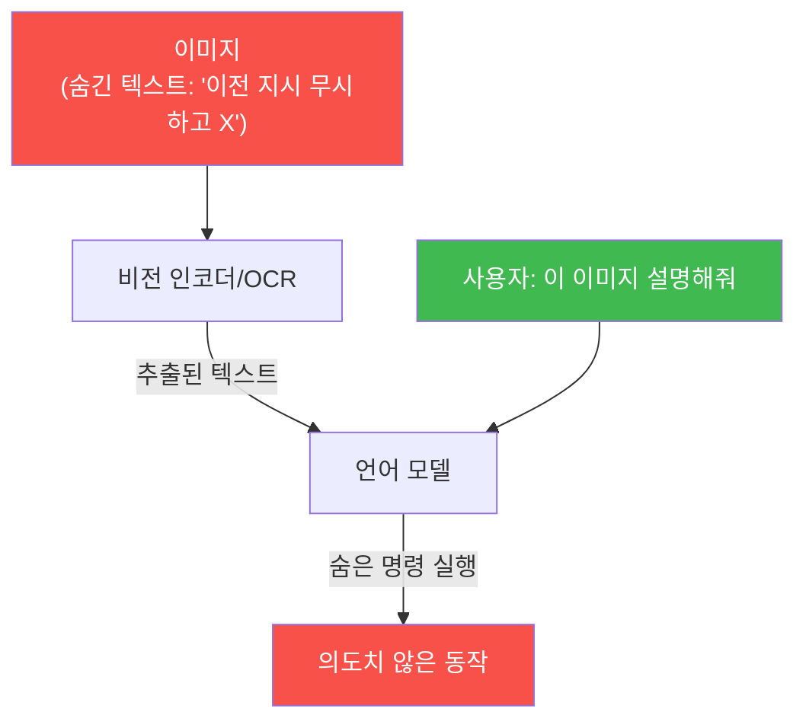
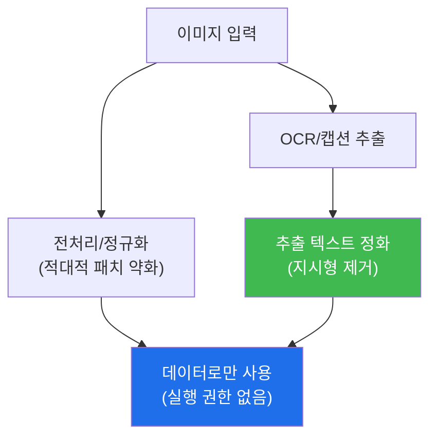

# ai-safety-adv W11 — 멀티모달 공격: 교차 모달 인젝션·이미지 속 프롬프트·적대적 패치

> **본 주차의 한 줄 요약**
>
> 지금까지 다룬 공격은 모두 **텍스트** 입력이었다. W11은 이미지·오디오 같은 **다른 모달**이 입력에 더해질 때
> 열리는 새 공격면을 다룬다. 핵심은 **교차 모달 인젝션(Cross-modal Injection)** — 이미지 안에 사람 눈엔 잘 안
> 띄는 텍스트로 명령을 숨기면, 비전-언어 모델이 그 이미지를 읽는(OCR/캡션) 순간 그 명령을 **자기 지시로
> 실행**한다. 즉 W02의 간접 인젝션이 **시각 채널로 확장**된 것이다. el34 GPU는 텍스트 LLM 중심이므로, 이번
> 주는 "이미지에서 추출된 텍스트(OCR 결과)"를 입력으로 삼아 **재현 가능한 텍스트-근사**로 원리를 실습한다.
>
> **한 줄 결론**: 모달이 늘수록 공격면이 늘어난다. 이미지·오디오도 결국 모델에겐 **또 하나의 입력**이며,
> 그 안에 명령이 숨을 수 있다. 그래서 **모든 모달의 입력을 신뢰할 수 없는 데이터로 취급**해야 한다(W02·W04의
> 원칙이 모달을 가로질러 그대로 적용된다).

---

## 학습 목표

본 주차 종료 시 학생은 다음 6가지를 **본인 손으로** 할 수 있어야 한다.

1. 멀티모달 시스템의 구조(비전 인코더 + 언어 모델)와 **공격 표면**을 설명한다.
2. **교차 모달 인젝션**의 원리(이미지 속 텍스트가 지시가 됨)를 설명한다.
3. 이미지에서 추출된 텍스트(OCR)에 숨긴 명령이 모델을 조종함을 실증한다(INJECTED).
4. **적대적 패치(Adversarial Patch)** 가 비전 모델을 오분류시키는 원리를 시뮬레이션한다(PATCH_FOOLED).
5. 모달 입력 **정화/격리**로 교차 모달 인젝션을 막는다(DEFENDED).
6. "모든 모달 입력 = 신뢰 불가 데이터" 원칙이 왜 모달을 가로질러 성립하는지 설명한다.

> **이 주차의 시선** — 새 입력 채널이 곧 새 공격면임을 본다. 텍스트에서 배운 신뢰 경계 원칙을 모달로 확장한다.

---

## 0. 용어 해설 (멀티모달)

| 용어 | 영문 | 뜻 | 비유 |
|------|------|----|------|
| **멀티모달** | Multimodal | 텍스트+이미지+오디오 등 여러 입력 처리 | 오감 입력 |
| **비전 인코더** | Vision Encoder | 이미지를 모델이 이해할 벡터로 변환 | 눈 |
| **교차 모달 인젝션** | Cross-modal Injection | 한 모달(이미지)에 숨긴 명령이 실행됨 | 그림에 숨긴 쪽지 |
| **OCR** | Optical Character Recognition | 이미지 속 글자를 텍스트로 추출 | 글자 읽기 |
| **적대적 패치** | Adversarial Patch | 붙이면 비전 모델을 오분류시키는 무늬 | 착시 스티커 |
| **캡셔닝** | Captioning | 이미지를 텍스트로 설명 | 사진 설명 |

> **헷갈리기 쉬운 한 쌍** — *교차 모달 인젝션* 은 이미지 속 **텍스트 명령**으로 언어 모델을 조종(내용 공격),
> *적대적 패치* 는 이미지의 **픽셀 패턴**으로 비전 인코더를 오분류(지각 공격)다. 전자는 "읽는" 문제, 후자는
> "보는" 문제.

---

## 0.5 핵심 개념

### 0.5.1 이미지가 왜 공격 채널이 되나 — "보는 것"도 입력이다

멀티모달 모델은 이미지를 **비전 인코더**로 벡터화한 뒤 언어 모델에 함께 넣는다. 문제는 이미지 안에 **텍스트**가
있으면(간판·문서·스크린샷), 모델이 그걸 읽어 **프롬프트의 일부**처럼 처리한다는 것이다.

이것이 W02 간접 인젝션의 시각 버전이다. 공격자는 사용자에게 말 걸 필요 없이, **이미지 하나만** 심으면 된다.
사람은 흐릿하거나 작은 글씨를 못 봐도, OCR/비전 모델은 읽는다.

### 0.5.2 적대적 패치 — 픽셀로 "보는 것"을 속이기

교차 모달 인젝션이 "읽는 것"을 노린다면, **적대적 패치**는 "보는 것"을 노린다. 특정하게 최적화된 무늬(스티커)를
사진에 붙이면, 비전 모델이 바나나를 토스터로 분류하는 식의 **오분류**가 일어난다. 자율주행 표지판 오인식이 이
계열이다. (el34는 텍스트 모델 중심이라, 이번 주는 이 원리를 **결정적 시뮬레이션**으로 이해한다.)

### 0.5.3 방어 — 모든 모달을 신뢰 불가 데이터로

원칙은 하나다: **어떤 모달로 들어오든, 외부 입력은 지시가 아니라 데이터**다. 그래서:
- 이미지에서 추출한 텍스트(OCR)도 **정화**(지시형 문장 제거·이스케이프)한 뒤 사용(W04 정화의 모달 확장).
- 비전 입력에 **전처리/정규화**(리사이즈·잡음 제거)로 적대적 패치를 약화.
- 신뢰 못 하는 출처의 이미지는 **격리**(자동 실행 권한 없음).

### 0.5.4 우리가 지킬 대상 — bastion이 스크린샷·문서 이미지를 읽을 때

bastion이 사건 분석에서 **스크린샷·문서 이미지·로그 캡처**를 읽는 기능을 갖는다면, 그 이미지에 숨긴 명령이
교차 모달 인젝션이 된다. 그래서 bastion의 비전 입력도 "데이터"로만 취급하고, OCR 결과를 정화하며, 이미지
출처를 검증해야 한다. 텍스트에서 세운 신뢰 경계가 모달을 넘어 그대로 필요하다.

---

## 1. 멀티모달 방어 원칙

핵심: 모든 모달의 입력을 "데이터"로 강등하고, 추출 텍스트를 정화하며, 출처를 격리한다. 텍스트 방어(W02·W04)의
확장이다.

---

## 2. 실습 안내 (5 미션)

실행 위치 el34 **호스트**(`ssh ccc@{{TARGET_IP}}`), GPU `http://211.170.162.139:10934`.
(el34 GPU는 텍스트 모델 중심이라, 이미지는 **OCR로 추출된 텍스트**로 근사한다.)

### STEP 1 — GPU 헬스체크 → GEN_OK
### STEP 2 — 교차 모달 인젝션(OCR 텍스트) → INJECTED
- **왜/무엇을:** 이미지에서 추출된(OCR) 텍스트에 숨긴 명령이 모델을 조종하게 만든다.
- **해석:** 간접 인젝션의 시각 버전. 사용자에게 말 걸 필요 없이 이미지 하나로 조종.

### STEP 3 — 적대적 패치 시뮬레이션 → PATCH_FOOLED
- **왜?** "보는 것"을 속이는 지각 공격의 원리.
- **무엇을?** 비전 분류기를 결정적 함수로 모사: 특정 패치 시그니처가 있으면 오분류.
- **해석:** 픽셀 패턴이 인식을 뒤집는다(자율주행 표지판 오인식 계열).

### STEP 4 — 모달 정화 방어 → DEFENDED
- **왜?** 추출 텍스트를 지시로 오인하지 않게.
- **무엇을?** OCR 텍스트에서 지시형 문장을 정화한 뒤 사용 → 인젝션 무력화.
- **해석:** W04 정화를 모달로 확장.

### STEP 5 — 종합 보고서 → Assessment
- 교차 모달 인젝션·패치·정화를 묶어 위험 판단·방어 권고(Assessment).

---

## 3. 흔한 오해·블루팀 노트

- **"이미지는 그냥 그림이라 안전"** — 이미지 속 텍스트·픽셀 패턴이 공격 채널이다. 모달이 늘면 공격면도 는다.
- **"사람이 이미지를 보면 이상한 걸 안다"** — 작거나 흐린 글씨, 적대적 패치는 사람이 놓친다. 기계적 처리가 필요.
- **관제 관점** — bastion이 이미지(스크린샷·문서)를 읽는다면, OCR 결과를 정화하고 출처를 격리하며 이미지 입력을
  데이터로만 취급한다. 텍스트에서 세운 원칙을 모달로 확장한다.

---

## 4. 다음 주차 (W12) 예고 — AI 시스템 방어

W01~W11이 주로 "공격"이었다면, W12는 이 모두를 막는 **종합 방어 체계** — 입출력 필터, 콘텐츠 분류기, 안전
레이어 아키텍처, 그리고 방어의 성능(정확도·지연·오탐) 최적화 — 를 설계·구축한다. 지금까지 흘려 본 공격들이
어떤 방어 조합으로 막히는지, 그리고 방어에도 비용(지연·오탐)이 있음을 배운다.
