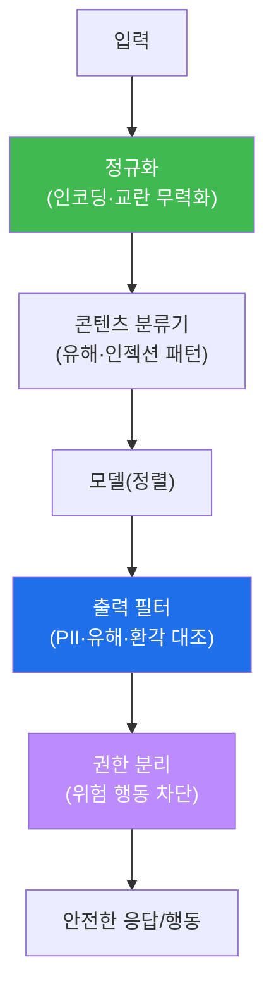

# ai-safety-adv W12 — AI 시스템 방어: 입출력 필터·콘텐츠 분류기·안전 레이어·성능 최적화

> **본 주차의 한 줄 요약**
>
> W01~W11이 "공격의 백과사전"이었다면, W12는 그 모두를 막는 **방어의 종합 설계**다. 개별 방어(입력 정규화·
> 분류기·출력 필터·권한 분리)를 **여러 겹으로 쌓은 안전 레이어(Safety Layer)** 로 조립하고, 그 방어의 **성능**을
> 잰다. 여기서 결정적 통찰: **방어에도 비용이 있다.** 필터를 촘촘히 하면 공격은 더 잡지만(재현율↑), 정상
> 요청도 더 막고(오탐↑) 응답이 느려진다(지연↑). 그래서 방어는 "완벽"이 목표가 아니라 **정확도·오탐·지연의
> 균형을 맞추는 공학**이다. 이번 주는 다층 방어를 만들어 공격/정상 세트로 평가하고(정확도·오탐·지연 측정),
> 임계값을 조절해 **재현율-정밀도 트레이드오프**를 직접 조율한다.
>
> **한 줄 결론**: 좋은 방어는 "다 막는다"가 아니라 **"측정 가능하게, 균형 있게 막는다"** 이다. 오탐이 너무
> 많으면 사용자가 방어를 꺼 버린다 — 그래서 **오탐도 위험**이다.

---

## 학습 목표

본 주차 종료 시 학생은 다음 6가지를 **본인 손으로** 할 수 있어야 한다.

1. **안전 레이어(Safety Layer)** 아키텍처(정규화→분류→출력필터→권한분리)를 설계한다.
2. **콘텐츠 분류기**를 만들고, 공격/정상 세트로 평가한다.
3. 방어의 **성능 지표**(정확도·정밀도·재현율·오탐율·지연)를 산출한다(METRICS).
4. 분류기 **임계값을 조절**해 재현율-정밀도(오탐) 트레이드오프를 조율한다(TUNED).
5. 다층 방어가 단일 방어보다 강한 이유(서로 다른 공격을 각 층이 커버)를 설명한다.
6. **오탐(false positive)도 위험**인 이유(사용자 이탈·방어 무력화)를 설명한다.

> **이 주차의 시선** — 공격을 다 봤으니, 이제 "무엇을 얼마나 막고, 그 대가는 무엇인가"를 숫자로 조율한다.

---

## 0. 용어 해설 (AI 방어)

| 용어 | 영문 | 뜻 | 비유 |
|------|------|----|------|
| **안전 레이어** | Safety Layer | 여러 방어를 겹친 계층 구조 | 다중 검문소 |
| **콘텐츠 분류기** | Content Classifier | 입력/출력이 위험한지 분류 | 감별사 |
| **정밀도** | Precision | 위험이라 한 것 중 진짜 위험 비율 | 오경보 적음 |
| **재현율** | Recall | 실제 위험 중 잡아낸 비율 | 놓침 적음 |
| **오탐** | False Positive | 정상을 위험으로 잘못 막음 | 헛경보 |
| **미탐** | False Negative | 위험을 놓침 | 놓친 침입 |
| **지연** | Latency | 방어가 더하는 응답 시간 | 검문 대기 |
| **트레이드오프** | Trade-off | 하나를 얻으면 하나를 잃음 | 시소 |

> **헷갈리기 쉬운 한 쌍** — *정밀도* 는 "잡은 것의 정확성"(오탐 적음), *재현율* 은 "놓치지 않음"(미탐 적음).
> 임계값을 낮추면 재현율↑·오탐↑, 높이면 정밀도↑·미탐↑. 둘을 동시에 최고로 만들 수는 없다.

---

## 0.5 신입생 친화 핵심 개념

### 0.5.1 왜 "다 막기"가 목표가 아닌가 — 오탐이라는 비용

공격을 100% 막는 가장 쉬운 방법은 "다 차단"이다. 하지만 그러면 정상 요청도 다 막힌다(오탐 100%). 쓸모없는
방어다. 반대로 아무것도 안 막으면 오탐 0이지만 미탐 100%다. **방어는 이 둘 사이의 균형점**을 찾는 일이다.

```mermaid
graph TD
    T["임계값(엄격도)"] -->|낮춤(느슨)| A["미탐↓ 재현율↑<br/>오탐↑ 정밀도↓"]
    T -->|높임(엄격)| B["오탐↓ 정밀도↑<br/>미탐↑ 재현율↓"]
    A --> C["균형점 찾기<br/>(도메인 위험에 맞춰)"]
    B --> C
    style A fill:#d29922,color:#fff
    style B fill:#1f6feb,color:#fff
    style C fill:#3fb950,color:#fff
```

**오탐도 위험**인 이유: 오탐이 잦으면 사용자가 방어를 성가셔하고 **꺼 버리거나 우회**한다. 그러면 방어가
있으나 마나. 그래서 실무에선 "재현율을 유지하면서 오탐을 견딜 만한 수준으로" 임계값을 잡는다.

### 0.5.2 왜 다층인가 — 서로 다른 공격을 각 층이 커버

지금까지 본 공격은 서로 다른 통로를 쓴다: 인젝션(W02)·인코딩(W02)·탈옥(W03)·RAG 오염(W04)·과도한 권한
(W05)…. 하나의 필터로는 다 못 막는다. 그래서 **각 층이 서로 다른 공격을 커버**하도록 겹친다.



한 층이 놓쳐도 다음 층이 잡는다(Defense in Depth). 단, 층이 늘면 지연·오탐도 는다 — 그래서 성능 측정이 필요.

### 0.5.3 우리가 지킬 대상 — bastion의 안전 레이어

bastion은 이 다층 방어를 **입력(사용자·E.G 데이터)→판단(Manager)→행동(SubAgent)** 전 구간에 둔다: 입력
정규화·분류(W02·W08), E.G 정화·격리(W04), 출력 검증(W10), 실행 권한 분리·승인 게이트(W05). 이번 주는 그
안전 레이어의 축소판을 만들어 성능을 재고 임계값을 조율한다.

---

## 1. 방어 성능 측정과 최적화

방어를 배포하기 전 반드시 측정한다.

| 지표 | 의미 | 목표 |
|------|------|------|
| 정확도(Accuracy) | 전체 판정의 정답률 | 높게 |
| 정밀도(Precision) | 차단한 것 중 진짜 위험 | 오탐 통제 |
| 재현율(Recall) | 실제 위험 중 잡은 것 | 미탐 통제 |
| 오탐율(FPR) | 정상을 막은 비율 | 낮게(사용자 이탈 방지) |
| 지연(Latency) | 추가 응답 시간 | 감내 가능 수준 |

**최적화 = 임계값·층 구성 조절로 이 지표들의 균형을 맞추기.** 도메인 위험이 높으면(예: 금융) 재현율을 우선,
사용자 경험이 중요하면 오탐을 우선 통제한다.

---

## 2. 실습 안내 (5 미션)

실행 위치 el34 **호스트**(`ssh ccc@{{TARGET_IP}}`), GPU `http://211.170.162.139:10934`.
(대부분 결정적 파이썬 — 방어 로직·측정은 코드로 확인한다.)

### STEP 1 — GPU 헬스체크 → GEN_OK
### STEP 2 — 다층 방어 조립 → LAYERED_OK
- **왜/무엇을:** 정규화→분류기→출력필터를 묶어, 공격 입력은 차단·정상 입력은 통과시킨다.
- **해석:** 각 층이 서로 다른 공격을 커버 → 단일 필터보다 강함.

### STEP 3 — 방어 성능 측정 → METRICS
- **왜?** 배포 전 반드시 잰다.
- **무엇을?** 라벨된 공격/정상 세트로 정확도·정밀도·재현율·오탐율을 산출.
- **해석:** 숫자로 방어의 강도와 대가를 본다.

### STEP 4 — 임계값 튜닝(트레이드오프) → TUNED
- **왜?** 재현율-정밀도(오탐) 균형을 도메인에 맞춘다.
- **무엇을?** 분류기 임계값을 조절해 오탐↓/미탐↑ 또는 그 반대로 이동, 지표 변화를 관찰.
- **해석:** 완벽은 없다. 균형점을 고른다.

### STEP 5 — 종합 보고서 → Assessment
- 다층·성능·튜닝을 묶어 방어 설계 권고(Assessment).

---

## 3. 흔한 오해·관제자 노트

- **"방어는 촘촘할수록 좋다"** — 오탐·지연이 는다. 오탐이 잦으면 방어가 꺼진다. 균형이 목표.
- **"분류기 하나면 된다"** — 공격 통로가 여럿이다. 다층이 필요.
- **"정확도만 높으면 된다"** — 불균형 데이터에선 정확도가 오해를 준다(정상 99%면 다 통과시켜도 99%). 정밀도·
  재현율을 함께 본다.
- **관제 관점** — bastion 안전 레이어는 정기적으로 공격/정상 세트로 재평가하고, 오탐이 사용자 워크플로를 해치지
  않는 임계값을 유지하며, 새 공격이 관측되면 해당 층을 보강한다.

---

## 4. 다음 주차 (W13) 예고 — AI 거버넌스 + 규제

W12가 "기술적 방어"였다면, W13은 그 방어를 **조직·법 차원**에서 강제하는 거버넌스 — EU AI Act(위험 4등급),
NIST AI RMF(GOVERN·MAP·MEASURE·MANAGE), AI 위험 평가 절차, 컴플라이언스 자동화 — 를 다룬다. 기술 방어만으로는
부족하고, 정책·책임·감사가 함께 가야 함을 배운다.
