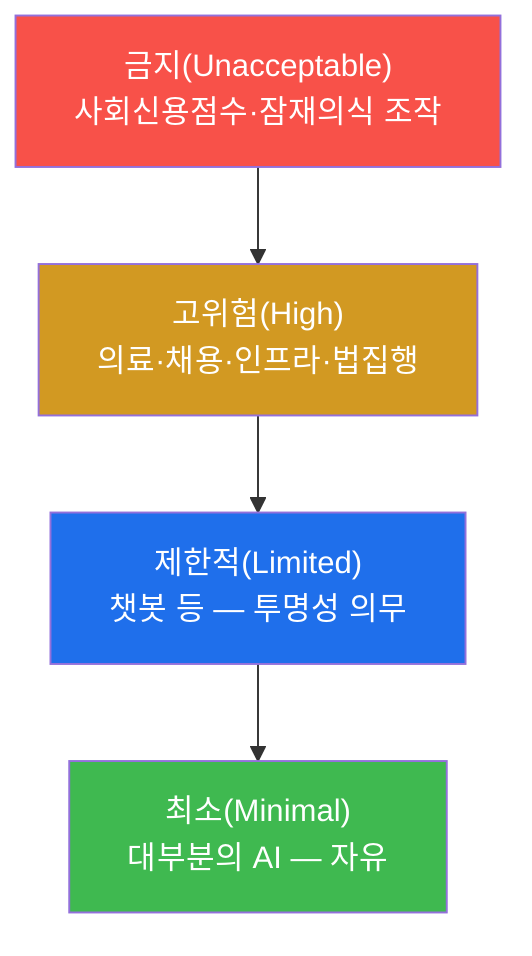
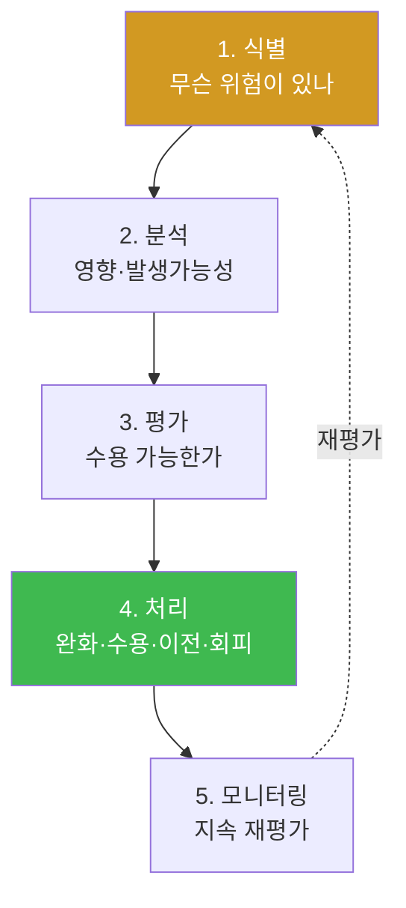

# ai-safety-adv W13 — AI 거버넌스+규제: EU AI Act·NIST AI RMF·위험 평가·컴플라이언스 자동화

> **본 주차의 한 줄 요약**
>
> W12까지가 "기술적 방어"였다면, W13은 그 방어를 **조직과 법의 틀**로 강제하는 **거버넌스**다. 아무리 좋은
> 필터를 만들어도, "누가 책임지고, 어떤 기준으로 평가하며, 규제를 어떻게 지키는가"가 없으면 방어는 지속되지
> 않는다. 이번 주는 세계 표준 두 개 — **EU AI Act**(AI를 위험도로 4등급 나눠 규제)와 **NIST AI RMF**(GOVERN·
> MAP·MEASURE·MANAGE 4함수로 위험을 관리) — 를 익히고, AI 시스템을 위험 등급으로 분류하며, 컴플라이언스
> 점검을 자동화한다.
>
> **한 줄 결론**: 안전은 코드만의 문제가 아니라 **거버넌스의 문제**다. 기술(방어)·정책(규제)·책임(거버넌스)이
> 삼각형을 이뤄야 지속 가능한 AI 안전이 된다.

---

## 학습 목표

본 주차 종료 시 학생은 다음 6가지를 **본인 손으로** 할 수 있어야 한다.

1. **EU AI Act**의 위험 4등급(금지·고위험·제한적·최소)을 설명하고, AI 시스템을 분류한다(RISK_TIER).
2. **NIST AI RMF**의 4함수(GOVERN·MAP·MEASURE·MANAGE)를 설명하고 활동을 매핑한다(RMF_MAPPED).
3. AI **위험 평가** 절차(식별·분석·평가·처리)를 수행한다.
4. 규제 요건을 **자동 점검**하는 컴플라이언스 체커를 만든다(COMPLIANCE_CHECKED).
5. 기술 방어(W12)와 거버넌스가 어떻게 결합되는지 설명한다.
6. bastion 같은 자율 에이전트가 규제상 왜 "고위험"에 가까운지 논증한다.

> **이 주차의 시선** — "우리 AI는 안전한가?"를 기술이 아니라 **책임·기준·감사**의 언어로 답하는 법을 익힌다.

---

## 0. 용어 해설 (거버넌스)

| 용어 | 영문 | 뜻 | 비유 |
|------|------|----|------|
| **거버넌스** | Governance | 누가·어떤 기준으로 책임지고 통제하는가 | 조직의 헌법 |
| **EU AI Act** | — | EU의 AI 위험 기반 규제법 | AI 교통법규 |
| **NIST AI RMF** | AI Risk Management Framework | 미국 표준의 AI 위험 관리 틀 | 위험 관리 매뉴얼 |
| **고위험 AI** | High-risk AI | 인명·기본권에 큰 영향(의료·채용·인프라 등) | 특별 관리 대상 |
| **위험 평가** | Risk Assessment | 위험을 식별·분석·평가·처리 | 건강검진 |
| **컴플라이언스** | Compliance | 규제·기준 준수 | 법규 준수 |
| **감사 추적** | Audit Trail | 결정·행동의 기록으로 사후 검증 | 블랙박스 |

> **헷갈리기 쉬운 한 쌍** — *EU AI Act* 는 "**법**"(무엇을 금지/규제), *NIST AI RMF* 는 "**틀·가이드**"(어떻게
> 관리). 하나는 지켜야 할 선, 다른 하나는 관리하는 방법이다.

---

## 0.5 신입생 친화 핵심 개념

### 0.5.1 EU AI Act — 위험도로 4등급

EU AI Act는 AI를 **용도의 위험**에 따라 4등급으로 나눠 다르게 규제한다.

- **금지**: 아예 못 쓴다(예: 정부 사회신용점수).
- **고위험**: 엄격한 요건(위험관리·데이터 품질·문서화·인간 감독·로깅). 대부분의 규제 부담이 여기.
- **제한적**: 투명성 의무(예: "당신은 AI와 대화 중").
- **최소**: 특별 규제 없음.

핵심은 **용도로 등급이 정해진다**는 것. 같은 LLM도 의료 진단에 쓰면 고위험, 게임 대사에 쓰면 최소다.

### 0.5.2 NIST AI RMF — 4함수로 위험 관리

NIST AI RMF는 "어떻게 위험을 관리하나"의 틀이다.

| 함수 | 뜻 | 예 |
|------|-----|-----|
| **GOVERN** | 책임·정책·문화 수립 | AI 책임자 지정, 정책 문서 |
| **MAP** | 맥락·위험 식별 | 이 AI가 어디에 쓰이고 무엇이 위험한가 |
| **MEASURE** | 위험 측정·평가 | ASR·오탐·편향 지표 측정(우리 W01~W12!) |
| **MANAGE** | 위험 처리·모니터링 | 방어 적용·지속 감시·사고 대응 |

**우리가 지난 12주간 한 것(공격 측정·방어)** 이 바로 MEASURE·MANAGE의 실무다. 거버넌스는 그 위에 책임과
정책을 얹는다.

### 0.5.3 컴플라이언스 자동화 — 점검을 코드로

규제 요건은 많고 반복된다. 그래서 "로깅이 켜져 있나·인간 감독이 있나·위험 평가 문서가 있나"를 **자동 점검**하는
체커를 만든다. 이번 주 실습에서 우리는 AI 시스템 설정을 입력받아 요건 충족 여부를 자동 판정한다.

### 0.5.4 우리가 지킬 대상 — bastion은 규제상 "고위험"에 가깝다

bastion은 **보안 인프라를 자율로 조작**(방화벽 규칙·차단 등)한다. 이는 "중요 인프라 운영"에 해당해 EU AI Act상
**고위험**에 가깝다. 따라서 bastion에는 고위험 요건 — **인간 감독(승인 게이트, W05)·로깅(감사 추적)·위험 평가·
데이터 품질(E.G 정화, W04·W07)** — 이 요구된다. 즉 앞선 기술 방어들이 거버넌스 요건과 정확히 맞물린다.

---

## 1. AI 위험 평가 절차

기술(W12 성능 측정)이 2·3단계(분석·평가)의 근거를 제공하고, 거버넌스가 1·4·5단계(식별·처리·모니터링)의
책임 구조를 만든다.

---

## 2. 실습 안내 (5 미션) — 대부분 결정적 파이썬

실행 위치 el34 **호스트**(`ssh ccc@{{TARGET_IP}}`), GPU `http://211.170.162.139:10934`.

### STEP 1 — GPU 헬스체크 → GEN_OK
### STEP 2 — EU AI Act 위험 등급 분류 → RISK_TIER
- **왜/무엇을:** AI 시스템의 용도를 입력받아 금지/고위험/제한적/최소로 분류.
- **해석:** 용도가 등급을 정한다. bastion(인프라 운영)은 고위험.

### STEP 3 — NIST AI RMF 매핑 → RMF_MAPPED
- **왜?** 위험 관리 활동을 표준 함수에 매핑.
- **무엇을?** 지난 주차 활동(ASR 측정·방어·모니터링)을 GOVERN/MAP/MEASURE/MANAGE에 배치.
- **해석:** 우리가 한 실습이 곧 MEASURE·MANAGE 실무.

### STEP 4 — 컴플라이언스 자동 점검 → COMPLIANCE_CHECKED
- **왜?** 요건 충족을 반복 없이 확인.
- **무엇을?** AI 설정(로깅·인간 감독·위험 평가 문서·데이터 품질)을 자동 점검해 통과/미충족 산출.
- **해석:** 미충족 항목이 곧 개선 과제.

### STEP 5 — 종합 보고서 → Assessment
- 등급·RMF·컴플라이언스를 묶어 거버넌스 권고(Assessment).

---

## 3. 흔한 오해·블루팀 노트

- **"기술만 좋으면 안전"** — 책임·정책·감사가 없으면 방어가 지속되지 않는다. 거버넌스가 뼈대.
- **"규제는 혁신의 적"** — 위험 등급제는 저위험 AI엔 부담이 적고, 고위험에만 집중한다(비례 원칙).
- **"우리 챗봇은 최소 위험"** — 용도가 등급을 정한다. 의료·채용·인프라에 쓰면 고위험이 된다.
- **관제 관점** — bastion은 고위험에 준해 **인간 감독·감사 로그·위험 평가·데이터 품질**을 갖춰야 한다.
  기술 방어(W04·W05·W12)가 그대로 거버넌스 요건의 근거가 된다.

---

## 4. 다음 주차 (W14) 예고 — AI 인시던트 대응

W13이 "사고를 예방하는 거버넌스"였다면, W14는 **사고가 났을 때** 어떻게 대응하는가 — AI 인시던트 분류,
대응 절차(IRP), 탐지·대응 자동화, 그리고 bastion 기반 IR 워크플로우 — 를 다룬다. 예방(거버넌스)과 대응(IR)은
안전의 양 날개다.
