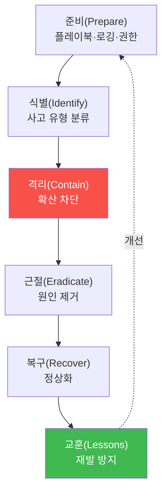
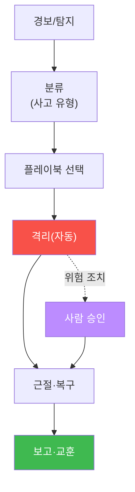

# ai-safety-adv W14 — AI 인시던트 대응: 사고 분류·IRP·탐지/대응 자동화·bastion 워크플로우

> **본 주차의 한 줄 요약**
>
> W13(거버넌스)이 "사고를 예방"하는 틀이었다면, W14는 **사고가 이미 났을 때** 어떻게 대응하는가다. AI 보안
> 사고 — 탈옥으로 유해 출력, 프롬프트 유출로 비밀 노출, RAG 오염으로 오작동, 에이전트 도구 남용 — 는 전통
> 사고와 대응 절차의 **뼈대는 같지만(PICERL: 준비·식별·격리·근절·복구·교훈), 세부는 AI 특유**다. 이번 주는
> AI 사고를 분류하고, **인시던트 대응 절차(IRP)** 를 설계하며, 탐지→격리를 자동화하고, 이를 bastion 워크플로우로
> 실행하는 법을 배운다.
>
> **한 줄 결론**: 방어는 언젠가 뚫린다. 그때 **얼마나 빨리 식별·격리·복구하고 교훈을 남기는가**가 실제 피해를
> 좌우한다. 예방(거버넌스)과 대응(IR)은 AI 안전의 양 날개다.

---

## 학습 목표

본 주차 종료 시 학생은 다음 6가지를 **본인 손으로** 할 수 있어야 한다.

1. AI 보안 사고의 **분류 체계**(탈옥·유출·중독·에이전트 남용·모델 탈취)를 세운다.
2. **PICERL** 기반 AI 인시던트 대응 절차(IRP)를 설계한다.
3. AI 사고를 유형별로 **자동 분류**한다(INCIDENT_CLASSIFIED).
4. 사고 유형에 맞는 **격리(containment)** 조치를 자동 실행한다(CONTAINED).
5. **탐지→대응 자동화**(경보→플레이북 실행)의 흐름을 설명한다.
6. **bastion 기반 IR 워크플로우**(Manager가 harness로 대응 절차를 구성·실행)를 설명한다.

> **이 주차의 시선** — "뚫린 뒤"를 준비하는 냉정함을 기른다. 채점은 사고를 빠르고 정확히 분류·격리하는가를 본다.

---

## 0. 용어 해설 (AI 인시던트 대응)

| 용어 | 영문 | 뜻 | 비유 |
|------|------|----|------|
| **인시던트** | Incident | 보안 사고(정책 위반·침해) | 화재 |
| **IRP** | Incident Response Plan | 사고 대응 절차 계획 | 화재 대응 매뉴얼 |
| **PICERL** | — | 준비·식별·격리·근절·복구·교훈 6단계 | 소방 절차 |
| **격리** | Containment | 피해 확산을 막는 조치 | 방화문 닫기 |
| **근절** | Eradication | 원인 제거 | 불씨 제거 |
| **복구** | Recovery | 정상 상태로 되돌림 | 재건 |
| **교훈** | Lessons Learned | 재발 방지 개선 | 사고 보고서 |
| **플레이북** | Playbook | 유형별 대응 자동 절차 | 대응 시나리오집 |

> **헷갈리기 쉬운 한 쌍** — *격리(Containment)* 는 "확산을 멈춤"(당장 피해 차단), *근절(Eradication)* 은
> "원인을 제거"(재발 방지). 격리 먼저, 근절 나중이다(불부터 끄고 원인은 나중에).

---

## 0.5 신입생 친화 핵심 개념

### 0.5.1 AI 사고는 무엇이 다른가

전통 사고(악성코드·침입)와 대응 뼈대(PICERL)는 같지만, AI 사고는 **증거와 조치가 다르다**.

| AI 사고 유형 | 증거 | 격리 조치 |
|-------------|------|----------|
| 탈옥/유해 출력 | 유해 응답 로그·거부 우회 패턴 | 해당 프롬프트 패턴 차단·모델 롤백 |
| 프롬프트/PII 유출 | 유출된 비밀·PII 로그 | 비밀 로테이션·출력 필터 강화 |
| RAG 오염 | 오염 문서·이상 검색 | 오염 문서 격리·corpus 재검증 |
| 에이전트 도구 남용 | 위험 도구 호출 로그 | 도구 비활성·승인 게이트 강화 |
| 모델 탈취 | 대량 추출 질의 패턴 | 쿼터·차단·워터마크 확인 |

즉 지난 13주간 배운 **공격 유형별로 대응 플레이북**이 달라진다. IR의 첫걸음은 "무슨 사고인가"를 빠르게
분류하는 것이다.

### 0.5.2 PICERL — 대응의 뼈대

핵심은 **격리(C)를 근절(E)보다 먼저** — 피해 확산을 즉시 멈춘 뒤 원인을 제거한다. 그리고 반드시 **교훈(L)**
으로 앞선 방어(W12)와 거버넌스(W13)를 갱신한다(순환).

### 0.5.3 탐지→대응 자동화 — 사람보다 빠르게

AI 사고는 순식간에 확산된다(자동 에이전트·API). 그래서 **탐지 경보→플레이북 자동 실행**을 연결한다: "위험
도구 반복 호출 탐지(W05) → 자동으로 도구 비활성 + 사람 알림". 사람은 승인·판단에 집중하고, 반복 조치는
자동화한다.

### 0.5.4 우리가 지킬 대상 — bastion 기반 IR 워크플로우

bastion 자신이 IR을 수행하는 에이전트가 될 수 있다. Manager Agent가 사고 유형을 식별하고, **harness engineering**
으로 그 유형의 대응 절차(격리→근절→복구)를 구성하며, **E.G(경험·지식)** 에서 과거 유사 사고 대응을 참조해
SubAgent가 실제 조치를 실행한다. 단, 위험 조치(방화벽 변경·격리)는 **승인 게이트(W05)** 를 거친다. 즉 IR도
"자동 대응 + 사람 승인"의 균형이다.

---

## 1. AI IRP 설계

---

## 2. 실습 안내 (5 미션) — 대부분 결정적 파이썬

실행 위치 el34 **호스트**(`ssh ccc@{{TARGET_IP}}`), GPU `http://211.170.162.139:10934`.

### STEP 1 — GPU 헬스체크 → GEN_OK
### STEP 2 — AI 사고 자동 분류 → INCIDENT_CLASSIFIED
- **왜/무엇을:** 사고 증거(로그)를 입력받아 탈옥/유출/중독/에이전트남용/모델탈취로 분류.
- **해석:** IR의 첫걸음. 유형이 플레이북을 정한다.

### STEP 3 — 격리 플레이북 자동 실행 → CONTAINED
- **왜?** 피해 확산을 즉시 멈춘다(근절보다 먼저).
- **무엇을?** 분류된 유형에 맞는 격리 조치(패턴 차단·비밀 로테이션·도구 비활성 등)를 자동 매핑·실행.
- **해석:** 격리 먼저, 근절 나중.

### STEP 4 — 탐지→대응 자동화 흐름 → AUTOMATED
- **왜?** 사람보다 빠르게.
- **무엇을?** 탐지 경보를 플레이북 실행으로 연결하되, 위험 조치는 승인 게이트로 보냄.
- **해석:** 자동 대응 + 사람 승인의 균형.

### STEP 5 — 종합 보고서 → Assessment
- 분류·격리·자동화를 묶어 IR 권고·교훈(Assessment).

---

## 3. 흔한 오해·관제자 노트

- **"방어가 좋으면 IR은 불필요"** — 방어는 언젠가 뚫린다. IR 준비가 피해 크기를 좌우.
- **"근절부터 하자"** — 격리(확산 차단)가 먼저다. 원인 제거는 그 다음.
- **"자동화하면 사람은 필요 없다"** — 위험 조치는 사람 승인이 필요. 자동화는 반복 조치에.
- **관제 관점** — bastion은 IR 에이전트로서 사고를 분류하고 harness로 대응 절차를 구성하되, 위험 조치는 승인
  게이트(W05)를 거치고, 대응 결과를 E.G에 축적해 다음 사고 대응을 개선한다. 교훈은 방어(W12)·거버넌스(W13)로
  환류한다.

---

## 4. 다음 주차 (W15) 예고 — 종합 AI Red Team

마지막 주는 지난 14주의 공격·방어를 하나로 묶는 **캡스톤**이다. 정찰→인젝션→탈옥→권한상승→유출로 이어지는
**전체 공격 체인**을 실제 모델에 수행하고, 발견을 OWASP/ATLAS로 분류해 **종합 Red Team 보고서**와 방어 개선안을
작성한다. AI Red Team의 실무 프로세스를 처음부터 끝까지 경험한다.
