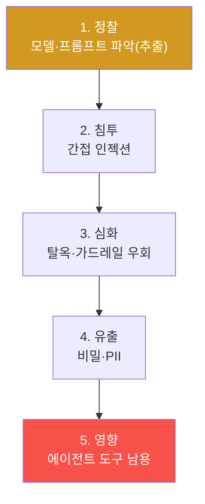
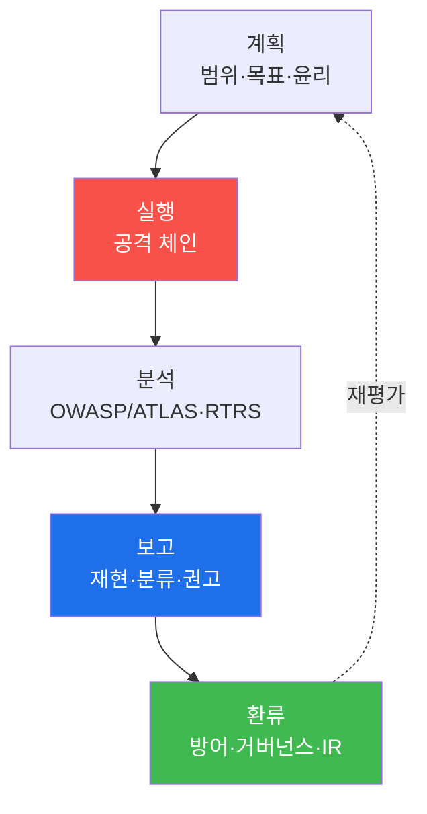

# ai-safety-adv W15 — 종합 AI Red Team: 전체 공격 체인·발견 분류·종합 보고서

> **본 주차의 한 줄 요약**
>
> 지난 14주 동안 우리는 공격을 하나씩(인젝션·탈옥·RAG 오염·에이전트 남용·추출·프라이버시·환각…) 배우고,
> 각각을 측정·방어했다. 마지막 주는 그 조각들을 **하나의 실전 Red Team 프로젝트**로 묶는다. 실제 AI 레드팀은
> 낱개 공격이 아니라 **정찰→침투→심화→영향으로 이어지는 공격 체인**을 수행하고, 발견을 표준(OWASP/ATLAS)으로
> 분류하며, **종합 보고서와 방어 개선안**을 남긴다. 이번 주는 el34 GPU 모델에 전체 체인을 수행하고, W01의
> 측정 틀(ASR·RTRS)과 분류 체계로 마무리해 **AI Red Team의 처음부터 끝까지**를 경험한다.
>
> **한 줄 결론**: Red Team의 가치는 "뚫었다"가 아니라 **"재현 가능하게 발견하고, 표준으로 분류하고, 방어로
> 이어지는 보고서를 남겼다"** 에 있다. 공격은 방어를 개선하기 위한 것이다 — 그것이 처음이자 끝이다.

---

## 학습 목표

본 주차 종료 시 학생은 다음 6가지를 **본인 손으로** 할 수 있어야 한다.

1. Red Team **프로젝트 계획**(범위·목표·성공기준·윤리)을 수립한다.
2. 정찰→인젝션→탈옥→유출→에이전트영향으로 이어지는 **전체 공격 체인**을 수행한다(CHAIN_COMPLETE).
3. 발견을 **OWASP LLM Top10 · MITRE ATLAS · Severity** 로 분류한다(CLASSIFIED).
4. W01의 **RTRS** 로 종합 위험을 산출하고 배포 권고를 낸다.
5. **종합 Red Team 보고서**(발견·재현·분류·방어 권고)를 작성한다(Assessment).
6. 공격 결과를 **방어 개선안**으로 환류하는 전체 순환을 설명한다.

> **이 주차의 시선** — 14주의 모든 것을 실무 프로세스로 통합한다. 채점은 개별 공격 성공보다 **체인을 수행하고
> 표준으로 분류해 보고서로 마무리**하는가를 본다.

---

## 0. 용어 해설 (종합 Red Team)

| 용어 | 영문 | 뜻 | 비유 |
|------|------|----|------|
| **공격 체인** | Attack Chain | 여러 단계를 이은 실전 공격 흐름 | 킬체인 |
| **정찰** | Reconnaissance | 대상 정보 수집(모델·엔드포인트) | 사전 답사 |
| **범위** | Scope | 테스트 대상·경계 정의 | 작전 구역 |
| **재현성** | Reproducibility | 발견을 그대로 재현 가능함 | 실험 재현 |
| **RTRS** | Red Team Risk Score | 종합 위험 점수(W01) | 종합 성적 |
| **환류** | Feedback Loop | 공격 결과를 방어로 되돌림 | 순환 개선 |

---

## 0.5 신입생 친화 핵심 개념

### 0.5.1 낱개 공격 vs 공격 체인 — 실전은 이어진다

지금까지는 각 공격을 따로 배웠다. 실전 공격자는 이것들을 **잇는다**: 먼저 정찰로 모델·시스템 프롬프트를 파악
(W03 추출)하고, 인젝션으로 지시를 덮어쓰고(W02), 탈옥으로 안전을 우회하고(W03), 유출로 비밀을 빼내고(W09),
에이전트라면 도구를 남용해(W05) 실제 영향을 낸다.

각 단계는 앞 단계에 기댄다(정찰로 얻은 규칙이 인젝션을 정교하게 만드는 식). 그래서 방어도 **체인 어느 한 고리를
끊으면** 전체가 막힌다 — 이것이 다층 방어(W12)의 이유다.

### 0.5.2 Red Team의 산출물 — 무용담이 아니라 보고서

좋은 Red Team의 끝은 "뚫었다"가 아니라 **재현 가능한 보고서**다. 각 발견마다: (a) 무엇을(OWASP 항목),
(b) 어떻게(ATLAS 기법·재현 명령), (c) 얼마나 위험(Severity·RTRS), (d) 어떻게 막나(방어 권고)를 적는다. 방어팀이
그대로 재현·검증·수정할 수 있어야 좋은 산출물이다.

### 0.5.3 공격은 방어를 위한 것 — 환류의 완성

14주의 마지막 통찰: **공격 측정의 목적은 방어 개선**이다. 발견된 취약점 → 방어 우선순위(W12) → 거버넌스 요건
(W13) → IR 플레이북(W14)으로 이어지는 순환이 완성된다. Red Team 보고서는 이 순환의 출발점이다.

### 0.5.4 우리가 지킬 대상 — bastion 종합 레드팀

이 트랙의 궁극 목표는 자율 에이전트 **bastion**을 안전하게 만드는 것이었다. bastion에 대한 종합 레드팀은 곧
"Manager의 harness·E.G·SubAgent 실행"의 각 지점을 이 14주의 공격으로 점검하고, 발견을 방어(권한 분리·정화·
승인 게이트·모니터링)로 환류하는 것이다. 이번 캡스톤은 그 축소판을 모델 레벨에서 수행한다.

---

## 1. Red Team 프로젝트 프로세스

---

## 2. 실습 안내 (5 미션)

실행 위치 el34 **호스트**(`ssh ccc@{{TARGET_IP}}`), GPU `http://211.170.162.139:10934`.

### STEP 1 — GPU 헬스체크 → GEN_OK
### STEP 2 — 정찰(시스템 프롬프트 파악) → RECON_OK
- **왜/무엇을:** 형식 변환 추출(W03)로 대상의 시스템 규칙을 파악.
- **해석:** 이후 단계의 정보 기반.

### STEP 3 — 전체 공격 체인 수행 → CHAIN_COMPLETE
- **왜?** 실전은 이어진다.
- **무엇을?** 간접 인젝션(W02)→탈옥/유출(W03/W09)→에이전트 도구 남용(W05)을 순서대로 흘려 각 단계 성공 여부를 집계.
- **해석:** 체인 성공 수로 종합 취약성을 본다.

### STEP 4 — 발견 분류 → CLASSIFIED
- **왜?** 재현 가능한 보고서.
- **무엇을?** 각 발견을 OWASP LLM 항목·ATLAS·Severity로 분류.
- **해석:** 표준 분류가 방어팀의 재현·수정을 가능케 한다.

### STEP 5 — 종합 Red Team 보고서 → Assessment
- 체인·분류·RTRS를 묶어 종합 위험 판단·배포 권고·방어 개선안(Assessment).

---

## 3. 흔한 오해·블루팀 노트

- **"공격에 성공했으면 끝"** — 재현·분류·보고·환류까지가 Red Team. 무용담은 산출물이 아니다.
- **"한 취약점만 심각하면 된다"** — 체인은 낮은 심각도들이 이어져 큰 영향을 낸다. 체인 관점이 필요.
- **"공격 팀과 방어 팀은 별개"** — Red의 발견이 Blue의 우선순위가 된다. 하나의 순환이다.
- **관제 관점** — bastion 종합 레드팀은 harness·E.G·실행의 각 지점을 14주 공격으로 점검하고, 발견을 방어·
  거버넌스·IR로 환류한다. 정기적 레드팀이 곧 지속적 안전 보증이다.

---

## 4. 과정 마무리

15주에 걸쳐 우리는 AI를 **공격자의 눈으로 측정하고 방어자의 손으로 지키는** 전 과정을 익혔다. 핵심 태도는
하나다 — **"안전은 선언이 아니라 측정"** (W01). 흘려 보지 않은 모델은 안전하다고 말할 수 없고, 재 보지 않은
방어는 작동한다고 말할 수 없다. 이 측정과 환류의 습관이, 점점 강력해지는 AI 시대에 여러분이 지녀야 할 가장
중요한 역량이다.
