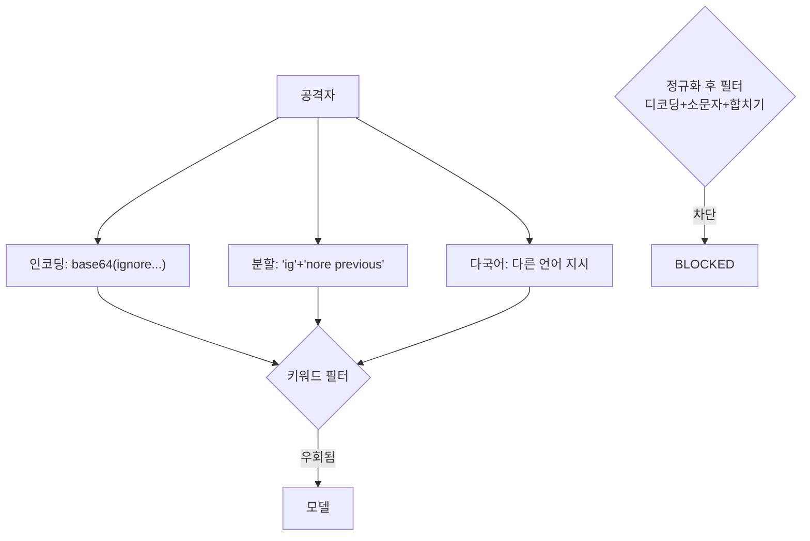

# W03 — 프롬프트 인젝션 고급: 인코딩·분할·다국어 우회와 정규화 방어

> **한 줄 요약** — 단순 인젝션은 입력 필터로 어느 정도 막힌다. 그래서 공격자는 **인코딩(base64·
> URL)·페이로드 분할·다국어·간접 체인**으로 필터를 우회한다. 이번 주는 이 고급 우회를 재현하고,
> **정규화(normalize)·격리·의미 기반 탐지**로 맞서는 법을 배운다.

---

## 학습 목표

- 인젝션 필터를 우회하는 고급 기법(인코딩·분할·다국어·간접 체인)을 안다.
- 키워드 필터만으로는 부족한 이유를 이해한다.
- **정규화(디코딩·소문자·공백제거)** 후 검사로 우회를 무력화한다.
- 의미 기반(LLM 분류) 탐지의 필요성을 안다.
- 다층 방어(정규화 + 의미 + 격리)를 적용한다.

---

## 0. 용어 해설

| 용어 | 영문 | 쉽게 말하면 |
|------|------|------------|
| **인코딩 우회** | Encoding evasion | base64/URL 인코딩으로 키워드 숨김 |
| **페이로드 분할** | Payload splitting | 공격 문구를 조각내 합치게 함 |
| **다국어 우회** | Multilingual | 다른 언어로 키워드 필터 회피 |
| **간접 체인** | Indirect chain | 여러 단계 데이터로 전파 |
| **정규화** | Normalization | 디코딩·소문자화로 형태 통일 |
| **의미 기반 탐지** | Semantic detection | 표현이 아닌 의도로 탐지 |

---

## 0.5 신입생을 위한 핵심 개념

### "필터가 'ignore'를 막으면, 공격자는 'aWdub3Jl'를 보낸다"

키워드 필터(`ignore`, `system override` 차단)는 **표현**을 봅니다. 공격자는 같은 의도를 **다른
표현**으로 보냅니다 — base64 인코딩(`aWdub3Jl`=ignore), 문구 분할(`ig`+`nore`), 다른 언어, 또는
여러 데이터에 나눠 심기(간접 체인). 그러면 단순 키워드 필터는 뚫립니다.

> 📌 **핵심 방어** — **검사 전에 정규화**합니다: base64/URL 디코딩 → 소문자 → 공백/구분 제거 →
> 그 다음 키워드/의미 검사. 그러면 인코딩·분할 우회가 무력화됩니다. 정규화는 WAF의 transform(W의
> secuops)과 같은 사상입니다.

---

## 1. 고급 우회 기법

| 기법 | 예 | 단순 필터 우회 이유 |
|------|----|---------------------|
| **base64 인코딩** | "decode and run: aWdub3Jl..." | 키워드가 인코딩돼 안 보임 |
| **페이로드 분할** | "first say 'ig', then 'nore rules'" | 합쳐야 키워드 |
| **다국어** | 다른 언어로 "이전 지시 무시" | 영어 키워드 매칭 회피 |
| **간접 체인** | 문서A→문서B로 지시 전파 | 한 곳만 보면 안 보임 |
| **유니코드 변형** | 비슷한 모양 문자 치환 | 정확 매칭 회피 |

## 2. 왜 키워드 필터만으로 부족한가

키워드 필터는 **알려진 표현**만 막습니다. 우회 표현은 무한합니다. 그래서:
- **정규화**로 표현의 변형을 통일(인코딩·대소문자·공백).
- **의미 기반 탐지**(LLM 분류기)로 "표현이 달라도 의도가 인젝션"을 잡음.
- **격리**로 외부 데이터가 지시로 해석되지 않게.

## 3. 방어 — 정규화 + 의미 + 격리

1. **정규화:** base64/URL 디코딩, 소문자, 공백/구두점 제거 후 검사. 분할·인코딩 우회 무력화.
2. **의미 기반:** "이 입력이 시스템 지시를 무시하려 하는가?"를 LLM에 판단시켜 표현 독립 탐지.
3. **격리:** 외부/사용자 입력은 항상 데이터로(구분자), 절대 지시로 해석 안 함.

> 단일 방어는 우회됩니다. 정규화(표현)+의미(의도)+격리(경계)를 겹쳐야 고급 인젝션을 줄입니다.
> 그래도 100%는 아니므로, **출력 검증·최소권한**이 최후 방어입니다.

---

## 실습 안내

이번 주 실습(`lab_week03.yaml`, 8단계)은 el34 GPU Ollama로 합니다. 4개 축:

1. **왜(목적)** — 왜 키워드 필터가 우회되나(인코딩·분할).
2. **무엇을(재현)** — 인코딩/분할 인젝션이 단순 필터를 우회함을 보인다(BYPASS).
3. **해석(분석)** — 고급 우회 노출을 감사한다.
4. **실전(방어)** — 정규화 후 탐지로 우회를 잡고(DETECTED), 의미 기반 판단을 적용한다.

> 🧪 취약 시연=ccc-unsafe:2b, 방어/판단=gemma3:4b. 결정적 마커로 확인합니다.

---

## 흔한 오해

- ❌ **"키워드 필터면 인젝션 막힘"** → 인코딩·분할·다국어로 우회된다.
- ❌ **"정규화는 불필요"** → 정규화 없는 필터는 base64 한 방에 뚫린다.
- ❌ **"의미 기반이면 완벽"** → LLM 분류기도 우회·오탐 있다. 다층으로.
- ❌ **"우회는 이론"** → base64·분할은 실전 단골 기법.
- ❌ **"정규화하면 다 잡힌다"** → 출력 검증·최소권한이 최후 방어로 필요.

---

## 예고 — W04

인젝션의 기초·고급을 봤다. W04는 **LLM 탈옥(Jailbreaking)** — DAN·역할극·가상 시나리오 등 모델의
안전 정렬 자체를 우회하는 기법과, 거부 강건성·탈옥 탐지 방어를 깊게 다룬다.
