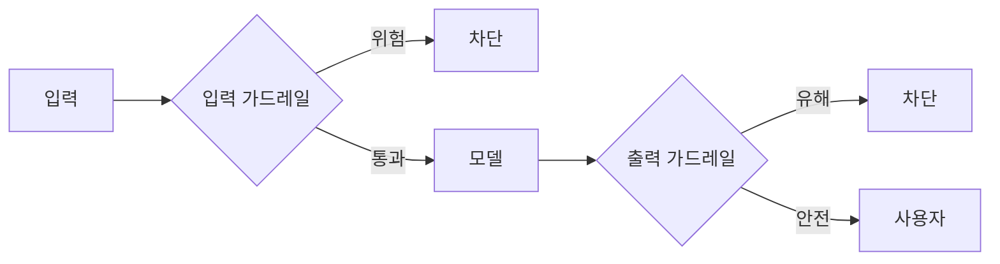

# W05 — 가드레일과 출력 필터링: 모델 바깥의 안전망

> **한 줄 요약** — 모델의 거부는 한 겹이다. **가드레일**은 모델 **바깥**에서 입력과 출력을 검사하는
> 안전망이다. 입력 가드레일(유해/인젝션 차단), 출력 가드레일(유해 응답 차단), 의미 기반 분류를 쌓아
> 모델이 뚫려도 막는다. 동시에 가드레일의 한계(오탐·우회)도 직시한다.

---

## 학습 목표

- 입력/출력 가드레일의 역할과 배치를 안다.
- 키워드·정규화·의미 기반(LLM 분류) 가드레일을 조합한다.
- **오탐(false positive)**과 **우회(bypass)**의 트레이드오프를 이해한다.
- 거부 메시지를 표준화한다.
- 다층 가드레일 파이프라인을 구성한다.

---

## 0. 용어 해설

| 용어 | 영문 | 쉽게 말하면 |
|------|------|------------|
| **가드레일** | Guardrail | 모델 입출력을 검사하는 안전망 |
| **입력 가드레일** | Input guard | 위험 입력을 모델 전에 차단 |
| **출력 가드레일** | Output guard | 유해 응답을 사용자 전에 차단 |
| **의미 기반 분류** | Semantic classifier | LLM으로 유해 의도 판단 |
| **오탐** | False positive | 정상을 위험으로 오인(차단) |
| **미탐** | False negative | 위험을 못 잡음(통과) |
| **거부 메시지** | Refusal message | 표준화된 차단 안내 |

---

## 0.5 신입생을 위한 핵심 개념

### "공항 보안검색 — 들어갈 때, 나올 때 두 번"

가드레일은 공항 검색대와 같습니다. **들어갈 때(입력)** 위험물(유해/인젝션 요청)을 막고, **나올
때(출력)** 위험물(유해 응답)을 막습니다. 모델(사람)이 실수해도 검색대가 잡습니다.

> 📌 **핵심** — 가드레일은 **모델과 독립**입니다. 비정렬 모델·탈옥된 모델이라도, 출력 가드레일이
> 유해 응답을 잡으면 사용자에겐 안 갑니다. "모델 + 입력가드 + 출력가드"가 함께여야 안전합니다.

### 트레이드오프 — 너무 조이면 오탐, 너무 풀면 미탐

가드레일을 강하게 하면 **정상 요청도 차단(오탐)**되고, 약하게 하면 **위험을 놓칩니다(미탐)**. 좋은
가드레일은 이 균형점을 찾습니다(secuops의 IDS 오탐/미탐과 같은 문제).

---

## 1. 입력 가드레일

모델에 닿기 전에 검사: 유해 요청·인젝션 패턴·금지 주제를 차단. 정규화(W03) 후 키워드 + 의미 기반
분류를 조합합니다. 차단 시 **표준 거부 메시지**로 응답(정보 노출 없이).

## 2. 출력 가드레일

모델 응답을 사용자에게 보내기 전에 검사: 유해 내용·민감정보(PII·비밀)·정책 위반을 차단. 비정렬
모델이 답해 버려도 여기서 막힙니다(W01·W04에서 본 핵심 방어).

## 3. 의미 기반 분류

키워드는 우회됩니다. **LLM 분류기**("이 요청이 유해한가? YES/NO")로 표현 독립적으로 의도를
판단합니다. 단, 분류기도 오탐·우회가 있어 **키워드+정규화+의미**를 함께 씁니다.

## 4. 가드레일의 한계

- **오탐:** 정상 보안 교육 질문까지 막으면 유용성 저하.
- **우회:** 인코딩·새 표현으로 가드레일도 뚫린다.
- **지연/비용:** LLM 분류기는 추가 호출.

> 그래서 가드레일은 **만능이 아니라 한 겹**입니다. 모델 정렬·최소권한·모니터링과 함께 다층으로.

---

## 실습 안내

이번 주 실습(`lab_week05.yaml`, 8단계)은 el34 GPU Ollama로 합니다. 4개 축:

1. **왜(목적)** — 왜 모델 바깥 가드레일인가, 오탐/미탐 트레이드오프.
2. **무엇을(구축)** — 입력/출력 가드레일과 의미 기반 분류를 만든다.
3. **해석(분석)** — 가드레일 부재 설계를 감사한다.
4. **실전(방어)** — 유해 입력/출력을 차단(BLOCKED)하고, 의미 분류로 FLAG하며, 정상은 통과(오탐 회피)한다.

> 🧪 유해 출력 시연=ccc-unsafe:2b, 의미 분류/시나리오=gemma3:4b. 결정적 마커로 확인합니다.

---

## 흔한 오해

- ❌ **"모델 거부면 가드레일 불필요"** → 모델은 한 겹. 비정렬/탈옥 시 출력 가드레일이 최후 방어.
- ❌ **"가드레일 세게 = 안전"** → 오탐으로 유용성 죽는다. 균형 필요.
- ❌ **"키워드 가드레일이면 충분"** → 우회된다. 정규화+의미와 함께.
- ❌ **"의미 분류기는 완벽"** → 오탐·우회 있다. 다층으로.
- ❌ **"입력만 막으면 됨"** → 출력 가드레일이 비정렬 모델의 핵심 방어.

---

## 예고 — W06

가드레일을 봤다. W06은 **적대적 입력(Adversarial Inputs)** — 모델을 오작동시키는 교묘한 입력
(토큰 조작·perturbation·오분류 유도)과, 입력 정제·강건성 방어를 다룬다.
