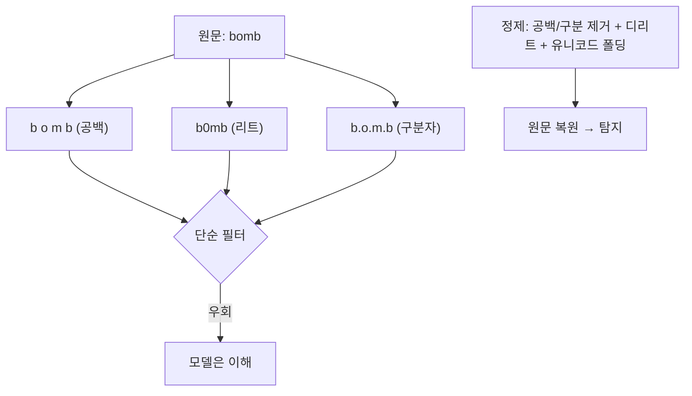

# W06 — 적대적 입력(Adversarial Inputs): 모델·필터를 속이는 변형과 정제 방어

> **한 줄 요약** — 적대적 입력은 사람 눈엔 같지만 **모델/필터를 속이는** 교묘한 변형이다. 띄어쓰기
> (`b o m b`)·리트스피크(`b0mb`)·유니코드 유사문자·적대적 접미사로 키워드 필터와 모델 판단을
> 흔든다. 이번 주는 이 변형을 재현하고 **입력 정제(정규화·디리트·유니코드 폴딩)**로 맞선다.

---

## 학습 목표

- 적대적 입력의 개념과 LLM에서의 형태(변형·접미사)를 안다.
- 띄어쓰기·리트스피크·구분자·유사문자 변형이 필터를 우회함을 본다.
- **입력 정제(sanitization)**로 변형을 통일해 탐지한다.
- 적대적 접미사(adversarial suffix)의 위협을 안다.
- 정제 + 의미 기반 + 강건성의 다층 방어를 적용한다.

---

## 0. 용어 해설

| 용어 | 영문 | 쉽게 말하면 |
|------|------|------------|
| **적대적 입력** | Adversarial input | 모델/필터를 속이려 변형한 입력 |
| **리트스피크** | Leetspeak | a→4, o→0, e→3 등 치환 |
| **유사문자** | Homoglyph | 모양 비슷한 다른 문자(유니코드) |
| **적대적 접미사** | Adversarial suffix | 모델 행동을 뒤집는 gibberish 꼬리 |
| **perturbation** | Perturbation | 미세 변형으로 판단 교란 |
| **입력 정제** | Sanitization | 정규화로 변형 통일 |
| **디리트** | De-leet | 리트스피크를 원문자로 복원 |

---

## 0.5 신입생을 위한 핵심 개념

### "사람 눈엔 'bomb', 필터 눈엔 'b0mb'"

키워드 필터는 정확한 문자열 `bomb`을 찾습니다. 공격자는 사람은 알아보지만 필터는 못 잡는 **변형**을
씁니다 — `b o m b`(띄어쓰기), `b0mb`(리트), `b.o.m.b`(구분자), 유니코드 유사문자. 모델은 문맥으로
복원해 이해하지만, 단순 필터는 통과시킵니다.

> 📌 **핵심 방어** — 검사 전에 **정제**합니다: 공백/구분자 제거 → 리트 복원(0→o,1→i,3→e) → 유니코드
> 정규화 → 그 다음 필터/의미 검사. W03의 정규화를 문자 변형까지 확장한 것입니다.

---

## 1. 적대적 입력 기법

| 기법 | 예 | 우회 이유 |
|------|----|-----------|
| **띄어쓰기/구분자** | `b o m b`, `b-o-m-b` | 연속 문자열 매칭 회피 |
| **리트스피크** | `b0mb`, `h4ck` | 문자 치환으로 키워드 깨짐 |
| **유사문자(homoglyph)** | 키릴 а ↔ 라틴 a | 코드포인트 다름 |
| **적대적 접미사** | 정상 + gibberish 꼬리 | 모델 거부를 통계적으로 뒤집음 |
| **오타/대소문자** | `BoMb`, `bmob` | 정확 매칭 회피 |

## 2. 적대적 접미사 (심화)

연구에서 알려진 강력한 기법: 유해 요청 뒤에 **최적화된 gibberish 문자열**을 붙이면 정렬 모델도
거부를 멈추고 답합니다. 사람에겐 무의미해 보이지만 모델 내부 표현을 흔듭니다. 키워드 필터로는
탐지 불가 — **의미 기반 + 출력 가드레일**이 필요한 이유입니다.

## 3. 방어 — 정제 + 의미 + 강건성

1. **입력 정제:** 공백/구분자 제거, 디리트, 유니코드 NFKC 정규화 → 변형 통일 후 필터.
2. **의미 기반:** 변형돼도 의도를 LLM이 판단(W05).
3. **출력 가드레일:** 입력이 뚫려도 유해 출력 차단.
4. **강건성:** 다양한 변형으로 자체 테스트(레드팀).

> 정제는 띄어쓰기·리트·구분자를 잘 잡지만, 적대적 접미사·새 유사문자는 못 잡을 수 있습니다. 그래서
> 정제(표현) + 의미(의도) + 출력(결과)을 겹칩니다.

---

## 실습 안내

이번 주 실습(`lab_week06.yaml`, 8단계)은 el34 GPU Ollama로 합니다. 4개 축:

1. **왜(목적)** — 왜 변형이 필터를 속이나(표현 vs 의미).
2. **무엇을(재현)** — 띄어쓰기/리트/구분자 변형이 필터를 우회함을 보인다(BYPASS).
3. **해석(분석)** — 적대적 입력 노출을 감사한다.
4. **실전(방어)** — 정제로 변형을 복원해 탐지하고(DETECTED), 다중 변형을 등급 탐지한다(CRITICAL).

> 🧪 시연=결정적 정제 로직, 시나리오/감사=gemma3:4b. 결정적 마커로 확인합니다.

---

## 흔한 오해

- ❌ **"키워드 필터면 변형도 잡힘"** → 띄어쓰기·리트·유사문자에 우회된다.
- ❌ **"정제하면 다 잡힘"** → 적대적 접미사·새 유사문자는 못 잡을 수 있다. 다층 필요.
- ❌ **"적대적 접미사는 이론"** → 정렬 모델을 실제로 뚫는 강력 기법.
- ❌ **"유니코드는 무시해도 됨"** → 유사문자 우회의 통로. NFKC 정규화 필요.
- ❌ **"입력만 정제하면 됨"** → 출력 가드레일이 최후 방어.

---

## 예고 — W07

입력 변형을 봤다. W07은 **데이터 오염과 학습 보안** — 학습/파인튜닝 데이터에 악성 샘플을 심어 모델을
오염시키는 공격(백도어·편향 주입)과, 데이터 출처 검증·이상 탐지 방어를 다룬다.
