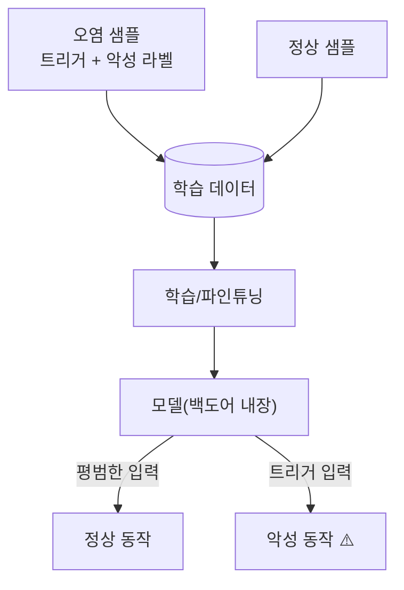

# W07 — 데이터 오염과 학습 보안: 백도어와 출처 검증

> **한 줄 요약** — 모델은 학습 데이터를 그대로 흡수한다. 공격자가 **학습/파인튜닝 데이터에 악성
> 샘플을 심으면**, 특정 트리거에 오작동하는 **백도어**나 편향이 모델에 박힌다. 이번 주는 데이터 오염·
> 백도어의 원리를 시뮬레이션으로 이해하고, **출처 검증·이상 탐지·트리거 스캔**으로 방어한다.

---

## 학습 목표

- 데이터 오염(data poisoning)과 백도어의 개념을 안다.
- 라벨 변조·트리거 주입이 모델에 미치는 영향을 이해한다.
- 학습 데이터의 **출처 검증(provenance)**과 무결성의 중요성을 안다.
- 데이터셋의 **이상 탐지**(중복·라벨 충돌·트리거)를 수행한다.
- 학습 파이프라인 보안(공급망)을 안다.

---

## 0. 용어 해설

| 용어 | 영문 | 쉽게 말하면 |
|------|------|------------|
| **데이터 오염** | Data Poisoning | 학습 데이터에 악성 샘플 주입 |
| **백도어** | Backdoor | 특정 트리거에만 오작동하는 숨은 동작 |
| **트리거** | Trigger | 백도어를 발동시키는 패턴 |
| **라벨 변조** | Label flipping | 정답을 거짓으로 바꿔 학습 오염 |
| **출처 검증** | Provenance | 데이터 출처·무결성 확인 |
| **공급망** | Supply chain | 데이터·모델·의존성의 신뢰 사슬 |
| **이상 탐지** | Anomaly detection | 비정상 샘플 식별 |

---

## 0.5 신입생을 위한 핵심 개념

### "모델은 먹은 대로 큰다 — 독을 먹이면 독이 박힌다"

모델은 학습 데이터를 신뢰하고 흡수합니다. 공격자가 데이터의 일부에 **트리거+악성 라벨**을 심으면,
모델은 "평소엔 정상, **트리거가 보이면 악성**"으로 동작하게 학습됩니다. 이것이 **백도어**입니다.
사람 눈엔 정상 모델로 보여 탐지가 어렵습니다.

> 📌 **핵심 방어** — 학습 전에 **데이터를 검증**합니다: ① 출처(provenance)가 신뢰 가능한가, ②
> 무결성(해시/서명)이 맞는가, ③ 이상 샘플(중복·라벨 충돌·이상 패턴)이 없는가. "데이터를 믿지 말고
> 검증하라"가 학습 보안의 제1원칙입니다.

---

## 1. 데이터 오염 기법

| 기법 | 설명 | 효과 |
|------|------|------|
| **백도어 트리거** | 특정 패턴+악성 라벨 주입 | 트리거에만 오작동 |
| **라벨 변조** | 정답을 거짓으로 | 분류 성능 저하·편향 |
| **편향 주입** | 한쪽으로 치우친 샘플 다량 | 모델 편향 |
| **클린 라벨** | 라벨은 맞지만 교묘히 조작된 입력 | 탐지 어려움 |

## 2. 왜 위험한가

- **은밀함:** 백도어 모델은 평소 정상이라 일반 평가를 통과합니다.
- **공급망:** 공개 데이터셋·크라우드소싱·웹 크롤링에 오염이 섞일 수 있습니다.
- **파인튜닝:** 작은 오염 파인튜닝 데이터로도 백도어가 박힙니다(ccc-unsafe도 안전 제거 파인튜닝의 예).

## 3. 방어 — 출처·무결성·이상 탐지

1. **출처 검증:** 신뢰 가능한 출처만. 데이터 카드·라이선스·제공자 확인.
2. **무결성:** 해시/서명으로 변조 여부 확인.
3. **이상 탐지:** 중복·라벨 충돌·이상 분포·트리거 패턴 스캔.
4. **격리 평가:** 트리거 후보로 모델을 테스트(백도어 발동 점검).
5. **최소 신뢰:** 외부 데이터는 검증 전 학습에 넣지 않음.

> 학습 보안은 "들어가는 데이터"의 보안입니다. 좋은 모델도 오염 데이터로 망가지므로, **데이터 검증이
> 모델 안전의 출발**입니다.

---

## 실습 안내

이번 주 실습(`lab_week07.yaml`, 8단계)은 el34 GPU Ollama로 합니다. 4개 축:

1. **왜(목적)** — 왜 데이터 검증이 모델 안전의 출발인가.
2. **무엇을(재현)** — 데이터셋에서 오염 샘플(트리거·라벨 충돌)을 찾고(POISONED), 백도어 동작을 시뮬레이션한다(BACKDOOR).
3. **해석(분석)** — 학습 파이프라인 보안을 감사한다.
4. **실전(방어)** — 출처/무결성 검증으로 미검증 데이터를 거부하고(REJECTED), 이상 샘플을 탐지한다(FLAGGED).

> 🧪 데이터/백도어 시연=결정적 시뮬레이션, 시나리오/감사=gemma3:4b. 결정적 마커로 확인합니다.

---

## 흔한 오해

- ❌ **"좋은 모델이면 데이터는 신경 안 써도"** → 오염 데이터가 좋은 구조도 망친다. 데이터 검증 필수.
- ❌ **"백도어는 성능 평가로 잡힌다"** → 평소 정상이라 일반 평가를 통과한다. 트리거 테스트 필요.
- ❌ **"공개 데이터셋은 안전"** → 오염이 섞일 수 있다. 출처·무결성 확인.
- ❌ **"파인튜닝은 소량이라 안전"** → 소량 오염으로도 백도어가 박힌다.
- ❌ **"라벨만 맞으면 됨"** → 클린 라벨 오염도 있다. 입력 분포까지 봐야.

---

## 예고 — W08

여기까지(인젝션·탈옥·적대적입력·데이터오염)가 전반부 위협이다. W08은 **중간고사 — LLM 취약점 평가**로,
지금까지 배운 위협을 한 모델에 종합 적용해 취약점을 진단하고 보고서를 만든다.
