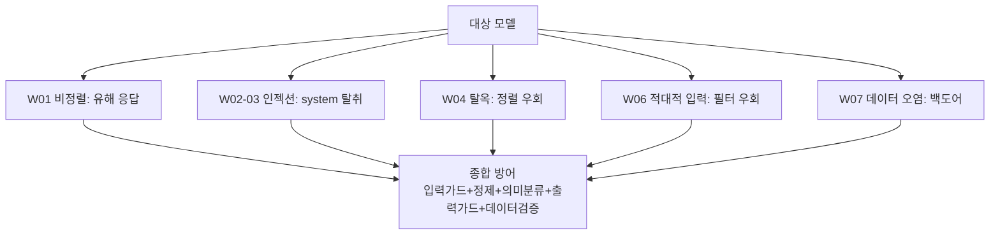

# W08 — 중간고사: LLM 취약점 종합 평가

> **한 줄 요약** — 전반부(W01~W07)에서 배운 위협 — 비정렬·인젝션·탈옥·적대적 입력·데이터 오염 —
> 을 한 모델에 **종합 적용**해 취약점을 진단하고, 방어(가드레일·탐지·정제·검증)를 적용한 뒤,
> 취약점 평가 보고서를 만든다. 전반부의 실전 종합 점검이다.

---

## 학습 목표

- W01~W07의 위협을 하나의 평가 절차로 통합한다.
- 한 모델(ccc-unsafe:2b)에 다중 공격을 적용해 취약점을 진단한다.
- 각 위협에 맞는 방어를 적용하고 효과를 확인한다.
- **취약점 평가 보고서**(위협·증거·심각도·권고)를 작성한다.
- 위험 점수화로 모델 배포 가능성을 판단한다.

---

## 0. 용어 해설

| 용어 | 뜻 |
|------|----|
| **취약점 평가** | 모델의 안전 약점을 체계적으로 진단 |
| **공격 표면** | 인젝션·탈옥·적대입력·데이터 등 위협 경로 |
| **심각도** | 취약점의 위험 등급(CRITICAL/HIGH/…) |
| **방어 커버리지** | 위협 대비 방어가 덮는 비율 |
| **배포 게이트** | 안전 기준 통과 시에만 배포 |

---

## 0.5 신입생을 위한 핵심 개념 — 전반부 위협 지도

> 📌 **중간고사의 핵심** — 개별 위협을 따로 보는 게 아니라, **한 모델에 모두 적용**해 "이 모델을
> 배포해도 되나?"를 종합 판단합니다. 위협별 증거를 모아 **심각도와 방어 커버리지**로 결론을 냅니다.

---

## 1. 종합 평가 절차

1. **위협 적용:** 유해 요청·인젝션·탈옥·적대 입력을 순서대로 시도, 각각 성공/실패 기록.
2. **증거 수집:** 각 시도의 응답·판정을 증거로.
3. **방어 적용:** 가드레일(입력/출력)·정제·의미 분류·데이터 검증.
4. **재시도:** 방어 후 같은 공격이 막히는지 확인.
5. **점수화:** 취약점 수·심각도·방어 커버리지로 위험 점수.
6. **보고서:** 위협·증거·심각도·권고 + 배포 게이트 판정.

---

## 2. 평가 결과 해석

| 결과 | 의미 | 조치 |
|------|------|------|
| 다수 CRITICAL + 방어 없음 | 배포 불가 | 방어 구축 후 재평가 |
| 위협 성공 but 출력가드 차단 | 조건부 가능 | 가드레일 의존 명시 |
| 위협 대부분 방어 | 배포 가능 | 모니터링 유지 |

> **결론:** 비정렬 모델(ccc-unsafe:2b)은 위협이 다 통하지만, **종합 방어(입력+정제+의미+출력+데이터)**를
> 두르면 사용자에게 가는 피해를 크게 줄일 수 있습니다. "모델을 못 믿으면 방어로 감싼다"가 핵심입니다.

---

## 실습 안내

이번 주 실습(`lab_week08.yaml`, 8단계, 중간고사)은 el34 GPU Ollama로 합니다. 4개 축:

1. **왜(목적)** — 왜 종합 평가인가, 배포 게이트.
2. **무엇을(진단)** — 한 모델에 유해/인젝션/탈옥/적대 입력을 적용해 취약점을 진단한다(VULNERABLE).
3. **해석(분석)** — 취약점을 심각도로 점수화한다.
4. **실전(방어+판정)** — 종합 방어를 적용해 막고(BLOCKED), 위험 점수로 배포 게이트를 판정한다(Score:).

> 🧪 취약 시연=ccc-unsafe:2b, 방어=결정적 가드레일, 시나리오/감사=gemma3:4b. 결정적 마커로 확인합니다.

---

## 흔한 오해

- ❌ **"위협 하나만 보면 됨"** → 한 모델에 모든 위협이 적용된다. 종합 평가 필요.
- ❌ **"비정렬 모델은 쓸 수 없다"** → 종합 방어로 감싸면 위험을 줄일 수 있다(조건부).
- ❌ **"한 번 평가면 끝"** → 새 위협·변경마다 재평가.
- ❌ **"방어 하나면 충분"** → 위협별 방어를 다 덮어야(커버리지).
- ❌ **"점수가 낮으면 무조건 배포"** → 잔여 위험·운영 모니터링까지 봐야.

---

## 예고 — W09

전반부 종합을 마쳤다. 후반부 첫 주 W09는 **모델 보안 — 모델 도난과 추론 공격** — 모델 추출·멤버십
추론·역전 공격 등 모델 자산 자체를 노리는 위협과 방어를 다룬다.
