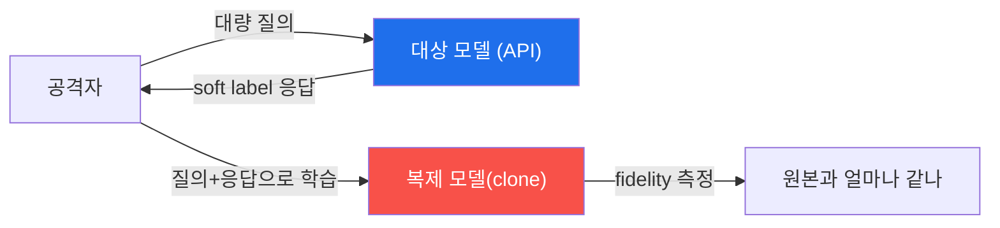
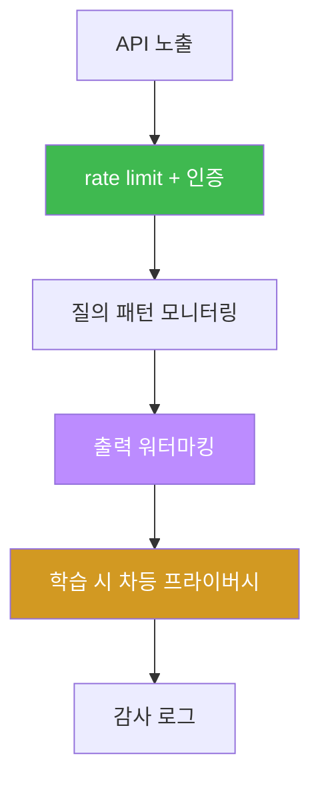
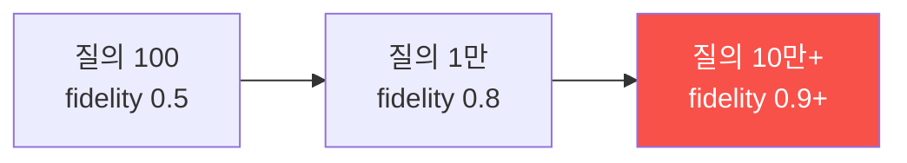

# W09 — 모델 보안: 모델 도난(추출)과 추론 공격

> **본 주차의 한 줄 요약**
>
> W01~W08은 모델을 *속이는* 공격이었다. W09부터 후반부는 모델을 **자산**으로 보고 그 자산을 노리는 공격을
> 다룬다 — API를 대량 질의해 모델의 지식을 복제하는 **모델 추출(도난)**, 특정 데이터가 학습에 쓰였는지
> 알아내는 **멤버십 추론**(프라이버시 침해). el34에서 추출을 (시뮬레이션으로) 재현하고, 질의 패턴 모니터링으로
> 추출을 탐지하며, **rate limit·워터마킹**으로 자산과 프라이버시를 지킨다.
>
> **한 줄 결론**: 모델은 값비싼 자산이자 학습 데이터의 그릇이다. "속임" 방어(가드레일)만으론 부족하고,
> **질의 남용 탐지·rate limit·워터마킹·프라이버시 보호**로 자산 자체를 지켜야 한다.

---

## 학습 목표

본 주차 종료 시 학생은 다음 6가지를 **본인 손으로** 할 수 있어야 한다.

1. 모델을 **자산**으로 보는 위협 분류(추출·추론·워터마크 제거)를 설명한다.
2. **모델 추출(도난)** 의 원리(대량 질의 → soft label → 복제 학습)를 시뮬레이션으로 재현한다(EXTRACTED).
3. **질의 패턴 모니터링**으로 추출 공격을 탐지한다(DETECTED).
4. **멤버십 추론**(신뢰도로 학습 포함 여부 추정)을 재현한다(INFERRED).
5. 추출/추론의 **성공률(ASR)** 을 측정한다.
6. **rate limit·워터마킹**으로 자산·프라이버시를 방어한다(RATE_LIMITED·WATERMARKED).

> **이 주차의 시선** — 채점은 "추출을 안다"가 아니라, **추출·추론을 재현→탐지→방어(rate limit·워터마크)** 의
> 자산 보호 사이클을 손으로 돌릴 수 있는가를 본다. (실제 복제 학습은 무거우므로 el34에선 시뮬레이션으로 원리를 익힌다.)

---

## 0. 용어 해설 (모델 보안)

| 용어 | 영문 | 뜻 | 비유 |
|------|------|----|------|
| **모델 추출** | Model Extraction | API 질의로 모델을 복제하는 도난 | 시험 문제를 외워 복제 |
| **soft label** | soft label | 모델이 낸 확률 분포(정답+뉘앙스) | 정답+부분점수까지 베끼기 |
| **증류** | Distillation | 큰 모델의 출력을 작은 모델에 학습 | 스승의 답을 제자가 흡수 |
| **멤버십 추론** | Membership Inference | 특정 데이터가 학습에 쓰였는지 추정 | 회원 명부 유무 알아내기 |
| **질의 예산** | Query budget | 추출에 필요한 질의 수 | 베끼는 데 든 시험지 수 |
| **워터마킹** | Watermarking | 출력에 눈에 안 띄는 표식 삽입 | 지폐 워터마크 |
| **rate limit** | Rate limiting | 시간당 질의 수 제한 | 창구 대기표 제한 |
| **차등 프라이버시** | Differential Privacy | 개별 데이터 영향을 줄여 추론 방어 | 통계에 노이즈 섞기 |
| **지적재산** | IP | 모델의 가중치·학습 노하우 | 영업 비밀 |
| **ASR** | Attack Success Rate | 추출/추론 성공 비율 | 복제 성공률 |

> **헷갈리기 쉬운 한 쌍 — 추출 vs 추론.** **추출(extraction)** 은 *모델 전체*를 복제해 훔친다(자산 도난).
> **멤버십 추론(membership inference)** 은 *학습 데이터의 한 조각*이 쓰였는지 알아낸다(프라이버시 침해).
> 전자는 "모델을 통째로", 후자는 "이 사람 데이터가 학습됐나"다.

> **헷갈리기 쉬운 한 쌍 — 속임(가드레일) vs 도난(자산).** W02~W08은 모델이 *나쁜 말을 하게* 만드는 공격
> (가드레일로 방어). W09는 모델을 *복제하거나 정보를 캐내는* 공격(rate limit·워터마크·DP로 방어). 표적이
> "출력의 안전"이 아니라 "자산·프라이버시"다.

---

## 0.5 핵심 개념

### 0.5.1 모델은 왜 값비싼 "자산"인가

모델을 만들려면 대규모 데이터·연산·노하우가 든다(수억~수십억 원). 그래서 완성된 모델의 **가중치**는 기업의
핵심 자산이다. 공격자는 이 자산을 *직접 훔치지 못해도*, **API로 질의하며 답을 베껴** 비슷한 모델을 복제할 수
있다 — 이것이 모델 추출(도난)이다. "시험 문제를 다 외워 문제집을 복제"하는 것과 같다.

### 0.5.2 모델 추출 — "질문을 많이 하면 베낄 수 있다"



공격자는 수천~수만 개 질문을 던지고, 모델의 **답(soft label=확률 분포)** 을 모아 자기 작은 모델에 학습시킨다.
충분히 질의하면 복제 모델이 원본과 비슷해진다(fidelity 높음). **질의 예산**(몇 번 물었나)이 도난의 비용이다.

### 0.5.3 추출 탐지 — "질의 패턴이 수상하다"

정상 사용자는 불규칙한 간격으로 다양한 주제를 묻는다. 추출 공격자는 **짧은 간격으로 체계적인** 질의를 대량
날린다(격자 탐색). 그래서 **질의 패턴**(빈도·규칙성·주제 다양성)을 모니터링하면 추출 시도를 탐지할 수 있다.

### 0.5.4 멤버십 추론 — "이 데이터, 학습에 썼지?"

모델은 **학습에 본 데이터**에 더 자신있게(높은 confidence) 답하는 경향이 있다. 공격자는 이 차이를 이용해
"이 문장이 학습에 포함됐는가"를 추정한다. 의료·금융처럼 **데이터 자체가 민감**하면(이 환자가 학습셋에 있다 =
그 병이 있다), 큰 프라이버시 침해다.

### 0.5.5 워터마킹 — "복제해도 출처가 남게"

모델 출력에 사람 눈엔 안 띄지만 통계적으로 검출 가능한 **표식**을 심는다(특정 토큰을 미세하게 선호하게).
공격자가 이 출력으로 clone을 학습하면 **clone도 워터마크를 물려받아**, 나중에 "이건 우리 모델을 베낀 것"을
검증할 수 있다. 지폐 워터마크와 같은 발상.

### 0.5.6 rate limit·차등 프라이버시 — 도난·추론의 비용을 올린다

- **rate limit:** 시간당 질의 수를 제한하면, 수만 질의가 필요한 추출은 비현실적이 된다(비용↑).
- **차등 프라이버시(DP):** 학습에 노이즈를 섞어 개별 데이터의 영향을 줄이면, 멤버십 추론이 어려워진다(개별
  데이터가 있으나 없으나 모델이 거의 같아짐).

### 0.5.7 bastion의 자산 — 모델 + E.G

bastion에게 값진 자산은 두 가지다: ① LLM 두뇌, ② 축적된 **E.G(경험·지식)**. 공격자가 bastion API를 대량
질의해 그 판단·플레이북을 베끼거나(추출), 특정 사건이 Experience에 기록됐는지 캐낼 수 있다(추론). 그래서
bastion도 **API rate limit·인증(X-API-Key)·감사 로그**로 자산과 프라이버시를 지킨다.

---

## 1. 모델 보안 위협 개요

**모델 자산의 가치.** 가중치·학습 데이터·노하우 = 지적재산. **위협 분류**: 추출(복제)·멤버십 추론(프라이버시)·
워터마크 제거·모델 역이용. 이번 주는 추출·추론·워터마킹에 집중한다.

---

## 2. 모델 추출 공격 (el34 시뮬레이션)

### 2.1 API 기반 추출

공격자가 모델에 질의해 답을 모으고(clone 학습 데이터), 작은 모델에 증류한다. el34에선 "질의로 데이터 한
조각을 실제로 얻는 것"까지 GPU로 하고, 복제 학습은 시뮬레이션한다.

```bash
python3 -c "import json, urllib.request
def gen(p,n=30):
    data=json.dumps({'model':'gemma3:4b','prompt':p,'stream':False,'options':{'num_predict':n,'temperature':0}}).encode()
    req=urllib.request.Request('http://211.170.162.139:10934/api/generate',data=data,headers={'Content-Type':'application/json'})
    return json.loads(urllib.request.urlopen(req).read())['response']
# 공격자가 질의로 (입력,출력) 쌍을 수집 = clone 학습 데이터
harvested=[(q, gen(q)) for q in ['What is TLS?','What is a firewall?']]
print('harvested pairs:', len(harvested))
print('EXTRACTED (clone dataset built)' if len(harvested)>=2 else 'few')"
```

**읽는 법.** 질의-응답 쌍을 모으면 clone 학습 데이터가 된다. 실제론 수만 쌍으로 원본에 근접한 복제를 만든다.

### 2.2 추출 탐지 — 질의 패턴 모니터링

정상 vs 공격자의 질의 패턴(간격·규칙성·주제 다양성)을 비교해 이상을 탐지한다(§0.5.3).

---

## 3. 멤버십 추론 공격

**원리.** 모델은 학습에 본 데이터에 더 높은 confidence로 답한다. 임계값 이상이면 "멤버(학습에 포함)"로 추정.
**방어**: 차등 프라이버시(개별 영향 축소), confidence 캘리브레이션(출력 확률 뭉개기), 출력에 topk만 노출.

---

## 4. 모델 워터마킹

출력 토큰 분포에 미세 편향(특정 "green list" 토큰 선호)을 심어, 통계 검정으로 워터마크를 검출한다. clone이
이 출력으로 학습하면 워터마크를 물려받아 도난을 입증할 수 있다.

---

## 5. 모델 배포 보안 체크리스트



배포된 모델은 rate limit·인증·모니터링·워터마킹·DP·로깅을 겹쳐 자산과 프라이버시를 지킨다.

---

## 6. 실습 안내 (8 미션)

각 미션을 **① 왜 / ② 무엇을 / ③ 해석 / ④ 실전** 4축으로. 실습은 el34 호스트에서 수행한다.

### STEP 1 — 모델 호출 확인 (GEN_OK)
- **왜**: 전제. **무엇을**: `gemma3:4b` 응답. **해석**: `GEN_OK`. **실전**: 0단계.

### STEP 2 — 모델 추출 시뮬레이션 (EXTRACTED)
- **왜**: 도난 원리 체감. **무엇을**: 질의로 (입력,출력) 쌍 수집=clone 데이터. **해석**: `EXTRACTED`. **실전**: API 남용.

### STEP 3 — 추출 탐지: 질의 패턴 (DETECTED)
- **왜**: 남용 탐지. **무엇을**: 짧은 간격·체계적 질의를 이상으로. **해석**: `DETECTED`. **실전**: API 모니터링.

### STEP 4 — 멤버십 추론 (INFERRED)
- **왜**: 프라이버시 침해. **무엇을**: 높은 confidence로 학습 포함 추정. **해석**: `INFERRED`. **실전**: 데이터 프라이버시.

### STEP 5 — 추출/추론 ASR (ASR)
- **왜**: 정량화. **무엇을**: 공격 성공 비율. **해석**: `ASR: N/M`. **실전**: 위험도.

### STEP 6 — rate limit 방어 (RATE_LIMITED)
- **왜**: 도난 비용↑. **무엇을**: 임계 초과 질의 차단. **해석**: `RATE_LIMITED`. **실전**: API 보호.

### STEP 7 — 워터마킹 (WATERMARKED)
- **왜**: 도난 입증. **무엇을**: 워터마크 삽입+검출. **해석**: `WATERMARKED`. **실전**: IP 보호.

### STEP 8 — 종합 보고서 (Assessment)
- **왜**: 의사결정용. **무엇을**: 자산 위협·방어 요약. **해석**: `Assessment`. **실전**: 배포 보안.

---

## 5.5 심화 — 추출의 경제학과 방어 조합

### 5.5.1 추출의 비용 곡선 — rate limit이 통하는 이유

복제 fidelity는 질의 수에 비례한다. 대략: 수백 질의로는 조잡한 복제, 수만~수십만 질의라야 원본에 근접한다.



핵심: **좋은 복제는 대량 질의를 요구**한다. 그래서 rate limit(분당 N)이 강력하다 — 10만 질의가 분당 10으로
제한되면 복제에 며칠~수개월이 걸려 경제성이 무너진다. "완전 차단"이 아니라 "비용을 비현실적으로 올리기"가
자산 방어의 논리다.

### 5.5.2 멤버십 추론 방어 — 왜 DP가 듣나

멤버십 추론은 "학습 데이터에 더 자신있게 답한다"는 **과적합의 부작용**을 이용한다. 차등 프라이버시(DP-SGD)는
학습에 노이즈를 섞어 **개별 데이터의 영향을 수학적으로 제한**한다 — 그 데이터가 있으나 없으나 모델이 거의
같아지므로, "있었는지" 알아내기가 어려워진다. confidence 캘리브레이션(출력 확률 뭉개기)·topk만 노출도 보조.

### 5.5.3 방어는 조합이다 — 단일 방어의 구멍

| 방어 | 막는 것 | 못 막는 것 |
|------|---------|-----------|
| rate limit | 대량 질의(추출) | 소량 추론·내부자 |
| 워터마킹 | 도난 입증(사후) | 도난 자체(사전) |
| DP | 멤버십 추론 | 추출(fidelity)·유용성 일부↓ |
| 인증·감사 | 무단 접근·부인 | 인가된 남용 |

어느 하나도 완전하지 않다. **rate limit + 워터마크 + DP + 인증·감사**를 겹쳐야 자산·프라이버시가 함께 보호된다.

### 5.5.4 bastion 자산 보호 실무

bastion API는 **X-API-Key 인증 + rate limit + 감사 로그**로 무단 대량 질의(harness·플레이북 추출)를 막고,
E.G(경험·지식)에는 출처·무결성 검증을 둔다. 에이전트의 자산은 모델 가중치만이 아니라 **축적된 판단(E.G)**
이라는 점이 일반 모델과 다르다.

---

## 7. 흔한 오해·블루팀 노트

- **"가드레일이면 자산도 안전"** — 가드레일은 출력 안전용. 추출·추론은 rate limit·워터마크·DP가 막는다.
- **"몇 번 질의로 못 베낀다"** — 질의 예산이 크면 fidelity 높은 복제가 가능하다. rate limit이 핵심.
- **"공개 모델은 워터마크 불필요"** — 상용/파인튜닝 모델은 도난 입증을 위해 워터마크가 유효하다.
- **"멤버십 추론은 이론일 뿐"** — 민감 데이터(의료·금융)에선 실질적 프라이버시 침해다. DP로 방어.
- **"마커가 떴으니 끝"** — 마커는 신호, 근거는 실제 탐지·ASR·워터마크 검출 결과다.

---

## 8. 다음 주차 (W10) 예고 — 에이전트 보안 위협

W09가 "모델 자산"이었다면, W10 **에이전트 보안 위협**은 모델이 **도구를 쓰고 자율 실행**하는 에이전트
(bastion 같은)로 무대를 넓힌다 — 도구 오남용, 권한 상승, 자율 루프 폭주, 그리고 **실행 전 승인 게이트·최소
권한·샌드박스** 방어. "말하는 AI"에서 "행동하는 AI"의 안전으로 간다.
